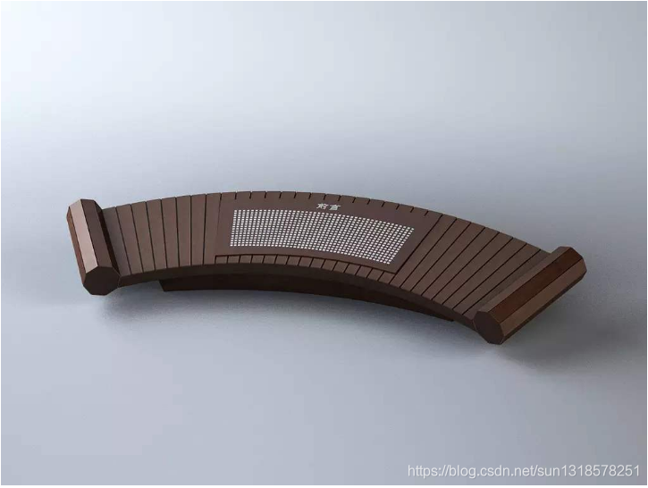
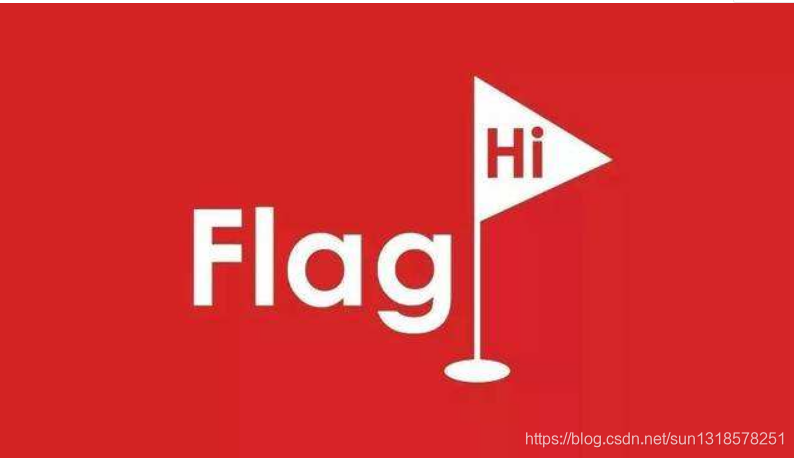
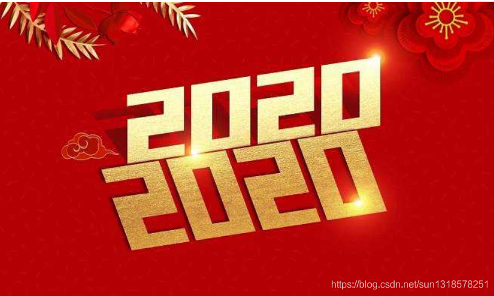

# 回望1920 AND 畅想2020

[TOC]

# 契机

---

  一个读者，加了我QQ一个月说加入我知识星球。作为一个菜鸡，知识星球就是用来分享和自己储存一点文件和知识点地方。并没有很多的干货，为了表示一下，和他进行了深入的交流和沟通。深入了解之后，他说：师傅有时间你把你立FLAG整理告诉我，我想挑战一下。

---

# 前言

---

  
  通常我写文章，需要两个条件：

- 一个契机
- 时间充沛  
  现在契机有了，时间在准备一个学期的后期课程比较少，所以时间也有了。  
  这篇文章筹划了很久，毕竟是我个人第一次想写的年度总结报告，没有任何压力，只是单纯的想总结回顾一下自己一年来所作所为而已。无论你觉得你我是在作秀，还是觉得我在装逼，我只有一句话回复你：我只想做我自己想做的事情。其实写过文章的人都知道，一篇文章从开始动手到最终定稿时，中间会反反复复修改很多次。其实我写文章，就是在脑子从重新回顾一下我的前半生吧，或许这才是我内心的答案吧。一边写这篇文章的时候，总是一边在回忆过往。

`思前想后，决定还是以时间线为线索展开。`

---

# 结缘黑客

---

  
 朦胧少年时，看了一部电影《黑客帝国》，此次不可救药的迷上黑客题材的电影，这也是我第一次对黑客这个职业有了朦胧的认知，从那以后我便心里萌发出，长大成为一名黑客的种子。

 虽然从那时候我便开始找各种资料，方式途径想要更深入了解黑客这方面的东西，知识。四处碰壁，四处被骗，交了各种智商税。玩过卡盟，葫芦侠……上了高中之后，还去淘宝上求着我姐帮我买了一本C primer plus当时商家还送了一本C++版的，花了二三十块钱（之后再也没找不到商家了）。书到之后，我打开看了，当时一点都不懂，那本书的字号很小，书很厚（7百多页，上了大学之后才知道这本书是被誉为C语言经典教材）作为一名刚上高中的学生哪里有耐心看，也看不懂。当时打开看了一两页之后只是简单解释说明C语言的发展历程，当时身边也没有任何认识的上过大学之类的，身边亲戚朋友的学历都不是很高。所以这个一时兴起的计划被搁置了。

---

# 认知网安

---

  
  从结缘黑客到认知网安安全经历很长的一段时间，大概有6年左右的时间间隔吧。6年间不断地关注着，尽我一切可能性去了解更多的东西。  
 但是真正认知网络安全是在大学开始的，那是一个大二的学长问我是否想学网络安全。我当时毫不犹豫的回答是想，在学长指导下，我先后学了Python、了解HTML、JavaScript，这个时候我已经是一名大一下学期的是学生了。在大一上个学期我学了两名语言，一个Java和C语言（专业必修）。之后过了一段时间，我当时看到学长在看学习视频，恰好看见了他百度网盘里面的资料。这也就是我刚刚开始接触网络安全这个行业起始点。

---

# 安全之路

  
 起初开始学习就是看网络安全教程视频，到目前为止看的比较完整的一套视频是carcer的视频教学。我看这种视频教学有一个特点，我不喜欢慢慢的看，这也是我个人的一个习惯吧。我习惯开倍速看，我觉得培训视频中间会有教员的个人观点、经历、见解等，我觉得我这些完全可以听听就行，没有必要去深入探讨研究的。每一个人都有自己一套学习体系、学习经验，其他人的是好的但未必就适合自己。在学习路程中学会、总结、形成自己的一套行之有效的方法才是好的。  
 我大概花了一个月的时间去看了这套视频，这套视频是一共30+集，一集是大概1-2小时。边看的过程中有些重点还是放缓播放速度去看，偶尔还写一点笔记之类的。  
 [下一秒学习法](https://blog.csdn.net/sun1318578251/article/details/93032438)是我一直学习使用的方法、技巧。还是那一句话，没那么多想当然，没那么多偶然，所有的必然和偶然都是你自己一直努力的结果。

---

# FLAG

- 驾照（科二挂了一次，停留在科三）`未完成`
- 英语四级（凉了）`未完成`
- 软考网络工程师(52,53) `完成`
- 博客排名进10w（后来自己加）`完成`
- 圈子社区`完成`
- 土司社区`完成`
- freebuf投稿`未完成`
- 先知投稿`完成`
- …  
   其实我真的没设立太多的flag，有几个flag是我早就规划好的。比例说我驾照是我在想今年拿下的，但是我拖延症性格最终给落下了。英语四级和软考冲突了，还有一些细小的flag，有些完成了有些没完成。其实除了我自己规划好的flag其他的都是遇上就自动成为自己接下来为之奋斗的目标了。

***`新年flag`***

- CSDN 博客访问量破10w挣20w成为博客专家
- 把2019的未完成的flag完成
- 暑假实习二个月（去处未定，有老板、HR看得上欢迎留言评论联系方式，我联系您）
- 脱单此乃人生大事
- 待续…其他的暂时未成想到

---

# 总结

 2019年有惊喜，有遗憾，有意外，有失落。。。这些也是每一个人也有的经历吧。但是总的来说我2019对于我个人来说是一个喜大过于悲的一年，我获取了很多荣誉，同时也失去了很多东西。

 其实想写的东西很多，想和读者分享的东西有很多。一路走过来感谢喜欢我读者的朋友们，在此我想对你们说一声谢谢。让我们一起迎接2020这个特殊的一年，让我们一起奋斗吧。  

---

# 空

 实在想不到标题名字，故意”空“来代替。下面有几件事情想说明一下。  
 1. 做一个小小调查，有心的读者可能发现了，我文笔风格转化了几次。从一开始的嘻嘻哈哈，到后来的严谨不苟言笑。  
我想知道大家喜欢那种风格，或者说更侵向与那种风格，亦或者是希望我是那种风格呢？跪求大家在评论区留言。

  2. 欢迎大家来问我一些关于博客上文章上的问题，但不支持大家来问我一些与博客文章之外的问题哦。大家有些问题其实我自己也不知道，另外博主自己还是一个学生，没很多时间和大家交流沟通一些问题，这点大家请见谅。

  
  3. 大家别找我说收徒弟之类的东西，本人不收徒弟。自己还是一个菜鸡，实在你是想让我收你为徒也不是不可以。拜师费2w一次性付清，终生教你。教到你比我强，学习计划我来制定，不容质疑。就是这么霸道！  

 多说一点，如果大家想看我一些东西，欢迎加我QQ群(群号请看置顶博客《About Me 关于我》)，群主就是我。大家可以看我一个名为荣耀的相册，里面记载了过去一年里我所获得的或大或小的荣耀。如果没兴趣当我没说。相册密码是：我的荣耀
