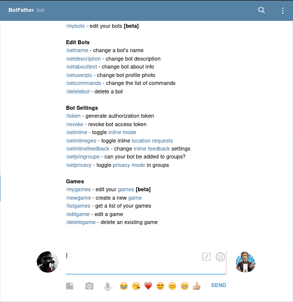
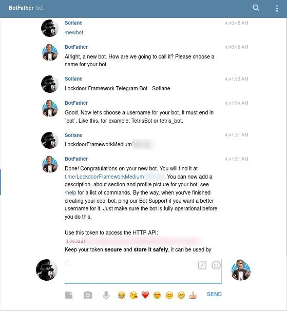
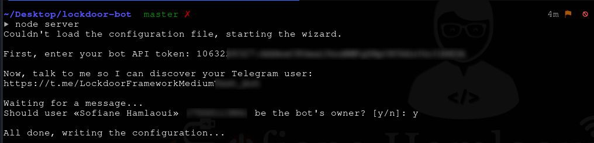
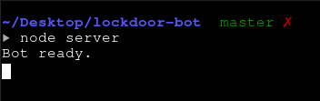
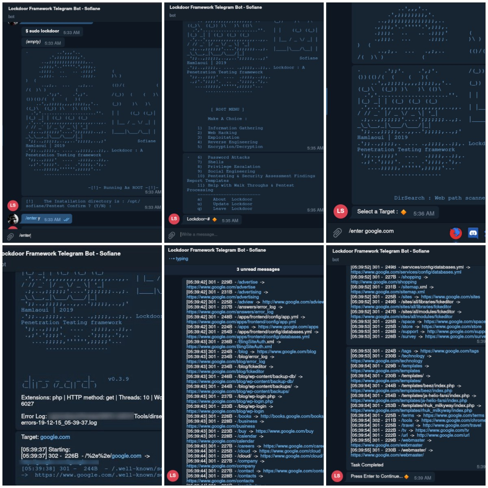
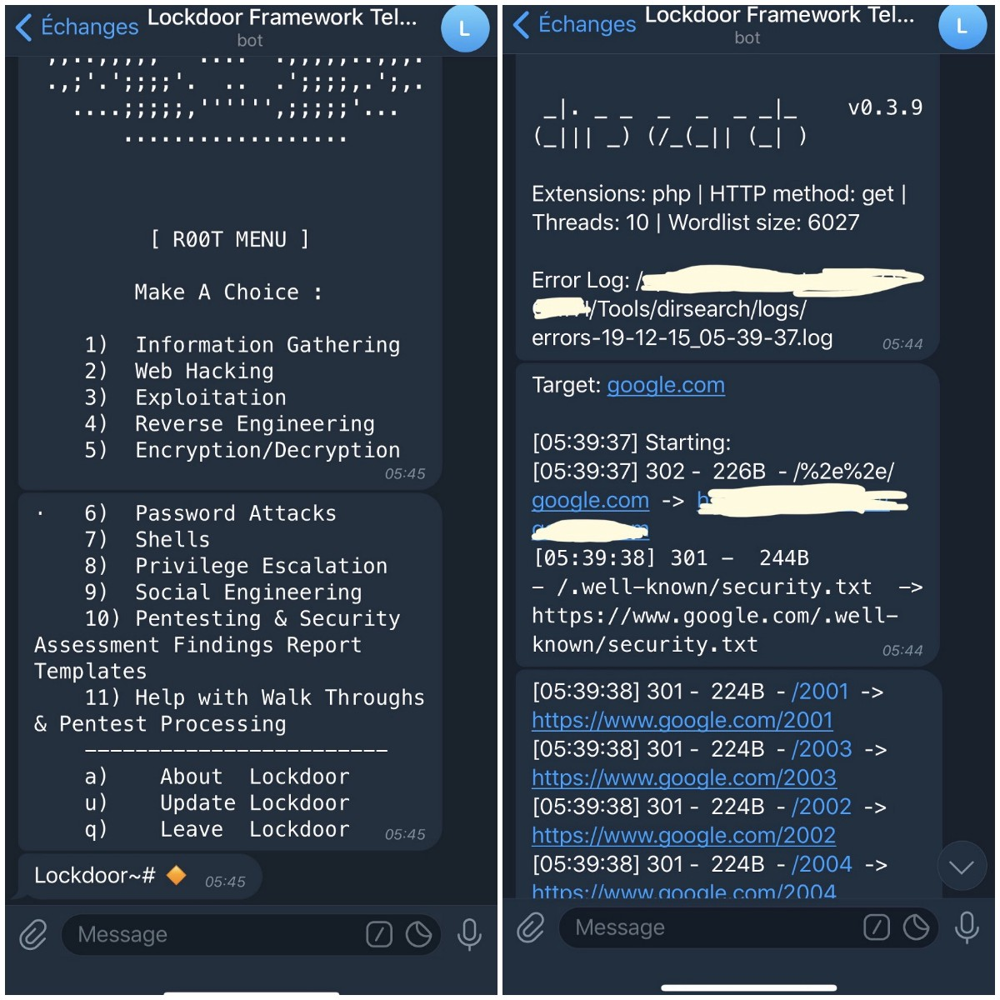

# Telegram机器人作为渗透测试框架

Author : Sofiane Hamlaoui
:   [原文链接](https://medium.com/@SofianeHamlaoui/use-telegram-bot-as-a-penetration-testing-framework-a309c41dbc40)

Translator
:   清水Samny

# 想法来源

当我查看了浏览器书签，然后我注意medium[^1](国外类似于简书的应用)有一篇有关[**Telegram bot的Hacking＆Pentesting**](https://medium.com/@arbazhussain/telegram-bot-for-hacking-pentesting-b7856db28ef)*的文章*。 我看了这篇文章并在我的[**Twitter帐户**](https://twitter.com/S0fianeHamlaoui/status/1205414073837457408)上分享了它，然后发现有些CyberSec（或Interested by）喜欢该机器人的想法。

我创建了一个[Lockdoor](https://github.com/SofianeHamlaoui/Lockdoor-Framework)的渗透测试框架，那么为什么不使用我的工具进行相同的测试呢？

更新 : [Arbaz Hussain](https://medium.com/@arbazhussain) 的工具无法使用了。( 2019/12/15 )

`Check it here`: `https://github.com/arbazkiraak/hackbot`

---

# 工作原理

这个想法是使用[Lockdoor Framework](https://github.com/SofianeHamlaoui/Lockdoor-Framework)，通过任何Telegram聊天或者信息来实现的。

基本上，它是一款从一个Telegram聊天中执行（指令）工具。当然，在做这些操作之前，您必须先配置和安装工具，然后配置机器人，最后使用它。

---

# 安装配置

1. 配置和安装Lockdoor Frameword:

首先，你查看这个Lockdoor框架安装指南。

[SofianeHamlaoui /锁门框架  
🔐Lockdoor框架：具有网络安全资源的渗透测试框架](https://github.com/SofianeHamlaoui/Lockdoor-Framework/wiki/Installation?source=post_page-----a309c41dbc40----------------------)

- 或者直接使用下面命令安装。

  ```plain
  $: git clone https://github.com/SofianeHamlaoui/Lockdoor-Framework.git && cd Lockdoor-Framework 
  $: chmod +x ./install.sh 
  $: ./install.sh
  ```

---

2. 配置和安装Telegram机器人

使用一款由[botgram](https://github.com/botgram)改进的[shell bot](https://github.com/botgram/shell-bot)。

- <https://github.com/SofianeHamlaoui/lockdoor-bot>



打开访问 `https://web.telegram.org/`

开始一段会话和我们的机器人之父[botfather](https://web.telegram.org/#/im?p=@BotFather)

---

`创建Telegram机器人`



- 输入/newbot 新建一个机器人。
- 给机器人起一个名字。
- 给机器人创建一个用户名。
- 复制保存API

---

- 配置并运行机器人服务器运行。

  ```plain
  Requirements : 
  - python
  - node-pty
  - Telegram 
  - Happiness :D
  ```
- 安装

```plain
$: git clone https://github.com/SofianeHamlaoui/Lockdoor-bot && cd Lockdoor-bot
$: npm install
```

- 开启服务器

  ```plain
  $: node server
  ```

第一次运行时，会根据问题答案自动创建配置文件`config.json`。你也可以自己编辑配置，参考`config.example.json`。



---

- 在创建Telegram机器人之后复制API token。
- 打开访问机器人给出的链接(<https://t.me/X/X/X/X/X/X/X/X/X/)并发送一条消息确认你的Telegram账号是机器人的主人。>
- 运行服务器。

  ```plain
  $: node server
  ```

  

  `看到这个就代表着机器人运行成功！`

---

- 命令集：  
  下面列出很多命令方便你使用机器人，或者也可以查看[github的repo](https://github.com/SofianeHamlaoui/lockdoor-bot)。

  ```plain
  run - Execute command
  enter - Send input lines to command
  type - Type keys into command
  control - Type Control+Letter
  meta - Send the next typed key with Alt
  keypad - Toggle keypad for special keys
  redraw - Force the command to repaint
  end - Send EOF to command
  cancel - Interrupt command
  kill - Send signal to process
  status - View status and current settings
  cd - Change directory
  env - Manipulate the environment
  shell - Change shell used to run commands
  resize - Change the terminal size
  setsilent - Enable / disable silent output
  setlinkpreviews - Enable / disable link expansion
  setinteractive - Enable / disable shell interactive flag
  help - Get help
  file - View and edit small text files
  upload - Upload and overwrite raw files
  r - Alias for /run or /enter
  ```
- *导入命令\**

```plain
/run - to run a command
/enter - to Send input lines to command
```

在配置并运行服务器之后，你可以使用Lockdoor Framework 在任何一个Telegram对话或者消息中。

# 2个选择

Lockdoor Framework需要root权限，你可以做：

- 1> root运行机器人服务器（不推荐）。

  ```plain
  $: sudo node server
  ```
- 2>在Telegram对话中用root权限运行。

  ```plain
  $: ( Telegram chat ) : /run sudo lockdoor
  ```

---

# NEXT

转到你的telegram机器人聊天输入/run lockdoor (或者 /run sudo lockdoor 如果没有用root启动服务器 )。

  


---

# 最后

`你可以查看Lockdoor Framework Github repo 获取更多有关资料。`

- [作者Github](https://github.com/SofianeHamlaoui/Lockdoor-Framework?source=post_page-----a309c41dbc40----------------------)
- [作者推特](https://twitter.com/S0fianeHamlaoui?source=post_page-----a309c41dbc40----------------------)
- [作者网站](https://sofianehamlaoui.me/?source=post_page-----a309c41dbc40----------------------)
- [作者脸书](https://www.facebook.com/S0fianeHamlaoui?source=post_page-----a309c41dbc40----------------------)
- [译者博客](https://samny520.github.io/)
- [译者推特](https://twitter.com/samny78087805)
- [译者CSDN](https://blog.csdn.net/sun1318578251)

---

# 致谢

感谢 Arbaz Hussain 为这篇文章提供宝贵的想法。  
感谢 Alba Mendez ，多亏她的bot-shell，才能成功创作这个Telegram机器人。
