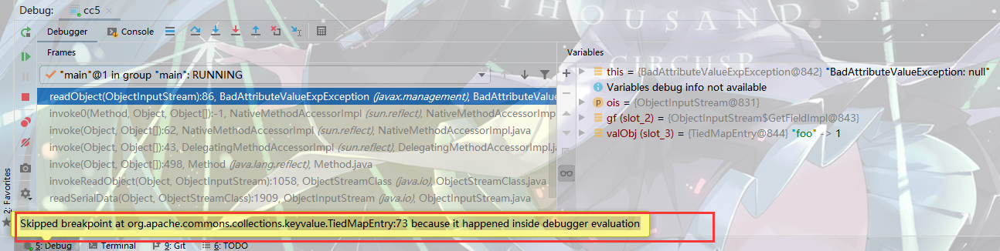
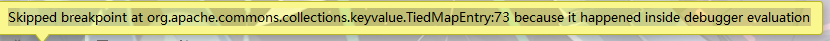
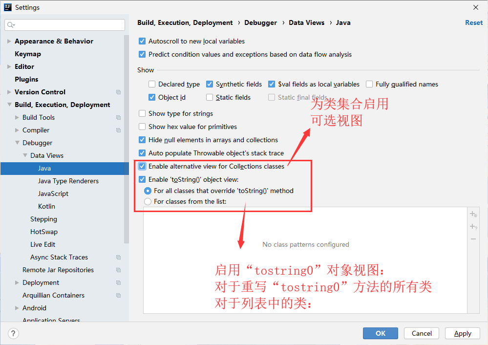

# Skipped breakpoint because it happened inside debugger evaluation

解决Skipped breakpoint at %code reference% because it happened inside debugger evaluation的通用方法。  
  

1. 先尝试去掉勾选 `Enable 'tostring0' object view`
   > 因为idea的debugger是默认会在内部将方法执行一次，然后回显提示数据，本意是很好，但有时候会干扰影响结果。

3. 如果还是不行就再去掉勾选`Enable alternative view for Collections classes`一定是可以的。
   > idea默认在用户调试之前先执行`toString`方法，然后回显数据，也就是`“预知”`功能。但有时候会影响判断，但可以设置那些类中`toString`方法是是可以做`“预知”`。
