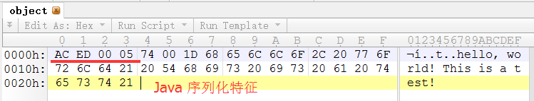
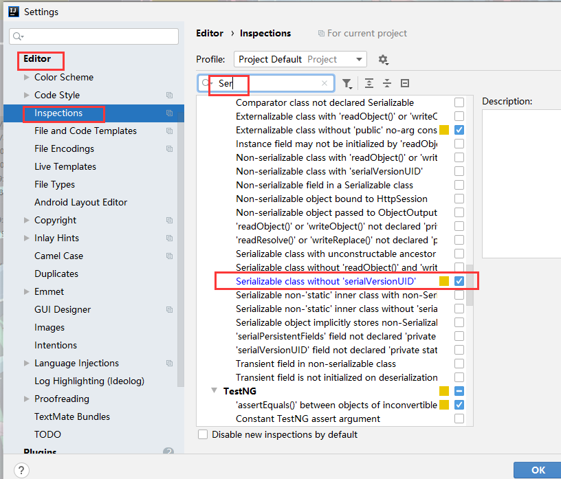
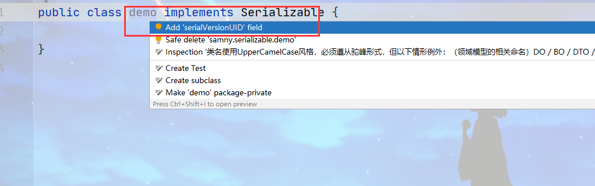
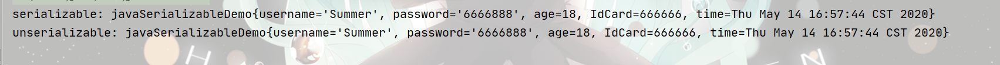
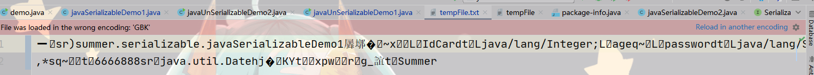
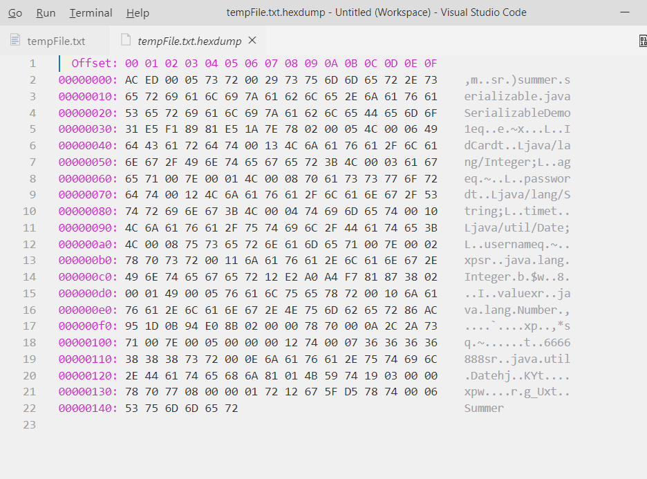
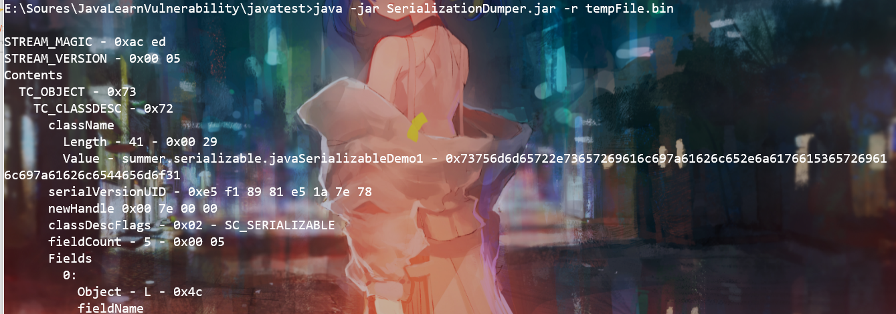
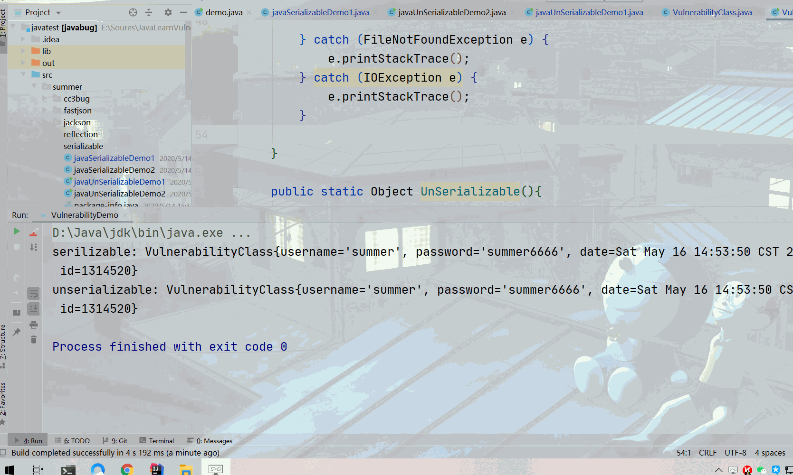

# 漫谈Java反序列化

# 前言

   Java的反序列化漏洞探索出了Java安全的新纪元。开发人员为什么要反序列化呢？众所周知，用户和服务器进行交互时，会传输一下数据，数据传输前需要格式化，将数据转化成服务器认可的格式。比例：`JSON`、`XML`。  
   `JSON`和`XML`的优点是兼容性比较强，是通用的数据交互格式。缺点是不支持复杂的数据类型。故开发人员面对需要复杂的数据类型是将数据反序列化，以来达数据交互的目的。  
   Java程序在运行时，会产生大量的数据。有些时候，我们需要将内存中的对象信息存储到磁盘或者通过网络发送给第三者，此时，就需要对对象进行序列化操作。当我们需要从磁盘或网络读取存储的信息时，即为反序列化。简单理解，序列化即将内存中的对象信息转换为字节流并存储在磁盘或通过网络发送。反序列化，即从磁盘或网络读取信息，直接转换为内存对象。

PS: 为避免代码太长而导致的阅读效果，故将完整的实验代码全部已经上传至 <https://github.com/SummerSec/JavaLearnVulnerability>

---

# 反序列化demo

## 知识补充

**反序列化漏洞基本条件**

1. Java反序列化类一定要实现`Serializabe`接口
2. 所有的Java反序列化漏洞都是用通过`readObject()`实现
3. 所有反序列化数据都是要通过`writeObject()`函数实现  
   

---

**SerialVersionUID**  
   Java的序列化的机制通过判断serialVersionUID来验证版本的一致性。在反序列化的时候与本地的类的serialVersionUID进行比较，一致则可以进行反序列化，不一致则会抛出异常InvalidCastException。IDEA是可以自动生成一个serialVersionUID，需要设置如下。  
  


---

## 案例DEMO

`javaSerializableDemo1`源码

```java
public class javaSerializableDemo1 implements Serializable {
	// 序列版本ID
    private static final long serialVersionUID = -1877568378649280904L;
    private String username;
    private String password;
    private Integer age;
    private Integer IdCard;
    private Date time;
    

    public javaSerializableDemo1(String username, String password, Integer age, Integer idCard, Date time) {
        this.username = username;
        this.password = password;
        this.age = age;
        IdCard = idCard;
        this.time = time;
    }

   // 省略一部分set、get方法。
   
    @Override
    public String toString() {
        return "javaSerializableDemo{" +
                "username='" + username + '\'' +
                ", password='" + password + '\'' +
                ", age=" + age +
                ", IdCard=" + IdCard +
                ", time=" + time +
                '}';
    }
}
```

`javaUnSerizableDemo1`源码，一般情况下`对象写入流writerObject()`和`对象的输出流readObject`是分开实现的。

```java
public class javaUnSerializableDemo1 {
    public static void main(String[] args) {
        javaSerializableDemo1 demo = new javaSerializableDemo1("Summer","6666888",18,666666,new Date());

        System.out.println("serializable: " + demo);

        // 将对象写入文件中
        ObjectOutputStream oos = null;
        try {
            FileOutputStream fileOutputStream = new FileOutputStream("tempFile.txt");
            oos = new ObjectOutputStream(fileOutputStream);

            // 序列化
            oos.writeObject(demo);

            oos.close();
        } catch (FileNotFoundException e) {
            e.printStackTrace();
        } catch (IOException e) {
            e.printStackTrace();
        }

        // 读文件
        File file = new File("tempFile.txt");
        ObjectInputStream ois = null;
        try {

            FileInputStream fileInputStream = new FileInputStream(file);
            ois = new ObjectInputStream(fileInputStream);

            // 反序列化
            javaSerializableDemo1 newdemo = (javaSerializableDemo1) ois.readObject();
            System.out.println("unserializable: " + newdemo);
        } catch (FileNotFoundException e) {
            e.printStackTrace();
        } catch (IOException e) {
            e.printStackTrace();
        } catch (ClassNotFoundException e) {
            e.printStackTrace();
        }
    }
}
```

  
由于是字节码，直接打开是乱码。  
  
用vscode插件`hexdump`查看生成的文件。  
  
或者使用`SerializationDumper.jar`工具，效果如下部分截图。  
下载地址：<https://github.com/NickstaDB/SerializationDumper>  


   这个DEMO中实现了笔者前文所提及到的三要素，但似乎你还看不出来漏洞的存在的地方。

---

## 漏洞DEMO

   下面会以一个存在的漏洞demo，带你更进一步理解Java反序列化的危害。  
**漏洞源码**

```java
public class VulnerabilityClass implements summer.serializable.Serializable {
    private static final long serialVersionUID = 5550839108669505813L;
    private String username;
    private String password;
    private Date date;

   
    private void readObject(java.io.ObjectInputStream ois) throws IOException, ClassNotFoundException {
        ois.defaultReadObject();
        // 加入执行命令代码
        Runtime.getRuntime().exec("calc");
    }

    public VulnerabilityClass() {
    }

    // 省略set、get方法
    @Override
    public String toString() {
        return "VulnerabilityClass{" +
                "username='" + username + '\'' +
                ", password='" + password + '\'' +
                ", date=" + date +
                ", id=" + id +
                '}';
    }

    public VulnerabilityClass(String username, String password, Date date, Integer id) {
        this.username = username;
        this.password = password;
        this.date = date;
        this.id = id;
    }
```

**漏洞利用**

```java
public static void main(String[] args) {
       // 调用序列化方法
        Serilizable();
        // 反序列化方法
        UnSerializable();

    }
    public static void Serilizable(){
        VulnerabilityClass clazz = new VulnerabilityClass();
        clazz.setDate(new Date());
        clazz.setId(1314520);
        clazz.setPassword("summer6666");
        clazz.setUsername("summer");

        // 写文件
        File file = new File("tempFile3");
        try {
            ObjectOutputStream oos = new ObjectOutputStream(new FileOutputStream(file));
            oos.writeObject(clazz);
            System.out.println("serilizable: " + clazz);
            oos.close();

        } catch (FileNotFoundException e) {
            e.printStackTrace();
        } catch (IOException e) {
            e.printStackTrace();
        }

    }

    public static Object UnSerializable(){

        File file = new File("tempFile3");
        try {
            ObjectInputStream ois = new ObjectInputStream(new FileInputStream(file));
            VulnerabilityClass clazz = (VulnerabilityClass) ois.readObject();
            System.out.println("unserializable: " + clazz);
            ois.close();

        } catch (FileNotFoundException e) {
            e.printStackTrace();
        } catch (IOException e) {
            e.printStackTrace();
        } catch (ClassNotFoundException e) {
            e.printStackTrace();
        }

        return VulnerabilityClass;
    }

}
```



**漏洞成因分析**

   在漏洞源码中的`readObject()`方法，第一行是默认的反序列化方法`defaultReadObject()`，但是下面一行是添加了`Runtime.getRuntime().exec("calc")`，虽然这里简单粗暴的将执行命令的代码写入了方法。实际的情况下，开发人员是不会这么做，笔者这里简单展示一下漏洞原理。实际情况都是攻击者通过各种伪造方法、修改、重定义等方法最后到达执行命令。

```java
private void readObject(java.io.ObjectInputStream ois) throws IOException, ClassNotFoundException {
        ois.defaultReadObject();
        // 加入执行命令代码
        Runtime.getRuntime().exec("calc");
    }
```

---

# 总结

   反序列化漏洞三要素实现`Serializabe`接口、`readObject()`、`writeObject()`方法，缺一不可。但试想一下，如果用户控制了`readObject`亦或者是`writeObject`方法，那么是不是可以造成反序列化漏洞呢？其实也有一个问题控制不了`writeObject`方法，因为其在服务器内，或者是Java应用内，我们不可能去修改内部代码。所以说只能通过控制`readObject`方法，这里的控制得打双引号。问题来了，前人大佬们已经研究出来许多控制方法，经典`AnnotationInvocationHandler`和`BadAttributeValueExpException`类均满足条件，下篇文章带你分析。  
   如果要深入理解反序列化漏洞可以去学习反序列化利用工具`ysoserial`。网上很多反序列化文章基本上都是研究`commons-collection`反序列化，但其实`commons-colection`反序列化链是很复杂，不建议新手小白学习。`ysoserial-Gadget-URLDNS`这条反序列化链建议新手小白学习，比较简单。推荐文章[小楼昨夜又春风，你知ysoserial-Gadget-URLDNS多少？](https://samny.blog.csdn.net/article/details/105790987)，这篇文章全方位的解释`URLDNS`这条链的利用、成因，相对其他作者写的文章分析更加全面，基本上你知道或者不知道都在文章里面。
