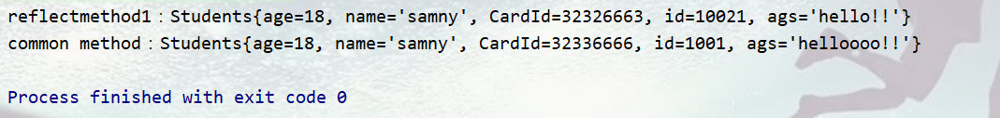

# 从安全角度谈Java反射机制--序章

# 前言

首发：<https://www.sec-in.com/article/307>  
   众所周知，Java目前影响最大的是反序列化漏洞，换一句话说Java安全是从反序列化漏洞开始，但反序列化漏洞又可以基于反射，这次笔者带你走进Java安全的大门。  
   Java反序列化的payload大多与反射机制密切相关，但仅仅是因为这个吗？答案肯定是片面的。反射作为大多数编程语言里必不可缺的组成部分，对象可以通过反射获取其他的类，类可以通过反射拿到所有的方法（包括私有方法），获取到方法可以调用。一句话，反射给Java等类似的静态语言赋予了`“灵魂”`。

ps: 本文实验代码都上传[JavaLearnVulnerability](https://github.com/samny520/JavaLearnVulnerability)项目，为了让更多人知道，麻烦动动小手star一下。

---

# 反射基础

   Java反射操作的对象是`java.lang.Class`对象，如果想要使用Java反射，首先得获取Class对象。下面我们看一段代码。

```java
public static void main(String[] args) throws Exception {
	Class cls = Class.forName(className);
	cls.getMethod(methodName).invoke(cls.newInstance());
}
```

示例代码中，笔者演示几个比较重要的方法：

- 获取类对象的方法`forName`
- 从获取类对象中获取方法 `getMethod`
- 执行得到获取的方法的方法`invoke`
- 实例化对象`newInstance`

ps：当然反射不可能仅仅只是这些方法，下面中笔者有提及其他的方法，当然不可能是全部都一一道来，正所谓`授之与鱼，不如授之于渔`。更多方法建议大家去看JDK文档，在线的文档百度一搜就有。

---

## 类源码

   首先笔者构造了两个类`students`和`classdemo1`。

---

### 实体类`students`源码：

```java
public class Students {
    private Integer age = 18;
    private String name = "samny";
    private Integer CardId = 332323223;
    private Integer id = 10012;
    private String hello = "hello world";

    public Students(Integer age, String name, Integer cardId, Integer id, String hello) {
        this.age = age;
        this.name = name;
        this.CardId = cardId;
        this.id = id;
        this.hello = hello;

    }

    @Override
    public String toString() {
        return "Students{" +
                "age=" + age +
                ", name='" + name + '\'' +
                ", CardId=" + CardId +
                ", id=" + id +
                ", ags='" + hello + '\'' +
                '}';
    }

    public Students() {

    }

    public Integer getAge() {
        return age;
    }
	// 以下省略set，get以及toString方法。
    
}
```

---

### 实体类`classdemo1`的源码：

```java
public class classdemo1 {
    private  String  name;
    public void print(){
        System.out.println("parameterlessMethod：hello");

    }
    public void print2(String name){
        System.out.println( "parameterMethod: hello" + name);
    }
}
```

---

### 反射方法获取Students类。

> 实例化所需要的类集合 Class[] classes = new Class[]{Integer.class,String.class,Integer.class,Integer.class,String.class};  
> 通过构造器构造类Constructor constructor = cls.getDeclaredConstructor(classes);  
> 通过调用有参构造器实例化类Object str = constructor.newInstance(18, “samny”, 32326663, 10021, “hello!!”);

```java
public static void reflectmethod1(){
        try {

            // 获取对象

            Class cls = Class.forName("samny.reflection.Students");

//            // 获取构造器方法
            Class[] classes = new Class[]{Integer.class,String.class,
                    Integer.class,Integer.class,String.class};
            Constructor constructor = cls.getDeclaredConstructor(classes);

            Object str = constructor.newInstance(18, "samny", 32326663, 10021, "hello!!");
            System.out.println(str);
            // 或者下面这样子输出
//            System.out.println(constructor.newInstance(18, "samny", 32326663, 10021, "hello!!"));

        } catch (ClassNotFoundException | NoSuchMethodException |
                IllegalAccessException | InstantiationException | InvocationTargetException e) {
            e.printStackTrace();
        }
    }
```

### 常规开发人员实例化类构造类demo

```java
public static void Sts(){
        Students students = new Students();
        students.setAge(18);
        students.setName("samny");
        students.setCardId(32336666);
        students.setId(1001);
        students.setAgs("helloooo!!");
        System.out.println(students.toString());
    }
```

对比一下效果是没有任何的区别，但反射操作只需要知道类名就可以完全操作类甚至是类中的私有方法之后文章会详细说明，本文不做说明。  


---

### 反射调用类中的无参和有参方法。

> 之前说过的知识就不在说明  
> 开头就说了，invoke是执行获取类得到方法的方法  
> 但调用有参方法和无参方法有点细微的差别  
> `getMethod`方法的第一个参数是类方法名称，第二个是类对象。这里先留个疑问，如果是多个类对象呢？  
> `invoke`函数的第一个参数是`实例化`的类对象，第二个是参数值  
> 常规方法的调用，直接`Class.method()`即可

```java
public static void reflectmethod2(){
        try {
            Class  cls = Class.forName("samny.reflection.classdemo1");
            // 无参方法调用
            Object ob = cls.newInstance();
//            Method mt = cls.getMethod("print"); 有没有null均可
            Method mt = cls.getMethod("print",null);
            mt.invoke(ob,null);
            // 有参方法调用
            Method mt2 = cls.getMethod("print2", String.class);
            mt2.invoke(ob,"world");

        } catch (ClassNotFoundException e) {
            e.printStackTrace();
        } catch (IllegalAccessException e) {
            e.printStackTrace();
        } catch (InstantiationException e) {
            e.printStackTrace();
        } catch (NoSuchMethodException e) {
            e.printStackTrace();
        } catch (InvocationTargetException e) {
            e.printStackTrace();
        }
    }
```


---

---

# 参考

P神-Java安全漫谈-反射篇
