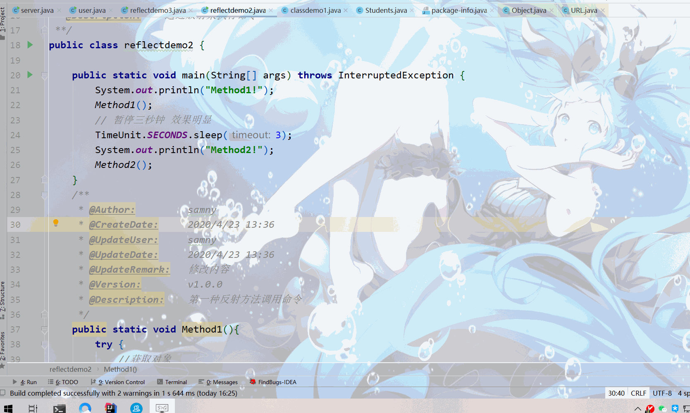
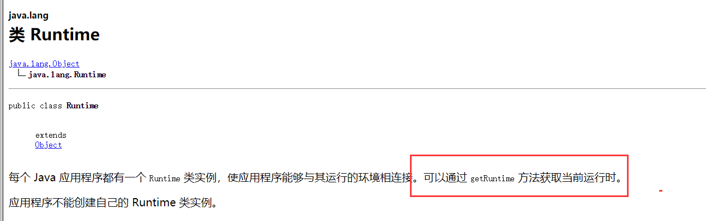
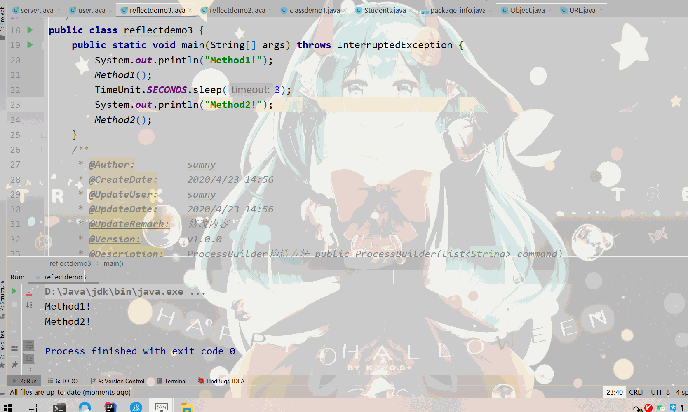
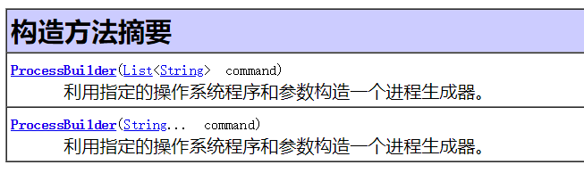

# 从安全角度谈Java反射机制--前章

# 前言

首发：<https://www.sec-in.com/article/307>  
   欢迎回来，上回说到Java反射机制基础知识，并用简单代码做了一个简单的Demo。  
  笔者从执行命令的角度来展开话题，看这篇文章大部分都是网络安全的从业者亦或者是安全规范的学习者，众所周知执行命令获取权限是安全人员追求，也是黑客最终追求。所以从执行命令的角度来展开，无疑是激发你们读者最大阅读兴趣。

ps: 本文实验代码都上传[JavaLearnVulnerability](https://github.com/samny520/JavaLearnVulnerability)项目，为了让更多人知道，麻烦动动小手star一下。

---

# 知识补充

   这里稍微补充一点小知识，对于一些0基础的读者的一些知识补充，老司机可以忽视。Java执行命令常见的有两个类`java.lang.Runtime`和`java.lang.ProcessBuilder`，通常情况下使用`java.lang.Runtime`类，个人觉得Runtime类是比ProcessBuilder好使用些。

## windows下执行命令的几种方式

1. Windows下调用程序
   > Process proc =Runtime.getRuntime().exec(“exefile”);
   >
   > 2. Windows下调用系统命令  
   >    String [] cmd={“cmd”,”/C”,”copy exe1 exe2”};  
   >    Process proc =Runtime.getRuntime().exec(cmd);
   > 3. Windows下调用系统命令并弹出命令行窗口  
   >    String [] cmd={“cmd”,”/C”,”start copy exe1 exe2”};  
   >    Process proc =Runtime.getRuntime().exec(cmd);

   ## Linux下执行命令的几种方式

   1. Linux下调用程序
      > Process proc =Runtime.getRuntime().exec(“./exefile”);
   2. Linux下调用系统命令
      > String [] cmd={“/bin/sh”,”-c”,”ln -s exe1 exe2”};  
      > Process proc =Runtime.getRuntime().exec(cmd);
   3. Linux下调用系统命令并弹出命令行窗口
      > String [] cmd={“/bin/sh”,”-c”,”xterm -e ln -s exe1 exe2”};  
      > Process proc =Runtime.getRuntime().exec(cmd);

---

# 反射之Runtime



## 方法一

> Object ob = cls.getMethod(“getRuntime”,null).invoke(null,null);  
> 返回的是一个Runtime类对象  
> 前文说过，invoke第一个参数是一个`Object类对象`  
> 你可能好奇为什么我不直接使用`newInstance()`呢？  
> 因为Runtime类中的无参构造方法是private权限，无法访问。ps：其实是有办法的，下文会说道。  
> `getRuntime`方法返回的是Runtime类对象，这就是为什么有些payload会使用此方法了，而不是直接newInstanc()



```java
public static void Method1(){
        try {
            //获取对象
            Class cls = Class.forName("java.lang.Runtime");
            //实例化对象
            Object ob = cls.getMethod("getRuntime",null).invoke(null,null);
            // 反射调用执行命令
            cls.getMethod("exec", String.class).invoke(ob,"calc");

        } catch (ClassNotFoundException e) {
            e.printStackTrace();
        } catch (IllegalAccessException e) {
            e.printStackTrace();
        } catch (InvocationTargetException e) {
            e.printStackTrace();
        } catch (NoSuchMethodException e) {
            e.printStackTrace();
        }
    }
```

---

## 方法二

> 前文说过java.lang.Runtime类无参构造方法是private权限无法直接调用  
> setAccessible通过反射修改方法的访问权限，强制可以访问  
>  Constructor constructor = cls.getDeclaredConstructor();是获取类构造器方法的方法

```java
public static void Method2(){
       try {
           // 获取对象
           Class cls = Class.forName("java.lang.Runtime");
           // 获取构造方法
           Constructor constructor = cls.getDeclaredConstructor();
           
           constructor.setAccessible(true);
           // 实例化对象
           Object ob = constructor.newInstance();
           Method mt = cls.getMethod("exec", String.class);

           mt.invoke(ob,"calc");

       } catch (ClassNotFoundException | NoSuchMethodException e) {
           e.printStackTrace();
       } catch (IllegalAccessException e) {
           e.printStackTrace();
       } catch (InstantiationException e) {
           e.printStackTrace();
       } catch (InvocationTargetException e) {
           e.printStackTrace();
       }
   }
```

---

# 反射之ProcessBuilder



通过看JDK文档，ProcessBuilder类有两个构造方法。  
  
如果分别使用反射构造方法获取实例化语句如下：

- `Class.forName("java.lang.ProcessBuilder").getDeclaredConstructor(List.class).newInstance(Arrays.asList("calc")))`
- `Class.forName("java.lang.ProcessBuilder").getDeclaredConstructor(String.class).newInstance("calc"))`

## 方法一

   方法一笔者在此就提一点，`newInstance()`实例化时把所需要执行命令参数直接一并进行了。

```java
public static void Method1(){
        try {
            // 获取对象
            Class cls = Class.forName("java.lang.ProcessBuilder");
            // 实例化对象
            Object ob = cls.getDeclaredConstructor(List.class
            ).newInstance(Arrays.asList("calc"));
            // 执行命令
            cls.getMethod("start").invoke(ob,null);

        } catch (ClassNotFoundException | NoSuchMethodException e) {
            e.printStackTrace();
        } catch (IllegalAccessException e) {
            e.printStackTrace();
        } catch (InstantiationException e) {
            e.printStackTrace();
        } catch (InvocationTargetException e) {
            e.printStackTrace();
        }
    }
```

---

## 方法二

   方法二使用第二种构造方法，可变长参数(`String...`表示参数长度不确定)。那么对于反射来说，如果要获取目标函数里包含的可变长参数，可直接视为数组。因此只需要将`String [].class`传给构造方法即可，但在调用`newInstance()`实例化方法时，不能直接传一个一维数组`String[]{“calc"}`，而是应该传入一个二维数组`String[][]calc`。因为`newInstance()`函数本身接收的是一个可变长参数，我们传给`ProcessBuilder`的也是一个可变长参数，二者叠加由一维数组变成了二维数组。

```java
public static void Method2(){
        try {
            // 获取对象
            Class cls = Class.forName("java.lang.ProcessBuilder");
            // 实例化对象
            
            String[][] cls2 = new String[][]{{"calc"}};
            Object ob = cls.getConstructor(String[].class).newInstance(cls2);
            //执行命令
            cls.getMethod("start").invoke(ob,null);

        } catch (ClassNotFoundException | NoSuchMethodException e) {
            e.printStackTrace();
        } catch (IllegalAccessException e) {
            e.printStackTrace();
        } catch (InstantiationException e) {
            e.printStackTrace();
        } catch (InvocationTargetException e) {
            e.printStackTrace();
        }
    }
```

---

# 参考

<https://xz.aliyun.com/t/7029#toc-3>  
<https://javasec.org/javase/Reflection/Reflection.html>  
JDK文档  
Java安全漫谈-反射篇 –P牛著。
