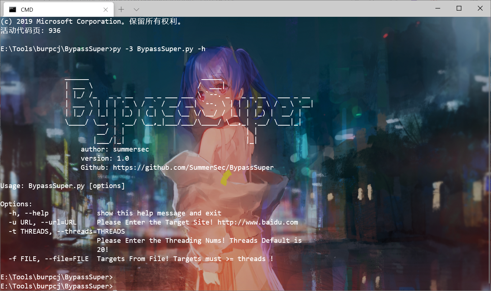
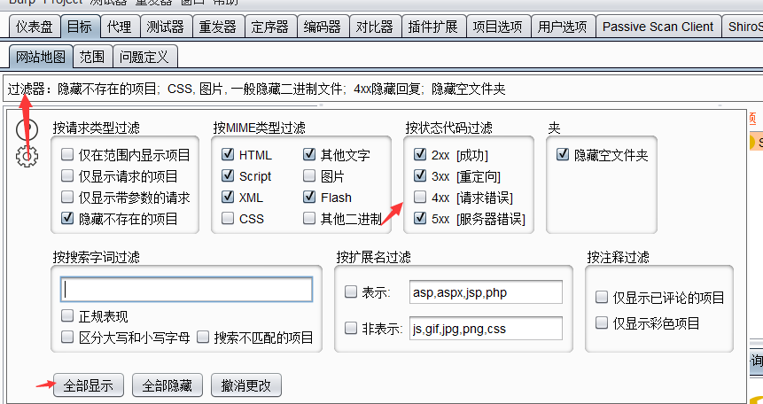
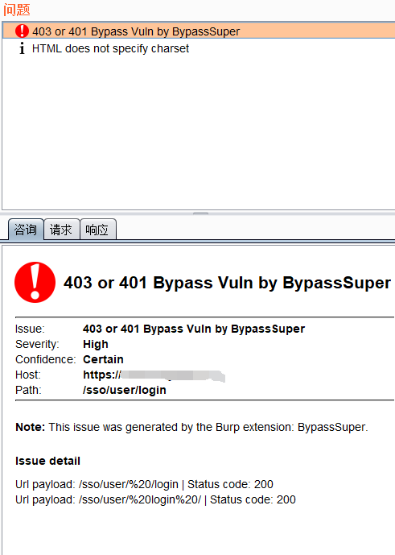
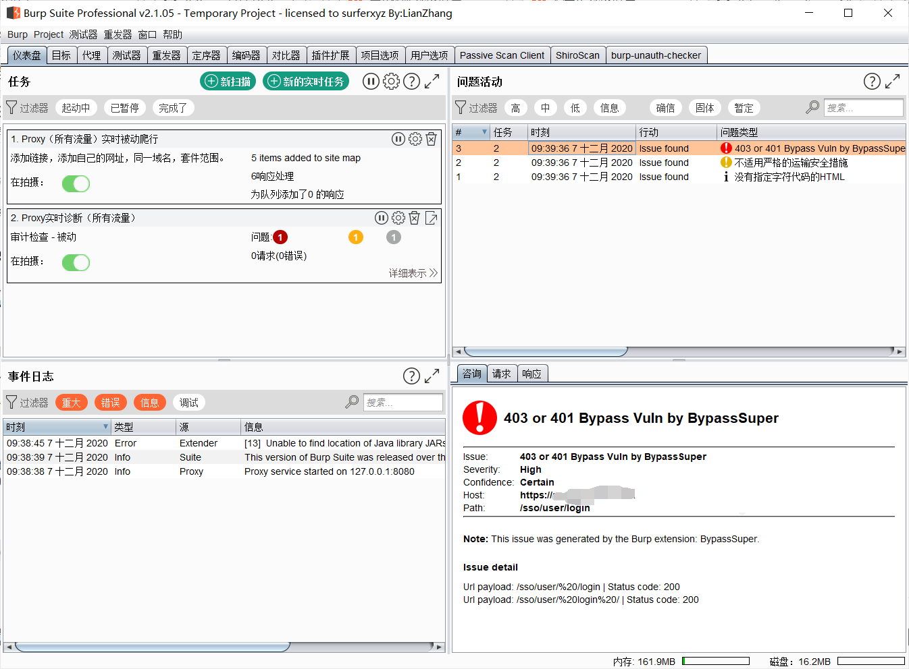
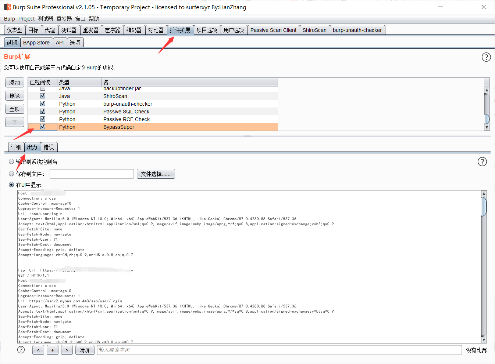
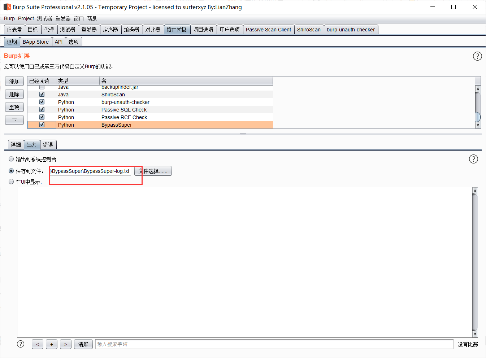
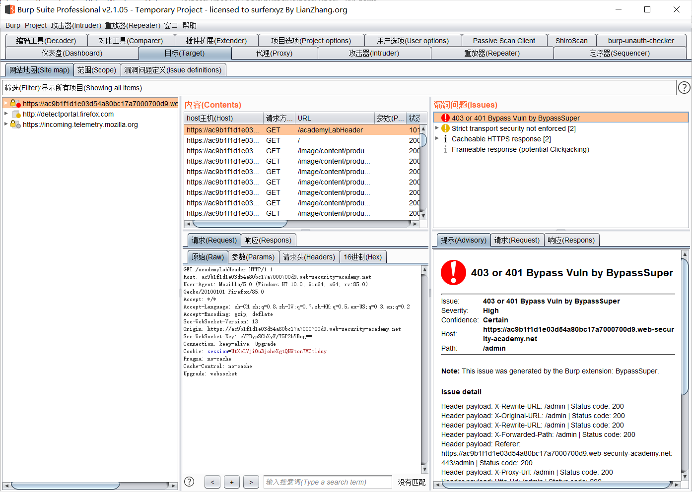
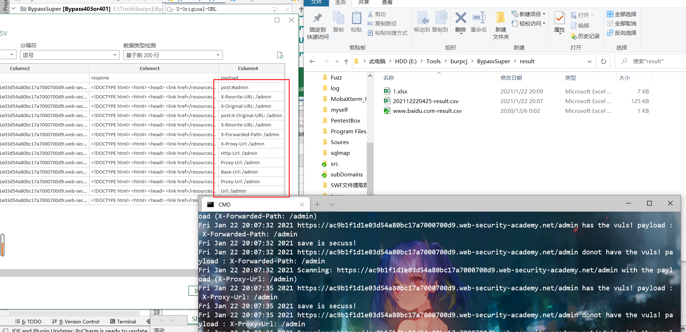
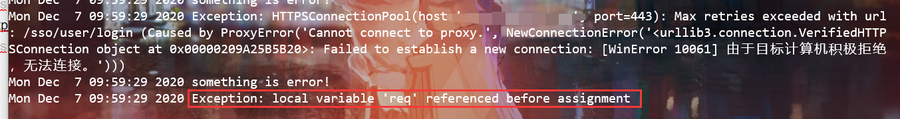

# BypassSuper使用介绍说明

# BypassSuper

### 一款针对403/401页面进行快速、高效尝试Bypass的扫描工具

[](https://github.com/SummerSec/BypassSuper)
[](https://github.com/SummerSec/BypassSuper)
[](https://github.com/SummerSec/BypassSuper)
[](https://github.com/SummerSec/BypassSuper)
[](https://github.com/SummerSec/BypassSuper)
[](https://github.com/SummerSec)
[](https://twitter.com/SecSummers)


```plain
                ______                            _____
                | ___ \                          /  ___|
                | |_/ /_   _ _ __   __ _ ___ ___ \ `--. _   _ _ __   ___ _ __
                | ___ \ | | | '_ \ / _` / __/ __| `--. \ | | | '_ \ / _ \ '__|
                | |_/ / |_| | |_) | (_| \__ \__ \/\__/ / |_| | |_) |  __/ |
                \____/ \__, | .__/ \__,_|___/___/\____/ \__,_| .__/ \___|_|
                        __/ | |                              | |
                       |___/|_|                              |_|
                    author: summersec
                    version: 1.0
                    Github: https://github.com/SummerSec/BypassSuper
`
```

## 👮🏻‍♀️ 免责声明

   由于传播、利用BypassSuper工具（下简称本工具）提供的检测功能而造成的**任何直接或者间接的后果及损失**，均由使用者本人负责，开发者本人**不为此承担任何责任**。

   本工具会根据使用者检测结果**自动生成**扫描结果报告，本报告内容及其他衍生内容均**不能代表**本人的立场及观点。

   请在使用本工具时遵循使用者以及目标系统所在国当地的**相关法律法规**，一切**未授权测试均是不被允许的**。若出现相关违法行为，我们将**保留追究**您法律责任的权利，并**全力配合**相关机构展开调查。

## 🐉来龙去脉

   在某群里看到大佬发了个这个项目[BurpSuite\_403Bypasser](https://github.com/sting8k/BurpSuite_403Bypasser)，然后看了一眼这个具体实现功能。因为在此之前在推特上看到国际友人发过类似的tips，当时就挺感兴趣的。但找了一圈并没有发现有什么现成的扫描器或者burp插件，当时是不了了之。这个项目发现之后，我第一时间就去看了一眼源代码，输出日志，发生很多payload和内容开发者是理解错的，或者是姿势不对。当然我发现之后，我开始动手在此源码上开始我的修改之路。截至本文发布时间为止，也有人发现这个问题，详情参考：<https://github.com/sting8k/BurpSuite_403Bypasser/issues/4>

---

## ⚡ Installation

### BypassSuper-Burp

`BurpSuite -> Extender -> Extensions -> Add -> Extension Type: Python -> Select file: BypassSuper-Burp.py -> Next till Fininsh`

---

### BypassSuper

`pip3 install -r requirements.txt --> python3 BypassSuper.py -h`

---

## 👏 参数介绍

   您可以使用`python3 BypassSuper.py [options]`命令来运行本工具，`options`内容表述如下：

- -h（–help）

  帮助命令，无需附加参数，查看本工具支持的全部参数及其对应简介；
- -u （–url）  
  要扫描的网站网址路径，为必填选项之一，例如：`-u https://www.baidu.com`；

  - -f （–file）  
    要扫描的网站网址路径文件，为必填选项之一，例如：`-f target.txt`；
  - -t （–threads）  
    扫描线程数量，为选填选项，配合-f参数使用，要求必须`target数量大于线程数量（默认20）`不然无法执行，例如：`-f target.txt -t 20`

---

## 🎬Screenshot



   安装完成后自动扫描，在两个地方可以查看到扫描结果。第一个：在target里面，设置过滤器全部显示或者显示4xx。  




   第二个地方在仪表盘  
  
   在插件拓展里面可以的UI可以查看扫描过程（建议直接输出到文件方便查看，UI里面只能查看部分，会被覆盖）。  
  


---

## 🎬实际案例

   靶场案例[URL-based access control can be circumvented](https://portswigger.net/web-security/access-control/lab-url-based-access-control-can-be-circumvented)，这个是portswigger官方给的实际案例。~~悄咪咪说一句，上面给的截屏是一个真实SRC案例！~~  
实用burp插件效果  


使用BypassSuper脚本效果  


---

## 📝 TODO

- 添加参数Bypass规则
- 重构代码，目前所有源码都在一个文件中，太杂了
- 自动扫描网页中的api接口实现BypassSuper中的“JSFinder”
- 目录爆破，配合JSFinder
- 自动爬取网页实现爬虫功能发现更多页面和接口

---

## 📝 意见交流

---

   您可以直接在GIthub仓库中提交ISSUE：[https://github.com/SummerSec/BypassSuper](https://github.com/SummerSec/BypassSuper/issues)亦或者发送邮件到summersec[@]qq.com

## ♨已知问题

- [Exception: local variable ‘req’ referenced before assignment此问题是主机设置全局代理问题，目前没有添加代理功能。](https://github.com/SummerSec/BypassSuper/issues/3) 解决办法：[关闭全局代理](https://github.com/SummerSec/BypassSuper/issues/3)  
  
- [结果csv文件中文乱码并且格式不对。](https://github.com/SummerSec/BypassSuper/issues/2)[解决办法](https://github.com/SummerSec/BypassSuper/issues/2)

---

## 📖 References

- <https://twitter.com/iam_j0ker/status/1324354024657711106?s=20>
- <https://twitter.com/jae_hak99/status/1297556269960540161?s=20>
- <https://twitter.com/SalahHasoneh1/status/1296572143141031945>
- <https://twitter.com/infosecsanyam/status/1331146922011324417>
- <https://twitter.com/i_hack_everyone/status/1332027600726753280>
- <https://github.com/lobuhi/byp4xx/blob/main/byp4xx.sh#L70>
- <https://twitter.com/jae_hak99/status/1333811754745249792>
- <https://twitter.com/h4x0r_dz/status/1317218511937261570>
- <https://github.com/KathanP19/HowToHunt/blob/master/WAF_Bypasses/WAF_Bypass_Using_headers.md>

---

[](https://starchart.cc/SummerSec/BypassSuper)


