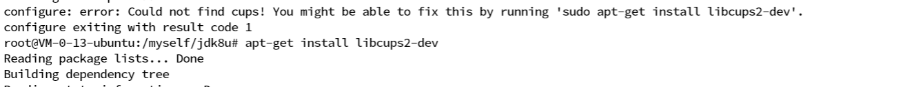
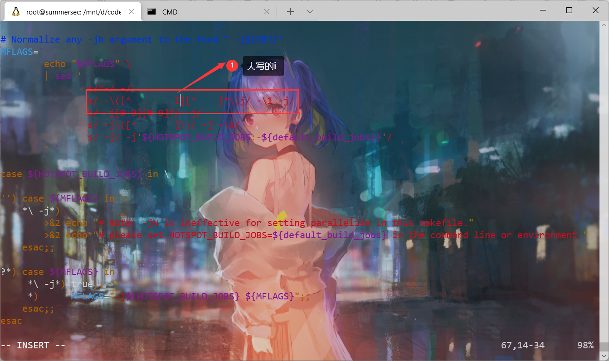
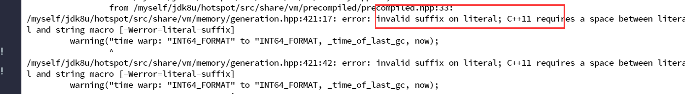
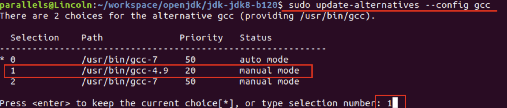
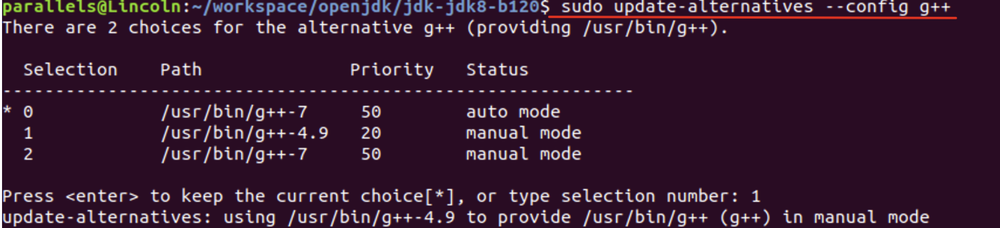
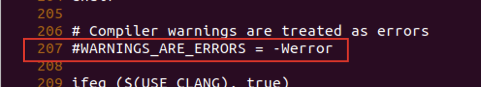
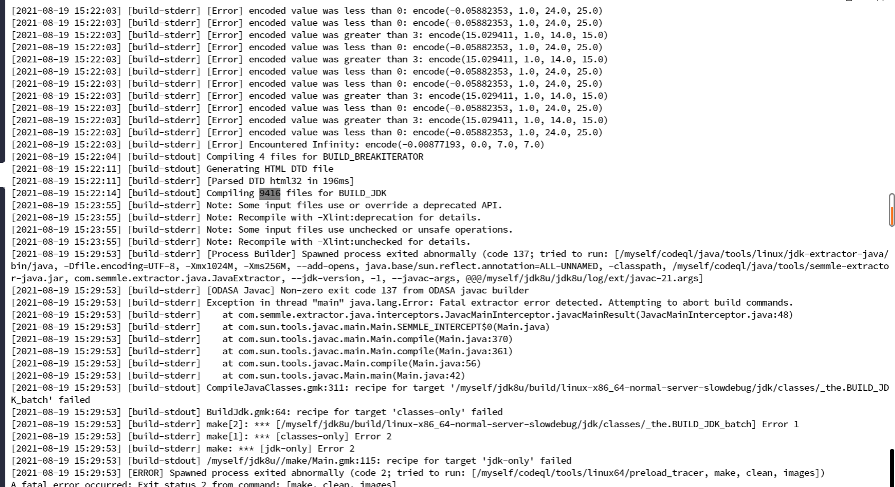
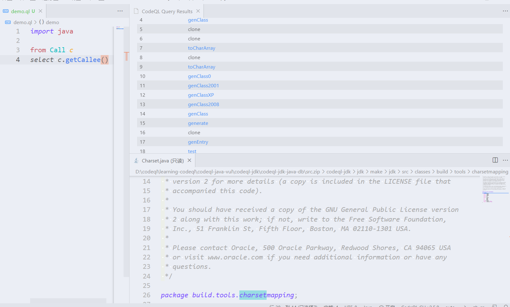

# CodeQL Create OpenJdk/Jdk8 Database

sudo apt install mercurial  
hg clone <http://hg.openjdk.java.net/jdk8/jdk8> jdk8u  
cd jdk8u  
chmod 777 ./\*  
wget <https://download.java.net/openjdk/jdk7u75/ri/jdk_ri-7u75-b13-linux-x64-18_dec_2014.tar.gz>  
tar xvf jdk\_ri-7u75-b13-linux-x64-18\_dec\_2014.tar.gz  
 ./configure –with-target-bits=64 –with-jvm-variants=server –with-debug-level=slowdebug –disable-zip-debug-info –with-boot-jdk=/your-pwd/soft/java-se-7u75-ri/ –with-memory-size=1024  
参数解释:

–with-target-bits=64: 构建64的JDK

–with-jvm-variants=server :构建server模式的JDK

–with-debug-level=slowdebug: slowdebug带有更多的调试信息

–disable-zip-debug-info：禁止压缩调试信息，可以方便调试

–with-boot-jdk=/export/soft/java-se-7u75-ri/ ：表示boot jdk的路径，就是刚才下载的jdk7的路径  
**`--with-memory-size=1024 表示1GB`**

*sudo apt-get install libx11-dev libxext-dev libxrender-dev libxtst-dev libxt-dev*

./get\_source.sh

等待几分钟，时间可能需要很久  
在运行 ./configure ，运行的过程需要的依赖很多，依次安装就好了。  
  


vi hotspot/make/linux/makefiles/adjust-mflags.sh



gcc的版本过高  
  
安装gcc和g++ 4.9版本

修改apt源：

sudo vi /etc/apt/sources.list

添加以下内容到文件末尾：

#install gcc 4.9

deb <http://dk.archive.ubuntu.com/ubuntu/> xenial main

deb <http://dk.archive.ubuntu.com/ubuntu/> xenial universe

更新源：

sudo apt-get update

安装4.9版本：

sudo apt install gcc-4.9

sudo apt install g++-4.9

管理多版本gcc：

sudo update-alternatives –install /usr/bin/gcc gcc /usr/bin/gcc-7 50  
sudo update-alternatives –install /usr/bin/g++ g++ /usr/bin/g++-7 50  
sudo update-alternatives –install /usr/bin/gcc gcc /usr/bin/gcc-4.9 20  
sudo update-alternatives –install /usr/bin/g++ g++ /usr/bin/g++-4.9 20

切换到4.9版本：

sudo update-alternatives –config gcc  


sudo update-alternatives –config g++  


注意：切换完gcc的版本后需要重新运行之前命令

sh ./configure –with-target-bits=64 –with-jvm-variants=server –with-debug-level=slowdebug –disable-zip-debug-info –with-boot-jdk=/export/soft/java-se-7u75-ri/

再执行  
vi hotspot/make/linux/makefiles/gcc.make  
注释掉如下这行  


./configure –with-target-bits=64 –with-jvm-variants=server –with-debug-level=slowdebug –disable-zip-debug-info –with-boot-jdk=/your-pwd/soft/java-se-7u75-ri/  
最后 make images

```plain
codeql database create jdk_src --language=java --command="make images"
```

如果运行过程中下面错误，就是系统内存不够  


```plain
CompileJavaClasses.gmk:316: recipe for target '/data/github/jdk-jdk8-b120/build/linux-x86_64-normal-server-release/jdk/classes/_the.BUILD_JDK_batch' failed
make[2]: *** [/data/github/jdk-jdk8-b120/build/linux-x86_64-normal-server-release/jdk/classes/_the.BUILD_JDK_batch] Error 137
BuildJdk.gmk:64: recipe for target 'classes-only' failed
make[1]: *** [classes-only] Error 2
/data/github/jdk-jdk8-b120//make/Main.gmk:115: recipe for target 'jdk-only' failed
make: *** [jdk-only] Error 2
```

建议加上

```plain
codeql database create jdk_src --language=java --command="make images" -M 1024
```

其实就是编译jdk，因为CodeQL需要参与到源码的编译过程中去才能构建数据库。效果成功如下：  


---

参考原文：  
<https://blog.csdn.net/java_yanglikun/article/details/114460300>  
<https://github.com/github/codeql/issues/4304>
