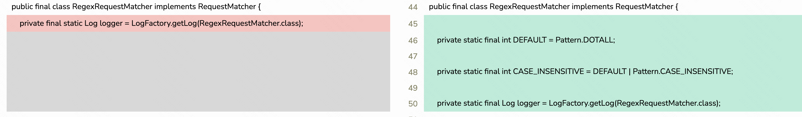
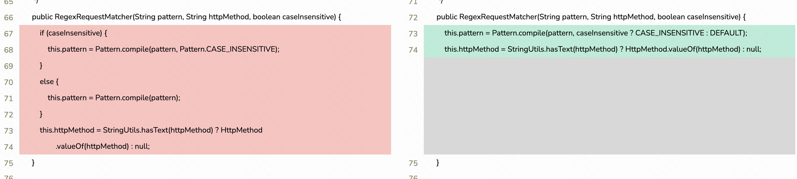

## 正则匹配配置不当

### 前言

正则匹配如果被使用在权限检验的场景中，需要注意一些是否使用默认配置。如果使用默认配置会**可能**会导致被Bypass的情况，历史Java框架漏洞 [Spring Security  CVE-2022-22978](https://tanzu.vmware.com/security/cve-2022-22978)，[Apache Shiro CVE-2022-32532](https://lists.apache.org/thread/y8260dw8vbm99oq7zv6y3mzn5ovk90xh)。


---

### 默认情况下的漏洞

示例代码，大多数开放很少注意到使用`Pattern.DOTALL`来避免匹配文本中的`\r\n\t`等字符，就很可能存在被绕过的风险。

> Ps: Pattern内置了 CASE_INSENSITIVE、MULTILINE、DOTALL、UNICODE_CASE、CANON_EQ、UNIX_LINES、LITERAL、UNICODE_CHARACTER_CLASS、COMMENTS 等匹配设置
>
> CASE_INSENSITIVE 不区分大小写
>
> DOTALL 在 dotall 模式下，表达式 {@code .} 匹配任何字符，包括行终止符。默认情况下，此表达式不匹配行终止符。
>
> MULTILINE  启用多行模式。在多行模式中，表达式 ^ 和匹配分别在行终止符或输入序列的结尾之后或之前。默认情况下，这些表达式只匹配整个输入序列的开头和结尾。多行模式也可以通过嵌入式标志表达式 (?m) 启用
>
> ....

```java
import java.util.regex.Pattern;

public class RegexBypassDemo {

    public static void main(String[] args) {
        String regex = "/permit/.*";
        Pattern pattern = Pattern.compile(regex, Pattern.DOTALL);
        Pattern pattern1 = Pattern.compile(regex);

        String source = "/permit/a\nb";

        if (pattern.matcher(source).matches()){
            System.out.println("pattern: /permit/a\nb is match!");
        }

        if (pattern1.matcher(source).matches()){
            System.out.println("pattern1: /permit/a\nb is match!");
        }

    }
}
```

Output:

> pattern: /permit/a
> b is match!


---

### 漏洞场景


#### Apache Shiro CVE-2022-32532

漏洞环境 https://github.com/4ra1n/CVE-2022-32532

正常情况下场景：

请求中带了Token是能访问/permit/的目录，如果没有带Token是不允许访问。


```http
GET /permit/any HTTP/1.1
Token: 4ra1n
```


> success


```http
GET /permit/any HTTP/1.1
```

> Access is not allowed


```http
GET /permit/a%0any HTTP/1.1
```

> Bypass Success

---


漏洞源代码`org.apache.shiro.util.RegExPatternMatcher` 实现

``` java
package org.apache.shiro.util;

import java.util.regex.Matcher;
import java.util.regex.Pattern;

public class RegExPatternMatcher implements PatternMatcher {
    public RegExPatternMatcher() {
    }

    public boolean matches(String pattern, String source) {
        if (pattern == null) {
            throw new IllegalArgumentException("pattern argument cannot be null.");
        } else {
            Pattern p = Pattern.compile(pattern);
            Matcher m = p.matcher(source);
            return m.matches();
        }
    }
}

```

修复后的漏洞代码，在`Pattern.compile()`方法，默认情况下**flag=Pattern.DOTALL**。

```java
package org.apache.shiro.util;

import java.util.regex.Pattern;
import java.util.regex.Matcher;


public class RegExPatternMatcher implements PatternMatcher {

    private static final int DEFAULT = Pattern.DOTALL;

    private static final int CASE_INSENSITIVE = DEFAULT | Pattern.CASE_INSENSITIVE;

    private boolean caseInsensitive = false;

    public boolean matches(String pattern, String source) {
        if (pattern == null) {
            throw new IllegalArgumentException("pattern argument cannot be null.");
        }
        Pattern p = Pattern.compile(pattern, caseInsensitive ? CASE_INSENSITIVE : DEFAULT);
        Matcher m = p.matcher(source);
        return m.matches();
    }


    public boolean isCaseInsensitive() {
        return caseInsensitive;
    }


    public void setCaseInsensitive(boolean caseInsensitive) {
        this.caseInsensitive = caseInsensitive;
    }
}
```


----

#### Spring Security  CVE-2022-22978


漏洞代码[Version: 5.0.x  RegexRequestMatcher](https://raw.githubusercontent.com/spring-projects/spring-security/5.0.x/web/src/main/java/org/springframework/security/web/util/matcher/RegexRequestMatcher.java)

```java
package org.springframework.security.web.util.matcher;

import java.util.regex.Pattern;

import javax.servlet.http.HttpServletRequest;

import org.apache.commons.logging.Log;
import org.apache.commons.logging.LogFactory;
import org.springframework.http.HttpMethod;
import org.springframework.security.web.util.matcher.RequestMatcher;
import org.springframework.util.StringUtils;


public final class RegexRequestMatcher implements RequestMatcher {
	private final static Log logger = LogFactory.getLog(RegexRequestMatcher.class);

	private final Pattern pattern;
	private final HttpMethod httpMethod;


	public RegexRequestMatcher(String pattern, String httpMethod) {
		this(pattern, httpMethod, false);
	}


	public RegexRequestMatcher(String pattern, String httpMethod, boolean caseInsensitive) {
		if (caseInsensitive) {
			this.pattern = Pattern.compile(pattern, Pattern.CASE_INSENSITIVE);
		}
		else {
			this.pattern = Pattern.compile(pattern);
		}
		this.httpMethod = StringUtils.hasText(httpMethod) ? HttpMethod
				.valueOf(httpMethod) : null;
	}


	public boolean matches(HttpServletRequest request) {
		if (httpMethod != null && request.getMethod() != null
				&& httpMethod != valueOf(request.getMethod())) {
			return false;
		}

		String url = request.getServletPath();
		String pathInfo = request.getPathInfo();
		String query = request.getQueryString();

		if (pathInfo != null || query != null) {
			StringBuilder sb = new StringBuilder(url);

			if (pathInfo != null) {
				sb.append(pathInfo);
			}

			if (query != null) {
				sb.append('?').append(query);
			}
			url = sb.toString();
		}

		if (logger.isDebugEnabled()) {
			logger.debug("Checking match of request : '" + url + "'; against '" + pattern
					+ "'");
		}

		return pattern.matcher(url).matches();
	}

	private static HttpMethod valueOf(String method) {
		try {
			return HttpMethod.valueOf(method);
		}
		catch (IllegalArgumentException e) {
		}

		return null;
	}
}
```


修复后的代码[Version: 5.7.x  RegexRequestMatcher.java ](https://github.com/spring-projects/spring-security/blob/5.7.x/web/src/main/java/org/springframework/security/web/util/matcher/RegexRequestMatcher.java)：

```java
package org.springframework.security.web.util.matcher;

import java.util.regex.Pattern;
import javax.servlet.http.HttpServletRequest;
import org.apache.commons.logging.Log;
import org.apache.commons.logging.LogFactory;
import org.springframework.core.log.LogMessage;
import org.springframework.http.HttpMethod;
import org.springframework.util.StringUtils;

public final class RegexRequestMatcher implements RequestMatcher {

	private static final int DEFAULT = Pattern.DOTALL;

	private static final int CASE_INSENSITIVE = DEFAULT | Pattern.CASE_INSENSITIVE;

	private static final Log logger = LogFactory.getLog(RegexRequestMatcher.class);

	private final Pattern pattern;

	private final HttpMethod httpMethod;


	public RegexRequestMatcher(String pattern, String httpMethod) {
		this(pattern, httpMethod, false);
	}


	public RegexRequestMatcher(String pattern, String httpMethod, boolean caseInsensitive) {
		this.pattern = Pattern.compile(pattern, caseInsensitive ? CASE_INSENSITIVE : DEFAULT);
		this.httpMethod = StringUtils.hasText(httpMethod) ? HttpMethod.valueOf(httpMethod) : null;
	}


	@Override
	public boolean matches(HttpServletRequest request) {
		if (this.httpMethod != null && request.getMethod() != null
				&& this.httpMethod != HttpMethod.resolve(request.getMethod())) {
			return false;
		}
		String url = request.getServletPath();
		String pathInfo = request.getPathInfo();
		String query = request.getQueryString();
		if (pathInfo != null || query != null) {
			StringBuilder sb = new StringBuilder(url);
			if (pathInfo != null) {
				sb.append(pathInfo);
			}
			if (query != null) {
				sb.append('?').append(query);
			}
			url = sb.toString();
		}
		logger.debug(LogMessage.format("Checking match of request : '%s'; against '%s'", url, this.pattern));
		return this.pattern.matcher(url).matches();
	}

	@Override
	public String toString() {
		StringBuilder sb = new StringBuilder();
		sb.append("Regex [pattern='").append(this.pattern).append("'");
		if (this.httpMethod != null) {
			sb.append(", ").append(this.httpMethod);
		}
		sb.append("]");
		return sb.toString();
	}

}
```


主要差异






---

### 漏洞场景分析

这个bypass和之前历史路径bypass不一样，因为这个具体的uri都改变了，无法将请求转发到具体代码逻辑下或者说转发到需要的uri上。

这里根据4ra1n大佬的代码可能存在某些特殊情况的场景利用，当路径使用**{value}**取值时就可能存在漏洞。

```java
@RequestMapping(path = "/permit/{value}")
public String permit(@PathVariable String value) {
    System.out.println("success!");
    return "success is " + value;
}
```


但这种情况在实际开放场景很少会使用**{value}**取路径。


----

### 总结


1. 使用正则匹配作为权限检验不能直接使用`Pattern.compile(regex)`，应当使用`Pattern.compile(regex, Pattern.DOTALL);`
2. 使用正则匹配匹配文本也应当尽量避免使用`Pattern.compile(regex);`，尽量加上Pattern中的匹配模式。
3. 尽量避免使用**{value}**这种模糊方式取路径的值
4. 关于自动化检测，目前CodeQL是支持了，详情参考 https://github.com/github/securitylab/issues/694 。


---


### 参考

* https://lists.apache.org/thread/y8260dw8vbm99oq7zv6y3mzn5ovk90xh
* https://tanzu.vmware.com/security/cve-2022-22978
* https://xz.aliyun.com/t/11501

