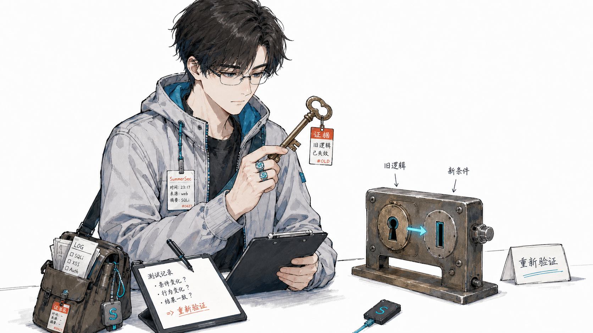
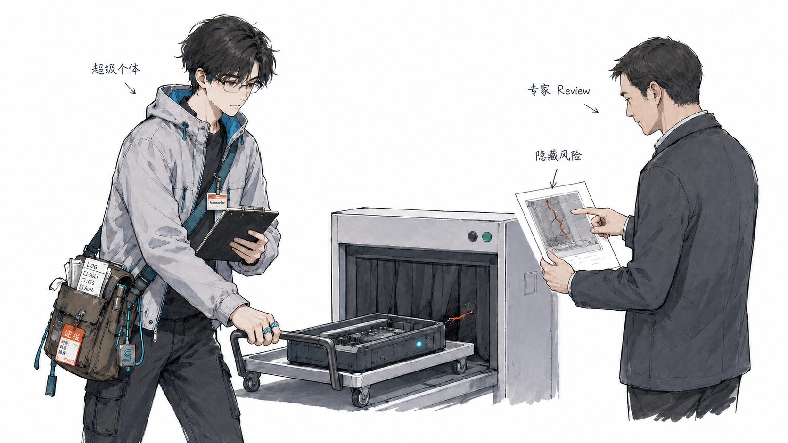
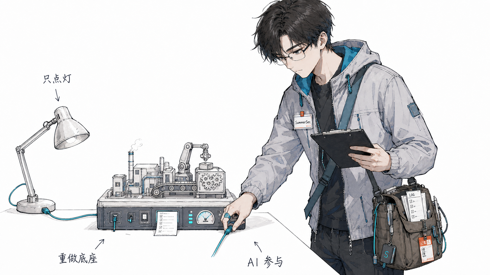
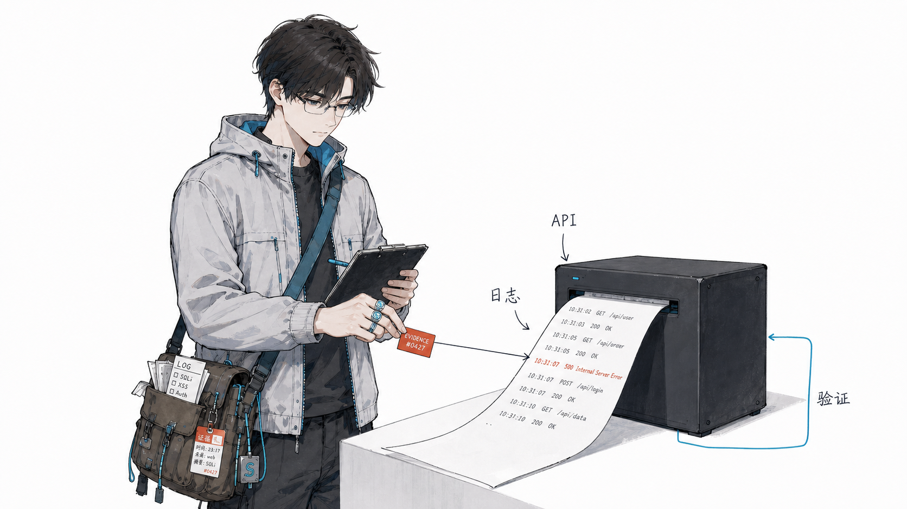
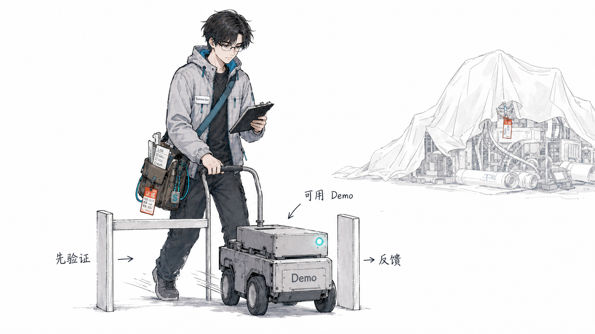
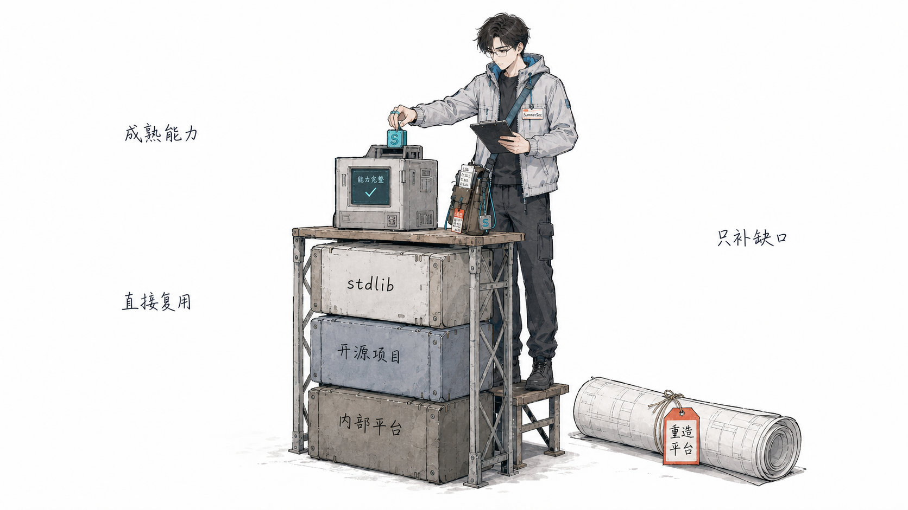
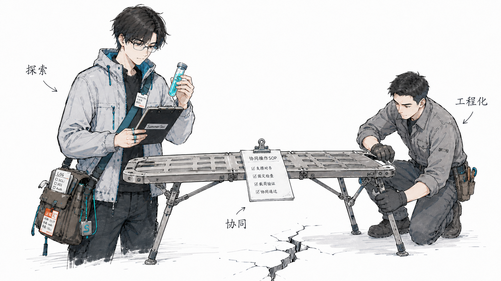
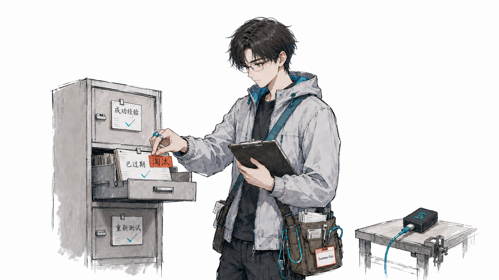
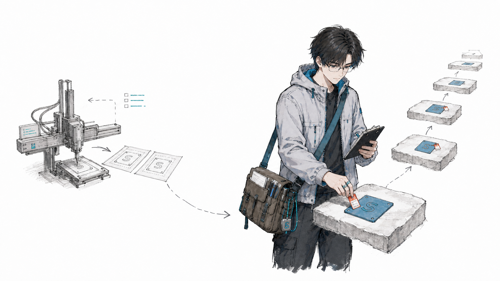

# AI 时代，如何保持个人与团队的顶尖竞争力

最近半年到一年，我在团队里反复碰到同一类问题：工具换得很快，人的做事习惯却没怎么变。大家都会用 AI 了，但很多工作仍按原来的逻辑推进，只是在某一步插入了一个聊天框。

我越来越觉得，AI 时代最先要改的不是工具栈，而是做事时的行为逻辑。

## 先把脑子转过来

我说的不是多学几个 AI 工具，也不是把过去的工作原封不动交给 AI 跑快一点。真正要变的，是做事时的行为逻辑、判断逻辑和思考方式。

以前的一套做事逻辑，放到 AI 时代未必还成立。过去我们习惯先按岗位分工，按既有流程推进，再在某个环节加一个工具。现在不能再用这套逻辑去判断所有事情。面对一个问题，应该先想它能不能用 AI 的方式重新做，能不能更快做出验证，人的时间该放在哪个环节。不是先把旧办法走一遍，再顺手问一句 AI 能不能帮忙。

这不代表过去的经验全部作废，而是它们不再是默认答案。模型能力、工具形态和协作方式一直在变，过去成功的分工、流程和判断，都得拿到新的条件下重新检查。脑子没有转过来，再会用工具，也很容易停在“学会用了，但不知道怎么用好”的阶段。

这也意味着，别再用岗位边界限制自己。安全工程师可以做一个产品 Demo，开发工程师也可以先验证一条安全思路。AI 把跨角色做原型的门槛压低了。岗位仍是专业起点，但不该成为行动边界。

不过，能做出原型不等于突然拥有了另一个领域的判断力。AI 写出的代码能跑，不代表没有安全隐患。低风险、容易验证的事可以自己推进；要进生产，涉及安全、资金或敏感数据，还是得让对应领域的人 Review。超级个体负责把想法往前推，专家负责在关键处踩刹车。

## 别只把 AI 当成电灯

电力刚出现时，人们最先想到的是照明。它确实延长了工作时间，但如果工厂只是把蒸汽机换成电动机，车间布局、生产流程和管理方式全都不变，效率不会立刻飞起来。

AI 也是这样。公司加一个 AI 插件，岗位多一个 AI 工具，流程旁边挂一个 AI 助手，看着很先进，底下仍然是原来的系统。真正难的从来不是装上工具，而是改流程、改组织、改岗位，也改人的习惯。

爱迪生的珍珠街中央发电站在 1882 年投入运行。到 1900 年前后，美国工厂里由电动机驱动的动力仍只是很小一部分；到 1920 年代，电力驱动才在制造业动力中占到一半以上。电力从出现到真正拉动生产率，隔了接近一代人的时间。Paul David 用电力和计算机的历史做过类似比较：装上设备只是开始，组织和配套投入也得一起变。[The Dynamo and the Computer](https://www.jstor.org/stable/2006600)

AI 暂时没有让所有组织的生产率爆发，不是因为它没用，而是大多数组织还在把它装进旧系统。它越通用，改造越不会一夜完成。基础设施应该围绕 AI 重做，而不是只给旧流程补一盏灯。

## 让 AI 参与验证

Vibe Coding 已经让代码产出很快了，但很多人后面还是卡住：怎么测试？怎么确认功能真符合预期？出了问题怎么定位？如果还是靠人盯着页面点几下，开发、测试和验证就没有真正连起来。

自己做软件或工具时，要给 AI 留一个窗口。测试环境里的运行日志、API 调用记录、测试结果，都应该让它能直接读到。它可以先排查、再核实、再提出修复方案，人不必把问题整理成一段完美提示词后才让它开始工作。

做产品也是同一个道理。别默认让用户自己研究几十个按钮。复杂功能要有一套 AI 能执行的 SOP：什么时候问用户，要收集什么信息，拿到信息后怎么操作，遇到问题怎么回答。界面仍然重要，但 AI 应该成为另一个入口，替用户跨过无意义的摸索。

## 先做一个能用的 Demo

AI 时代的节奏会更快。一个想法一旦被看懂，别人很快就能借助开源项目和 AI 做出类似版本。想法当然重要，但它守不住太久。

问题是，人一兴奋就想把第一版做得很大，功能要全，架构要完整，最好一次到位。这种完美主义会拖慢验证。更实际的做法是先做一个能用的 Demo，把最核心的问题交给真实用户。有人愿不愿意用？问题是否真的存在？值不值得继续投入？先拿反馈，再决定往哪里走。

反馈好，再加码；反馈不对，就改路径，必要时把想法本身放掉。AI 让每个人都有更多点子，但人的精力没有变多。做出一个东西只要一天，维护它却可能要半年。短平快不是拿粗糙当效率，而是缩小验证范围，别把长期维护成本提前背到身上。

## 站在巨人的肩膀上

AI 写代码越快，造轮子也越容易。一个需求交给 Agent，它很容易从头搭一套东西，把简单功能写成一部史诗。最后留下的是一大堆要维护的代码，而很多需求其实早已有成熟方案：现有项目、内部平台、标准库、操作系统能力，或者 GitHub 上已经被反复维护的开源项目。

[Ponytail](https://github.com/DietrichGebert/ponytail) 的思路很值得复用：写代码前先问，需求真的存在吗？项目里是否已有实现？标准库、平台原生能力或已有依赖能不能解决？这些路都走不通，再写最小实现。

这不只适用于代码。要不要做新工具、搭新平台，也该先问同样的问题。很多重复建设，问题不在能力，而在定位。平台名字不同、归属团队不同、原先面向的场景不同，大家就下意识觉得不能复用。

我前两天把电视遥控器当成 Vibe Coding 的输入设备，效果很好。它原本定位为电视遥控器，但定位不是能力上限。名字不重要，能解决问题就用。

为了 Vibe Coding 再造一只“AI 专用遥控器”，不只是多一个设备，还会多出研发、生产、兼容、故障处理和更新成本。小规模做出的设备，很难比量产遥控器便宜，手感、稳定性和实际效果也未必更好。如果现成方案已经解决问题，还执意造一个新的，很容易只是在满足“我做了个新东西”的想象。那不是创新，很多时候只是自我陶醉。

成熟产品的价值不只在功能。它们已经被用户和工程师折腾过，坑有人踩过，也有人持续维护。要证明的应该是事情有没有做成，不是有多少东西从零开始造。

## 团队不能把探索和工程化拆开

我见过团队把一些前沿 AI 应用很快落到实际场景里，这件事本身做得不错。问题往往出在负责人变化后：探索者退出，后续工作完全交给习惯传统开发方式的人，Agent 的经验和判断没有被接住，事情很快又回到旧节奏。

这不该简单归结为某个人不懂 AI。更大的问题是，组织把探索和工程化当成了一次交接。Demo 可以交代码，但“为什么这么做、怎么判断有效、什么情况下该停”很难靠一次会议说清。

更合适的方式是让两类人持续协同：先驱者快速试新技术、验证方向；成熟开发者补足稳定性、工程质量和维护能力。前者不能交完 Demo 就退出，后者也不能只接代码不接判断。验证过的做法要写成 SOP，让其他成员能复用。

## 成功经验也有保质期

我们另外一个做得不好的地方，是没有及时发现一些成功经验已经过期。

AI 技术更新太快。一个方法半年前很好用，新模型、新工具、新理论出来以后，已经没必要继续用了。可一旦某件事被贴上“成功落地”的标签，大家就容易把它当成长期正确的做法，继续维护，很少有人主动问一句：现在还需要这样吗？

这件事管理者得管。管理者不能只推广成功经验，还要盯着它什么时候开始失效。发现技术条件变了，就该重做验证。该替换就替换，该停就停，不能因为过去成功过，就一直往里面追加资源。

组织需要积累经验，也得会删除经验。只进不出的知识库，最后装的未必全是资产，也可能是一堆没人敢动的历史包袱。

## 别人复制完时，你要已经往前走了

功能会被复制，代码会被复制，想法也会被复制。这件事拦不住。

能做的是让自己的学习、验证和进化更快。别人照着你当前的版本做出来时，你已经拿到新的用户反馈，改过一轮，知道原来的判断哪里不对了。对方复制到的只是上一版。

团队不能指望某一次判断永远正确。发现走偏了，就推翻旧结论，把这次教训放回流程里，下次别再踩一遍。别人最难复制的，是你不断自我修正的速度。

