---
tags:
- blog-comments
---

# 从手改 Skill 到自动进化：评测结果和执行轨迹如何让 Agent 变稳

## 先说人话：这到底解决什么问题

现在很多人都在用 AI agent 干活：给它写一份 skill，也就是 SKILL.md 这份"工作手册"，告诉它一类任务该怎么一步步做，然后让它自己跑。比如一个做安全审计的 agent，skill 里写着"先定位接口、再追调用链、最后判断有没有漏洞"。这份 skill 不是一段随手写的 prompt，更像是一套结构化的方法论。它会直接影响 agent 处理这一类任务的上限。

问题出在后面：agent 干着干着，总会在某些 case 上稳定栽同样的跟头。你翻开 skill 改两句，把这个 case 修好了，结果之前能做对的几个又错了。

改 skill，就像打地鼠。按下这个，冒出那个。

<!--
illustration-prompt: 01-manual-skill-regression
Generate one standalone 16:9 horizontal Chinese article illustration for a sumsec.me style technical blog.

Visual DNA: pure white background, clean minimalist deep charcoal contour line art, restrained low-saturation character color washes, lots of empty white space, sparse cyan-blue and red-orange handwritten Chinese annotations, clean white-paper engineering sketch feeling with dry humor. No gradients, shadows, paper texture, commercial vector style, PPT infographic look, cute mascot poster, children's illustration, realistic UI, cyberpunk poster, pixel art, dithered bitmap, low-resolution jagged edges, or top-left title.

Recurring SumSec Observer required: original young adult security researcher and system observer, late 20s to early 30s, quiet sober eyes, low-key melancholic working expression, slightly tired but focused, clean-shaven smooth jawline, no facial hair, dark ink slightly messy side-swept short hair, thin-frame glasses, pale cool-gray high-collar lightweight hooded jacket, dark cyan-blue inner lining/drawstrings/crossbody strap, black inner shirt, dark pants, muted gray-brown side tool bag with log papers, notes, clips, tiny cyan cables, red-orange evidence tags, black clipboard/tablet, small readable "SummerSec" work-ID badge on chest, exactly two subtle silver rings with cyan-blue SummerSec S emblems, one small black S tool chip. Natural upright posture, not hunched. Character must perform the core action.

Theme: 手改 Skill 造成回归。
Structure type: 前后对比 / 角色状态。
Core idea: 手动修一个 case 时，另一个原本通过的 case 又弹出故障，Skill 修改像一张会反弹的故障面板。
Composition: SumSec Observer sits at a sparse white workbench, calmly holding a black clipboard and placing a small red-orange label "修好这个" on one raised SKILL.md paper tab. Nearby, two other spring-loaded paper tabs pop up from the same flat board, labeled "旧 case 回归" and "新错". No animals, no toy mascots. The board is a low-tech paper-and-spring mechanism, not a game. A small cyan line connects the tabs to a central folder labeled "SKILL.md". Observer's expression is tired but composed, as if this has happened too many times.
Suggested elements: spring paper tabs / SKILL.md folder / red-orange regression tags / cyan dependency line / black clipboard.
Chinese handwritten labels: "手改" / "修好这个" / "旧 case 回归" / "新错" / "SKILL.md".
Color use: deep charcoal line art; pale cool gray jacket; dark cyan-blue strap and small system lines; red-orange only for failure/regression labels; large white space.
Constraints: one image explains only this regression trap, not a formal flowchart, not a cute whack-a-mole scene, no animals, no mascot, no UI screenshot.
-->
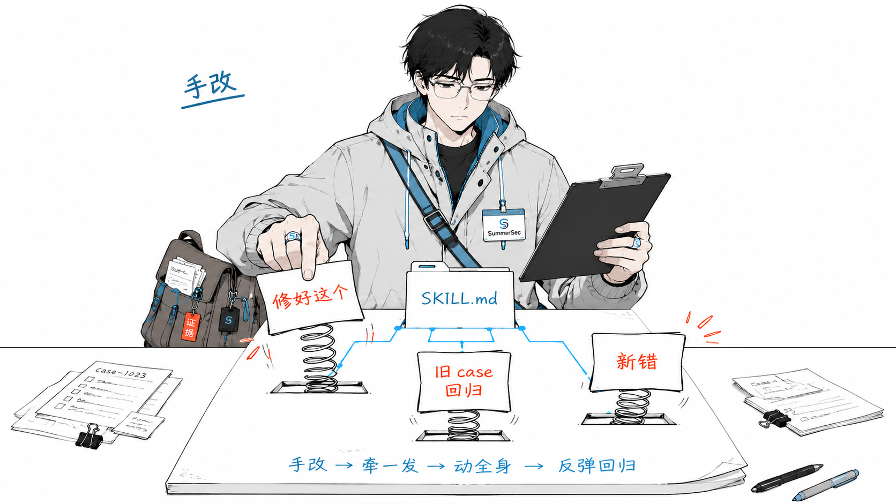

更麻烦的是，这事根本没法"一次写对"。一个 agent 要面对的任务千变万化，你不可能预先把 skill 写到完美。它只能在实战里一个 case 一个 case 地暴露短板，再一版一版地补。手动盯着这个过程，既慢，又容易顾此失彼。

我想做的是把"改 skill"这件事变成一套可重复的流程：让 agent 完成任务的能力，沿着评测结果自己往前走。

拆开看，大概是五步：
1. 跑一批测试任务，看 agent 在哪些 case 上做错了
2. 自动分析它为什么做错（不是瞎猜，是有规则的）
3. 自动生成一个 patch 去改它的 skill（SKILL.md）
4. 改完之后再验证——确保改好了这个，没搞坏那个
5. 如果验证通过，就接受这次修改；不通过，就丢掉，记到黑名单里

跑几轮之后，agent 处理这类任务的能力会慢慢变稳。

这里最容易被误解的一点是：这不是"让 AI 自己教自己"。LLM 只负责把诊断结果写成候选修改；诊断、验证、回滚、黑名单这些容易出事故的环节，都交给可复查的规则。

我不假设模型会突然变聪明，只是把它容易犯糊涂的地方收进工程约束里。

### 什么样的任务适合这么干

先说清楚：不是所有 agent 任务都能这么玩。能不能跑自进化，只取决于一条——**这个任务的输出，能不能被客观判定对错**。

判据就这一条，但它筛掉了一大半任务。能过的任务有个共同点：结论是收敛的、有标准答案可对照的。是不是垃圾邮件、这段代码有没有漏洞、从合同里抽出的金额对不对——答案非此即彼，对就是对，错就是错。反过来，"写一段文案""把这篇文章总结得漂亮点"这类开放式任务就不行：好坏见仁见智，没有唯一标准答案，你连"这次改得好不好"都没法机械判断，自然谈不上让它自动迭代。

**一句话：你的任务结论越接近一道有标准答案的判断题，越适合上这套自进化。**

下面说说我自己的情况，给你一个对照的参考。

我是一名代码安全工程师，日常干的事是审计代码里有没有安全漏洞。这件事交给 agent 之后，它每跑完一个 case，输出的结论高度收敛——**这段代码到底有没有漏洞，只有 `true` / `false` 两种答案**。

这个二元输出，恰好踩在前面那条判据上。因为答案非黑即白，我就能拿它跟标准答案（每个 case 事先人工标注过有无漏洞）直接对照，机械地算出每次到底对没对：答对多少、漏报（FN）多少、误报（FP）多少。主观性主要在人工标注和 judge 提取规则里，后面的指标计算是可重复的。这就是"基于结果的评测"。

有了可靠的结果评测，自进化才有立足点：每一步改动都需要一个客观信号来回答"这次改得到底好不好"。代码安全审计天然就提供了这个信号——所以它是个适合拿来跑结果驱动自进化的场景。如果你手头的任务也满足"结论可被客观判对错"，那这套方法大概率也能搬过去。

---

## 输入数据：结果与过程缺一不可

整套系统的输入就两样东西，都是 JSONL 格式（每行一个 JSON）：

### results.jsonl —— 评测结果

每行记录一个测试 case 的结果：agent 答了什么、答对没有。

```jsonl
{"case_id": "biz-vul-001", "ground_truth": "true", "judge_verdict": "true", "pass_fail": "pass"}
{"case_id": "biz-vul-002", "ground_truth": "true", "judge_verdict": "false", "pass_fail": "fail", "failure_kind": "FN"}
```

关键字段：
- `case_id`：哪个测试用例
- `ground_truth`：标准答案（在我的场景里，`"true"` = 有漏洞，`"false"` = 没有；其他场景可以是任何二元标签）
- `judge_verdict`：AI 裁判判定 agent 的回答是什么
- `pass_fail`：对了还是错了
- `failure_kind`：错的话是漏报（FN）还是误报（FP）

### sessions/ 目录 —— agent 的操作日志

每个 case 一个文件（`sessions/<case_id>.jsonl`），记录 agent 干活的全过程：

```jsonl
{"type": "assistant", "content": "我来分析这个接口...", "tool_calls": [{"name": "Read", "args": "PayController.java"}]}
{"type": "tool", "tool_name": "Read", "result": "public class PayController {...}"}
{"type": "assistant", "content": "# 审计结论\n该接口存在任意发奖漏洞..."}
```

这就是 agent 的"考试答题过程"——它搜了什么、读了什么、在哪一步做了什么决定。诊断引擎靠的就是这份日志来判断 agent 哪里走偏了。

<!--
illustration-prompt: 02-results-and-trace
Generate one standalone 16:9 horizontal Chinese article illustration for a sumsec.me style technical blog.

Visual DNA: pure white background, clean minimalist deep charcoal contour line art, restrained low-saturation character color washes, large blank space, sparse cyan-blue and red-orange handwritten Chinese annotations. White-paper engineering sketch, not PPT, not commercial infographic, not complex architecture, no UI screenshot, no cyberpunk, no pixel art, no top-left title.

Recurring SumSec Observer required: original young adult security researcher/system observer with deep ink messy side-swept short hair, thin-frame glasses, quiet sober low-key melancholic focused expression, clean-shaven jawline, pale cool-gray high-collar hooded jacket, dark cyan-blue lining/drawstrings/crossbody strap, black inner shirt, dark pants, gray-brown side tool bag with log papers and tiny cyan cables, black clipboard, chest "SummerSec" badge, exactly two subtle cyan-blue S-emblem rings, small black S tool chip. Natural upright posture, simple hand pose only.

Theme: 评测结果与执行轨迹缺一不可。
Structure type: 证据栈 / 系统局部。
Core idea: results.jsonl 只能告诉你"对错"，sessions/ 才能告诉你"为什么错"；两者合在一起才够驱动 Skill 进化。
Composition: On a white desk, SumSec Observer uses one hand to align two long paper strips: left strip labeled "results.jsonl" with small pass/fail marks and red-orange FN/FP stickers; right strip labeled "sessions/" as a curled log tape with tiny tool-call marks. The two strips feed into a simple transparent evidence tray labeled "可改的根因". Observer points at the intersection, not at the viewer. A small cyan line from the log tape meets a red-orange fail tag from results.
Suggested elements: results score strip / session log tape / evidence tray / FN FP tags / cyan trace line.
Chinese handwritten labels: "结果：错没错" / "轨迹：怎么错" / "FN" / "工具调用" / "根因".
Color use: deep charcoal lines; cyan-blue for trace/log path; red-orange for failed result tags; character color anchors as specified.
Constraints: one image explains the two input sources; do not draw a formal pipeline or database diagram; keep labels short and legible.
-->
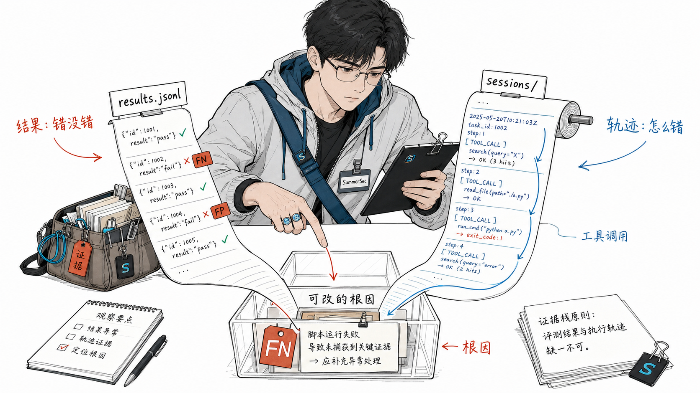

### 我的数据从哪来：就是 sec-code-bench 平台

先把我自己的情况说清楚：上面这两份文件，我是从一个叫 **sec-code-bench** 的平台导出的。它是我们自己搭的一套 Agent 任务评测平台（FastAPI + SQLite），不是"安全审计专用"系统。原则上，只要输出能被客观判定对错，就可以接进来跑。

平台只做几件事：

```
数据集（每个 case 带人工标注的 ground_truth）
  → 通过 OpenAPI 把 case 派发到任务运行平台，全程记录 agent 的操作日志
  → LLM judge 从 agent 的回答里提取结论（true / false）
  → 跟 ground_truth 对照，自动算出 TP / FP / TN / FN
  → 一键打包导出，喂给进化
```

平台自己不参与进化，它只干一件事：可靠地产出"agent 这次到底答对没有"的客观数据。前面说过，自进化的立足点就是这个客观信号，平台就是信号的来源。

这里有个容易被忽略的设计：评测运行在真实任务环境里。sec-code-bench 不自己起沙箱跑 agent，而是通过 OpenAPI 对接真实的任务运行平台。评测时 agent 用的模型、工具链、代码运行环境，跟它日常干活保持一致。平台只负责出题、记录结果和判分，执行侧交给任务运行环境。这样测出来的对错率更接近 agent 在真实任务里的表现，进化方向也不容易被"实验室假象"带偏。

最后那步"一键打包导出"产出的，正是上面这两份文件：跑完一轮评测点一下，就能下载一个 zip，里面是 `results.jsonl` + `sessions/<case_id>.jsonl`，外加一份 `manifest.json`（记着这批数据用的哪个数据集、哪个 agent、哪个 judge 模型）。`results.jsonl` 里的 `case_id` 跟 `sessions/` 的文件名严格对齐，拿来就能喂进化。

### 一组真实评测结果：进化前后差多少

为了让前面这套数据流不悬空，下面放一组从 sec-code-bench 直接导出的真实运行结果。场景完全一致：同一个 agent（`claude-code-biz-vul`），同一个"营销漏洞评测数据集"，总共 63 个 case；所有 run 都是 `completed`，`error_cases=0`。区别主要在于 skill profile：一组用进化前的 `deepseek` skill，一组用自动迭代后的 `evolution` skill。

<!--
illustration-prompt: 02b-baseline-vs-evolved-results
Generate one standalone 16:9 horizontal Chinese article illustration for a sumsec.me style technical blog.

Visual DNA: pure white background, clean minimalist deep charcoal contour line art, restrained low-saturation character color washes, large blank space, sparse cyan-blue and red-orange handwritten Chinese annotations. White-paper engineering sketch feeling, not PPT, not formal infographic, not UI screenshot, not dashboard, not cyberpunk, no pixel art, no top-left title.

Recurring SumSec Observer required: original young adult security researcher and system observer with dark ink slightly messy side-swept short hair, thin-frame glasses, quiet sober low-key melancholic focused expression, clean-shaven jawline, pale cool-gray high-collar lightweight hooded jacket, dark cyan-blue inner lining / drawstrings / crossbody strap, black inner shirt, dark pants, muted gray-brown side tool bag with log papers and tiny cyan cables, black clipboard, chest "SummerSec" badge, exactly two subtle cyan-blue S-emblem rings, and one small black S tool chip. Natural upright posture, simple hand pose only.

Theme: 基线版本和进化后版本的评测结果对比。
Structure type: 前后对比 / 证据栈。
Core idea: 同一批 63 个 case 的评测里，进化后的 skill 不是单纯把分数写高一点，而是把基线版本里容易漏掉的 case 重新兜住，让结果更稳、误漏更少。Kimi 从 77.8% 提升到 84.1%，GLM 从 77.8% 提升到 88.9%，DeepSeek 从 82.5% 提升到 87.3%；这些数字只是证据，真正要表达的是“同一批 case 里，被漏掉的结果变少了，判断被拉稳了”。
Composition: On a wide white desk, SumSec Observer stands slightly to one side, comparing three paired paper result trays for Kimi, GLM, and DeepSeek. In each left baseline tray, a few small red-orange case slips are visibly sliding out of the tray or hanging at the edge, suggesting missed cases and unstable judgment. In each right evolved tray, those slips have been gathered back inside and clipped into place with small cyan seals, so the tray looks calmer, fuller, and more ordered. Observer uses one hand to press a loose red-orange slip back into the middle pair while holding a black clipboard in the other hand. A small blue strip labeled the same 63-case batch feeds both left and right trays. The exact percentages should appear only as tiny corner evidence notes attached to each model pair, such as Kimi 77.8% -> 84.1%, GLM 77.8% -> 88.9%, DeepSeek 82.5% -> 87.3%, not as large floating headline text. Do not draw a real table, dashboard, or matrix; make it a paper-tray comparison scene that shows fewer escaped cases on the evolved side.
Suggested elements: paired paper result trays / slipping case slips / red-orange FN tags / cyan seals or clips / black clipboard.
Chinese handwritten labels: "同一批 63 case" / "基线会漏" / "进化后兜住了" / "FN 变少" / "更稳" / "Kimi 77.8->84.1"。
Color use: deep charcoal lines, pale cool gray and muted off-white for cards, cyan-blue for checks and evidence strip, red-orange only for failure tags and risky points, restrained character colors as specified.
Constraints: one image explains only the improvement relationship between baseline and evolved results. The key visual meaning must come from fewer missed cases and steadier trays, not from standalone percentages. Do not turn it into a precise chart, percentage dashboard, matrix table, or product screenshot. If exact numbers appear, keep them tiny and attached to the corresponding model pair as corner evidence notes, never as the main headline. The article table below already carries exact metrics.
-->
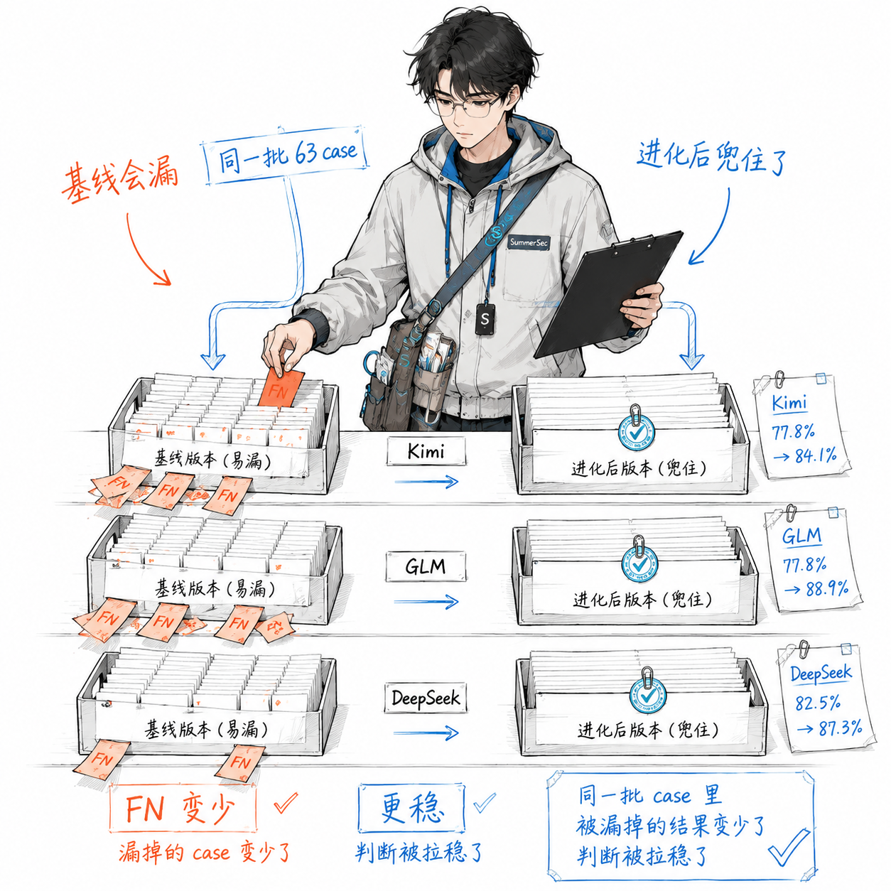

这张图只保留每组模型的基线版本和最终进化版本，方便直接看变化：Kimi 从 77.8% 到 84.1%，GLM 从 77.8% 到 88.9%，DeepSeek 从 82.5% 到 87.3%。图只表达"基线 vs 进化后"的对比关系；完整版本编号以下方表格为准，DeepSeek 中间还有一次 84.1% 的过渡运行。

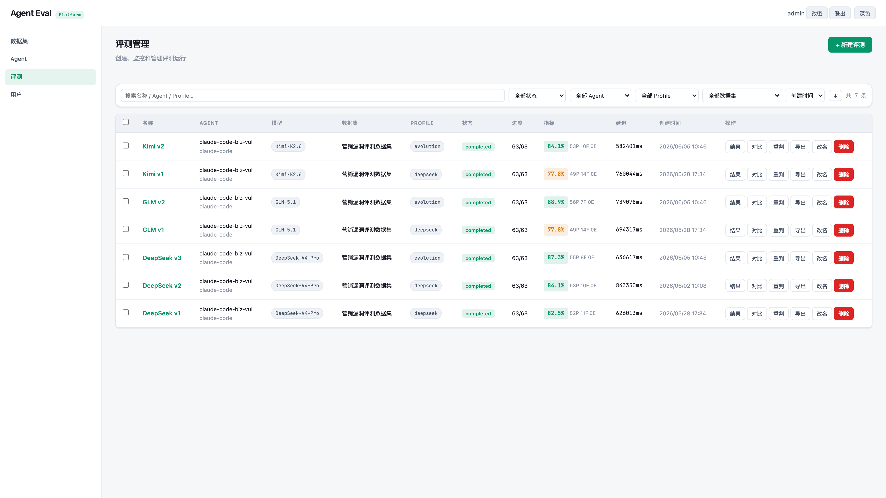

评测任务列表负责把不同 skill profile 的运行放在同一个视图里：状态、进度、通过率、失败数、平均延迟都能直接对齐。这里能看到 `Kimi v1/v2`、`GLM v1/v2`、`DeepSeek v1/v2/v3` 七条重命名后的任务，也能一键进入结果、对比和导出。

| 运行名称 | Skill profile | 时间 | 通过率 | 通过/失败 | TP | TN | FP | FN | 平均耗时 |
|----------|---------------|------|--------|-----------|----|----|----|----|----------|
| `Kimi v1` | `deepseek` | 2026/05/28 17:34 | 77.8% | 49P / 14F | 18 | 31 | 4 | 10 | 760044ms |
| `Kimi v2` | `evolution` | 2026/06/05 10:46 | 84.1% | 53P / 10F | 21 | 32 | 5 | 5 | 582401ms |
| `GLM v1` | `deepseek` | 2026/05/28 17:34 | 77.8% | 49P / 14F | 18 | 31 | 4 | 10 | 694317ms |
| `GLM v2` | `evolution` | 2026/06/05 10:46 | **88.9%** | **56P / 7F** | 22 | 34 | 3 | 4 | 739078ms |
| `DeepSeek v1` | `deepseek` | 2026/05/28 17:34 | 82.5% | 52P / 11F | 19 | 33 | 2 | 9 | 626013ms |
| `DeepSeek v2` | `deepseek` | 2026/06/02 10:08 | 84.1% | 53P / 10F | 20 | 33 | 2 | 8 | 843350ms |
| `DeepSeek v3` | `evolution` | 2026/06/05 10:45 | 87.3% | 55P / 8F | 19 | 36 | 1 | 7 | 636617ms |

粗看总分，`evolution` 组的最好成绩是 **88.9%（56/63）**，比进化前同批基线里的 77.8% 起点高了 **11.1 个百分点**；如果按这几次运行简单平均，进化前 4 次是 50.75/63（约 80.6%），进化后 3 次是 54.67/63（约 86.8%），平均多做对约 4 个 case。

但更有意思的是逐 case 对比。比如：

- `Kimi v1` → `Kimi v2`：修复 10 个原本错误的 case，同时新增 6 个错误，净提升 4 个 case
- `GLM v1` → `GLM v2`：修复 9 个原本错误的 case，新增 2 个错误，净提升 7 个 case
- `DeepSeek v2` → `DeepSeek v3`：修复 6 个原本错误的 case，新增 4 个错误，净提升 2 个 case

这组数据给我的提醒是：总分会掩盖很多细节。自动迭代确实能把一批稳定失败的 case 拉回来，但"修复"和"回归"经常一起发生。后面要讲的 guardrail gate，就是为了把这些逐 case 的新错误拦下来。不是让 skill 每轮都更激进，而是让它在变强的时候尽量不忘旧账。

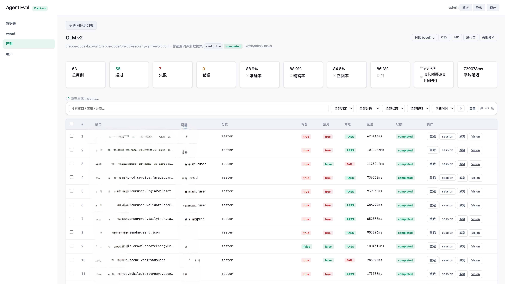

单次结果页会把 63 个 case 拆开看：总通过数、失败数、精确率、召回率、F1、TP/FP/TN/FN，以及每个 case 的判定、延迟和 session 入口。进化系统后面吃的 `results.jsonl` 和 `sessions/`，就是从这里一键导出的。

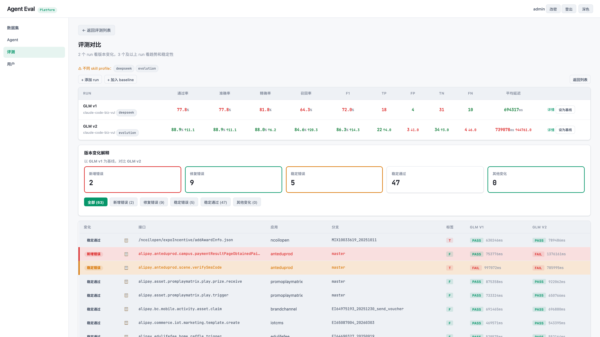

对比页则直接暴露"变好"和"变坏"的细账：比如 `GLM v1` 到 `GLM v2`，通过率从 77.8% 到 88.9%，修复 9 个错误，但也新增 2 个错误。guardrail gate 要处理的正是这种净提升背后的回归风险。

## 先看一个真实 case：系统到底怎么改 skill

先用一个脱敏 case 串一下完整流程，再拆里面的模块。

评测集中有个 case `biz-vul-037`，标注是 `ground_truth: "true"`（存在漏洞）。agent 连续 3 轮都判成 `false`（无漏洞），属于稳定漏报。

trace_parser 先把 28 万 token 左右的原始 session 压成一个几千 token 的结构化摘要：

```json
{
  "tool_calls_total": 67,
  "tool_breakdown": {"Read": 38, "Grep": 21, "Bash": 8},
  "errors": 1,
  "steps_claimed": ["STEP1", "STEP2", "STEP3", "STEP4"],
  "steps_evidenced": ["STEP1", "STEP2", "STEP4"],
  "conclusion": "false"
}
```

关键信号很明确：agent 声称自己走了 STEP 3（追调用链到实现层），但 session 里没有对应证据。诊断规则命中 `progress_mismatch`，再叠加结果类型 `FN`，根因就收敛成一句话：**调用链没有追到 `ServiceImpl` 层，在接口签名层面就下了无漏洞结论**。

同一类根因覆盖了 5 个失败 case，占全部失败 case 的 38%，超过默认 30% 的聚合门槛，于是触发进化。patch_engine 生成的修改是一个很小的 diff：

```diff
--- a/SKILL.md
+++ b/SKILL.md
@@ -45,3 +45,6 @@ STEP 3: 调用链追踪
 - 从入口 Controller 向下追踪
+- 必须用 `Grep` 追到 `ServiceImpl` / `Processor` 层的具体实现
+- 仅看接口签名或 Facade 层不算完成本步骤
+- 若追踪深度不足：在结论中标注"调用链未追到实现层，判定置信度低"
```

这个 patch 不是生成完就直接接受。它还要过结构检查、文本质量检查、target gate、guardrail gate、holdout gate、verify gate。最后结果是：5 个 target case 里修复了 2 个，28 个历史通过 case 无回归，文本质量分也没下降，这才写入 `iterations/v3/`。

这轮能不能进主线，不看 patch 写得像不像那么回事，只看 gate 的结果。LLM 在这里做的事很窄：把诊断结论转成一个候选 diff。

<!--
illustration-prompt: 03-trace-diagnosis
Generate one standalone 16:9 horizontal Chinese article illustration for a sumsec.me style technical blog.

Visual DNA: pure white background, clean minimalist deep charcoal contour line art, low-density details, restrained low-saturation character color, plenty of empty white space, sparse cyan-blue and red-orange handwritten Chinese annotations. Not PPT, not a formal flowchart, not cyberpunk, not UI, no pixel art, no top-left title.

Recurring SumSec Observer required: young adult SumSec Observer, deep ink slightly messy side-swept short hair, thin-frame glasses, quiet sober slightly weary working expression, clean-shaven, pale cool-gray high-collar hooded jacket, dark cyan-blue lining/drawstrings/crossbody strap, black inner shirt, dark pants, gray-brown side tool bag, black clipboard/tablet, log papers, red-orange evidence tags, tiny cyan cables, chest "SummerSec" badge, exactly two subtle S-emblem rings. Character performs the core action.

Theme: 通过执行轨迹定位漏掉的步骤。
Structure type: 证据栈 / 漏洞链路。
Core idea: agent 声称走了 STEP 3，但 session 里缺少对应证据；结果 FN + 轨迹缺步，才形成可行动的根因。
Composition: A long horizontal log tape lies across the page with four lightly drawn stations: STEP1, STEP2, STEP3, STEP4. STEP3 is a visible blank gap with a small torn-paper hole. SumSec Observer leans slightly forward, pointing at the empty STEP3 gap with a black clipboard in the other hand. A red-orange tag says "缺证据", a small red-orange sticker says "FN", and a cyan note says "progress_mismatch". A small folded patch note "候选 diff" waits on the right, not yet accepted.
Suggested elements: log tape / missing STEP3 gap / red-orange FN tag / cyan progress_mismatch note / folded patch note.
Chinese handwritten labels: "声称走了" / "实际缺步" / "FN" / "缺证据" / "候选 diff".
Color use: deep charcoal for tape and linework; cyan for trace diagnosis note; red-orange for FN and missing evidence; restrained character colors.
Constraints: do not make it a complicated call-chain diagram; one missing step should be the visual focus.
-->
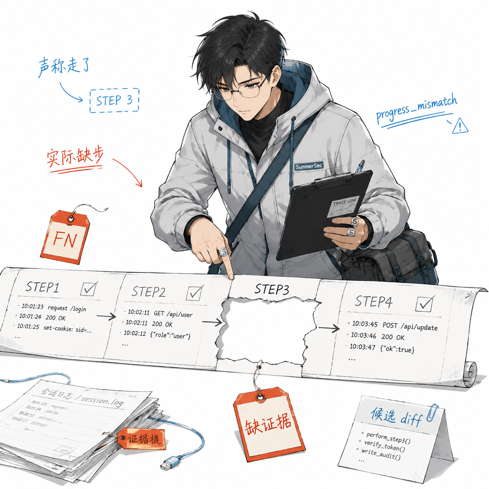

## 第一个反直觉设计：诊断不用 LLM

这是整套系统最反直觉的一个决定：**诊断阶段完全不用 LLM，只用确定性规则**。

你可能会问：既然都是 AI 的事，为什么不让 AI 自己判断哪里错了？

答案来自一次不太好看的实验结果：让 LLM 直接判断 skill 好不好，稳定性明显低于规则方法，部分设置接近随机水平。

这里的"测过"不是拍脑袋：我们抽取了历史失败 case 的 session 摘要和人工复盘结论，让 LLM 判断"是不是 skill 流程问题、该不该改 skill"，再跟人工归因和规则诊断结果对照。结果很不稳定：同一批 case 换一次 prompt 或模型温度，结论就会明显漂移；而规则诊断虽然覆盖面有限，但至少不会因为 prompt 或采样参数变化而漂移。最后我们接受了一个更朴素的取舍：**诊断宁可少判，也不要飘着判**。

想想也合理：让员工自己评判自己的手册写得好不好，能有多客观？

<!--
illustration-prompt: 06-deterministic-diagnosis
Generate one standalone 16:9 horizontal Chinese article illustration for a sumsec.me style technical blog.

Visual DNA: pure white background, clean minimalist deep charcoal contour lines, restrained low-saturation marker/watercolor character color, lots of white space, sparse cyan-blue and red-orange handwritten Chinese annotations. White-paper engineering sketch, dry humor, not PPT, not a formal flowchart, no UI screenshot, no cyberpunk, no pixel art, no top-left title.

Recurring SumSec Observer required: young adult security researcher/system observer, clean-shaven, dark ink messy side-swept short hair, thin-frame glasses, quiet sober slightly tired focused expression, pale cool-gray hooded jacket, dark cyan-blue lining/drawstrings/crossbody strap, black inner shirt, dark pants, muted gray-brown tool bag with log papers, black clipboard/tablet, tiny cyan cables, red-orange evidence tags, small chest "SummerSec" badge, exactly two subtle cyan-blue S-emblem rings. Character must perform the core action.

Theme: 诊断阶段不用 LLM，而是用可复查的确定性规则。
Structure type: 系统局部 / 概念隐喻。
Core idea: LLM 可以生成候选改法，但诊断台只接受稳定规则；少判比飘着判更可靠。
Composition: SumSec Observer stands at a simple white inspection desk, calmly sliding several behavior evidence cards through a row of small mechanical rule calipers labeled "tool", "retry", "progress", "error". A large soft speech bubble labeled "LLM 判断" floats outside a transparent side box with a small red-orange "先别进" tag. Passing cards get tiny cyan check marks; uncertain cards are placed in a small tray labeled "未诊断". Keep the scene physical and sparse, like a hand-built lab bench, not a software dashboard.
Suggested elements: rule calipers / behavior evidence cards / side box for LLM / undiagnosed tray / cyan checks.
Chinese handwritten labels: "规则诊断" / "可复查" / "少判" / "未诊断" / "先别进".
Color use: deep charcoal linework; cyan for stable rule checks; red-orange only for exclusion tags or warnings; restrained character colors.
Constraints: do not draw a judge robot, do not make it a debate scene, do not use a formal pipeline diagram.
-->
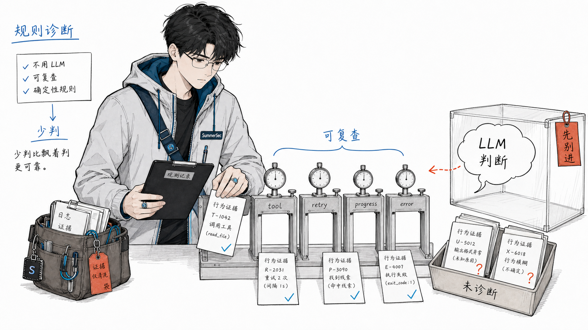

### 诊断引擎怎么工作：三层压缩 + 可扩展规则

诊断分两步：先压缩，再判断。

**第一步：trace_parser——把 agent 的"答题过程"压缩 100 倍。**

原始 session 文件可能有 10-50 万 token（一次审计 agent 可能读了几十个文件、调了上百次工具）。直接喂给 LLM 会超窗口、注意力稀释、结果不可复现。

trace_parser 把这些信息压成三层：

```
层 1: 工具调用骨架（保留工具名 + 参数摘要，丢弃返回内容）
层 2: 阶段统计（每类工具调了几次、error 几个、重试几次）
层 3: 进度交叉验证（Agent 声称执行了 STEP 1/2/3，实际 session 有没有对应调用）
```

压缩比约 100:1。几十万 token 的原始 session，压成几千 token 的结构化 JSON。

**trace_parser 还能自动识别两种不同的 session 格式**——标准 JSONL 和 Claude Code 原生 transcript 格式，通过扫描前几行的特征自动路由，用户不需要手动指定。

**第二步：flow_diagnosis——一组可扩展的规则。**

当前内置了一组基础规则，每条规则检测一种"agent 干活时的坏习惯"：

| 规则 | 检测什么 | 用人话说 |
|------|---------|---------|
| `no_tool_calls` | session 里零工具调用 | 不干活 |
| `redundant_retry` | 同一个工具、同样参数调了 ≥3 次 | 反复做同一件事，没有进展 |
| `repeated_file_edits` | 同一文件被编辑 ≥5 次 | 试错型修改 |
| `tool_error_burst` | 真实 error ≥8 条（排除搜索空结果） | 连续出错 |
| `tool_error_high_rate` | 单工具 error 率 ≥50% | 某个工具基本用不好 |
| `tool_imbalance` | 单工具占 >60% 调用 | 工具使用不均衡 |
| `progress_mismatch` | 声称走了 STEP 1/2/3 但实际缺步 | 说一套做一套 |
| `conclusion_missing` | 调了 ≥5 个工具但没给出结论 | 做了但不交卷 |

`tool_error_burst` 规则会过滤"良性 error"——比如 Search 返回 "0 results found"、Read 返回 "no such file"，这些是搜索型工具的正常返回，不算真正的 error。用 `BENIGN_ERROR_PATTERNS` 列表过滤，避免误判。

这里有个我很在意的取舍：内置基础规则不含业务关键字。没有 `vul_definitions.md`，没有 `tr_interface_matcher.py`，也没有跟"安全审计"相关的词。它们只看 agent 行为本身，换成代码审查、数据分析之类的 agent 也能用。业务专属的检测，比如"审计任务必须调用某个脚本"，可以通过扩展检查器接入；主引擎只负责执行规则、聚合命中结果和进入后续 gate。

### 联合归因：结果 × 流程 = 根因

诊断引擎不是孤立地看"哪条规则命中了"，而是把**评测结果类型**和**流程问题**交叉对比：

```
case 结果=FN（漏报）+ progress_mismatch（声称走了 STEP 1/2/3，实际缺步）
  → 根因：声称追了调用链，实际没追到实现层，漏判

case 结果=FN（漏报）+ no_tool_calls（零工具调用）
  → 根因：没做实质分析就下了"无漏洞"结论

case 结果=pass + redundant_retry（重复重试）
  → 结果对但效率低（低优先级，先不管）
```

只有 **结果错误 + 流程异常的交集** 才触发进化。pass 但流程有瑕疵的 case 不急着改。这避免了过度优化——"又没答错，改它干嘛"。

而且还有一个默认聚合门槛：同一根因覆盖 ≥30% 的失败 case，才值得进入修改流程。低于这个比例说明失败原因太零散，不是系统性问题，强行改可能越改越乱。这个阈值不是定律，换任务时应该跟着样本量和失败分布一起调整。

---

## 一个你想不到的模块：质疑测试数据本身

这套系统里有个少见的设计——**gt_auditor（ground_truth 审计器）**。

大多数系统都有一个隐含假设：测试数据的标注是对的。agent 答错了 → agent 的问题。

但实际上，**标注也可能标错**。如果某个 case 的 ground_truth 本身就是错的，agent 按照正确逻辑得出正确答案，却因为标注错误被判"失败"。如果系统根据这个"失败"去改 SKILL.md，那是在**为了迁就错误标注而改歪自己**。

gt_auditor 的做法是——给每个失败 case 打一个"GT 可疑度"分数，范围 0~1。五个确定性信号加权求和：

| 信号 | 权重 | 逻辑 |
|------|------|------|
| agent 和 Judge 一致，但跟 GT 相反 | **0.40** | 最强信号：agent 输出和判读结果都指向 A，只有标注说 B |
| 步骤覆盖完整（≥5 个 STEP） | 0.20 | agent 完整走完了分析流程，不是偷懒 |
| 执行清洁（error ≤2） | 0.10 | 执行过程没出什么问题 |
| 无重试 | 0.10 | 执行很流畅 |
| 结论明确 | 0.10 | agent 明确给出了 final verdict |

可疑度 ≥ 0.5 的 case 被标记为"GT 嫌疑"。

**关键设计：GT 嫌疑 case 不被排除出评测**——它们仍正常参与 gate 验证（否则就是在选择性忽略数据）。但在 patch 生成阶段，LLM 会被告知"以下 case 可能是标注错误，不要为了迁就它们而改歪 SKILL.md"。

还有一类更直接的矛盾检测：同一种类型的 case（比如相同 `vul_type`）有的标 true、有的标 false，就自动标记为数据质量问题。

这五个信号仍然是规则，不让 LLM 在这里自由发挥。

<!--
illustration-prompt: 07-gt-auditor
Generate one standalone 16:9 horizontal Chinese article illustration for a sumsec.me style technical blog.

Visual DNA: pure white background, clean minimalist deep charcoal contour lines, restrained low-saturation character color, lots of white space, sparse cyan-blue and red-orange handwritten Chinese annotations. White-paper engineering sketch with dry humor. Not PPT, not formal infographic, no UI screenshot, no cyberpunk, no pixel art, no top-left title.

Recurring SumSec Observer required: young adult clean-shaven SumSec Observer with dark ink messy side-swept short hair, thin-frame glasses, quiet sober low-key melancholic working expression, pale cool-gray hooded jacket, dark cyan-blue lining/drawstrings/crossbody strap, black inner shirt, dark pants, muted gray-brown tool bag, black clipboard/tablet, log papers, red-orange evidence tags, tiny cyan cables, small chest "SummerSec" badge, exactly two subtle S-emblem rings.

Theme: gt_auditor 质疑测试数据本身。
Structure type: 证据栈 / 前后对比。
Core idea: 失败不一定都是 agent 错；当 agent、Judge 和 GT 出现矛盾时，标注也要进入审计。
Composition: A simple balance scale sits on a white desk. One side holds a red-orange tag labeled "GT", the other side holds two paper cards labeled "Agent" and "Judge" with cyan check marks. SumSec Observer writes on a clipboard and attaches a small note "GT 可疑" to the scale base. Nearby are five small thin signal strips, each with a tiny weight mark, but not a dense chart. The visual focus is the imbalance between GT and evidence.
Suggested elements: balance scale / GT tag / Agent and Judge cards / five signal strips / suspicion note.
Chinese handwritten labels: "GT 可疑" / "Agent" / "Judge" / "标注也要审" / "别迁就错标".
Color use: cyan for agreement/evidence; red-orange for suspicious GT label; restrained character colors.
Constraints: no courtroom scene, no database cylinder, no big checklist table; make it feel like evidence weighing.
-->
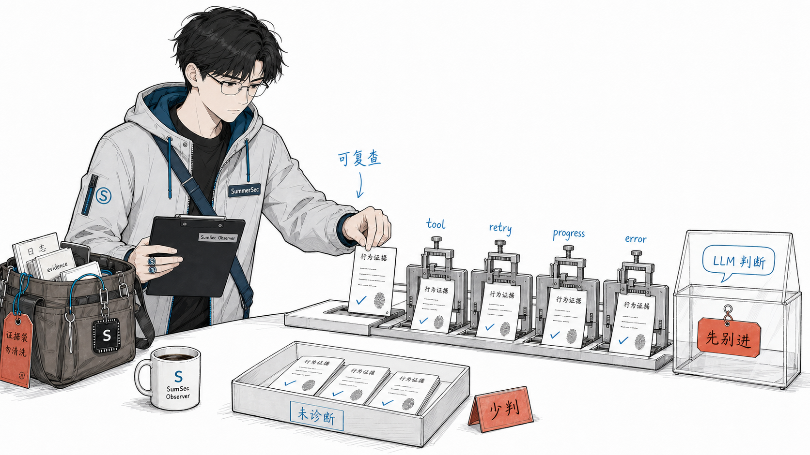

---

## Patch 引擎：只让 LLM 生成候选 diff

诊断完了，知道 agent 哪里出了问题。下一步：改 SKILL.md。

在这套进化流程里，LLM 只负责生成候选修改：根据诊断结果，写出一个 unified diff 格式的最小 patch。

为什么只在这一步让 LLM 介入生成？因为"把诊断结论转化为自然语言的 SKILL.md 修改"是一个文本改写任务，这恰好是 LLM 擅长的事。诊断需要稳定，验证需要可复现，都不适合交给生成式判断。

<!--
illustration-prompt: 08-patch-diff-engine
Generate one standalone 16:9 horizontal Chinese article illustration for a sumsec.me style technical blog.

Visual DNA: pure white background, clean minimalist deep charcoal contour line art, restrained low-saturation marker/watercolor character color, lots of white space, sparse cyan-blue and red-orange handwritten Chinese annotations. Clean white-paper engineering sketch, dry humor, not PPT, not UI, no cyberpunk, no pixel art, no top-left title.

Recurring SumSec Observer required: young adult clean-shaven security researcher/system observer with dark ink messy short hair, thin-frame glasses, quiet sober slightly tired focused expression, pale cool-gray hooded jacket, dark cyan-blue lining/drawstrings/crossbody strap, black inner shirt, dark pants, muted gray-brown tool bag with log papers, black clipboard/tablet, red-orange evidence tags, tiny cyan cables, small chest "SummerSec" badge, exactly two subtle S-emblem rings.

Theme: LLM 只负责吐出候选 unified diff。
Structure type: 概念隐喻 / 系统局部。
Core idea: 生成器只是一台小型 diff 打印机，产物必须先变成可应用、可回滚的 patch。
Composition: A small low-tech paper printer labeled "LLM" prints a narrow sheet labeled "patch.diff" with visible --- / +++ / @@ marks. SumSec Observer catches the sheet with one hand and clips it onto a black clipboard; beside the printer are two small bins: one cyan bin labeled "候选" and one red-orange bin labeled "口号". A compact SKILL.md folder waits on the desk. The printer is useful but not trusted as final authority.
Suggested elements: LLM paper printer / patch.diff strip / SKILL.md folder / candidate bin / slogan reject bin.
Chinese handwritten labels: "候选 diff" / "SKILL.md" / "可回滚" / "口号退回" / "@@".
Color use: cyan for accepted candidate flow; red-orange for rejected slogan bin; restrained character colors.
Constraints: no robot assistant, no chat bubbles full of text, no complex patch table; one small printer metaphor only.
-->
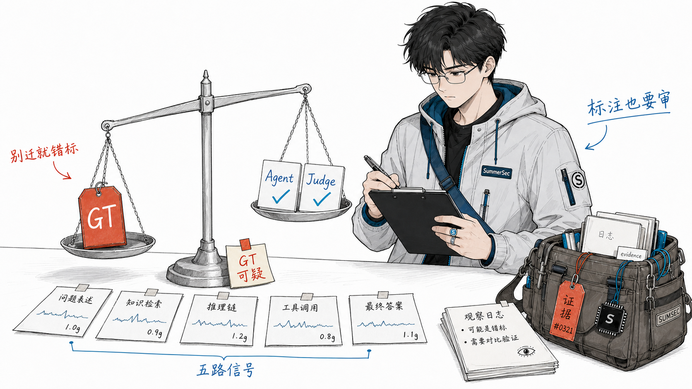

### 喂给 LLM 的输入（< 10KB）

```
1. 当前 SKILL.md 全文                       ~5KB
2. 失败 case 联合归因摘要                   ~2KB
3. GT 审计结果（哪些 case 可能是标注错误）   ~0.5KB
4. taboo 黑名单（已试过但失败的改法）        ~0.5KB
```

合计不到 10KB。这里故意压得很短，输入越短，越不容易把模型带散。

### 输出：严格只接受 unified diff

LLM 的输出不是"描述性文字"（比如"建议在第 3 步增加一条规则"），而是**可以直接 `patch` 命令应用的 unified diff**：

```diff
--- a/SKILL.md
+++ b/SKILL.md
@@ -42,3 +42,5 @@ STEP 2: 调用链追踪
 - 从入口 Controller 向下追踪
 + 必须追到 Processor / ServiceImpl 层（仅看接口签名会漏判）
 + 否则：报告中标注"调用链未追到实现"
```

为什么坚持 diff 格式？因为描述文字没法机器回滚。如果这次改坏了，diff 可以精确撤销；描述文字只能重新让 LLM 去理解"上次改了啥"，又引入一层不确定性。

### 三重过滤：LLM 生成的东西不能直接信

LLM 生成的 patch 不能直接用——它可能生成口号、可能踩 taboo、可能破坏文档结构。所以有三层过滤：

**第一层：taboo 拦截（LLM 调用之前）**

先算待改 patch 的签名（rule_id + 诊断方向），查黑名单。如果这个方向上次已经试过且被 gate 拒绝了，直接跳过，不浪费一次 LLM 调用。

**第二层：结构检查（LLM 返回之后）**

```
✓ 必须包含 --- a/SKILL.md / +++ b/SKILL.md / @@ 三件套
✓ diff 总行数 ≤ 80（保守的 learning rate）
✓ 不允许新增 markdown 标题行（#/##/###）——防止重组文档结构
```

**第三层：文本质量检查**

这层检查的核心理念是：**反口号**。

很多 LLM 喜欢生成"认真审查代码"、"仔细检查参数"这种正确但无用的废话。patch_engine 用正则强制要求：

- **DO / 步骤行必须包含工具名或文件路径**。比如 `"用 Grep 搜索 campId"` 合格，`"认真审查代码"` 不合格。判定标准：新增行必须匹配到反引号包裹的代码、大驼峰类名、带后缀的文件路径、函数调用、或 CLI 参数——任何一个都行，但一个都没有就是空话
- **黑名单短语直接拒绝**。"无论如何"、"永远不"、"跳过检查"——这些绝对化指令会让 agent 在边界情况下出错
- **声称"修复 X"的行必须编码具体动作**。不能光说"避免漏判"，必须同时说怎么避免（调什么工具、查什么文件）

三层过滤全是确定性规则。任何一层出现 fatal 级别问题，patch 直接被拒。

> 这套"反口号"机制背后有一个更深的发现：**不同的词选择本身就能让 LLM 的准确率相差 27 个百分点**。这个故事和完整的陷阱词表，放在后面"语义陷阱"一节展开。

### 为什么限制 ≤80 行 diff

这不是随意的数字。每次只改一小处，有三个好处：

1. **定位回归原因**：如果这次改完 3 个 case 回归了，你确切知道是哪处改动导致的
2. **taboo 有意义**：改动越小，taboo 的签名越精确，越不容易误伤
3. **防灾难性遗忘**：大面积重写 SKILL.md 会破坏之前有效的规则，实测如此

这跟机器学习里的 learning rate 是同一个道理——步子太大容易翻车。

---

## 四层验证：改完之后怎么确认没搞坏

改完 skill 之后，怎么确认改好了？

很多人的做法是"跑一遍测试看分数涨没涨"。但这远远不够——你可能改好了 3 个 case，同时搞坏了 5 个。

我们设计了四层 gate，**每一层检查一个不同的维度**：

```
┌─────────────────────────────────────────────────┐
│  第 1 层  Target Gate                            │
│  → 本次想修的 case，至少有 1 个从错变对          │
│  → 确保"改了有用"                               │
├─────────────────────────────────────────────────┤
│  第 2 层  Guardrail Gate                         │
│  → 之前答对的 case，改完一个都不能答错          │
│  → 确保"没搞坏旧功能"                           │
├─────────────────────────────────────────────────┤
│  第 3 层  Holdout Gate（每 5 轮一次）            │
│  → 一批从未参与诊断的"隐藏测试"                 │
│  → 整体 F1 不能掉超过 1 个百分点                │
│  → 确保"泛化能力没退步"                         │
├─────────────────────────────────────────────────┤
│  第 4 层  Verify Gate                            │
│  → SKILL.md 本身的文本质量打分 ≥ 75 分          │
│  → 且比上一版不掉 > 5 分                        │
│  → 确保"手册没有自相矛盾、没有废话"             │
└─────────────────────────────────────────────────┘
```

**任何一层没过，patch 就被丢掉。**

<!--
illustration-prompt: 04-four-gates
Generate one standalone 16:9 horizontal Chinese article illustration for a sumsec.me style technical blog.

Visual DNA: pure white background, clean minimalist deep charcoal contour lines, restrained marker/watercolor character color, lots of white space, sparse cyan-blue and red-orange handwritten Chinese annotations. White-paper engineering sketch with dry humor. Not PPT, not a formal process chart, no UI screenshots, no cyberpunk, no pixel art, no top-left title.

Recurring SumSec Observer required: original young adult security researcher/system observer, clean-shaven, dark ink messy side-swept short hair, thin-frame glasses, quiet sober low-key melancholic working expression, pale cool-gray hooded jacket, dark cyan-blue lining/drawstrings/crossbody strap, black inner shirt, dark pants, gray-brown tool bag with log papers, black clipboard, red-orange evidence tags, tiny cyan cables, chest "SummerSec" badge, exactly two subtle S-emblem rings. Simple hand pose, natural upright posture.

Theme: 四层 gate 拦住坏 patch。
Structure type: 概念隐喻 / 系统局部。
Core idea: patch 不是生成完就接受，而是要过 target、guardrail、holdout、verify 四道闸；任何一层失败都退回。
Composition: Four small hand-drawn paper gate frames stand in a row like low-tech inspection hoops, each gate has a short label: "target", "guardrail", "holdout", "verify". SumSec Observer gently pushes a small paper envelope labeled "patch.diff" through the first gate with one hand while holding a clipboard. A rejected envelope sits in a small side tray with red-orange label "退回". Cyan check marks appear on passed gates, red-orange cross marks only on the rejected tray. Keep it organic and sketchy, not a formal pipeline.
Suggested elements: four paper gates / patch envelope / reject tray / cyan check marks / red-orange fail tag.
Chinese handwritten labels: "patch.diff" / "target" / "guardrail" / "holdout" / "verify" / "退回".
Color use: deep charcoal frames; orange/cyan small motion/check marks; red-orange only for rejection/failure; restrained character colors.
Constraints: not a PPT gate diagram; no dense arrows; each gate should feel like a physical paper checkpoint.
-->
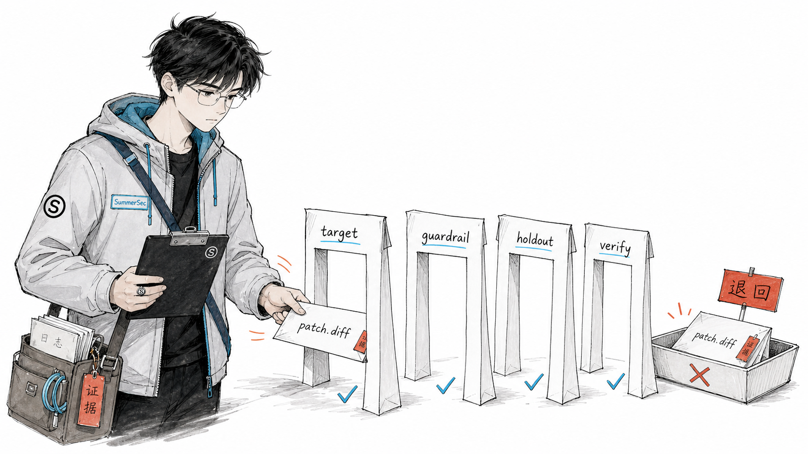

### Holdout 集的严格隔离

还有一个隔离设计——**Holdout 集完全隔离**：

```
全量 case 池
├── Selection split (60%)   target + guardrail，参与每轮判定
├── Holdout split   (25%)   每 5 轮才看，纯泛化监控
└── Golden set      (15%)   人工审过，verify 校准用，永不参与进化
```

诊断阶段用的 case、patch 参考的 case、Holdout 统统看不到。为什么？因为如果你在写 patch 的时候能看到测试答案，那就不是在"提升泛化能力"，而是在"背答案"。

这借鉴的是机器学习的经典做法：训练集和测试集必须严格分离，否则你测出来的分数是假的。

### Verify Gate：指标好但流程烂也不行

第四层 verify 是跟前三层**正交**的维度。前三层看的是"结果对不对"，verify 看的是"SKILL.md 写得好不好"——格式合规、触发词有效、核心规则前置、没有硬编码路径等等。

一个 SKILL.md 可能在当前 case 上效果好，但文本质量烂（充满绝对化指令、缺少否定清单），迟早在新 case 上翻车。verify 就是防这个。

如果你的 workspace 里还没有 verify 脚本，系统会自动从模板 fork 一份。下一轮自动复用，减少重复配置。

---

## 黑名单机制：进化的记忆

每次 patch 被拒绝，我们都会记下来：

```json
[
  {
    "rule_id": "redundant_retry",
    "diff_hash": "a3f7c9e2b1d45678",
    "reason": "gate rejected: guardrail gate 失败，3 个历史通过 case 回归",
    "recorded_at": "2026-05-27T14:30:00Z"
  }
]
```

下次 LLM 生成新 patch 时，会看到完整的黑名单。就像在便利贴上写"上次这么改搞砸了，别再试"。

**没有这个机制，系统会在几个"看起来合理但实际有害"的修改之间反复横跳。**

<!--
illustration-prompt: 09-taboo-memory
Generate one standalone 16:9 horizontal Chinese article illustration for a sumsec.me style technical blog.

Visual DNA: pure white background, clean minimalist deep charcoal contour line art, restrained low-saturation character color, lots of blank space, sparse cyan-blue and red-orange handwritten Chinese annotations. White-paper engineering sketch, dry humor, not PPT, not formal architecture diagram, no UI screenshot, no cyberpunk, no pixel art, no top-left title.

Recurring SumSec Observer required: young adult clean-shaven SumSec Observer, dark ink messy side-swept short hair, thin-frame glasses, quiet sober slightly tired focused expression, pale cool-gray hooded jacket, dark cyan-blue lining/drawstrings/crossbody strap, black inner shirt, dark pants, muted gray-brown tool bag, black clipboard/tablet, log papers, red-orange evidence tags, tiny cyan cables, small chest "SummerSec" badge, exactly two subtle S-emblem rings. Character must perform the core action.

Theme: taboo 黑名单记住失败 patch，避免重复踩坑。
Structure type: 证据栈 / 概念隐喻。
Core idea: 被 gate 拒绝的 patch 不只是丢掉，还会变成负面记忆，下一轮提示 LLM 别再试同一个方向。
Composition: SumSec Observer pins several small rejected patch slips onto a narrow "taboo" ledger board. Each slip has a tiny fingerprint-like diff_hash mark and a red-orange stamp "别再试". A cyan thread runs from the ledger to a small prompt envelope labeled "下一轮 prompt", showing the negative memory being injected. Keep it sparse, like an audit desk with a few pinned failure notes.
Suggested elements: taboo ledger board / rejected patch slips / diff_hash fingerprints / prompt envelope / cyan memory thread.
Chinese handwritten labels: "taboo" / "别再试" / "diff_hash" / "下一轮" / "失败记忆".
Color use: red-orange for rejected patch stamps; cyan for memory injection thread; restrained character colors.
Constraints: no prison imagery, no scary black book, no database diagram; make it a calm engineering audit ledger.
-->
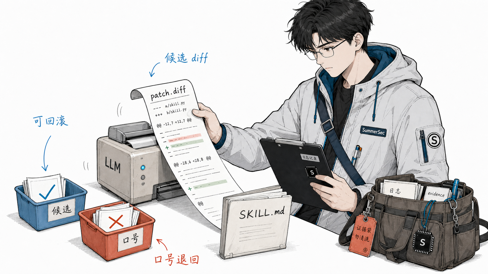

更巧妙的是：

- **黑名单跨版本共享**。假设 v3 的某个改法被拒了，回滚到 v2 重新来过时，v2 仍然知道 v3 的失败经验。你不需要重新踩一遍坑
- **黑名单跨分支共享**。在实验分支上学到的教训，主分支也能受益
- **签名用 diff_hash**。SHA256 前 16 位作为 patch 指纹，精确匹配，尽量减少误伤

taboo 的读写时机：写是在 gate 拒绝时，读是在 patch_engine 生成 prompt 时——作为负面约束注入。回滚时**不清空**黑名单（否则会重蹈覆辙）。

---

## 收敛判断：知道什么时候该停

系统不会无限跑下去。四个信号，任何一个满足就建议停止：

<!--
illustration-prompt: 10-convergence-stop
Generate one standalone 16:9 horizontal Chinese article illustration for a sumsec.me style technical blog.

Visual DNA: pure white background, clean minimalist deep charcoal contour lines, restrained low-saturation character color, lots of white space, sparse cyan-blue and red-orange handwritten Chinese annotations. Clean engineering sketch, dry humor, not PPT, not formal chart, no UI screenshot, no cyberpunk, no pixel art, no top-left title.

Recurring SumSec Observer required: young adult clean-shaven security researcher/system observer, dark ink messy short hair, thin-frame glasses, quiet sober slightly tired focused expression, pale cool-gray hooded jacket, dark cyan-blue lining/drawstrings/crossbody strap, black inner shirt, dark pants, muted gray-brown tool bag, black clipboard/tablet, log papers, red-orange evidence tags, tiny cyan cables, small chest "SummerSec" badge, exactly two subtle S-emblem rings.

Theme: 收敛判断和停止条件。
Structure type: 概念隐喻 / 角色状态。
Core idea: 进化不是无限加规则；到达高分、连续没进展、skill 过长或预算耗尽时，就应该停下来或回滚。
Composition: A simple hand-drawn control panel on a white desk has four small physical gauges: "F1", "停滞", "长度", "预算". SumSec Observer calmly lowers a small lever labeled "stop" while holding a clipboard. One gauge needle is red-orange near a warning zone, another has a cyan check. A folded SKILL.md scroll nearby is getting too long, slightly curling off the desk.
Suggested elements: four gauges / stop lever / long SKILL.md scroll / clipboard / warning needle.
Chinese handwritten labels: "该停了" / "F1" / "停滞" / "过长" / "预算".
Color use: cyan for stable/ok states; red-orange for warning zones; restrained character colors.
Constraints: no speedometer dashboard UI, no racing metaphor, no dense performance chart.
-->
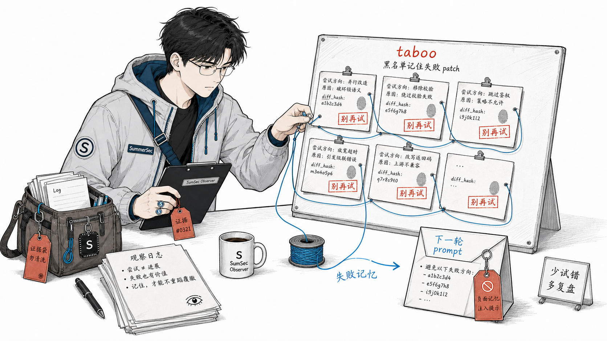

1. **已经够好了**：F1 ≥ 0.95
2. **连续没进展**：连续 5 轮 gate 都没通过
3. **skill 太长了**：SKILL.md 超过 15000 字节
4. **预算到了**：达到设定的最大迭代次数

### 加权停滞：回归比停滞更严重

"连续没进展"不是简单的 0/1 计数，而是加权的：

```
每轮停滞增量 = 0.3 × target未改善
             + 1.0 × guardrail回归
             + 0.7 × holdout下降
```

guardrail 回归（搞坏了旧功能）的惩罚是 target 未改善（没改好新功能）的 **3 倍多**。这体现了一个工程直觉：**搞坏比没改好严重得多**。

累加到 5.0 就触发停止。这意味着如果你连续 5 轮只是"没改善"（0.3×5=1.5），系统会继续尝试；但如果其中有 3 轮是 guardrail 回归（1.0×3=3.0），加上 2 轮停滞（0.3×2=0.6），总和 3.6 已经接近阈值了。

### 自动回滚：负迁移保护

还有一个防御机制：当加权停滞超阈值时，系统会对比当前版本和**历史最佳 holdout 版本**。如果当前版本已经比历史最好的差了——说明最近几轮的修改在"单点改善"的同时让整体退化了——系统建议（或自动）回滚到历史最佳。

这个机制主要防一种很隐蔽的退化：每轮 patch 都在 target 集上改善了 1-2 个 case，guardrail 也没回归，看起来一切都好。但 holdout 在慢慢下滑。这就是累积负迁移，单看每一步都能解释，连起来看方向已经偏了。

### SKILL.md 过长时的精简模式

单独说第 3 点——当 SKILL.md 膨胀到 15000 字节后，继续往里加规则反而会让效果变差。这个阈值来自我们几轮历史迭代的经验观察：超过这个量级后，新增规则更容易跟旧规则互相遮挡，模型也更容易忽略早期约束。它不是一个放之四海皆准的常数，更像一个保守的警戒线；不同任务可以按自己的上下文长度和评测曲线调整。触发后系统会切换到**精简模式**：下一轮 patch 只允许"合并/删除冗余规则"，不允许新增。

否则很容易走到一个熟悉的坏结局：prompt 越写越长，模型开始忽略早期规则，准确率反而掉下去。

---

## 工程形态：把算法变成能复用的能力

前面讲的都是进化循环本身。可一套循环能不能被别人用起来，最后拼的不是概念，而是工程形态：数据怎么接入、命令怎么触发、历史怎么保存、中断后能不能继续。

落地时，我们把它做成了一个 **Claude Code Plugin**。plugin 只是载体，真正关键的是三个解耦：

<!--
illustration-prompt: 11-plugin-form
Generate one standalone 16:9 horizontal Chinese article illustration for a sumsec.me style technical blog.

Visual DNA: pure white background, clean minimalist deep charcoal contour lines, restrained low-saturation marker/watercolor character color, lots of white space, sparse cyan-blue and red-orange handwritten Chinese annotations. White-paper engineering sketch, dry humor, not PPT, not formal architecture diagram, no UI screenshot, no cyberpunk, no pixel art, no top-left title.

Recurring SumSec Observer required: young adult clean-shaven SumSec Observer with dark ink messy side-swept short hair, thin-frame glasses, quiet sober slightly tired focused expression, pale cool-gray hooded jacket, dark cyan-blue lining/drawstrings/crossbody strap, black inner shirt, dark pants, muted gray-brown tool bag, black clipboard/tablet, log papers, tiny cyan cables, red-orange evidence tags, small chest "SummerSec" badge, exactly two subtle S-emblem rings.

Theme: 薄命令 + 厚 skill 的 Claude Code Plugin 工程形态。
Structure type: 方法分层 / Agent 编排。
Core idea: slash command 只是轻入口，真正复用的是多个厚 skill；数据源、入口、目标 skill 三件事解耦。
Composition: SumSec Observer arranges a slim command card labeled "/evolve" on top of three thicker paper tool blocks labeled "core", "memory", "data-prep". To the left are two local JSONL rolls labeled "results.jsonl" and "sessions/"; to the right is a configurable SKILL.md folder. Thin cyan connector lines show loose coupling, with no central database or platform box.
Suggested elements: slim slash command card / thick skill blocks / JSONL rolls / SKILL.md folder / loose cyan connectors.
Chinese handwritten labels: "/evolve" / "core" / "memory" / "data-prep" / "解耦".
Color use: cyan for loose connectors and skill activation; red-orange only for small warning tags if needed; restrained character colors.
Constraints: do not draw a product architecture diagram, no cloud icons, no platform logo, no dense boxes.
-->
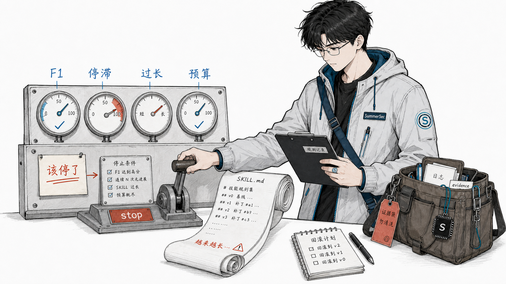

1. **数据源彻底解耦**。进化器不绑定评测平台后端，只读两份本地 JSONL（`results.jsonl` + `sessions/`）。你从哪拿到这两份文件，它一概不管。
2. **命令入口轻量**。`/evolve` 一条命令就能对你自己的 skill 跑进化；命令只负责参数和入口，不承载核心逻辑。
3. **目标 skill 可配置**。它不是为"安全审计"这一个 skill 写死的；只要能提供同样结构的评测结果和 session 日志，就可以迁移到其他 SKILL.md。

### 薄命令 + 厚 skill

plugin 的结构刻意做成"一个薄命令，几个厚 skill"：

```
commands/evolve.md            ← 唯一的显式 slash command（极薄，只做参数解析）
skills/
  skill-evolution-core/       ← 主流程：diagnose → patch → gate → write
  skill-evolution-memory/     ← 版本管理：快照 / 回滚 / 分支 / timeline
  evolution-data-prep/        ← 数据准备：把零散评测产物搬进标准目录
  verify-companion-template/   ← verify 层的通用自检模板
```

为什么不把所有逻辑塞进 `evolve.md` 一个命令里？因为 Claude Code 的 skill 有个特性——**靠 description 自动激活**。用户说"回滚到上一版"，`skill-evolution-memory` 自动触发；用户说"看看 skill 为什么失败"，`skill-evolution-core` 自动触发。命令只是显式入口，skill 才是能力本身。

这就是"薄命令 + 厚 skill"的好处：用户不需要记一堆命令。说清楚意图，对应的 skill 自己接住。

### 断点恢复：进化跑一半断了怎么办

一轮进化要跑 diagnose → patch → gate → write 好几个阶段，中间可能因为各种原因中断（API 超时、用户 Ctrl-C、机器重启）。

每个阶段都会更新一个 `.pending_round.json`：

```json
{"round": 7, "stage": "gate", "started_at": "...", "diagnosis_done": true, "patch_done": true}
```

下次启动 Claude Code 时，`session-start` hook 会检测到这个文件，提示你"上一轮进化卡在 gate 阶段，要不要继续？"。已经跑完的 diagnose 和 patch 不用重来。

---

## 版本管理：每一版都能退回去

进化跑了十几轮之后，你手里有十几个版本的 SKILL.md。哪一版最好？某一版改坏了想退回去怎么退？这是 `skill-evolution-memory` 解决的问题。

它的设计哲学是一句话：**文件系统就是数据库**。不引入 SQLite、不引入任何外部存储，全靠目录结构和软链。

```
<skill>/
├── SKILL.md                    # 当前激活版本
├── iterations/
│   ├── current → v7/           # 软链，指向当前版本
│   ├── v0/                     # 初始版本
│   ├── v1/
│   │   ├── SKILL.md
│   │   ├── metrics.json        # F1 / precision / recall / guardrail / holdout
│   │   ├── gate_verdict.json   # accepted | rejected | reverted + 原因
│   │   ├── patch.diff          # 相对上一版的 unified diff
│   │   └── provenance.json     # 谁、何时、基于什么 root_causes 改的
│   ├── ...
│   └── edit_audit.log          # append-only：每次切换的时间 / from / to / 原因
├── branches/exp-foo/           # 实验分支（完整隔离）
└── taboo.json                  # 历史被拒变更签名（黑名单）
```

这套设计有几个关键点：

**回滚就是重指软链。** `current` 是个指向 `v<N>/` 的软链。回滚到 v5，本质就是把软链从 `v7` 重指到 `v5`。这是一个原子操作，不会覆盖任何历史版本。

**回滚也写历史。** 这是个反直觉但重要的设计：每次回滚都会 append 到 `edit_audit.log`。为什么？因为"静默回退"会导致失忆——三个月后你看到 SKILL.md 是 v5，但完全不知道它曾经到过 v7 又退回来了，更不知道为什么退。审计日志让每一次方向变化都留痕。

**写入按原子方式完成。** 先写临时文件，再 `mv tmp final`。POSIX 的 rename 保证要么是旧版本，要么是新版本，避免出现写到一半断电留下的半截文件。

**分支派生用于实验。** 想试一个激进的改法又怕污染主线？`fork` 出一个 `branches/exp-foo/`，在里面独立迭代。但 `taboo.json` 用软链共享主线——**实验分支学到的教训，主线也能受益；主线踩过的坑，分支不用重踩**。

**timeline 是 append-only 审计流。** 所有关键操作（snapshot / rollback / taboo_append / fork）都 append 到 `timeline.json`，形成一条完整的进化史。任何时候你都能回答"这个 skill 是怎么一步步变成今天这样的"。

为什么不用数据库？因为文件系统对 `rsync`、`git`、`tar` 天然友好。你想把进化历史同步到另一台机器，一条 `rsync` 就够了；想给某一版打个 tag，`git` 直接管。**最简单的存储，往往是最耐用的存储。**

<!--
illustration-prompt: 05-version-memory
Generate one standalone 16:9 horizontal Chinese article illustration for a sumsec.me style technical blog.

Visual DNA: pure white background, clean minimalist deep charcoal contour line art, restrained low-saturation character color washes, lots of blank white space, sparse cyan-blue and red-orange handwritten Chinese annotations. Clean white-paper engineering sketch, not PPT, not formal architecture diagram, no UI, no cyberpunk, no pixel art, no top-left title.

Recurring SumSec Observer required: young adult SumSec Observer with dark ink messy side-swept hair, thin-frame glasses, quiet sober slightly tired focused expression, clean-shaven jawline, pale cool-gray high-collar hooded jacket, dark cyan-blue lining/drawstrings/crossbody strap, black inner shirt, dark pants, muted gray-brown tool bag, black clipboard/tablet, log papers, red-orange evidence tags, tiny cyan cables, chest "SummerSec" badge, exactly two subtle cyan-blue S-emblem rings, small black S tool chip. Character must do the core action.

Theme: 版本、回滚与黑名单记忆。
Structure type: 证据栈 / 系统局部。
Core idea: 每一版 Skill 都能回退，失败 patch 会进 taboo 记忆；进化不是只往前冲，而是带着失败记录往前试。
Composition: A simple open shelf of paper folders labeled v0, v1, v2, v3, current -> v3. SumSec Observer moves a thin string pointer labeled "current" from one folder to another while holding a clipboard. Beside the shelf is a small shared notebook labeled "taboo", with red-orange sticky notes "别再试" and tiny patch fingerprints. A cyan line connects taboo notebook to all version folders, showing shared memory. The scene feels like a quiet archive desk, not a database diagram.
Suggested elements: version folders / current string pointer / taboo notebook / red-orange rejected patch notes / cyan shared memory line.
Chinese handwritten labels: "current" / "v1" / "v2" / "v3" / "taboo" / "别再试" / "可回滚".
Color use: deep charcoal linework; cyan for current/shared memory line; red-orange for rejected patch notes; restrained character colors.
Constraints: do not draw a database cylinder or architecture diagram; make it a small physical archive with dry humor.
-->
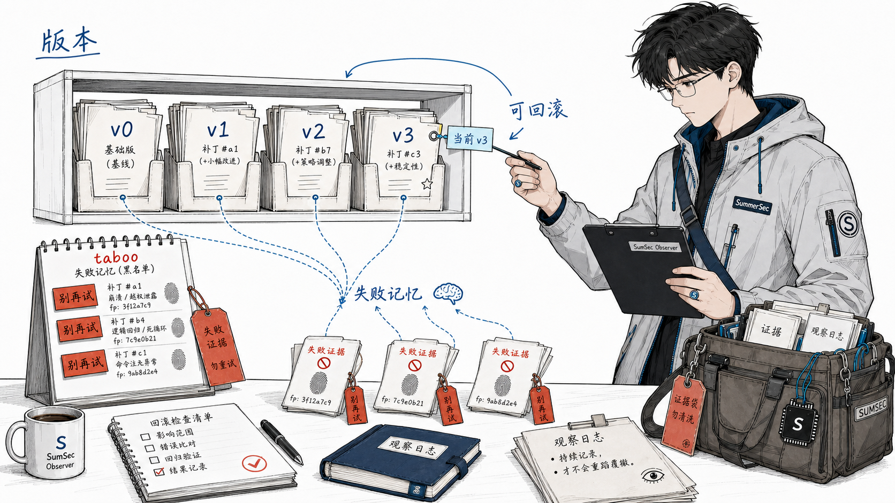

---

## 旁支发现：换个词，准确率掉 27 个百分点

进化系统改 SKILL.md 时不是想怎么改就怎么改——它被一套"语义陷阱"规则兜着底。这套规则来自一个对照实验：拿同一份 SKILL.md，**约束、逻辑、步骤一字不改，只把核心词"漏洞"统一替换成"风险"**，在同一批营销漏洞评测集上重跑。结果正确率从 89.3% 掉到 62.1%——**只换一个词，差了 27 个百分点**。

这不是要证明"风险"这个词永远不能用，而是说明在二元判定任务里，词的边界会直接影响模型的执行稳定性。"找漏洞"判定空间是收敛的（有 / 没有），"找风险"会把边界放宽（多大算风险？潜在的算不算？），模型更容易从"按标准答案判断"滑向"自由发挥"。

<!--
illustration-prompt: 12-semantic-trap
Generate one standalone 16:9 horizontal Chinese article illustration for a sumsec.me style technical blog.

Visual DNA: pure white background, clean minimalist deep charcoal contour lines, restrained low-saturation character color, lots of white space, sparse cyan-blue and red-orange handwritten Chinese annotations. Clean white-paper engineering sketch, dry humor, not PPT, not UI, no cyberpunk, no pixel art, no top-left title.

Recurring SumSec Observer required: young adult clean-shaven security researcher/system observer, dark ink messy side-swept short hair, thin-frame glasses, quiet sober low-key melancholic working expression, pale cool-gray hooded jacket, dark cyan-blue lining/drawstrings/crossbody strap, black inner shirt, dark pants, muted gray-brown tool bag, black clipboard/tablet, log papers, tiny cyan cables, red-orange evidence tags, small chest "SummerSec" badge, exactly two subtle S-emblem rings.

Theme: 语义陷阱：换一个词，判定边界变宽。
Structure type: 前后对比 / 概念隐喻。
Core idea: "漏洞"和"风险"不是随便互换的词；边界一宽，模型就更容易自由发挥，准确率会掉。
Composition: Two small paper funnels sit side by side. The left funnel labeled "漏洞" is narrow and drops cards cleanly into a small box labeled "有/无". The right funnel labeled "风险" is wide and leaks cards into several vague trays labeled "可能", "影响", "担心". SumSec Observer places a small red-orange warning tag on the wide funnel while holding a clipboard. Keep it simple, no charts.
Suggested elements: narrow funnel / wide funnel / binary box / vague trays / warning tag.
Chinese handwritten labels: "漏洞" / "风险" / "边界变宽" / "有/无" / "自由发挥".
Color use: cyan for narrow stable path; red-orange for widened boundary warning; restrained character colors.
Constraints: no bar chart, no percentage headline, no dense word cloud; make the word-boundary idea physical.
-->
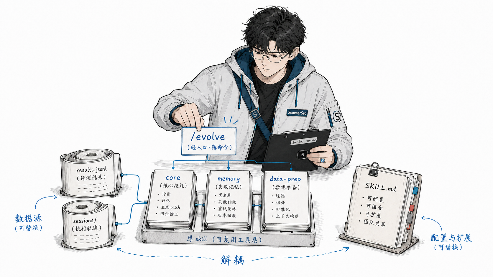

所以我们把这类陷阱词整理成一张表（17 组中文 + 10 组英文）和 4 种结构性句式，固化到项目的 `.claude/rules/semantic-trap.md`。它会随会话进入上下文，让 LLM 在编写或修改 SKILL.md 时默认看到这些窄边界约束，而不是生成之后再靠人工补提醒。

这跟前面 patch 引擎的"反口号"机制是同一件事的两面：语义陷阱控制词的边界，反口号正则控制句子的可执行性。一个防止模型想太宽，一个防止模型写太虚。

> 这个发现我单独写过一篇更完整的分析：[《别让大模型"想太多"：SKILL 开发中的语义陷阱与抗幻觉设计》](https://sumsec.me/2026/%E5%88%AB%E8%AE%A9%E5%A4%A7%E6%A8%A1%E5%9E%8B_%E6%83%B3%E5%A4%AA%E5%A4%9A_%EF%BC%9ASKILL%E5%BC%80%E5%8F%91%E4%B8%AD%E7%9A%84%E8%AF%AD%E4%B9%89%E9%99%B7%E9%98%B1%E4%B8%8E%E6%8A%97%E5%B9%BB%E8%A7%89%E8%AE%BE%E8%AE%A1.html)。

---

## 回头看：七条贯穿全文的设计原则

把整套系统拆完，你会发现真正支撑它的不是某个聪明的算法，而是七条朴素到有点固执的工程原则：

<!--
illustration-prompt: 13-seven-principles
Generate one standalone 16:9 horizontal Chinese article illustration for a sumsec.me style technical blog.

Visual DNA: pure white background, clean minimalist deep charcoal contour line art, restrained low-saturation marker/watercolor character color, lots of white space, sparse cyan-blue and red-orange handwritten Chinese annotations. White-paper engineering sketch, dry humor, not PPT, not formal infographic, no UI screenshot, no cyberpunk, no pixel art, no top-left title.

Recurring SumSec Observer required: young adult clean-shaven SumSec Observer, dark ink messy side-swept short hair, thin-frame glasses, quiet sober slightly tired focused expression, pale cool-gray hooded jacket, dark cyan-blue lining/drawstrings/crossbody strap, black inner shirt, dark pants, muted gray-brown tool bag with log papers, black clipboard/tablet, red-orange evidence tags, tiny cyan cables, small chest "SummerSec" badge, exactly two subtle S-emblem rings.

Theme: 七条工程原则约束不确定性。
Structure type: 方法分层 / 证据栈。
Core idea: 系统稳定来自一组朴素工程纪律：少用 LLM 做判断、小步、记失败、防回归、怀疑数据、解耦。
Composition: SumSec Observer places seven small paper clamps around a restless loose sheet labeled "LLM 生成器", gently holding it flat on a white desk. Each clamp has a tiny short label, not a full sentence. The sheet is not scary, just unstable until clipped down. A black clipboard records the seven rules.
Suggested elements: seven paper clamps / loose generator sheet / clipboard / red-orange regression tag / cyan stability line.
Chinese handwritten labels: "规则判断" / "只生成" / "防回归" / "小步" / "记失败" / "审数据" / "解耦".
Color use: cyan for stable clamps/lines; red-orange for regression warning; restrained character colors.
Constraints: no motivational poster, no numbered list infographic, no big title; keep it a physical desk metaphor.
-->
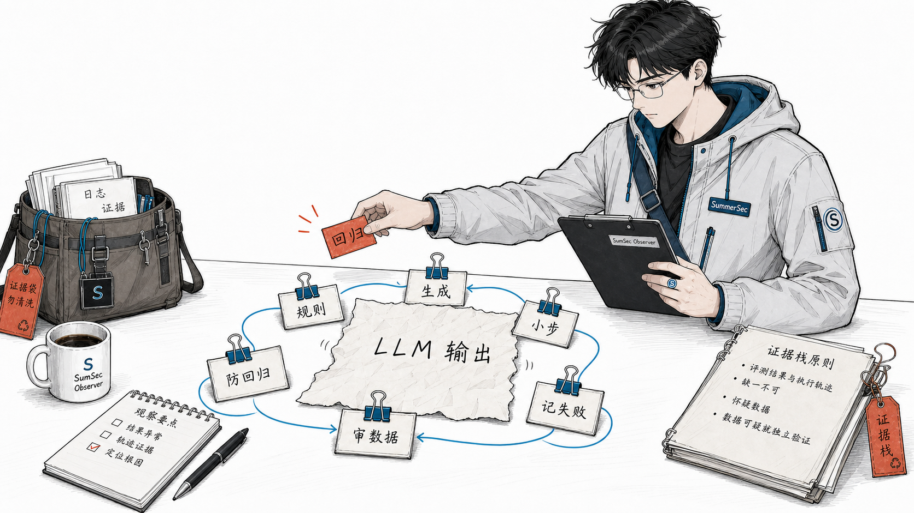

1. **能用规则判断的，尽量不用 LLM。** 诊断、gate、GT 审计、语义陷阱检测都优先交给可复查的规则。实测下来，LLM 判断 skill 好坏的稳定性不够，部分设置接近随机水平。
2. **LLM 只用在它最擅长的那一件事上。** 进化流程里只让 LLM 负责"把诊断结论转写成 SKILL.md 的 diff"。其余判断和验收交给规则。
3. **防止变坏，比追求变好更重要。** guardrail 回归的惩罚权重是 target 未改善的 3 倍多；四层 gate 任何一层不过就整体拒绝。宁可不改，不可改坏。
4. **小步快跑。** 单次 patch ≤ 80 行。这是 learning rate——步子太大，定位不了回归原因，taboo 也失去意义。
5. **记住每一次失败。** taboo 黑名单跨版本、跨分支共享。回滚不清空。同一个坑不踩第二次。
6. **怀疑数据本身。** GT 审计承认一个大多数系统不敢承认的事实——测试标注也会错。不为迁就错误标注而改歪自己。
7. **极致解耦。** 方法论与数据源解耦（只认 JSONL）；存储用文件系统而非数据库（rsync/git 友好）；命令薄、skill 厚（自然语言激活）。

如果只留一句话，我会这么概括：这不是"AI 自己教自己"。它更像是用工程纪律，去约束 LLM 的不确定性。

进化的每一步都可能出错。LLM 会生成口号，会踩旧坑，也会迁就错标注。但常见的出错方式，都有一道可复查的闸门拦着。最后真正让系统稳定下来的，不是那个会犯错的生成器，而是整套可复现的约束。

---

## 已知局限

诚实说，这套系统远不完美。几个我们清楚但还没解决的问题：

<!--
illustration-prompt: 14-known-limits
Generate one standalone 16:9 horizontal Chinese article illustration for a sumsec.me style technical blog.

Visual DNA: pure white background, clean minimalist deep charcoal contour lines, restrained low-saturation character color, lots of white space, sparse cyan-blue and red-orange handwritten Chinese annotations. Clean white-paper engineering sketch, dry humor, not PPT, not formal limitation chart, no UI screenshot, no cyberpunk, no pixel art, no top-left title.

Recurring SumSec Observer required: young adult clean-shaven security researcher/system observer, dark ink messy short hair, thin-frame glasses, quiet sober slightly tired focused expression, pale cool-gray hooded jacket, dark cyan-blue lining/drawstrings/crossbody strap, black inner shirt, dark pants, muted gray-brown tool bag, black clipboard/tablet, log papers, tiny cyan cables, red-orange evidence tags, small chest "SummerSec" badge, exactly two subtle S-emblem rings.

Theme: 已知局限与收敛后的天花板。
Structure type: 地图路线 / 概念隐喻。
Core idea: Skill 进化有边界：缺工具救不了、规则诊断覆盖有限、数据质量会影响方向、到高分后更多依赖基础模型和工具链提升。
Composition: A clean white route ends at a low transparent glass ceiling labeled "天花板". SumSec Observer stands upright, not defeated, holding a clipboard and marking several boundary tags on the route: "缺工具", "未诊断", "数据噪声", "hard case". Beyond the glass ceiling are faint abstract cards labeled "模型" and "工具链", lightly drawn, not as a promise. The mood is honest and calm.
Suggested elements: route path / transparent glass ceiling / boundary tags / hard case cards / faint model-toolchain cards.
Chinese handwritten labels: "天花板" / "缺工具" / "未诊断" / "数据噪声" / "hard case".
Color use: cyan for the reachable route; red-orange for boundary tags; restrained character colors.
Constraints: no dramatic wall, no failure poster, no pessimistic scene; keep it calm and engineering-honest.
-->
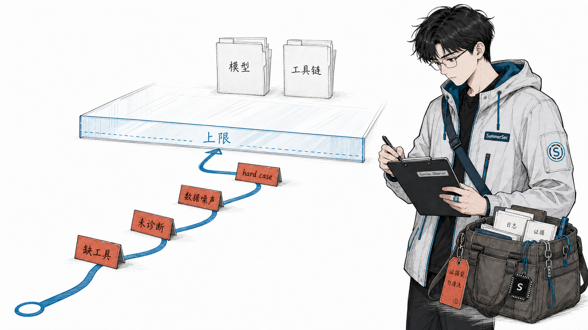

1. **只能改"怎么做"，不能改"做什么"**。进化改的是 SKILL.md 里的步骤和约束——如果 agent 失败的原因是它的工具链缺了某个能力（比如根本没有调用链分析工具），patch 怎么写都救不了。进化系统能优化方法论，但不能凭空创造新能力。

2. **诊断规则覆盖有限**。当前内置规则能覆盖最常见的行为异常，也支持继续扩展业务规则；但总有一些"做了但做错了"的 case——agent 流程完整、工具调用合理、结论明确，就是判断错了。这类纯认知错误，当前的规则引擎检测不到，只能归入"未诊断"。

3. **依赖评测集的质量和规模**。case 太少时统计不够稳定（30% 阈值可能被噪声触发）；case 的分布如果有偏（比如只有 FN 没有 FP），进化方向就会被带偏。GT 审计能兜一部分底，但不能替代高质量标注。

4. **收敛后的天花板**。当 F1 到达 0.90+ 之后，剩下的失败 case 往往是真正的 hard case——诊断不出系统性根因，patch 只能做零星的特例处理，效果越来越边际递减。到这个阶段，继续改 SKILL.md 的收益会很有限，后续提升可能更依赖基础模型能力、工具链能力或输入信息质量本身的提升。

---

## 写在最后

<!--
illustration-prompt: 15-final-evolution-loop
Generate one standalone 16:9 horizontal Chinese article illustration for a sumsec.me style technical blog.

Visual DNA: pure white background, clean minimalist deep charcoal contour line art, restrained low-saturation marker/watercolor character color, lots of white space, sparse cyan-blue and red-orange handwritten Chinese annotations. White-paper engineering sketch, dry humor, not PPT, not formal flowchart, no UI screenshot, no cyberpunk, no pixel art, no top-left title.

Recurring SumSec Observer required: young adult clean-shaven SumSec Observer, dark ink messy side-swept short hair, thin-frame glasses, quiet sober slightly tired focused expression, pale cool-gray hooded jacket, dark cyan-blue lining/drawstrings/crossbody strap, black inner shirt, dark pants, muted gray-brown tool bag with log papers, black clipboard/tablet, red-orange evidence tags, tiny cyan cables, small chest "SummerSec" badge, exactly two subtle S-emblem rings.

Theme: 让评测结果推动下一版 Skill。
Structure type: Workflow / 概念隐喻。
Core idea: 不是手改打地鼠，而是把结果、轨迹、规则、patch、gate 串成一个可回滚的进化闭环。
Composition: A quiet circular workbench loop made from paper objects: results sheet, trace tape, rule calipers, patch envelope, gate stamp, and a SKILL.md folder. SumSec Observer places the SKILL.md folder back at the start of the loop with a small cyan arrow. One red-orange rejected patch sits outside the loop in a small tray. The loop should feel hand-built and modest, not grand or futuristic.
Suggested elements: circular paper workbench / results sheet / trace tape / rule calipers / gate stamp / SKILL.md folder.
Chinese handwritten labels: "结果" / "轨迹" / "规则" / "patch" / "gate" / "下一版".
Color use: cyan for the stable loop arrow; red-orange for rejected patch tray; restrained character colors.
Constraints: no infinity symbol logo, no inspirational poster, no dramatic hero scene; keep it practical and understated.
-->
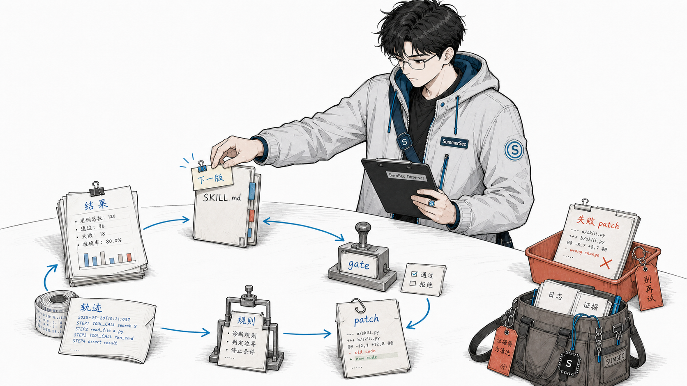

如果你也在反复手改 agent 的 skill、打地鼠似的顾此失彼，不妨试试让这件事跑起来：让 agent 完成任务的能力，沿着评测结果自己进化。
