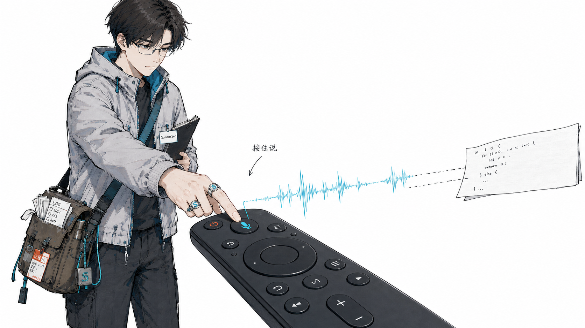
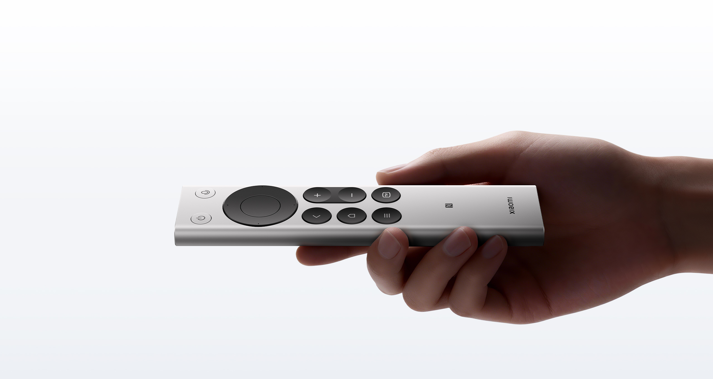
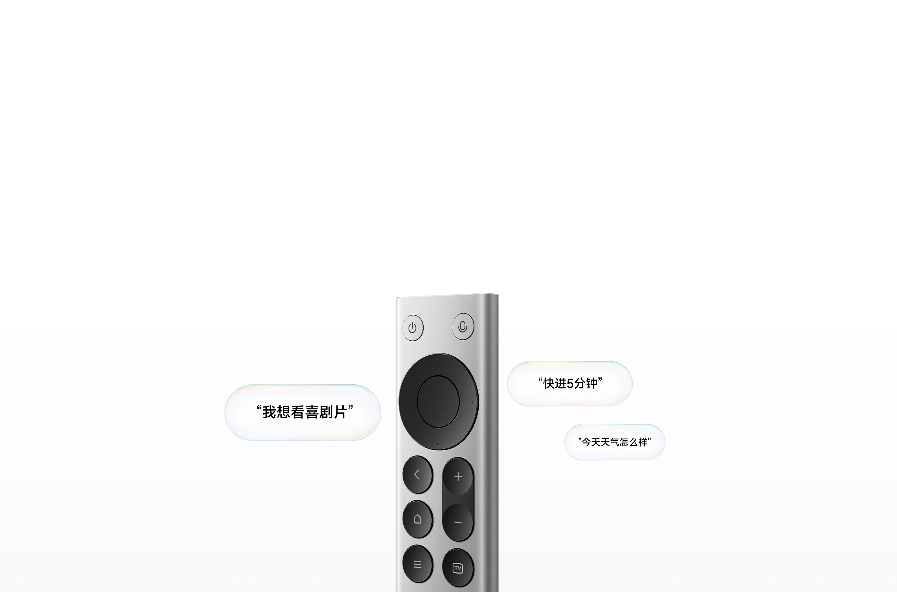
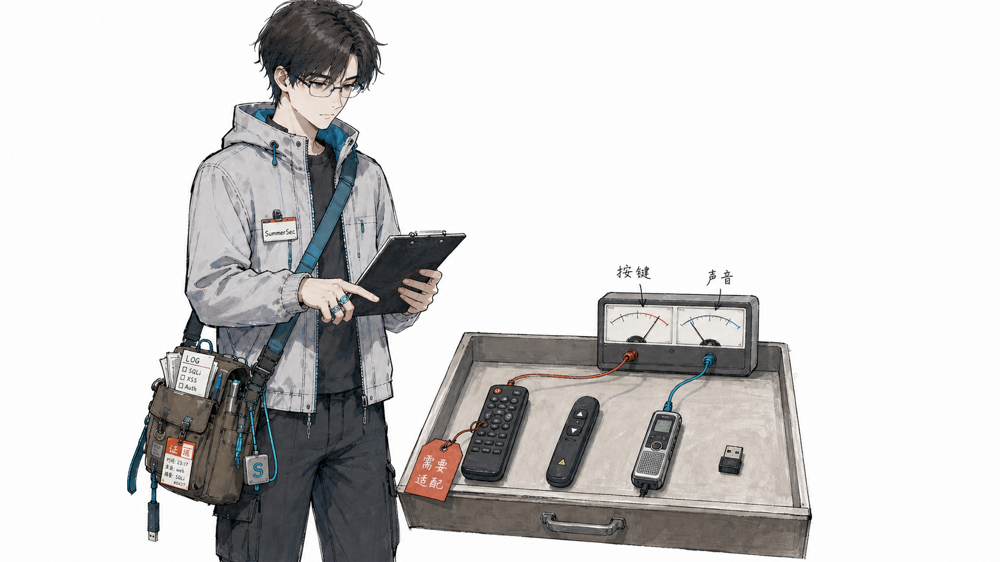
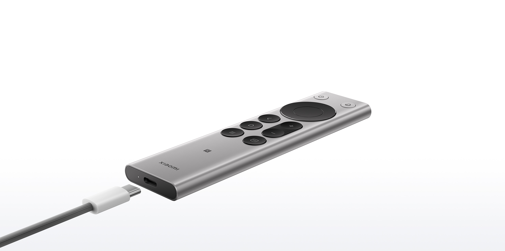

---
tags:
- blog-comments
---

# 谁能想到，电视遥控器竟成了 Vibe Coding 神器

我桌上现在放着一只小米蓝牙遥控器 2 Pro。

它原本是管电视的，现在被我拿来管 Codex 和 Claude Code。

按住遥控器上的麦克风键，直接说需求。说完松手，语音变成文字，我继续看 Agent 干活。手不用离开椅子扶手，也不用在输入框、快捷键和麦克风开关之间来回折腾。

就这么个小东西。

我用的是图里这只小米蓝牙遥控器 2 Pro，也叫 RC003。这里的麦克风不是另买的一支桌面麦克风，就是遥控器里面那颗。它能把声音通过蓝牙送出来，正好被我拿来做 Vibe Coding 的语音入口。

写这篇文章时，它在[小米官网](https://www.mi.com/xiaomi-bluetooth-remote-2-pro)的定价是 99 元。我看到的第三方渠道和闲鱼价格还要低一点，六十多块也能买到，具体得看成色和卖家。

说真的，我一开始也没觉得这玩意能改变什么。它又不会让 Codex 突然变聪明，更不会替我把需求想清楚。

但语音写代码有个很小、又很烦的问题。

启动那一下。

手要离开原来的位置，点输入框，找快捷键，开麦克风，说完再关掉。一次也就多两三个动作，听起来完全不算事。可一天重复几十次，人就会下意识嫌麻烦，到头来还是缩回键盘上敲字。

遥控器解决的就是这点小麻烦。

按住，说话。松开，继续看结果。

实际用起来，大概就是这样。

<video controls playsinline preload="metadata" width="100%" style="max-width:1080px" src="./pic/vibe-coding-remote/vibecoding.mp4"></video>

方向键、返回键和其他按键还可以绑成翻页、复制、粘贴，或者自己常用的组合键。它没有改变模型能力，只是把我开口之前那点犹豫拿掉了。

这个用法就更简单了。我也拿它刷网页版抖音，直接用遥控器操作页面。它本来就是给电视做的，换到网页版短视频上，居然一点都不违和。

<video controls playsinline preload="metadata" width="100%" style="max-width:1080px" src="./pic/vibe-coding-remote/douying-web.mp4"></video>

把它接进 Windows，思路其实就两步。先通过蓝牙把遥控器连上电脑，让系统收到它的按键和声音。再用键盘映射功能，把麦克风键绑定到语音输入软件的快捷键。映射工具支持的话，可以设成按住型，也可以设成开关型。

我更喜欢按住型。

实际使用时，先短按一次唤醒遥控器，然后按住麦克风键两秒以上，边按边说，说完松开。整个动作跟拿对讲机说话差不多，不需要盯着屏幕确认麦克风到底开没开。

声音这一路得单独看设备。如果 Windows 能直接把它识别成麦克风，在系统里选中对应输入设备就行。如果设备传过来的是蓝牙压缩语音，系统又没有直接暴露麦克风输入，就需要增加虚拟麦克风、音频桥接或对应驱动，把声音送进输入法。

这块有个边界得讲清楚。蓝牙连接和键盘映射只负责触发按键、把声音送进电脑，真正把语音转成文字的，还是你正在用的输入法或语音输入程序。Windows 这边可以用智谱的 AI 输入法，和这套按住说、松手继续的操作配合起来比较顺。只把按键映射好，电脑不会突然自动听懂人话。。。

真想照着做，也别急着先买同款。

家里如果有闲置的 PPT 翻页笔、演示用激光笔、录音笔，或者其他带麦克风的遥控设备，都可以先翻出来试试。设备叫什么不重要，先看电脑能不能收到两样东西，一个是按键，一个是实时传过来的声音。

举个具体的例子，汉光 PV60 激光笔在闲鱼上十几块钱就能买到。它本身带麦克风，也能接进这套语音输入流程。而且我自己的感受是，它拿在手里的质感比小米遥控器还要好一点。

只提供按键也没关系。挑一个不常用的键，绑到语音输入快捷键上，收音继续用笔记本自带麦克风，成本就是零。手边什么都没有，二手平台上几块钱、十几块钱的 USB 翻页器和小键盘也能完成这个动作。

带蓝牙会省事不少，不过有蓝牙也不等于一定能用，系统还得同时认出它的按键和麦克风。没有蓝牙，但设备自带 USB 接收器，也可以走同一套思路。如果只有红外信号，或者录音笔只能把声音存在本机、不能实时传给电脑，那就需要额外增加接收器、转换模块或软件桥接，改造成本也会跟着上来。

如果你跟我一样，想把按钮和麦克风都拿在手里，再考虑小米蓝牙遥控器 2 Pro 这类带语音功能的设备。它贵出来的部分，买的不是更高级的快捷键，而是离开桌面也能说话。

所以别被「电视遥控器」这几个字限制住。只要能给电脑送进去一个按键，再送进去一路声音，这套用法就能成立。

写到这里，刚好看到 OpenAI 和 Work Louder 联名发布了 [Codex Micro](https://openai.com/zh-Hans-CN/supply/co-lab/work-louder/)，官方售价是 230 美元。

它当然不只是一排小键盘。Codex Micro 有 13 个机械轴、一个触摸传感器、一个旋钮和一个平面摇杆。按键可以映射接受、拒绝、按键说话和新建聊天，RGB 灯还能显示 Agent 是在思考、运行、等待还是已经完成。它甚至可以直接调节推理等级。

作为一台放在桌上的 Agent 指挥中心，它比遥控器完整得多。这点得承认。

但如果把需求缩小一点，只看我每天最常用的动作，也就是按住说需求、松手继续看结果，那这只遥控器的优势就很明显了。

Codex Micro 更像固定在桌面的控制台。小米遥控器是一根细长的条，随手就能拿起来，握久了也不累，出门塞进包里也不占地方。它本身用蓝牙连接，USB-C 充电，不需要一直拖着一根线。

价格差得更直接。Codex Micro 是 230 美元，小米遥控器第三方渠道五六十元就能买到。如果家里已经有闲置的遥控器、翻页笔或者带麦克风的激光笔，成本甚至可以是零。

我不是说 230 美元不值。那笔钱买到的是专用键帽、Agent 状态灯、旋钮、摇杆和一套完整的桌面控制体验。

只是我现在真正需要的，还不是一座 Agent 指挥中心。

就是一个随时能摸到、按住就能说话的按钮。

我留下这只遥控器还有个很朴素的原因，它是 USB-C 充电，不用临时翻抽屉找电池。充一次电，随手放在桌边，比不少专门做出来的桌面小设备还省心。

当然，有些蓝牙遥控器也只认自家电视。动手改造或者下单之前，还是得先确认电脑能不能收到它的按键和声音。否则折腾半天，家里只是又多了一件新的旧设备。。。

Mac 也能复刻这个思路。如果旧设备在 macOS 里能被识别成键盘，可以用 [Karabiner-Elements](https://karabiner-elements.pqrs.org/) 改按键，再用 [Hammerspoon](https://www.hammerspoon.org/) 或 [BetterTouchTool](https://folivora.ai/) 触发动作。收音先用 Mac 自带麦克风，需要虚拟声卡转接时再看 [BlackHole](https://existential.audio/blackhole/)。语音转文字这块，我在 Mac 上更推荐豆包输入法，实际识别效果和整体体验都更好。

折腾完这套东西以后，我才发现，我以前少用语音，并不是觉得它不好用，很多时候就只是懒得点开。模型和编辑器天天都在升级，我每天重复最多的动作，却只是打开输入，再把一句话送进去。

一个按钮听起来没什么。

连续按上一百次，差别就出来了。

所以我现在还把这只遥控器放在桌边。不是为了显得有多极客，就是下一次想让 Codex 改点东西时，伸手，按住，说完，松开。

电视遥控器没有失业，只是换了份工作。

文中产品图片来自[小米蓝牙遥控器 2 Pro 官方产品页](https://www.mi.com/xiaomi-bluetooth-remote-2-pro)。
