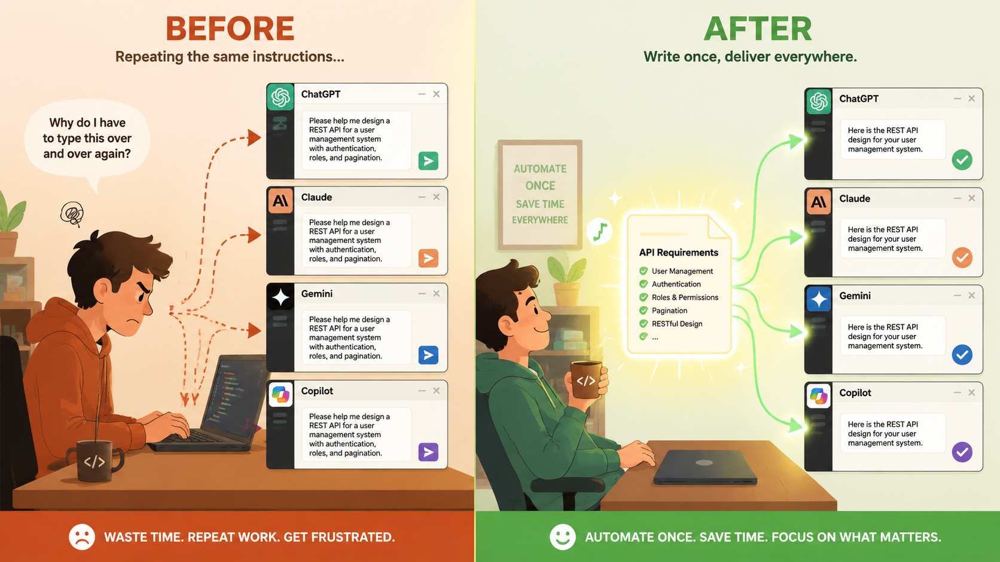
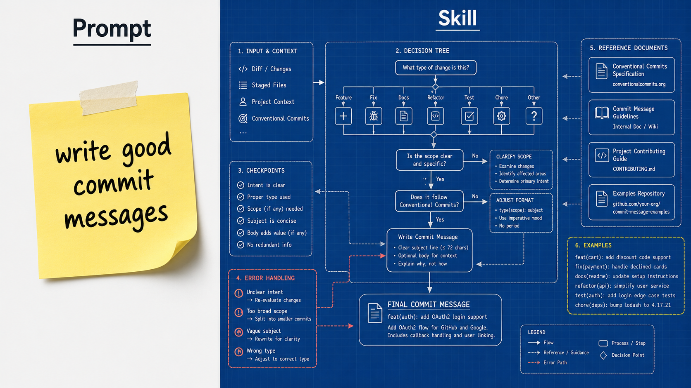
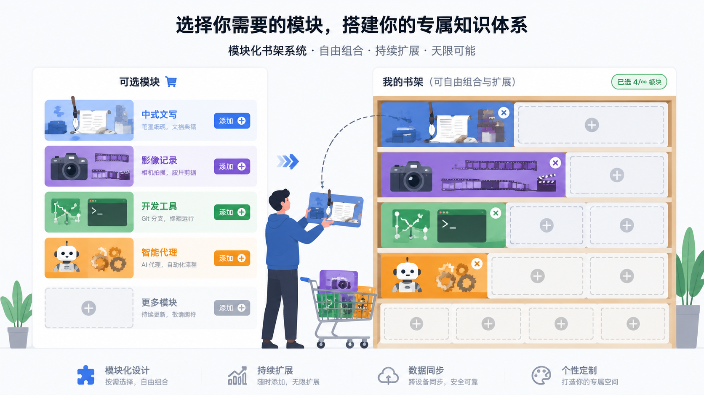
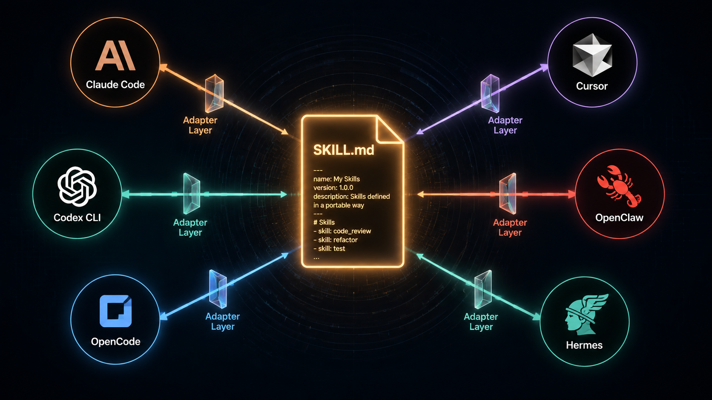
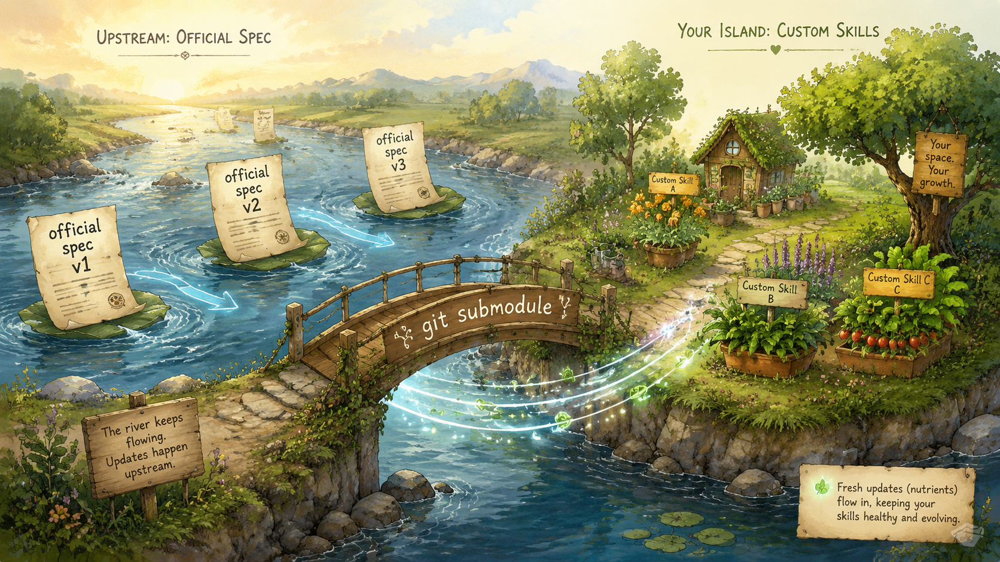
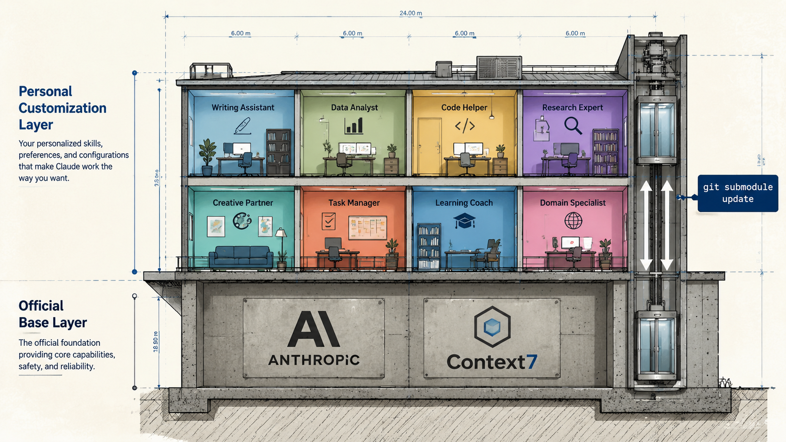
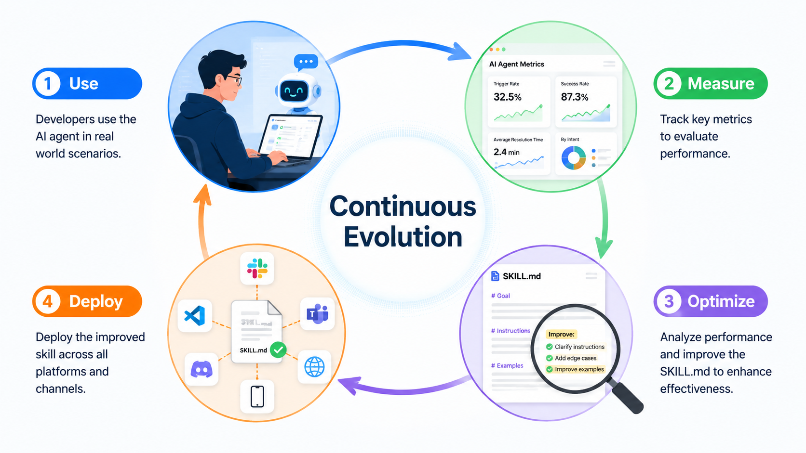
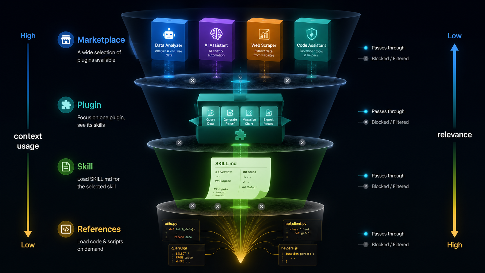
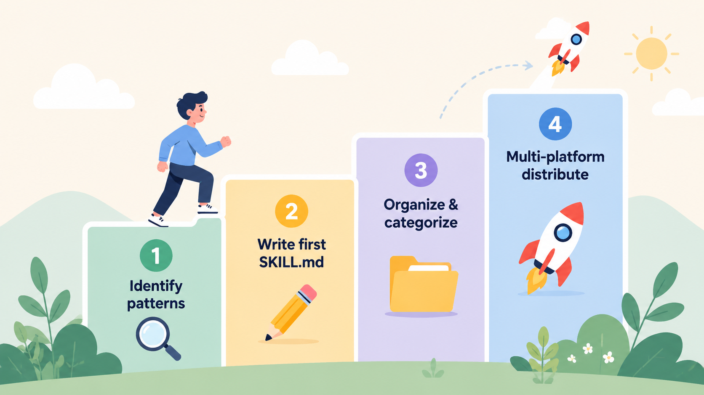

---
tags:
- blog-comments

---
# 模型人人都能用，什么才是你能带走的？我的答案是一个可进化的SKILL库

> 你花几十小时调教出来的 AI 工作流，换个工具就没了？这篇文章聊聊怎么把它变成可积累、跨平台、能自我进化的资产。

<!-- 
封面图 prompt:
A developer sitting at a desk with multiple AI agent interfaces floating around them (Claude, Cursor, Codex logos as abstract glowing orbs). The developer is organizing glowing skill cards into a central glowing repository hub. Style: clean tech illustration, isometric perspective, soft blue and purple gradient background, minimal and modern. No text on image.
-->


---

## 先聊一个不舒服的现实

<!-- 
插图 prompt:
A developer standing at a crossroads/fork in the road, looking uncertain. Behind them, a fading office building with a "company" sign dissolving into particles. In front of them, multiple diverging paths leading to different destinations (startup, freelance, new company). The developer carries only a small glowing backpack (representing portable skills). Around the paths, AI tool logos float like road signs changing rapidly. Style: slightly melancholic but hopeful atmosphere, muted colors with the glowing backpack as focal point, editorial illustration style, metaphorical.
-->


AI 时代有一个残酷的事实：**谁也无法保证你明天还在这家公司。**

当 AI 能完成越来越多的工作，团队在缩编，岗位在重组。你今天在 A 公司用 Cursor 写代码，明天可能在 B 公司用 Claude Code，后天可能自己出来单干。


在这种不确定性下，什么是你真正能带走的？

- 公司的代码仓库？那是公司的。
- 项目里的 `.cursor/rules`？那是项目的。
- 你在某个 AI 工具里积累的对话历史？换个工具就没了。
- 你脑子里"怎么让 AI 高效干活"的经验？能带走，但不固化下来，它会慢慢模糊、过时。

**唯一真正属于你的，是你把这些经验结构化、版本化、存在自己仓库里的那部分。**

我做 SumSec-Skills 的出发点就是这个：不管明天在哪家公司、用什么工具、做什么项目——我的 Agent 技能库跟着我走。它是我的，不是任何公司的，不是任何平台的。

模型能力是公共基础设施，人人都能调用同一个 Claude、同一个 GPT。但**你如何使用它**——你的工作流、你的质量标准、你踩过的坑——这些才是别人复制不了的东西。前提是，你得把它们存下来。

---

## 一句话说清楚我在做什么

**SumSec-Skills 做的事情很简单：把"教 AI"的经验收拢到一个 Git 仓库里，分好类，让所有 AI 工具都能用。**

你每天和 AI 对话，反复教它"怎么帮你干活"。这些教的过程——你的 prompt、你的规则、你的工作流——就是你的**技能资产**。我把它们从散落各处的状态，变成了一个有版本、有结构、可跨平台分发的仓库。

下面展开聊聊背后的设计思考。

---

## 第一个问题：你有没有发现，你在重复"教" AI？

<!-- 
插图 prompt:
Split screen illustration: left side shows a frustrated developer repeatedly typing the same instructions into different AI chat windows (3-4 windows stacked). Right side shows the same developer relaxed, with a single glowing document automatically feeding into all AI windows simultaneously. Style: flat illustration, warm colors, before/after comparison layout.
-->



举几个场景：

- 你在 Cursor 里写了一套 commit 规则，换到 Claude Code 又得重新写一遍
- 你花了半小时教 AI "写中文文章不要有 AI 味"，下次新对话又从头来
- 你在 A 项目里调教好了 PR 创建流程，B 项目里又得重新解释
- 你换了台电脑，之前所有的 rules 和 prompt 全部归零

你在做重复劳动。而且是一种特别隐蔽的重复劳动——每次"教 AI"的过程感觉像在工作，但你其实在重复造轮子。

SumSec-Skills 要解决的就是这个：**教一次，到处用，永远不丢。**

---

## 核心理念：Skill 不是 Prompt，是"行为规范"

很多人的第一反应是："那我把常用的 prompt 存到一个文件里不就行了？"

不够。一段 prompt 是"告诉 AI 做什么"。一个 Skill 是"定义 AI 在某个场景下应该怎么思考、怎么决策、怎么行动"。两者的区别，看个例子就明白了。

<!-- 
插图 prompt:
Two side-by-side comparisons. Left: a simple sticky note with "write good commit messages" written on it, labeled "Prompt". Right: an elaborate blueprint/flowchart showing decision trees, checkpoints, error handling paths, and reference documents connected by arrows, labeled "Skill". Style: technical diagram aesthetic, blueprint blue background on right side, yellow sticky note on left.
-->



拿 SumSec-Skills 里的 `git-commit-pr` 举例。它不是一句"帮我写好 commit message"，而是一整套行为规范：

```
1. 先看这个仓库最近 30 条提交，学习它的风格（不是套模板）
2. 检查有没有 .env、密钥之类的敏感文件（有就停下来问我）
3. 如果我在 main 分支上，先建议我新建功能分支（别直接往主干提交）
4. 生成 commit message 时，优先跟随仓库已有风格，其次才用通用规范
5. 推送前检查远程状态，推送失败有降级方案
6. 创建 PR 时优先用 gh CLI，不行就给我一个链接
```

这不是一段 prompt 能表达的。每一条规则背后都是踩过的坑，是一个经过实战打磨的决策流程。

SumSec-Skills 里的每个 Skill 都长这样：

```
Skill = 结构化的行为规范 + 参考资料 + 辅助脚本
```

它有入口文件（`SKILL.md`），有深度参考（`references/`），有可执行工具（`scripts/`）。不是一段文字，是一个完整的能力包。

---

## 第二个问题：为什么要按领域分成多个 Plugin？

<!-- 
插图 prompt:
A modular bookshelf system where each shelf section is a different color and theme: (1) Chinese writing brush and document - blue, (2) Camera and video film strip - purple, (3) Git branch and terminal - green, (4) Robot/agent with gears - orange, (5) empty shelf sections with "+" signs indicating room to grow. A user is picking individual shelf modules to assemble their own combination. Some shelves are being added/extended. Style: clean flat design, modular/expandable aesthetic, shopping/selection metaphor, shows growth potential.
-->



SumSec-Skills 目前有 20 多个技能，分成了四个独立的 Plugin。但这不是终态——随着技能不断积累，分类会持续增长。**分几个类、怎么分，完全取决于你自己。**

当前的四个 Plugin 是按我的使用场景自然长出来的：

| Plugin | 一句话说明 | 谁会用 |
|--------|-----------|--------|
| `writing-zh` | 中文写作辅助 | 写文章、做内容的人 |
| `media-tools` | 图片视频生成 | 做多媒体内容的人 |
| `dev-tools` | 开发者日常工具 | 写代码的人 |
| `agents-dev` | Agent 开发生态 | 开发 AI 插件的人 |

未来可能会有 `security-tools`（安全审计）、`data-analysis`（数据分析）、`infra-ops`（运维自动化）……只要某个领域的技能积累到 3-5 个，就值得独立成一个 Plugin。**这是一个会生长的结构，不是一个固定的四格抽屉。**

关键问题是：**为什么要分？为什么不把所有技能堆在一个大目录里？**

### 原因一：AI 的"注意力"是有限的

AI Agent 的上下文窗口就像人的工作记忆——能同时关注的东西有上限。你挂载的每一个 Skill，它的描述都会占用 Agent 的"注意力"。

如果你把所有 Skill 全部加载，Agent 每次收到你的指令，都要在几十个选项里判断"这次该用哪个"。这不仅浪费 token，还会增加误触发的概率——你说"帮我提交代码"，Agent 可能在"git-commit-pr"和"creating-blog-web-ppt"之间犹豫（因为后者也涉及"创建"这个动词）。

**分类 Plugin 的好处：你只装你当前需要的那几个。** Agent 只在少数高度相关的 Skill 里做判断，又快又准。技能库从 20 个增长到 50 个、100 个时，这个优势会越来越明显。

### 原因二：不同领域的更新节奏不同

写作技能可能每周都在调整（因为你对"去 AI 味"的标准在不断提高）。但 `git-commit-pr` 可能几个月都不用动（因为 Git 工作流相对稳定）。

如果所有技能捆绑在一起，每次更新写作技能都要"发布"整个包。分开之后，`writing-zh` 可以频繁迭代，`dev-tools` 保持稳定，互不干扰。

### 原因三：按需安装 = 尊重用户

```bash
# 我只写代码，只要开发工具
/plugin install dev-tools@sumsec-skills

# 我是内容创作者，要写作 + 媒体
/plugin install writing-zh@sumsec-skills
/plugin install media-tools@sumsec-skills
```

不是每个人都需要你所有的技能。一个前端开发者不需要"Remotion 视频最佳实践"；一个内容运营不需要"Agent SDK 开发"。**让用户选择他们需要的，而不是强塞一整包。**

### 原因四：分类即认知

当你在 marketplace 里浏览时，Plugin 的名字就告诉你它是干什么的：

```
writing-zh   → 我在写文章
media-tools  → 我在做图片/视频
dev-tools    → 我在写代码
agents-dev   → 我在开发 AI 工具本身
```

3 秒做出选择。如果几十个技能混在一起叫"SumSec-Skills"，你得逐个读描述才能判断。当技能库增长到 50、100 个时，没有分类就是灾难。

### 一个类比

这就像 npm 的 `@scope`：

```
@angular/core
@angular/router
@angular/forms
```

你不会把 Angular 所有模块打成一个包。按职责拆分，是包管理的基本功。Agent Skills 也一样。

---

## 第三个问题：为什么要多平台分发？

<!-- 
插图 prompt:
A central glowing SKILL.md document in the middle, with 6 arrows radiating outward to different platform logos/icons arranged in a circle: Claude Code (anthropic style), Cursor (cursor logo style), Codex CLI (openai style), OpenClaw, OpenCode, Hermes. Each arrow passes through a thin "adapter layer" (shown as a small translating prism/filter). Style: hub-and-spoke diagram, clean lines, dark background with glowing connections, tech/network aesthetic.
-->



现在 AI Agent 工具有多少？Claude Code、Cursor、Codex CLI、OpenClaw、OpenCode、Hermes……还在不断冒出新的。

**如果你的技能只能在一个平台上用，你就被锁定了。**

今天你用 Cursor 很顺手，明天 Claude Code 出了个杀手级功能你想切过去——结果发现所有的 rules 和 skills 都得重写。这种锁定效应，在工具快速迭代的当下，是个真实的风险。

SumSec-Skills 的做法是：**核心内容只写一份，外面包一层平台适配。**

```
SumSec-Skills/
├── dev-tools/skills/git-commit-pr/SKILL.md  ← 核心内容，只有一份
├── .claude-plugin/plugin.json               ← Claude Code 适配
├── .cursor-plugin/plugin.json               ← Cursor 适配
├── .codex-plugin/plugin.json                ← Codex CLI 适配
├── .agents/plugins/marketplace.json         ← Codex marketplace
├── openclaw.plugin.json                     ← OpenClaw 适配
├── opencode/plugins/sumsec-skills.mjs       ← OpenCode 适配
└── hermes/skills/sumsec-skills/SKILL.md     ← Hermes 适配
```

每个平台有自己的 manifest 格式，但它们指向的是同一批 `SKILL.md`。版本号统一管理，一次 bump 全部对齐。

**你的技能资产属于你，不属于任何平台。**

| 平台 | 安装方式 |
|------|----------|
| Claude Code | `/plugin install writing-zh@sumsec-skills` |
| Cursor | marketplace 导入 |
| OpenAI Codex CLI | Git URL 安装 |
| OpenClaw | 插件清单加载 |
| OpenCode | 插件注册 |
| Hermes | Skill 文件复制 |

---

## 第四个问题：怎么保证技能不过时？

<!-- 
插图 prompt:
A timeline/river flowing from left to right. On the river are floating documents labeled "official spec v1", "v2", "v3" (representing upstream updates). A bridge connects the river to a personal island/garden where custom skills grow as plants. The bridge is labeled "git submodule". New nutrients flow from the river through the bridge to feed the garden. Style: metaphorical illustration, nature meets tech, watercolor-digital hybrid, warm and organic feeling.
-->



AI Agent 平台的规范在快速演进。技能库如果是一座孤岛，很快就会和官方脱节。

**SumSec-Skills 用 Git Submodules 解决这个问题：把官方仓库直接"嵌入"到自己的仓库里。**

```gitmodules
[submodule "claude-plugins-official"]
    path = claude-plugins-official
    url = https://github.com/anthropics/claude-plugins-official.git

[submodule "context7"]
    path = context7
    url = https://github.com/upstash/context7.git
```

### 这意味着什么？

**一条命令，拉取官方最新设计：**

```bash
git submodule update --remote
```

Anthropic 更新了 Skill 规范？新增了 frontmatter 字段？调整了加载机制？不用去翻 changelog，不用猜"官方现在推荐怎么写"——直接看 `claude-plugins-official/` 目录里的最新代码。

### 一个真实的例子：Skill 规范在快速生长

最早期的 Claude Code Skill 长这样，朴素到只有两个字段：

```yaml
---
name: my-skill
description: "..."
---
```

能跑，但能力非常有限。它就是一段挂着名字的 prompt。

然后官方在短短一年内不断给它加新字段。今天一个完整的 Skill frontmatter 可能是这样：

```yaml
---
name: my-skill
description: "..."
when_to_use: "..."               # 补充触发场景，帮 AI 更准判断
argument-hint: "<file-path>"     # 自动补全时的参数提示
arguments: [issue, branch]       # 命名位置参数
disable-model-invocation: true   # 禁止 AI 自动调用
user-invocable: false            # 不出现在 / 菜单
allowed-tools: [Read, Grep]      # 预批准工具,减少确认弹窗
model: claude-opus-4-7           # 这个 Skill 指定模型
effort: high                     # 指定思考强度
context: fork                    # 子 Agent 隔离执行
agent: Explore                   # 选择子 Agent 类型
paths: ["src/**/*.ts"]           # 只在编辑特定路径时激活
hooks: { ... }                   # 绑定生命周期 hook
---
```

字段数量翻了 6 倍多。每一个都对应一个真实的工程痛点：

| 字段 | 解决什么问题 |
|------|-------------|
| `when_to_use` | description 装不下完整触发场景，单独一栏专门写触发短语 |
| `argument-hint` / `arguments` | 让 Skill 像命令一样接收参数（详见下一节）|
| `disable-model-invocation` | 危险操作（部署、删除）不能让 AI 自己决定 |
| `user-invocable: false` | 背景知识不需要出现在 `/` 菜单里 |
| `allowed-tools` | 只读操作不用每次弹确认框 |
| `model` / `effort` | 不同任务用不同算力（写文章用强模型，琐事用快模型）|
| `context: fork` + `agent` | 长任务隔离到子 Agent，不污染主对话 |
| `paths` | 只在编辑相关文件时才进入候选，节约注意力 |
| `hooks` | Skill 自己绑定生命周期事件，做自动化预处理 |

**这还只是 Claude Code 一个平台的现状。** 其它平台还在各自演进。规范从"一段带名字的 prompt"长成了一个可编程的运行时。你不持续跟踪，写出的 Skill 就停留在最初版本，能跑，但用不上现在的能力。

### 新增能力一：参数传递，让 Skill 不只是静态文档

Skill 从"挂名 prompt"变成"动态命令"，靠的是这一步。Skill 内容里可以用占位符引用用户传入的参数：

```yaml
---
name: migrate-component
description: 在框架之间迁移组件
arguments: [component, from, to]
---

把 $component 组件从 $from 迁移到 $to。
保留所有现有行为和测试。
```

用户输入：

```
/migrate-component SearchBar React Vue
```

Skill 内容被实时渲染成"把 SearchBar 组件从 React 迁移到 Vue"。

可用的占位符有这么几类：

- `$ARGUMENTS` — 所有参数拼成一个字符串
- `$ARGUMENTS[0]` / `$0` — 按位置访问第一个参数（shell 风格引号，多词用引号包起来）
- `$component` — 在 `arguments` 里声明的命名参数
- `${CLAUDE_SESSION_ID}` — 当前会话 ID，做日志或会话级文件
- `${CLAUDE_SKILL_DIR}` — Skill 自己所在的目录，引用同目录脚本必备

**Skill 不再是固化的指令，而是能接收上下文的可复用模板。** 一个 `/migrate-component` 配三个参数就能处理无数种迁移场景，不用为每对框架各写一个 Skill。

### 新增能力二：调用控制，谁来触发这个 Skill？

默认情况下，你和 AI 都可以触发任何 Skill。但有些 Skill 你只想自己手动触发（比如部署），有些你只想让 AI 在后台用（比如背景知识）。两个字段控制这件事：

| frontmatter 配置 | 用户能调用 | AI 能自动调用 | 加载到上下文的内容 |
|------------------|------------|----------------|--------------------|
| 默认 | ✅ | ✅ | description 常驻，body 调用时加载 |
| `disable-model-invocation: true` | ✅ | ❌ | **description 完全不进上下文**，body 用户触发时加载 |
| `user-invocable: false` | ❌ | ✅ | description 常驻，body 调用时加载 |

举两个例子：

```yaml
# 部署 Skill：必须用户手动触发，AI 不能擅自决定
---
name: deploy
disable-model-invocation: true
---
```

```yaml
# 遗留系统知识：AI 需要在相关时引用，但不是给用户的命令
---
name: legacy-auth-context
user-invocable: false
---
```

第二种特别值得注意：`disable-model-invocation` 不仅禁止 AI 调用，**还会把这个 Skill 的 description 从 AI 上下文里完全移除**。这是一个减压阀。把那些"重要但用得不频繁"的 Skill 标成手动触发，它们就不再占用 AI 的注意力预算。

---

### 顺便聊一下：Skill 多了真的会爆 context 吗？

写到这里我猜你心里有个疑问：**"如果我攒了几十上百个 Skill，AI 的上下文是不是被 description 撑爆了？"**

合理担心。但平台已经替你想了很多。说几个具体机制：

**1. 默认只加载 description，不加载正文。**
你装了 50 个 Skill，进入上下文的只是 50 行简短描述（每条上限 1,536 字符）。Skill 正文只在被触发时才进入对话，一个 800 行的 SKILL.md 平时一个 token 都不占。

**2. 描述预算是动态的，按模型上下文窗口的 1% 自动分配。**
Opus 4.7 有 200K 上下文，默认描述预算就是 2K 字符。预算不够时，**用得最少的 Skill 描述会先被砍掉**，常用 Skill 保留完整。可以用 `skillListingBudgetFraction` 调整这个百分比，或者用 `/doctor` 命令检查当前预算够不够。

**3. 用 `paths` 字段做按需激活。**
`paths` 字段让 Skill 只在你编辑特定路径的文件时才进入候选：

```yaml
---
name: react-conventions
paths: ["src/components/**/*.tsx"]
---
```

不编辑 React 文件时，这个 Skill 完全不出现。这就把"我有 100 个 Skill"变成了"任何时刻只有十几个相关的 Skill 在视野里"。

**4. 用 `skillOverrides` 在 settings 里手动调权重。**

```json
{
  "skillOverrides": {
    "legacy-context": "name-only",   // 只显示名字，不显示描述
    "deploy": "off"                  // 完全隐藏
  }
}
```

保留 Skill 在仓库里，但在当前项目里把它们"折叠"，既不丢，也不占 token。

**5. Auto-compaction 会替你保留最近用过的能力。**
长对话被压缩时，最近调用过的 Skill 会自动重新挂载，每个保留前 5,000 token，总预算 25,000 token。你不会因为对话变长而失去刚用过的能力。

---

**结论：放心写 Skill。** 真正需要克制的不是 Skill 总数，而是这几条工程纪律：

- 不要把 SKILL.md 写到 500 行以上（深度内容放 `references/`，让 AI 按需加载）
- 把 description 写准，让 AI 一眼能筛掉无关的
- 给"重要但用得不频繁"的加上 `disable-model-invocation` 或 `user-invocable: false`
- 给"只在特定路径相关"的加上 `paths`

这些都是平台给你的减压阀。用上它们，你的技能库可以放心从 20 个长到 200 个，上下文不会被撑爆，AI 的判断也不会被淹没。

**所以与其纠结要不要少写几个 Skill，不如把精力花在跟踪官方规范上。** 平台每加一个字段，往往就是在给你多一种"既要又要"的解法。不跟踪，Skill 一多就会越用越焦虑；跟踪了，你会发现每个焦虑场景官方都准备了对应的开关。

### 分层架构：官方是地基，个人是建筑

<!-- 
插图 prompt:
A layered architecture diagram shown as a building cross-section. Bottom layer (foundation/basement) labeled "Official Base Layer" contains Anthropic and Context7 logos, shown as solid concrete. Top layer (the actual building with rooms) labeled "Personal Customization Layer" contains colorful rooms representing different skills. An elevator shaft on the side labeled "git submodule update" connects both layers. Style: architectural cross-section drawing, clean lines, two distinct layers clearly visible, blueprint aesthetic with color accents.
-->



```
┌─────────────────────────────────────────────┐
│        个人定制层（你自己维护）                  │
│                                             │
│  git-commit-pr    humanizer-zh              │
│  skill-optimizer  multi-platform-guide      │
│  agent-chat-history ...                     │
├─────────────────────────────────────────────┤
│        官方基座层（submodule 自动同步）          │
│                                             │
│  claude-plugins-official (Anthropic)        │
│  context7 (Upstash)                         │
└─────────────────────────────────────────────┘
```

- **官方更新不会覆盖你的定制**：两层分离，`git submodule update` 只动下面那层
- **随时对照官方 diff**：看看改了什么，再决定要不要跟进
- **skill-optimizer 会帮你检查**：审计维度里包含"是否符合官方最新规范"

**不是自己造轮子，是站在官方肩膀上加自己的理解。**

---

## 第五个问题：这套东西真的能"进化"吗？

<!-- 
插图 prompt:
A circular feedback loop diagram with 4 stages: (1) "Use" - developer working with AI agent, (2) "Measure" - dashboard showing metrics like trigger rate, success rate, (3) "Optimize" - a magnifying glass examining a SKILL.md document with highlighted improvements, (4) "Deploy" - updated skill being distributed to multiple platforms. Arrows connect each stage in a cycle. In the center: "Continuous Evolution". Style: clean infographic, circular flow, each stage has a distinct icon, professional and modern.
-->



有了集中管理，你能做一件之前做不到的事：**系统性地优化你的技能。**

SumSec-Skills 里有一个叫 `skill-optimizer` 的技能，专门审计其他技能。它会：

1. 扫描所有 Skill，检查结构质量
2. 分析历史对话记录，看哪些被触发了、哪些从来没用过
3. 从八个维度打分：触发率、执行完成率、结构质量……
4. 给出 P0/P1/P2 优先级的改进建议

**用 AI 优化 AI。** 这是集中管理才能做到的事。

prompt 散落各处的时候，你甚至不知道自己有多少条规则，更别说分析效果了。集中到一个仓库之后，每次优化都有记录：

```bash
git log --oneline skills/git-commit-pr/
# a1b2c3d 加入敏感文件检测
# d4e5f6g 优化 commit message 风格学习逻辑
# h7i8j9k 初始版本
```

你能清楚地看到一个 Skill 怎么从"能用"变成"好用"的。

---

## 设计哲学总结

<!-- 
插图 prompt:
A two-panel layout. Left panel shows a single SKILL.md with "progressive disclosure" concept (layers peeling back). Right panel shows the same concept scaled up to repository level: multiple plugin boxes, each containing skills, user only pulling what they need. A visual parallel/mirror between the two panels showing "same principle, different scale". Style: clean split-panel infographic, mirror/fractal aesthetic, left side micro-scale, right side macro-scale, minimalist, professional.
-->



这个项目的架构设计，核心就一句话：

> **把 Skill 本身"渐进式加载、按需使用"的设计原则，复制到了仓库层面。**

一个好的 Skill 内部是这样工作的：AI 先读 `SKILL.md` 的入口描述，判断是否相关；相关了才读正文；正文里引用了 `references/` 才按需加载深度内容。不是一股脑全塞进上下文，而是层层递进、用多少加载多少。

SumSec-Skills 的仓库架构，把同样的逻辑放大到了整个技能库：

```
层级 1：Marketplace → 用户看到 4 个 Plugin 的描述，判断需要哪个
层级 2：Plugin     → 安装后，Agent 只看到该 Plugin 下 2-5 个 Skill 的 description
层级 3：Skill      → 匹配到了，才读 SKILL.md 正文
层级 4：References → 正文引用了，才加载深度参考和脚本
```

**每一层都是一道过滤器。** 从仓库到 Plugin 到 Skill 到 Reference，信息量逐层收窄，上下文占用逐层递减。刻意为之。

在此基础上，三条支撑原则：

### 1. 按领域分 Plugin，独立演进

不同领域的技能有不同的更新节奏、不同的受众。分开管理让它们各自生长，互不干扰。分类规则你自己定，随技能增长自然扩展——今天 4 个 Plugin，明天可能 8 个。

### 2. 开放系统，跟踪上游

通过 submodule 嵌入官方仓库，让个人定制永远站在最新规范之上。不是封闭造轮子，是"官方是地基，个人是建筑"。一条命令同步上游，对照 diff 决定是否跟进。

### 3. 一次编写，多处分发

核心内容只维护一份 `SKILL.md`，外层用各平台的 manifest 包装。版本号统一管理，不被任何单一工具锁定。**技能资产属于你，不属于平台。**

---

## 如果你想开始

<!-- 
插图 prompt:
A simple 4-step staircase/ladder going upward from left to right. Each step is labeled: Step 1 "Identify patterns" (magnifying glass icon), Step 2 "Write first SKILL.md" (pencil icon), Step 3 "Organize & categorize" (folder icon), Step 4 "Multi-platform distribute" (rocket icon). A small figure climbing the stairs. Style: simple flat illustration, encouraging and approachable, pastel colors, progress/growth metaphor.
-->



不需要一上来就搭建完整架构。四步走：

**第一步：找到你的重复模式。** 回顾过去一周，哪些指令你对 AI 说了 3 次以上？哪些流程每次都要重新解释？这些就是你的第一批 Skill 候选。

**第二步：写第一个 SKILL.md。** 不用完美，先把你最常用的那个流程写下来，放在 AI 工具能识别的位置。验证它确实能省事。

**第三步：分类整理。** 当你有了 3-5 个 Skill，开始按领域分组。这时候建一个独立仓库就有意义了。

**第四步：多平台适配。** 当你在多个 AI 工具间切换，加上对应的 manifest 文件。一次投入，长期受益。

---

## 更大的图景

<!-- 
插图 prompt:
A futuristic cityscape where each building represents a developer's personal skill repository. Buildings are connected by glowing bridges (representing forks, sharing, marketplace). In the sky, large platform logos (Claude, Cursor, etc.) shine like suns providing energy. On the ground level, developers walk between buildings exchanging skill cards. Style: sci-fi meets cozy, optimistic future vision, warm lighting, community feeling, detailed but not cluttered.
-->


我们正处在一个有趣的时间点：AI Agent 的能力在快速提升，但"如何让 AI 按你的方式工作"这件事，还没有成熟的工程实践。

SumSec-Skills 的尝试指向一个方向：

> **Agent Skills 应该像代码库一样被管理——有版本、有发布流程、有上游依赖追踪。**

当每个开发者都有自己的 Skills 仓库，当这些仓库通过 submodule 与官方保持同步、通过 fork 在社区间流动、通过 marketplace 被发现和安装——我们可能会看到一个新的生态：

**不是"谁的 AI 模型更强"，而是"谁的 AI 技能库更深"。**

模型能力是公共基础设施，官方规范是共享的地基。你如何在上面构建——你的工作流、你的质量标准、你的决策偏好——这些才是真正属于你的东西。

---

## 链接

- 仓库地址：[github.com/SummerSec/SumSec-Skills](https://github.com/SummerSec/SumSec-Skills)
- 许可证：Apache-2.0（自由使用、修改、分发）

---

*写于 2026 年。希望这篇文章能给同样在琢磨"怎么和 AI 更好协作"的你一些启发。*
