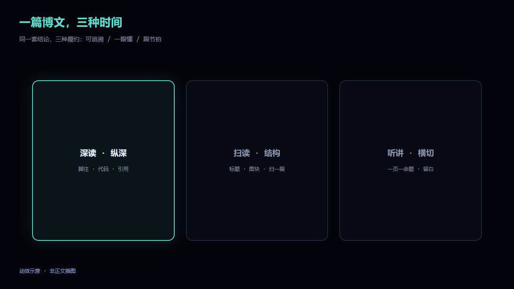
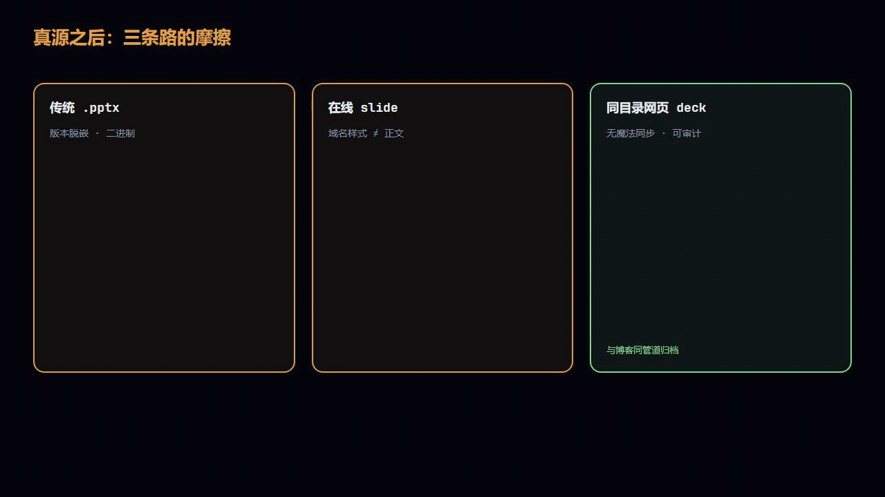
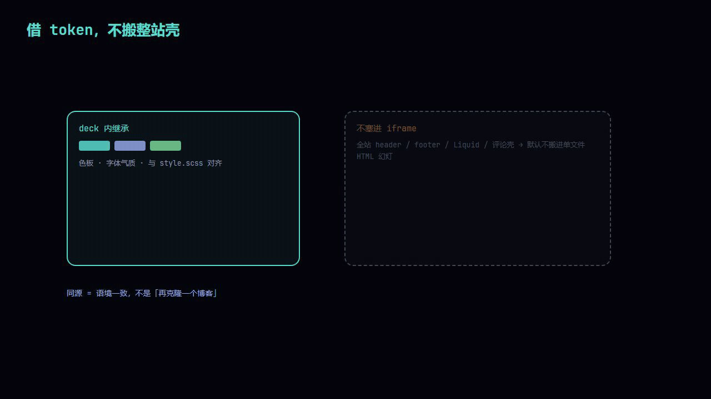
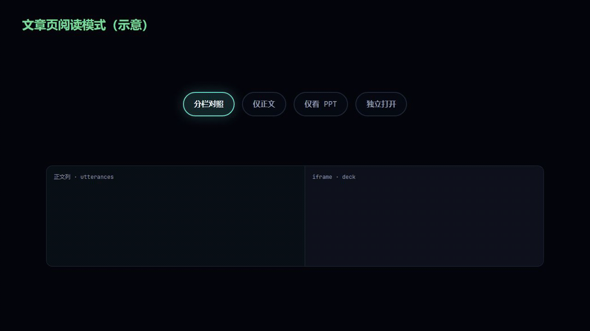

---
tags:
- blog-comments
ppt: ./一篇博文，三种时间：网页幻灯与 Remotion 动效的交付逻辑-ppt.html
---
# 一篇博文，三种时间：网页幻灯与 Remotion 动效的交付逻辑

## 引言

一篇技术长文写下来，资料、实验、推翻、重写，样样费神。收工那一刻很多人心里只有三个字：写完了。

可你只要丢过一次链接让人「先看这篇」，或者站上过一次分享台，就会撞上一件尴尬的事：同一份结论，在不同时间里，对读者提出的是不同种类的履约。

深读的人愿意跟着脚注和代码走，要的是可追溯、可引用、可搜索。扫读的人只有几分钟，要的是结构和图能不能一眼说明白。听讲的人把身体交给现场节奏，要的是节拍、留白、一页里最好只有一个能复述的命题。三种时间叠在同一个人身上也会发生：先收藏，后扫一眼，再在分享会上听你讲。术语漂移、数字不一致、视觉像两个品牌，他心里就会问一句：我到底该信哪一版？

所以问题从来不只是「要不要再做一份 PPT」。更直白一点：你有没有办法，在不大规模自相矛盾的前提下，把同一套东西交给这三种时间？

在 [SUMSEC.ME](https://sumsec.me) 这个仓库里，我的做法拆成三条线，彼此能单独存在，也能接上：

1. 网页版 PPT：用 [`creating-blog-web-ppt`](https://github.com/SummerSec/BlogPapers/tree/master/.claude/skills/creating-blog-web-ppt) 把 Markdown 落成和站点气质一致的独立单文件 HTML 幻灯，和文章同目录归档。「讲」靠它，真源仍钉在 Markdown 上。
2. Remotion 示意：用 [`remotion-blog-motion-assets`](https://github.com/SummerSec/BlogPapers/blob/master/.claude/skills/remotion-blog-motion-assets/SKILL.md) 约束子工程 [`_scripts/remotion-blog-ppt-article/`](https://github.com/SummerSec/BlogPapers/tree/master/_scripts/remotion-blog-ppt-article)，导出和正文同套色板的静帧或短循环视频，放进该文 `pic/`。扫读时那一眼靠它；动效是论证的压缩，不是第二篇正文。
3. 站点对照阅读：Jekyll 按 `ppt`（或默认同名规则）挂上 deck，文章页有分栏对照、仅正文、仅 PPT、新标签独立打开。同一条 URL，尽量少让人在「读」和「跟」之间迷路。

下面主要写为什么这样切、代价在哪。表格和命令还在，只是放在观点后面当附录式参考。文中的 Remotion 动图是概念示意；正文插图和 deck 里复用的图，仍指 Markdown / HTML 里的静态资源，和这些示意动图不是一类东西。

> 文中的「Skill」指预置给代码助手的规则包：路径约定、验收清单、禁止项。不用助手也行，当规格书对着写即可。



---

## 一、摩擦从哪里来

谁都知道演讲稿有用，真到跟前还是临时糊一版。多半不是懒：真源一旦写成博客，后面跟出来的幻灯、动图、演讲备注，全是带利息的负债。



传统幻灯工具能把版式做漂亮，麻烦在于版本和语境容易从正文里脱开。字体跟站点统一吗？图和代码要在两套工具里各维护一份吗？Git 里塞不塞 `.pptx`？正文改了一个数，幻灯忘了同步，读者未必骂你懒，但他会把「台上那个人」和「那篇文章」在心里分成两路信源。

在线 slide 平台域名和样式常常跟正文不在一个世界里；Markdown 一把梭转成泛用 HTML slides，又往往长得不像你的站。两条路都容易让人有同一种感觉：我被从作者的语境里拽出去了。

我选的是一条笨路：幻灯还是网页，颜色和字体跟站点借同一套 token；文件躺在文章旁边；静态托管、浏览器打开、打印 PDF 都行。整站 header、footer 不往 deck 里搬。收益不在酷，在归档语义简单：文章和 deck 在同一目录、同一部署管道里，半年后回来找，不会面对「最后一次上台前改的是哪份附件」这种失忆。代价也实在：没有从 md 到 slide 的魔法同步。要么手写 HTML，要么按 Skill 让模型吐一版，再自己验收。你买的是可审计的派生物，不是「自动生成永远正确」。

深读吃字，听讲吃节拍。同一段落搬上幻灯还叫「段落」，在台上往往就是灾难。正文里三个观点挤进一页 slide，台下的人常常一个也记不住——未必是他们笨，多半是通道换了，你还在用写论文的肌肉在挤。

---

## 二、为什么要两条 Skill

别混用入口。混用常见后果不是少读一个 README，而是把两类完全不同的错误搅在一锅里。

| 产物 | Skill | 默认落盘 | 容易栽在哪 |
|------|--------|----------|------------|
| 独立单文件网页幻灯 | [`creating-blog-web-ppt/SKILL.md`](https://github.com/SummerSec/BlogPapers/blob/master/.claude/skills/creating-blog-web-ppt/SKILL.md) | 与源 `.md` 同目录、同 basename 的 `.html`（全内联 CSS/JS），不吃 Jekyll layout | 一页塞三段论证、画布溢出视口、品牌位链错、图撑破版心 |
| 栅格静帧、H264 短片、可选 GIF | [`remotion-blog-motion-assets/SKILL.md`](https://github.com/SummerSec/BlogPapers/blob/master/.claude/skills/remotion-blog-motion-assets/SKILL.md) + 子工程 | 输出到 `YYYY/pic/<主题>/` 等；命令以子工程 [`README.md`](https://github.com/SummerSec/BlogPapers/blob/master/_scripts/remotion-blog-ppt-article/README.md) 为准 | 时间线乱拍、GIF 假清晰、色板漂了、改画布后忘了整套重渲 |

网页幻灯是空间加演讲节拍；Remotion 是时间轴加像素管道。前者怕认知超载，后者怕渲染假设不成立（例如 `GIFW` 和画布 `W` 不一致，等于先渲一套像素再硬缩，锐度是骗眼睛的）。

写或改 Remotion 时，仓库 skill 还要求打开本机的 `remotion-best-practices`（常见 `~/.claude/skills/...`，Windows 多为 `%USERPROFILE%\.claude\skills\remotion-best-practices\SKILL.md`），按需读 `rules/*.md`。`remotion-blog-motion-assets` 管 BlogPapers 里的路径、色板、导出清单；`remotion-best-practices` 管 Studio、`still`/`render`、composition、动画细节。拆开读烦，但能避免用做 slide 的直觉去拧视频编码的参数，反过来也一样。

Skill 和「扔给模型一段话」的差别，在于换一篇文章还能走同一套清单；收尾必须进浏览器滚、按、缩放过；禁止项写白（deck 别默认进 `resources/`、别把整站 Liquid 糊进 deck、别让主舞台超出视口再指望用户缩放页面）。它不保证你讲得好，只减少你在低级坑里装专业的概率。

---

## 三、网页版 PPT：Skill 想钉住的是编辑权

[`creating-blog-web-ppt`](https://github.com/SummerSec/BlogPapers/tree/master/.claude/skills/creating-blog-web-ppt) 像合同：何时启用、产物长什么样、哪几步不许跳、要读哪些 reference、怎么验收。细则在 `references/`。

我印象最深的是顺序里那句：先写三句主张，再写 HTML。

拆页本质是编辑权。模型和人都会把密度误当成信息：一页塞满字、三张图、两条链，台上没人读完，台下只觉得你在炫技。先压 `visual thesis`、`content plan`、`interaction thesis`，先回答这一页如果只能留一句话该留什么；这句话写不出来，就不该有那一页。

模型帮你生成 deck，到底是在排版，还是在替你决定信息优先级？如果从正文直接摘要出 slide，「什么值得被看见」就被外包了。模型擅长压缩和排布，不擅长替你负责判断。Skill 把「先写主张」写死，无非是把编辑权从生成流程里往回拽一道。

五步可以当检查表：

1. 读原文和仓库视觉参考（`style.scss`、`default.html`、`references/`）：只借 token 和氛围，不搬整站壳。
2. 三句主张：先信息架构，后样式。
3. 单文件 HTML：内联 CSS/JS；主画布用 `max-width`、`max-height`、`clamp()`、`aspect-ratio` 等钉在视口内；小屏纵向读。投影糊、窗口小、没有鼠标的人，仍能把这一页读完。
4. 核对路径：`SUMSEC` 品牌位链到博文在站点上的公开 URL，不是仓库，也不是幻灯片自己。幻灯是导读，可引用、可归档的还是正文。打印成 PDF 时品牌位可能退化成不可点的 URL 文字，那也至少说明这份 deck 跟哪篇文是一家的。
5. 浏览器级验证：按 `references/verification-checklist.md` 过一遍，别只做静态阅读。

不用模型也行：Skill 当规格书，手写 HTML 一条条对。模型省批量改句式，验收别外包。



---

## 四、Remotion：动效不是装饰

这一节对应 `remotion-blog-motion-assets`：路径、画布、导出参数、和站点一致的色值；不替代通用 Remotion 教程。

我把它和幻灯拆开，有一个很功利的理由：时间轴会逼你承认自己在画什么。静态图可以把矛盾藏在构图里；动效节奏不对，你自己先觉得假。静态图里能混过去的延迟感，在动效里往往一秒露馅。

| 来源 | 管什么 |
|------|--------|
| remotion-blog-motion-assets | `YYYY/pic/<主题>/`、`Root.tsx` 的 `W`/`H`/`fps`、批量 `render`、GIF 与 `GIFW` 约定、色板、发版前自检 |
| remotion-best-practices | Studio 预览、`still`/`render`、composition、动画与资源加载 |

仓库内阅读顺序：remotion-best-practices 索引 → 下表色板（可与 [`visual-system.md`](https://github.com/SummerSec/BlogPapers/blob/master/.claude/skills/creating-blog-web-ppt/references/visual-system.md) 对照）→ 子工程 `README.md` → `src/Root.tsx` 里各 composition 的 `id` 与 `durationInFrames`。

导出 MP4 的像素就是上限，`--crf` 只影响压缩。CRF 越低越接近无损、文件越大；本仓库批量示例用 16，略偏保守，方便素材复用。要更清晰：先改大 `Root.tsx` 里 `W`/`H`（建议 16∶9，例如 1280×720），再全体重渲。别靠后期缩放假装分辨率。

GIF 只有 256 色，循环动效在意观感时，正文里更推荐 `<video src="...mp4" autoplay loop muted playsinline></video>`。若仍要 GIF，用 README 里的两阶段 `ffmpeg`（`palettegen` → `paletteuse`）。脚本里的 `GIFW` 必须与 `Root.tsx` 的 `W` 相同。

操作流水线（摘要）：`cd _scripts/remotion-blog-ppt-article` → `npm install` → `npm run dev` → 静帧 `npx remotion still src/index.ts <id> --frame=<n> --output=...` → 批量 `npx remotion render ... --codec=h264 --crf=16` → 按需 GIF。文章里引用优先相对路径（如 `./pic/blog-ppt-remotion/foo.mp4`）。CDN 前缀见根目录 `CLAUDE.md`。

子工程里的 composition 以 `Root.tsx` 和仓库 README 为准，下面是写本文时用到的几块示意：

| 动效 ID | 用途 | 主色值 Token |
|---------|------|-------------|
| dual-carrier | 两种载体（纵深 / 横切） | 背景 `#05060c` / 强调 `#5cdbcf` |
| three-paths-friction | 三条常见路径的摩擦 | 警告 `#e0a050` / 文案 `#e8ecf4` |
| same-origin-layers | 同源借 token、不搬整站壳 | 背景 `#05060c` / 辅助 `#94a8e8` |
| path-strategy | deck 命名与 `ppt` 路径策略 | 文案 `#e8ecf4` / 辅助 `#8b95ab` |
| reading-modes | 阅读模式切换 | 正向 `#7dd79a` / 强调 `#5cdbcf` |
| data-flow | md / deck / front matter 数据流 | 强调 `#5cdbcf` / 辅助 `#94a8e8` |

色值速查：

| Token | Hex | 用途 |
|-------|-----|------|
| bg | `#05060c` | 主背景 |
| accent | `#5cdbcf` | 主强调、高亮边 |
| magenta | `#94a8e8` | 辅助结构 |
| green | `#7dd79a` | 正向语义 |
| danger | `#e0a050` | 警告、摩擦 |
| text | `#e8ecf4` | 主文案 |
| text-muted | `#8b95ab` | 说明、标签 |

同一篇里如果还有网页版 PPT，发版前对一眼 deck 和 Remotion 是否仍是一套 token。两套很像但不完全一样的深色叠在一起，比单纯配色丑更伤信任。

发版前可按文末附录逐项勾 Remotion 清单。

---

## 五、`ppt` 是开关，不是装饰链接

实现主要在 `_layouts/default.html` 的 Liquid：除 `README.md` 与 `resources/` 下的 md 外，其余文章按 `page.ppt` 或默认候选路径算出 `ppt_resolved_rel`，决定是否 `page_has_ppt`、是否套阅读壳。`assets/js/scifi.js` 管 `split`、`article`、`ppt` 等模式和同源探测；样式在 `assets/css/style.scss` 的 `#article-reading-mode` 附近。

从作者视角，`ppt` 像 feature flag：写上，就等于承诺右侧 iframe 里那份东西存在、可读、和本文配套。这比随手甩一个外链要重。

| 策略 | 磁盘上的 deck 文件名 | Front matter |
|------|----------------------|--------------|
| A. 默认同名 | `foo.md` 与 `foo.html` 同 stem | 可不写 `ppt`，布局猜 `{同目录}foo.html` |
| B. `-ppt` 后缀 | `foo-ppt.html` 与 `foo.md` 并存 | 须写 `ppt: ./foo-ppt.html`（或等价路径），否则布局仍猜 `foo.html`，对不上 |


`ppt` 也可写成绝对 URL。若指向别的域名，布局仍会出壳层，但 `scifi.js` 会做同源判断，跨域时不发 `fetch` 探测。同仓静态托管最省事；跨域就要自己兜嵌入失败和缓存策略这类浏览器脾气。

实例：[《别让大模型「想太多」……》](./别让大模型_想太多_：SKILL开发中的语义陷阱与抗幻觉设计.md) 用策略 B，front matter 里有 `ppt: ./别让大模型_想太多_：SKILL开发中的语义陷阱与抗幻觉设计-ppt.html`，文件名一眼分清 Jekyll 页和独立 deck。

deck 没准备好就别写 `ppt`。空 iframe 占的是读者时间。同源托管时，脚本用短超时的 `HEAD`/`GET` 探测资源；失败就收起分栏和「仅看 PPT」、清掉 iframe。宁可不露，也别挂一块长期 404 的灰框。

---

## 六、对照阅读

`page_has_ppt` 为真时，页面上会多一条轻工具条。



分栏：左正文、右 iframe 里 deck，审稿时左边问依据、右边指主线，少来回切标签。仅正文：关掉演讲节奏，回到可搜索、可复制、可评论的长文。仅看 PPT：把论证细节暂时降级，用节拍验收自己能不能讲。独立打开：新标签打开和 iframe 同源的那份 HTML，投屏、第二屏、把翻页交给别人时，往往比 iframe 稳。

宽屏默认偏分栏、窄屏默认偏纯文，大致以 `scifi.js` 里 `matchMedia`（约 `768px`）为界，具体以源码为准。

评论（utterances）仍在正文列，不进 iframe。讨论挂在可引用的正文和 issue 上，比散在「某次导出的 PDF」或「某次演讲临时链」里好找，也更好 diff。

---

## 七、端到端顺序

我习惯的顺序：md 先定稿 → 按 `creating-blog-web-ppt` 吐 deck → 按命名规则写或省略 `ppt` → 需要示意再走 Remotion，资源进该文 `pic/` → 本地 `jekyll serve` 把分栏、纯文、纯 PPT、独立打开各摸一遍 → 再单独打开 deck，测键盘翻页、全屏、品牌位回链、窗口压窄。

改正文时，哪条衍生品最容易先撒谎？我的经验是数字和结论先坏在 deck；动效坏得慢，一改画布就要整套重渲。顺序写死，发版时至少知道该 grep 哪里。

品牌位链线上读者会打开的博文 URL，别链 `localhost`；改过标题或文件名就 grep deck 里是否还有旧串；自定义 `permalink` 时，品牌位以最终公开 URL 为准。

```text
Markdown 正文 ──creating-blog-web-ppt──► 独立单文件 deck.html
       │
       └── front matter（ppt 路径）──► Jekyll 布局 ──► 阅读模式壳层 + iframe(src=deck)
```

另有一条并行线：正文加 Remotion，产出在 `pic/` 下的 mp4、gif、png，用 Markdown 或 `<video>` 嵌入，不经过 `ppt` 字段。


---

## 八、别干什么

别拿幻灯片顶替站点信息架构。deck 别默认进 `resources/`；别随手起和正文 stem 对不上的临时名；别手搓 CI 长期维护的文件。

iframe 在跨域、Cookie 或个别浏览器策略下可能不如独立打开稳。独立打开不是备胎，演讲里本来就需要干净全屏，而不是博客里再套一层博客。

deck 再漂亮也不解决「讲什么」。对照模式信息密度太高，只会让人左右眼打架。Skill 能挡的是难看、难用、难信任；能不能把人说服，还是写稿时欠下的债。

---

## 九、别的栈也能用的几条硬规矩

前面都是 SUMSEC.ME 里的具体实现。换成 Hugo、Hexo、VuePress，或者根本不是博客，只要你在维护「一份正文、多端交付」，下面几条仍可以当约束用：

1. 真源只认一份：能引用的数字和结论，以正文（或你的单一 Markdown 源）为准。
2. 幻灯和动效是投影，不是第二份独立副本：正文改了，衍生品要么跟，要么别发。
3. 颜色字体从站点样式继承，别在幻灯里另起一套皮肤，避免读者觉得换了品牌。
4. 「可讲」用显式开关（这里的 `ppt`）承诺；资源不存在时降级，别挂 404 灰框透支信任。
5. 不迷信自动同步黑盒：每一份派生物都经过验收，特定演讲可以改节拍，不怕一键覆盖冲掉你的判断。

什么时候可以不做？短文、一次性备忘、纯链接聚合，强行做 slide 多半是制造维护负担。读者只有你自己、又确定不会上台讲，留在 md 里就够。deck 也可以只做导读版：页数少，只留主张和指针，细节链回正文。全篇 mirror 到 slide，只有你真的要按段讲时才划算。Remotion 也一样：没有「一眼需要时间」的论证，就别为动效而动效。

---

## 结语

短文、偶发一篇，网页 PPT 和 Remotion 都可以没有。经常在「写透」和「讲清」之间两头跑，就要算一笔账：可讲性要不要付维护税。我们仓库把税收成固定工序，对照 UI 做成可选，视觉尽量跟正文别分家。

它替不了你裁内容、改稿子。能给你的东西很朴素：深读、扫读、听讲三条线同时来的时候，版本和语境上少给自己挖坑。

静态博客要抄「单文件 HTML deck + 文章页可控 iframe」，可以整段搬走；用本仓库就从 [`creating-blog-web-ppt`](https://github.com/SummerSec/BlogPapers/tree/master/.claude/skills/creating-blog-web-ppt) 与 [`remotion-blog-motion-assets`](https://github.com/SummerSec/BlogPapers/tree/master/.claude/skills/remotion-blog-motion-assets) 起看；动效和批量命令以 [`_scripts/remotion-blog-ppt-article`](https://github.com/SummerSec/BlogPapers/tree/master/_scripts/remotion-blog-ppt-article) 为准。deck 有了，再在 front matter 里补 `ppt`。

想先试水：找一篇现有文，按 skill 参考手写一个单文件 `demo.html` 放同目录，`ppt: ./demo.html` 写进 front matter，推上去看分栏。Remotion 可以后补。

---

## 附录：Remotion 执行清单

```text
- [ ] 定好该文的资源子目录（如 2026/pic/<主题>/）
- [ ] 写 composition 时已对照 remotion-best-practices / rules
- [ ] 配色对齐色值表
- [ ] npm install / npm run dev 看过时间线
- [ ] MP4：h264 + CRF=16
- [ ] 若出 GIF：两阶段 palette，且 GIFW = W
- [ ] 正文里关键动效优先 <video> 引用 mp4
- [ ] 浏览器打开文章页，暗色背景下核对可读性
```
