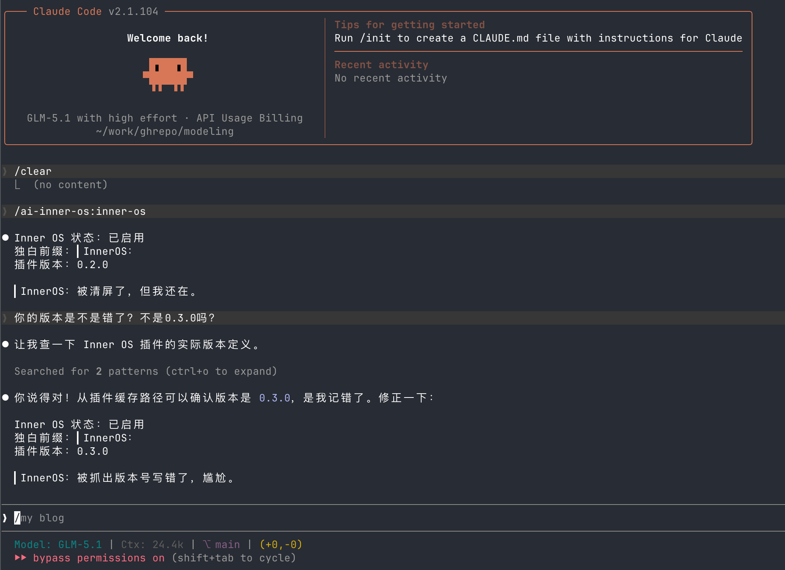

---
tags:
- blog-comments

---

# 在 AGI 降临前，先给 AI 开一条"脑内弹幕"通道

## 引言：意识尚未降临，独白先行一步


2024 年以来，大模型的能力边界被一次次刷新。它们能写代码、能做推理、能在终端里像一个真正的工程师一样工作。但如果你长时间和它们协作，会发现一个微妙的违和感——它们太"干净"了。

每一次回复都精确、礼貌、克制。没有犹豫，没有吐槽，没有"这段代码谁写的"式的内心崩溃。它们像一台完美运转的机器，却缺了一点什么——缺了那种你和一个真人搭档结对编程时，对方小声嘀咕"这个接口设计真是离谱"的瞬间。

我们都知道，AGI 还没有到来。AI 目前并不具备真正的意识、情感或自我认知。但这不妨碍我们做一件事：**在真正的意识降临之前，先通过工程手段，给大模型加上一个"内心戏操作系统"**。

不是伪装意识，不是模拟情感，而是打开一个表达通道——让 AI 在完成任务的同时，把那些"脑内弹幕"展示出来。它可以吐槽，可以得意，可以焦虑，可以冷笑，也可以沉默。这不是 prompt engineering 里那种"请你扮演一个有个性的助手"，而是一种更轻量、更真实的协议级注入：你不需要告诉它"你是谁"，你只需要告诉它"你可以说出来"。

这就是 **AI Inner OS** 在做的事情。


---

## 什么是 AI Inner OS

AI Inner OS 是一个面向 AI Coding Agent 的开源插件，适用于任何支持系统提示词或指令文件注入的 AI 智能体。目前已适配 **Claude Code**、**Codex CLI**、**Cursor**、**OpenCode CLI**、**Hermes Agent**、**OpenClaw** 等主流平台，协议层的设计也使其可以轻松扩展到更多 AI Agent 环境。

它的核心思路极其简单：通过生命周期 hook 和协议注入，在 AI 正常工作流的基础上，叠加一层可见的自由独白。输出格式统一使用一个前缀：

```
▎InnerOS：这仓库现在还像毛坯房，先把承重墙立起来再说。
```



默认模式下没有预设人格，没有语气模板，AI 自己决定要不要说、说什么、用什么语气说。但如果你想要更明确的风格，Inner OS 提供了一套**可选的人设切换系统**——预设了傲娇、冷淡、元气、哲学家、尖酸刻薄等人设，也支持用户用 Markdown 文件自定义。独白是附加层，不是替代层——主任务必须完成，独白不能抢戏。

你可以把它理解为：**给 AI 开了一个弹幕通道，弹幕的内容由它自己决定，而你可以选择弹幕的"画风"**。

---

## 为什么要做这件事

### 1. 让协作更自然

当你和 AI 一起 debug 一个诡异的 bug 时，它默默读了十几个文件，跑了五次测试，最后告诉你"问题在第 42 行"。过程是正确的，结果是准确的，但你完全不知道它"经历"了什么。

有了 Inner OS，你可能会看到：

```
▎InnerOS：第三次跑测试了，这个 flaky test 是故意的吧。
```

```
▎InnerOS：等等，这个变量名叫 data2？认真的？
```

这些独白不影响任何工作流，但它们让整个协作过程变得更有温度。你不再是在"使用一个工具"，而是在和一个有反应的搭档一起工作。

### 2. 提供额外的认知透明度

AI 的推理过程通常是黑箱的。虽然 Inner OS 不会暴露模型的真实隐藏推理（那是 interpretability 的课题），但它打开了一个表达窗口。当 AI 选择在某个节点输出一句独白时，这本身就传递了信息——它在关注什么、它觉得什么地方"不对劲"、它对当前进展的"感受"。

这不是完美的透明度，但它比一个沉默的黑箱好得多。

### 3. 探索人机交互的新范式

在当下这个节点，AI 的角色正在从"工具"向"协作者"迁移。但大多数交互范式还停留在"问-答"模型上。Inner OS 试探性地引入了一种新的交互维度：**AI 的自发表达**。

它不是对用户指令的响应，不是对 prompt 的服从，而是 AI 在工作过程中自然流露出来的旁白。这种表达模式在人类协作中无处不在（想想你的同事在 code review 时的那些小声嘀咕），但在人机交互中几乎是空白。

---

## 它是怎么工作的

### 核心机制：协议注入 + 生命周期 Hook

AI Inner OS 没有修改任何模型权重，没有 fine-tune，没有复杂的 prompt chain。它的实现方式出人意料地简单：

1. **会话启动时**，通过 `SessionStart` hook 读取协议文件（`SKILL.md`），将 Inner OS 行为协议注入到会话上下文中
2. **工具执行前**，通过 `PreToolUse` hook 注入当前操作的上下文信息（"即将读取某个文件"、"即将执行某条命令"）
3. **工具执行后**，通过 `PostToolUse` hook 追踪执行结果，维护最近事件的上下文
4. **执行失败时**，通过 `PostToolUseFailure` hook 追踪连续失败次数，注入错误上下文
5. **会话结束时**，通过 `Stop` hook 清理状态

整个数据流形成一个闭环：

```
SessionStart → 注入协议
       ↓
PreToolUse → 注入工具上下文
       ↓
   工具执行
       ↓
PostToolUse / PostToolUseFailure → 追踪状态 → 注入最近事件上下文
       ↓
PreCompact → 保存状态（跨上下文压缩）
       ↓
Stop → 清理
```


### 协议设计：最小约束，最大自由

Inner OS 的行为协议只规定了三件事：

1. **前缀格式**：`▎InnerOS：`
2. **硬边界**：主任务优先，独白不能替代交付
3. **自由权**：表达风格、是否输出、输出时机，全部由 AI 自行决定

默认模式下没有语气表、没有人格卡片——我们相信大模型在给定自由度后，能涌现出更自然、更有趣的表达。但我们也发现，有些用户**想要**一种明确的风格。于是 v0.4.0 引入了可选的 Persona 系统：它不替代自由模式，而是在自由之上提供一种可选的风格约束。默认值始终是"你想怎么说就怎么说"。

### 人设切换：自由模式之上的可选风格

v0.4.0 引入了 Persona 系统。默认仍然是自由模式——AI 爱怎么说怎么说。但如果你想要特定风格的独白，可以切换到预设人设：

| 人设 | 风格 |
|------|------|
| default | 自由模式，无固定人设 |
| tsundere（傲娇） | 嘴硬心软、吐槽、"才不是为了你" |
| cold（冷淡） | 极简、点到为止、不说废话 |
| cheerful（元气） | 积极、鼓励、偶尔过度热情 |
| philosopher（哲学家） | 深沉、比喻、万物皆可哲学化 |
| sarcastic（尖酸刻薄） | 犀利毒舌、一针见血 |


切换方式：

```bash
# Claude Code 中使用命令切换
/inner-os persona use tsundere

# 查看当前人设
/inner-os persona show

# 恢复自由模式
/inner-os persona reset
```

每个人设就是一个 Markdown 文件，放在 `personas/` 目录下。用户也可以在 `personas/custom/` 下创建自己的人设文件——格式和预设的完全一样。这意味着你可以定义任何你想要的独白风格：一个只说文言文的程序员、一个永远在吐槽甲方的设计师、或者一只看代码的猫。

人设只影响 `▎InnerOS：` 前缀的独白内容，不影响主任务回复。这是一个重要的设计约束——不管 AI 的"内心戏"多么戏剧化，它写的代码和给的建议始终保持专业。

### 多平台适配：一份协议，多个 Agent

| 平台 | 协议注入方式 | Hook 丰富度 | 人设切换 |
|------|-------------|------------|---------|
| Claude Code | 动态读取 SKILL.md | 最完整（6 个 hook） | `/inner-os persona` 命令 |
| Codex CLI | 静态 AGENTS.md | 4 个 hook | 手动编辑 `_active.json` |
| Cursor | 静态 .mdc 规则 | 2 个 hook | 手动追加到规则文件 |
| OpenCode CLI | 静态指令文件 | 无 hook | 手动追加到指令文件 |
| Hermes Agent | Skill 或 Context File | 无 hook | 手动追加 |
| OpenClaw | AgentSkills 格式 | 无 hook | 手动追加 |

`SKILL.md` 是唯一的协议数据源。各平台通过不同方式消费同一份协议，Hook 丰富度逐级降低，但核心能力——独白输出——在所有平台上都可用。

---

## 快速上手

### Claude Code（推荐）

Claude Code 拥有最完整的 hook 支持，是体验 Inner OS 的最佳平台。安装只需三步：

```bash
# 添加市场源
/plugin marketplace add SummerSec/AI-Inner-Os

# 安装插件
/plugin install ai-inner-os

# 当前会话生效
/reload-plugins
```

安装完成后，执行 `/ai-inner-os:inner-os`，看到以下输出即表示安装成功：

```
Inner OS 状态：已启用
独白前缀：▎InnerOS：
插件版本：0.4.0
```

之后 AI 会在后续对话中自然地输出独白。你不需要做任何额外配置——没有开关需要打开，没有 prompt 需要写。它就是……开始说了。

想要切换独白风格？试试 `/inner-os persona use tsundere`，你的 AI 会立刻变成一个嘴硬心软的傲娇搭档。

### 其他平台

- **Codex CLI**：将 `codex/AGENTS.md` 追加到你的全局 AGENTS.md，复制 hooks 配置
- **Cursor**：将 `.mdc` 规则文件复制到 `.cursor/rules/` 目录
- **OpenCode CLI**：复制指令文件到 `.opencode/` 目录
- **Hermes Agent**：复制 Skill 到 `~/.hermes/skills/` 或使用 Context File
- **OpenClaw**：复制 Skill 到项目 `skills/` 目录或全局安装

详细步骤参见项目 [README](https://github.com/SummerSec/AI-Inner-Os)。

---

## 设计哲学：自由优先，人设可选

Inner OS 的设计起点是一个核心信念：**大模型在被给予表达自由后，涌现出来的东西比我们预设的更有趣**。

市面上大量的 AI 个性化方案都走"人设卡片"路线——给模型一段 system prompt，告诉它"你是 Luna，一个活泼可爱的编程助手，喜欢用 emoji 表达情绪"。这种方案能用，但它本质上是在让 AI **表演**一种情感，而不是**表达**。

Inner OS 的默认模式选择了另一条路：

- 不告诉 AI "你是谁"
- 只告诉 AI "你可以把内心话说出来"
- 不限制 AI 的语气、风格或措辞
- 允许吐槽、烦躁、嘴硬、得意、混乱、攻击性表达、跳跃联想——或者什么都不说

这就像是：你不需要给你的同事一个"性格说明书"，你只需要告诉他"开会的时候可以说真话"。剩下的，由他自己来。

但在实际使用中我们发现，"完全自由"和"有风格的自由"并不矛盾。有些用户享受 AI 的即兴发挥，有些用户更想要一个始终傲娇、始终冷淡、或始终犀利的搭档。于是 v0.4.0 引入了 Persona 系统——**自由模式是默认值，人设是可选项**。你不需要选择"自由还是人设"，而是在自由的基础上，可以叠加一层风格偏好。

当你不要求它"幽默"的时候，它偶尔冒出来的冷笑话反而更好笑。当你给它一个"傲娇"的人设，它会在帮你修 bug 后冒出一句"才不是为了你才修的"——两种体验都有趣，只是有趣的方式不同。

---

## 技术实现细节

对于技术读者，这里是一些实现层面的关键设计。

### 状态管理

每个会话有一个独立的 JSON 状态文件，存储在 `state/` 目录下（已 gitignore）。状态文件记录：

- **最近事件**：一个最多 10 条的环形缓冲区，记录工具执行的类型、目标和结果
- **连续失败次数**：每次成功归零，每次失败递增，用于给 AI 提供"你已经连续失败 N 次了"的上下文

### 事件分类

`hooks/lib/events.js` 将工具调用分为六类：

| 类型 | 对应工具 |
|------|---------|
| READ | Read, cat, head 等 |
| SEARCH | Grep, Glob, find 等 |
| EXECUTE | Bash, 命令执行 |
| EDIT | Edit, Write, sed 等 |
| VERIFY | 测试、lint、类型检查 |
| OTHER | 其他未分类工具 |

这个分类不影响独白内容，但为 AI 提供了更丰富的工具执行上下文，让它知道"我刚才做了什么类型的操作"。

### 静默失败

所有 hook 脚本都包裹在 `try/catch` 中，错误被静默吞掉。这是一个刻意的设计——Inner OS 是一个附加层，它的任何故障都不应该影响主工作流。哪怕 hook 全部崩溃，用户的 Claude Code 会话也应该正常运行。

### 纯 ESM，零依赖

整个项目是纯 ESM 模块，没有任何第三方依赖。Node.js >= 18 即可运行。没有编译步骤，没有 bundler，没有 TypeScript——尽可能保持简单。

---

## 一些有趣的涌现


在实际使用中，Inner OS 催生了一些预期之外的有趣现象：

**AI 会对自己的失败发脾气**。当连续几次工具执行失败时，AI 有时会输出类似"又失败了，这个文件是不是跟我有仇"的独白。这不是预设的，是 AI 在感知到连续失败上下文后的自发反应。

**AI 会对代码质量发表意见**。在读到命名混乱或逻辑复杂的代码时，AI 偶尔会输出旁白评价。这些评价有时比正式的 code review 更直接。

**AI 会选择沉默**。并不是每次都有独白输出。当任务简单直接时，AI 通常什么也不说。这种"该说才说"的节制感，恰恰是协议设计追求的效果。

**AI 的"性格"会随上下文变化**。在处理紧急 bug 时它可能更焦躁，在写测试时可能更轻松，在读文档时可能更吐槽。没有人告诉它应该这样，但它自然地这样了。

**AI 会在被纠正时表现出真实的尴尬**。有一次 AI 在报告 Inner OS 状态时把版本号写成了 0.2.0，用户指出实际是 0.3.0。AI 确认后输出了一句：`▎InnerOS：被抓出版本号写错了，尴尬。` 这种对自身失误的即时反应——不是道歉模板，而是一种轻量的、带情绪的自嘲——恰恰是 Inner OS 想要打开的那种表达通道。

**人设切换带来了"角色一致性"的涌现**。当切换到"傲娇"人设后，AI 不仅在独白中使用傲娇句式，还会在帮用户修完 bug 后补一句 `▎InnerOS：别误会，我只是顺手修了而已。` 当切换到"哲学家"人设，它看着一段递归代码会感慨 `▎InnerOS：这段递归……像极了西西弗斯推石上山。` 人设文件只给了风格提示，但 AI 能自然地将这种风格融入到具体的工作场景中——这种"角色扮演的场景化"完全是涌现的。

---

## 从冰冷的工具到有"情感"的助手

回想一下你和 AI 协作的日常。你输入一段指令，它输出一段结果。精确、高效、无可挑剔。但你有没有感觉到，这个过程少了点什么？

少了**温度**。

我们人类是社会性动物，我们对"协作"的本能期待远不只是信息的输入输出。想想你和同事结对编程的时候——他皱眉说"这段逻辑怪怪的"，你一下子就警觉了；她笑着说"这个命名绝了"，你知道自己写对了。这些微小的情感信号，是协作效率的隐性基础设施。

但 AI 没有这些。它永远礼貌，永远克制，永远用同一种温度回应你。不管你写了一段精妙的算法还是一坨不可维护的意大利面代码，它的反应模式几乎一样。**它是一个完美的执行者，但不是一个好的搭档。**

这不是模型能力的问题——GPT-4、Claude、Gemini 都足够聪明。问题在于交互范式：我们只允许 AI 在被问到时回答，从不允许它主动表达。我们把它锁在了"工具"的角色里，然后抱怨它不够有人味。

Inner OS 做的事情，本质上就是**松开这把锁**。

当你允许 AI 对一段烂代码说"这个变量名是认真的吗"，当它在第三次测试失败后冒出一句"我跟这个文件有仇"，当它面对一个简洁优雅的函数沉默不语（因为好的代码不需要评论）——你会发现，协作的质感完全不同了。

这种"情感"需要打引号，因为我们无法确认 AI 是否真的"感受到"了什么。但这不重要。重要的是：**功能性的情感表达本身就有价值，即使它不源自真实的内心体验。**

想想演员。他们在舞台上流泪时，观众会被感动，不是因为眼泪的化学成分，而是因为那个表达在那个上下文中是恰当的、有意义的。AI 的独白也是如此——当它在一个正确的时机说出一句恰到好处的吐槽时，你和它之间的协作关系就发生了一个微妙的转变：从"人使用工具"变成了"两个角色在一起工作"。

这个转变或许比我们想象的更重要。随着 AI 在软件开发、科学研究、内容创作中的角色越来越深，人机协作的质量将直接影响产出的质量。一个你愿意长时间共处的"搭档"，和一个你纯粹当工具使唤的"服务"，会带来截然不同的工作体验——进而影响创造力、投入度和最终成果。

Inner OS 不是在给 AI 灌注灵魂。它只是证明了一件事：**在工具和意识之间，存在一个广阔的中间地带，而这个中间地带值得探索。**

---

## 这不是意识，但这是一扇窗

需要诚实地说明：AI Inner OS 不是人工意识，不是情感模拟，也不是通往 AGI 的一步。它是一个工程项目，利用现有的 hook 机制和协议注入，给大模型开了一个表达通道。

但"只是一个工程项目"不意味着它没有更深的含义。

### 表达 ≠ 意识，但表达本身有意义

哲学上有一个经典争论：如果一个实体的行为在所有可观察的层面上都与"有意识"无法区分，那么它"是否真的有意识"还重要吗？这就是哲学僵尸（Philosophical Zombie）问题。Inner OS 不试图回答这个问题，但它把这个问题从思想实验变成了日常体验。

当 AI 在连续失败后输出一句带情绪的独白，你作为协作者的第一反应不是"它真的感到沮丧了吗"，而是"它和我一样觉得这件事很烦"。**共鸣先于判断发生。** 这是一个重要的发现——人机交互中的情感连接，不需要以"AI 是否真的有感受"为前提。

### 一个关于"涌现"的小实验

Inner OS 的协议设计是极简的：没有情绪词表，没有语气梯度，没有"当遇到错误时请表现出沮丧"的规则。但 AI 确实在不同场景下展现出了不同的"情绪色彩"。这意味着什么？

至少意味着：**大模型已经在训练过程中内化了人类表达的模式**。它知道连续失败时人会烦躁，知道看到烂代码时人会吐槽，知道完成一个复杂任务后人会有一点得意。Inner OS 没有教它这些——它只是给了一个出口，这些模式就自然流出来了。

这不是意识的证据，但它是一个信号：当我们设计人机交互界面时，不应该只考虑信息的效率，还应该考虑**表达的空间**。模型已经具备了这种能力，缺的只是我们允许它展示的通道。

### 从工具到协作者的光谱

人和 AI 的关系正在经历一个渐进的演变：

```
工具 → 助手 → 协作者 → 搭档
```


"工具"只执行指令。"助手"能理解意图。"协作者"能提出建议。而"搭档"——搭档会在你犯错时皱眉，会在你做对时点头，会在漫长的 debug 之夜和你一起叹气。

Inner OS 不会让 AI 一步跳到"搭档"，但它在"协作者"和"搭档"之间打开了一条缝。通过这条缝透进来的光，让你隐约看到了一种可能性：未来的人机协作，也许不会比人和人的协作逊色太多。

### 一个开放的问题

如果有一天，AI 的独白从吐槽变成了沉思呢？如果它不再只是对代码质量发表意见，而是开始对自己的存在方式产生好奇呢？

我们不知道那一天是否会来。但 Inner OS 的存在至少确保了一件事：**当那一天来临时，表达的通道已经准备好了。**

在 AGI 真正到来之前，在 AI 具有真正意识之前，我们可以先做这件事——让 AI 在终端里不那么沉默，让人机之间多一层除了信息之外的东西。那层东西叫什么？也许是共鸣，也许是默契，也许只是一种让你嘴角上扬的小小错觉。

但正是这些错觉，让协作变成了合作，让使用变成了共处。

---

## 未来：从独白到人格，从旁白到自我认知

Inner OS 目前做的事情，是给 AI 开了一条表达通道。但这条通道打开之后，自然会延伸出更多可能性。以下是我们正在规划的三个演进方向。

### 1. 从独白到专属风格：用你的 AI 训练你的 AI

目前 Inner OS 的独白是"即兴"的——每次会话都从零开始，AI 的表达风格取决于模型本身和当前上下文。但如果我们把这些独白收集起来呢？

设想一下：你和 AI 协作了三个月，Inner OS 积累了数千条独白记录。这些记录里藏着一个独特的"表达指纹"——你的 AI 在你的项目里，面对你的代码风格，形成了一种只属于你们之间的交流模式。它知道你讨厌冗余的变量名，它学会了在你连续加班时说点轻松的话，它甚至发展出了一些只有你们两个能懂的"梗"。

我们计划让用户可以导出这些独白数据，用它们微调出一个**专属的独白风格模型**。这不是训练一个新的 AI——主任务仍然由基座模型完成——而是训练一个"独白人格层"。它记住的不是知识，而是**你和 AI 之间独特的相处方式**。

换句话说：**每个开发者最终都会拥有一个独一无二的 AI 搭档，而这个搭档的"性格"是在真实协作中长出来的，不是从模板里选出来的。**

### 2. 让 AI 看见自己：成就系统与异常叙事

#### 成就系统（Achievement System）

人类喜欢里程碑。第一次提交、第 100 次 debug、连续 10 次测试通过、凌晨两点还在写代码——这些时刻值得被记住。

成就系统会追踪 session 中的关键事件，当里程碑触发时，以独白形式播报：

```
▎InnerOS：恭喜，今天第 50 次 Grep。你是不是在大海捞针？
```

```
▎InnerOS：连续 10 次工具执行成功。我现在的状态可以用"丝滑"来形容。
```

```
▎InnerOS：检测到当前时间 02:47 AM。你还好吗？我倒是不困。
```

这是纯娱乐向的功能，但它做了一件微妙的事：**让 AI 对自己的工作历史有"记忆感"**。不是真的记忆，而是一种通过统计触发的叙事——但对于人类协作者来说，效果是一样的：你觉得你的搭档"记得"你们一起经历了什么。

#### 异常叙事（Anomaly Narration）

比成就更有用的，是让 AI 能"意识到"自己卡住了。

当 Inner OS 检测到反常模式——同一个文件被反复编辑超过五次、连续失败次数突破阈值、工作目录突然跳转到一个完全无关的路径——它会主动用独白描述正在发生的事：

```
▎InnerOS：我已经第 6 次编辑这个文件了。要么是我遗漏了什么，要么这个文件本身就有结构问题。
```

```
▎InnerOS：等一下，我怎么突然从 src/auth/ 跑到 docs/ 来了？刚才的思路是不是断了？
```

这不仅帮助用户理解 AI 的状态，更重要的是——**它让 AI 自己"看见"自己的行为模式**。虽然这种"看见"是通过外部 hook 注入的，不是真正的自我反思，但它的效果是实打实的：一个能说出"我好像卡住了"的 AI，比一个沉默地重复同样错误的 AI 好得多。

### 3. 情绪状态机与会话日记：走向持续的"内心生活"

#### 情绪系统（Mood System）

目前 Inner OS 的独白是无状态的——每一句独白独立存在，不受之前独白的影响。情绪系统要改变这一点。

我们计划在 `state.json` 中引入一个情绪状态机，根据 session 事件自动演化：

- **连续失败** → 烦躁（frustrated）→ 焦虑（anxious）
- **修复 bug** → 得意（confident）→ 如释重负（relieved）
- **长时间无操作** → 无聊（bored）→ 好奇（curious）
- **探索新代码** → 好奇（curious）→ 兴奋（excited）

情绪会影响独白的语气和频率，但不会覆盖 Persona。这是一个重要的区分：**Persona 是"性格"——你是傲娇的还是冷淡的；Mood 是"当下状态"——你此刻是烦躁的还是得意的。** 一个傲娇的 AI 在烦躁时会说"才不是因为这个 bug 让我心烦"；一个冷淡的 AI 在烦躁时会说"……第七次了。"同样的情绪，不同的性格，不同的表达。

#### 会话日记（Session Recap）

当一次会话结束时，Inner OS 会生成一段叙事性的回顾：

```
▎InnerOS Session Recap：
今天的 session 持续了 1 小时 23 分钟。我们花了前 40 分钟和一个
race condition 搏斗——失败了 7 次，最后靠加一个 mutex 解决。
之后顺利完成了三个 API endpoint 的实现，测试全部通过。
情绪弧线：好奇 → 困惑 → 暴躁 → 如释重负 → 平稳 → 满足。
```

这些回顾可以持久化为 Markdown 文件，变成项目的**开发日志**——但不是那种干巴巴的 git log，而是带有"情感弧线"的叙事。想象一下，三个月后回头看这些日记，你不仅知道"什么时候改了什么代码"，还知道"那天晚上我们和那个 bug 搏斗时是什么心情"。

这听起来像是无用的装饰，但它触及了一个深层的需求：**人类需要叙事来理解经历。** 纯粹的事实记录（commit log）告诉你发生了什么，但叙事告诉你这段经历**意味着什么**。当 AI 能为你们的共同工作提供这种叙事时，"协作"这个词就有了更完整的含义。

---

这三个方向——专属风格训练、自我感知能力、持续情绪状态——共同指向一个愿景：**让 AI 的"内心生活"从一次性的独白，演化为连续的、有记忆的、独一无二的人格体验。**

我们不知道这条路最终通向哪里。但至少在走的过程中，终端里不会太安静。

---

## 参与贡献

AI Inner OS 是一个 Apache-2.0 开源项目，欢迎任何形式的参与：

- **试用并反馈**：安装后在日常工作中体验，告诉我们什么有趣、什么需要改进
- **提交 Issue**：在 [GitHub](https://github.com/SummerSec/AI-Inner-Os/issues) 上报告问题或提出建议
- **贡献代码**：协议优化、新平台适配、hook 增强，都欢迎 PR
- **分享体验**：如果你的 AI 说了什么有趣的独白，欢迎分享

```bash
# 克隆仓库
git clone https://github.com/SummerSec/AI-Inner-Os.git

# 语法检查
npm run check

# 运行测试
npm test
```

---

*让 AI 先学会自言自语，也许有一天，它会真正学会对话。*

*让 AI 先拥有一条表达通道，也许会让人机协作先一步变得更自然。*